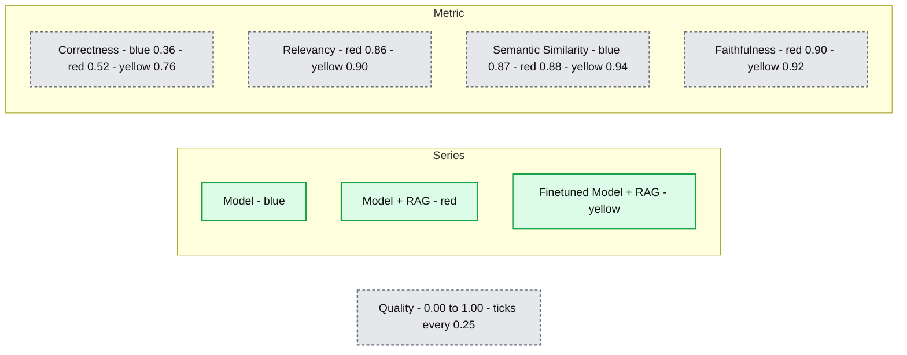

# Introducing Databricks Model Training for Fine-Tuning GenAI Models

- Source: https://www.databricks.com/blog/introducing-mosaic-ai-model-training-fine-tuning-genai-models
- Published: 2024-07-22
- Authors: Daniel King, Nancy Hung, Kasey Uhlenhuth
- Categories: data-science-machine-learning, databricks-ai
- Images: 3 total, 1 extracted as architecture

Today, we're thrilled to announce that Databricks Model Training's support for fine-tuning GenAI models is now available in Public Preview. At Databricks, we believe that connecting the intelligence in general-purpose LLMs to your enterprise data – data intelligence – is the key to building [high-quality GenAI systems](https://www.databricks.com/blog/mosaic-ai-build-and-deploy-production-quality-compound-ai-systems). Fine-tuning can specialize models for specific tasks, business contexts, or domain knowledge, and can be [combined](https://www.databricks.com/#RAGFineTune) with RAG for more accurate applications. This forms a critical pillar of our Data + AI Platform strategy, which enables you to adapt GenAI to your unique needs by incorporating your enterprise data.

## Model Training

Our customers have trained over 200,000 custom AI models in the last year, and we’ve distilled the lessons into Databricks Model Training, a fully managed service. Fine-tune or pretrain a wide range of models – including Llama 3, Mistral, DBRX, and more – with your enterprise data. The resulting model is then registered to Unity Catalog, providing full ownership and control over the model and its weights. Additionally, easily deploy your model with Databricks Model Serving in just one click.

We’ve designed Databricks Model Training to be:

- **Simple**: Select your base model and training dataset, and start training immediately. We handle the GPU and efficient training complexities so you can focus on the modeling.
- **Fast**: Powered by a proprietary training stack that is up to 2x faster than open source, iterate quickly to build your models. From fine-tuning on a few thousand examples to continued pre-training on billions of tokens, our training stack scales with you.
- **Integrated**: Easily ingest, transform, and preprocess your data on the Databricks platform, and pull directly into training.
- **Tunable**: Quickly tune the key hyperparameters, namely learning rate and training duration, to build the highest quality model.
- **Sovereign**: You have full ownership of the model and its weights. You control the permissions and access lineage — tracking the training dataset as well as downstream consumers.

> “At Experian, we are innovating in the area of fine-tuning for open source LLMs. The Databricks Model Training reduced the average training time of our models significantly, which allowed us to accelerate our GenAI development cycle to multiple iterations per day. The end result is a model that behaves in a fashion that we define, outperforms commercial models for our use cases, and costs us significantly less to operate.” James Lin, Head of AI/ML Innovation, Experian

## Benefits

Databricks Model Training allows you to adapt open source models to perform well on specialized enterprise tasks to achieve higher quality. Benefits include:

1. **Higher quality**: Improve the model quality along with specific tasks and capabilities, whether that be summarization, chatbot behavior, tools use, multilingual conversation, or more.
2. **Lower latency at lower costs: **Large, general intelligence models can be expensive and slow in production. Many of our customers find that fine-tuning small models (<13B parameters) can dramatically reduce latency and cost while maintaining quality.
3. **Consistent, structured formatting or style**: Generate outputs that follow a specific format or style, like entity extraction or creating JSON schemas in a compound AI system.
4. **Lightweight, manageable system prompts**: Integrate many business logic or user feedback into the model itself. It can be hard to incorporate end-user feedback into a complex prompt and small prompt changes can cause regressions for other questions.
5. **Expand the knowledge base**: With Continued Pretraining, extend a model’s knowledge base, whether that be particular topics, internal documents, languages, or updated recent events past the model’s original knowledge cut-off. Stay tuned for future blogs on the benefits of continued pretraining!

> "With Databricks, we could automate tedious manual tasks by using LLMs to process one million+ files daily for extracting transaction and entity data from property records. We exceeded our accuracy goals by fine-tuning Meta Llama3 8b and using Databricks Model Serving. We scaled this operation massively without the need to manage a large and expensive GPU fleet." - Prabhu Narsina, VP Data and AI, First American

## RAG and Fine-Tuning

We often hear from customers: should I use RAG or fine-tune models in order to incorporate my enterprise data? With Retrieval Augmented Fine-tuning ([RAFT](https://arxiv.org/abs/2403.10131)), combine both! For example, our customer Celebal Tech built a high quality domain-specific RAG system by finetuning their generation model to improve summarization quality from retrieved context, reducing hallucinations and improving quality (see Figure below).

**Summary:** Finetuned Model + RAG achieves the highest quality across correctness, relevancy, semantic similarity, and faithfulness.

**Components:**
- Model: blue series representing the base model; technology unspecified.
- Model + RAG: red series combining the model with retrieval augmented generation.
- Finetuned Model + RAG: yellow series combining a finetuned model with retrieval augmented generation.
- Correctness: quality metric.
- Relevancy: quality metric.
- Semantic Similarity: quality metric.
- Faithfulness: quality metric.
- Quality: vertical axis.
- Metric: horizontal axis.

**Flows:**
- none. No arrows are visible.

**Numbers:**
- Quality axis ticks: 0.00, 0.25, 0.50, 0.75, 1.00.
- Bar heights are approximate readings, not printed values:
  - Correctness: Model 0.36; Model + RAG 0.52; Finetuned Model + RAG 0.76.
  - Relevancy: Model + RAG 0.86; Finetuned Model + RAG 0.90.
  - Semantic Similarity: Model 0.87; Model + RAG 0.88; Finetuned Model + RAG 0.94.
  - Faithfulness: Model + RAG 0.90; Finetuned Model + RAG 0.92.
- No units are shown. Model bars are absent for relevancy and faithfulness.

source image: https://www.databricks.com/sites/default/files/inline-images/image2_24.png?v=1721664784

**Figure 1: **Combining a finetuned model with RAG (yellow) produced the highest quality system for customer Celebal Tech. Adapted from their blog.

> "We felt we hit a ceiling with RAG- we had to write a lot of prompts and instructions, it was a hassle. We moved on to fine-tuning + RAG and Databricks Model Training made it so easy! It not only adopted the model for Data Linguistics and Domain, but it also reduced hallucinations and increased speed in RAG systems. After combining our Databricks fine-tuned model with our RAG system, we got a better application and accuracy with the usage of less tokens.” Anurag Sharma, AVP Data Science, Celebal Technologies

## Evaluation

Evaluation methods are critical to helping you iterate on model quality and base model choices during fine-tuning experiments. From visual inspection checks to LLM-as-a-Judge, we’ve designed Databricks Model Training to seamlessly connect all the other evaluation systems within Databricks:

- **Prompts**: Add up to 10 prompts to monitor during training. We’ll periodically log the model’s outputs to the MLflow dashboard, so you can manually check the model’s progress during training.
- **Playground**: Deploy the fine-tuned model and interact with the playground for manual prompt testing and comparisons.
- **LLM-as-a-Judge**: With [MLFlow Evaluation](https://mlflow.org/docs/latest/llms/llm-evaluate/index.html), use another LLM to judge your fine-tuned model on an array of existing or custom metrics.
- **Notebooks**: After deploying the fine-tuned model, build notebooks or custom scripts to run custom evaluation code on the endpoint. 

## Get Started

You can fine-tune your model via the Databricks UI or programmatically in Python. To get started, select the location of your training dataset in Unity Catalog or a public Hugging Face dataset, the model you would like to customize, and the location to register your model for 1-click deployment.

- Watch our Data and AI Summit [presentation](https://youtu.be/DzeTTPHIQCk) on Databricks Model Training
- Read our documentation ([AWS](https://docs.databricks.com/en/large-language-models/foundation-model-training/index.html), [Azure](https://learn.microsoft.com/en-us/azure/databricks/large-language-models/foundation-model-training/)) and visit our [pricing](https://www.databricks.com/product/pricing/mosaic-foundation-model-training) page
- Try our [dbdemo](https://notebooks.databricks.com/demos/llm-fine-tuning/index.html) to quickly see how to get high-quality models with Databricks Model Training
- Take our [tutorial](https://www.databricks.com/resources/demos/tutorials/data-science-and-ai/fine-tune-your-own-llm-on-databricks-for-specific-task-and-knowledge)
