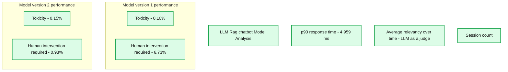

# Lakehouse Monitoring: A Unified Solution for Quality of Data and AI

- Source: https://www.databricks.com/blog/lakehouse-monitoring-unified-solution-quality-data-and-ai
- Published: 2023-12-12
- Authors: Jacqueline Li, Alkis Polyzotis, Kasey Uhlenhuth
- Categories: platform, data-engineering, data-science-machine-learning
- Images: 4 total, 2 extracted as architecture

## Introduction

[Databricks Data Quality Monitoring](https://www.databricks.com/product/machine-learning/lakehouse-monitoring) allows you to monitor all your data pipelines – from data to features to ML models – without additional tools and complexity. Built into [Unity Catalog](https://www.databricks.com/product/unity-catalog), you can track quality alongside governance and get deep insight into the performance of your data and AI assets. Lakehouse Monitoring is fully serverless so you never have to worry about infrastructure or tuning compute configuration. 

Our single, unified approach to monitoring makes it simple to track quality, diagnose errors, and find solutions directly in the [Databricks Data + AI Platform](https://www.databricks.com/product/data-intelligence-platform?scid=7018Y000001f7ztQAA&utm_medium=paid+search&utm_source=google&utm_campaign=20771864799&utm_adgroup=153516637417&utm_content=product+page&utm_offer=data-intelligence-platform&utm_ad=680871359457&utm_term=databricksiq&gad_source=1&gclid=CjwKCAiAmsurBhBvEiwA6e-WPAknTzE3aCQQ4I2mhURN7yoEFmOE366hAUqCAIq70sQdj_jnPxOpqhoCzSYQAvD_BwE). Keep reading to discover how you and your team can get the most out of Lakehouse Monitoring.

## Why Lakehouse Monitoring? 

Here’s a scenario: your data pipeline appears to be running smoothly, only to discover that the quality of the data has silently degraded over time. It’s a common problem among data engineers – everything seems fine until someone complains that the data is unusable.

For those of you training ML models, tracking production model performances and comparing different versions is an ongoing challenge. Consequently, teams are faced with models going stale in production and tasked with rolling them back.

The illusion of functional pipelines that mask crumbling data quality makes it challenging for data and AI teams to meet delivery and quality SLAs. Lakehouse Monitoring can help you proactively discover quality issues before downstream processes are impacted. You can stay ahead of potential issues, ensuring that pipelines run smoothly, and machine learning models remain effective over time. *No more weeks spent on debugging and rolling back changes!*

## How it works

**Summary:** Lakehouse Monitoring follows a Configure, Visualize, and Alert workflow to monitor tables and model performance, display quality metrics, and notify users of changes.

**Components:**
- Configure: Monitor a full table, compare data, and monitor model performance over time. No specific technology is named.
- Visualize: Track drift and model quality metrics using a fully customizable, out-of-the-box dashboard.
- Alert: Use Databricks SQL alerts for distributional changes and drift threshold violations.

**Flows:**
- Configure -> Visualize: Progress from monitoring configuration to viewing drift and model quality metrics.
- Visualize -> Alert: Progress from metric visualization to configuring notifications.

**Numbers:** none

```mermaid
%% Lakehouse Monitoring configuration, visualization, and alerting workflow
flowchart LR
    A[Configure - Monitor tables and model performance]
    B[Visualize - Dashboard for drift and model quality metrics]
    C[Alert - Databricks SQL alerts for changes and threshold violations]

    A -->|View monitoring metrics| B
    B -->|Set up notifications| C

    classDef client fill:#dbeafe,stroke:#2563eb,stroke-width:2px,color:#111
    classDef service fill:#dcfce7,stroke:#16a34a,stroke-width:2px,color:#111
    classDef store fill:#ede9fe,stroke:#7c3aed,stroke-width:2px,color:#111
    classDef cache fill:#fef3c7,stroke:#d97706,stroke-width:2px,color:#111
    classDef queue fill:#cffafe,stroke:#0891b2,stroke-width:2px,color:#111
    classDef critical fill:#fee2e2,stroke:#dc2626,stroke-width:4px,color:#111
    classDef external fill:#e5e7eb,stroke:#6b7280,stroke-width:2px,color:#111,stroke-dasharray:4 3
    classDef decision fill:#fce7f3,stroke:#db2777,stroke-width:2px,color:#111
    class A,B,C service
```

source image: https://www.databricks.com/sites/default/files/inline-images/image4_9.png

With Lakehouse Monitoring, you can monitor the statistical properties and quality of all your tables in just one-click. We automatically generate a dashboard that visualizes data quality for any Delta table in Unity Catalog. Our product computes a rich set of metrics out of the box. For instance, if you’re monitoring an inference table, we provide model performance metrics, for instance, R-squared, accuracy, etc.. Alternatively, for those monitoring data engineering tables, we provide distributional metrics including mean, min/max, etc.. In addition to the built-in metrics, you can also configure custom (business-specific) metrics that you want us to calculate. Lakehouse Monitoring refreshes metrics and keeps the dashboard up-to-date according to your specified schedule. All metrics are stored in Delta tables to enable ad-hoc analyses, custom visualizations, and alerts.   

## Configuring Monitoring

You can set up monitoring on any table you own using the Databricks UI ([AWS](https://docs.databricks.com/en/lakehouse-monitoring/create-monitor-ui.html) | [Azure](https://learn.microsoft.com/en-us/azure/databricks/lakehouse-monitoring/create-monitor-ui)) or API ([AWS](https://docs.databricks.com/en/lakehouse-monitoring/create-monitor-api.html) | [Azure](https://learn.microsoft.com/en-us/azure/databricks/lakehouse-monitoring/create-monitor-api)). Select the type of monitoring profile you want on your data pipelines or models: 

1. **Snapshot Profile: **If you want to monitor the full table over time or compare current data to previous versions or a known baseline, a Snapshot Profile will work best. We will then calculate metrics over all the data in the table and update metrics every time the monitor is refreshed.
2. **Time Series Profile: **If your table contains event timestamps and you want to compare data distributions over windows of time (hourly, daily, weekly, ...), then a Time Series profile will work best. We recommend that you turn on Change Data Feed ([AWS](https://docs.databricks.com/en/delta/delta-change-data-feed.html) | [Azure](https://learn.microsoft.com/en-us/azure/databricks/delta/delta-change-data-feed)) so you can get incremental processing every time the monitor is refreshed. Note: you will need a timestamp column in order to configure this profile.
3. **Inference Log Profile: **If you want to compare model performance over time or track how model inputs and predictions are shifting over time, an inference profile will work best. You will need an inference table ([AWS](https://docs.databricks.com/en/machine-learning/model-serving/inference-tables.html) | [Azure](https://learn.microsoft.com/en-us/azure/databricks/machine-learning/model-serving/inference-tables)) which contains inputs and outputs from a ML classification or regression model. You can also optionally include ground truth labels to calculate drift and other metadata such as demographic information to get fairness and bias metrics. 

You can choose how often you want our monitoring service to run. Many customers choose a daily or hourly schedule to ensure the freshness and relevance of their data. If you want monitoring to automatically run at the end of data pipeline execution, you can also call the API to refresh monitoring directly in your [Workflow](https://www.databricks.com/product/workflows). 

To further customize monitoring, you can set slicing expressions to monitor feature subsets of the table in addition to the table as a whole. You can slice any specific column, e.g. ethnicity, gender, to generate fairness and bias metrics. You can also define custom metrics based on columns in your primary table or on top of out-of-the-box metrics. See how to use custom metrics ([AWS](https://docs.databricks.com/en/lakehouse-monitoring/custom-metrics.html) | [Azure](https://learn.microsoft.com/en-us/azure/databricks/lakehouse-monitoring/custom-metrics)) for more details. 

## Visualize Quality

As part of a refresh, we will scan your tables and models to generate metrics that track quality over time. We calculate two types of metrics that we store in Delta tables for you: 

- **Profile Metrics**: They provide summary statistics of your data. For example, you can track the number of nulls and zeros in your table or accuracy metrics for your model. See the profile metrics table schema ([AWS](https://docs.databricks.com/en/lakehouse-monitoring/monitor-output.html#profile-metrics-table) | [Azure](https://learn.microsoft.com/en-us/azure/databricks/lakehouse-monitoring/monitor-output#profile-metrics-table)) for more information.
- **Drift Metrics**: They provide statistical drift metrics that allow you to compare against your baseline tables. See the drift metrics table schema ([AWS](https://docs.databricks.com/en/lakehouse-monitoring/monitor-output.html#drift-metrics-table) | [Azure](https://learn.microsoft.com/en-us/azure/databricks/lakehouse-monitoring/monitor-output)) for more information. 

To visualize all these metrics, Lakehouse Monitoring provides an out-of-the-box dashboard that is fully customizable. You can also create Databricks SQL alerts ([AWS](https://docs.databricks.com/en/sql/user/alerts/index.html) | [Azure](https://learn.microsoft.com/en-us/azure/databricks/sql/user/alerts/)) to get notified on threshold violations, changes to data distribution, and drift from your baseline table.

## Setting up Alerts

Whether you're monitoring data tables or models, setting up alerts on our computed metrics notifies you of potential errors and helps prevent downstream risks. 

You can get alerted if the percent of nulls and zeros exceed a certain threshold or undergo changes over time. If you are monitoring models, you can get alerted if model performance metrics like toxicity or drift fall under certain quality thresholds. 

Now, with insights derived from our alerts, you can identify whether a model needs retraining or if there are potential issues with your source data. After you’ve addressed issues, you can manually call the refresh API to get the latest metrics for your updated pipeline. Lakehouse Monitoring helps you proactively take actions to maintain the overall health and reliability of your data and models.

## Monitor LLM Quality

Lakehouse Monitoring offers a fully managed quality solution for Retrieval Augmented Generation (RAG) applications. It scans your application outputs for toxic or otherwise unsafe content. You can quickly diagnose errors related to e.g. stale data pipelines or unexpected model behavior. Lakehouse Monitoring fully manages monitoring pipelines, freeing developers to focus on their applications.

**Summary:** The dashboard compares two chatbot model versions using response time, relevance, session counts, toxicity, and required human intervention.

**Components:**
- LLM Rag chatbot Model Analysis: monitoring dashboard using MLflow evaluation API and an external LLM judge.
- p90 response time: latency metric.
- Average relevancy over time - LLM as a judge: relevance trends for Model version 1 and Model version 2.
- Session count: daily session bar chart.
- Model version 1 performance: toxicity and human intervention metrics.
- Model version 2 performance: toxicity and human intervention metrics.

**Flows:**
- none; no arrows are visible.

**Numbers:**
- p90 response time: 4 959 ms.
- Model versions: 1 and 2.
- Model version 1 toxicity: 0.10%.
- Model version 1 human intervention required: 6.73%.
- Model version 2 toxicity: 0.15%.
- Model version 2 human intervention required: 0.93%.
- Relevance axis: 0, 1, 2, 3, 4.
- Session count axis: 0, 20, 40, 60, 80, 100.
- Date labels: Dec 3, Dec 10, Dec 17, Dec 24; 2023.
- Metric freshness: 2 days ago.
- Dashboard description: 2 model versions.

source image: https://www.databricks.com/sites/default/files/inline-images/image3_13.png

## What’s coming next? 

We are excited for the future of Lakehouse Monitoring and looking forward to support: 

- Data classification/ PII Detection – Sign up for our Private Preview [here](https://docs.google.com/forms/d/e/1FAIpQLSfAwRewYAfkqlg2O3Uc3T-YDNf3hrzgoQyRrAU44yQBLJFH9g/viewform?usp=sf_link)!
- Expectations to automatically enforce data quality rules and orchestrate your pipelines
- A holistic view of your monitors to summarize the quality and health across your tables

To learn more about Lakehouse monitoring and get started today, visit our product documentation ([AWS](https://docs.databricks.com/en/lakehouse-monitoring/index.html) | [Azure](https://learn.microsoft.com/en-us/azure/databricks/lakehouse-monitoring/)). Additionally, catch up on the recent [announcements](https://www.databricks.com/blog/building-high-quality-rag-applications-databricks) about creating high quality RAG applications, and join us for our GenAI [webinar](https://www.databricks.com/resources/webinar/disrupt-your-industry-generative-ai).
