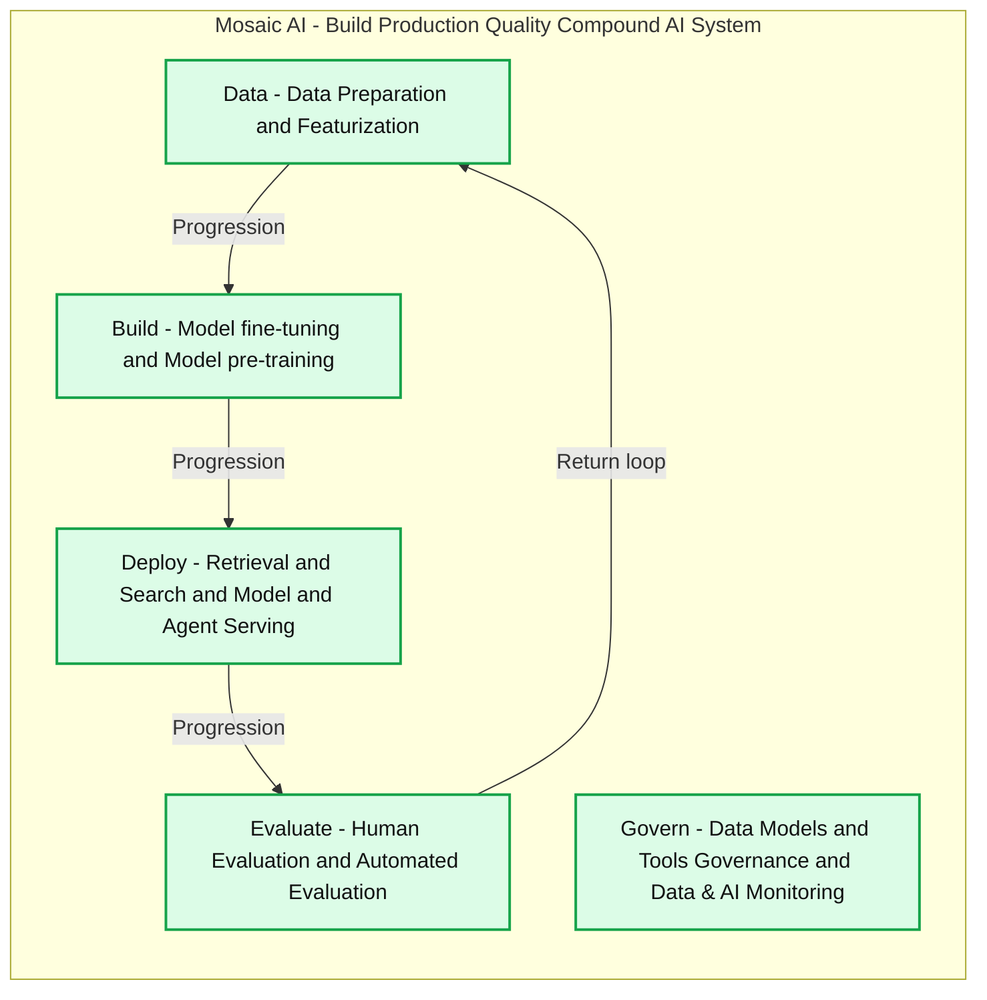

# Databricks: Build and Deploy Production-quality AI Agent Systems

*Announcing new products to simplify agent and RAG development, model fine-tuning, AI evaluation, tools governance, and more*

- Source: https://www.databricks.com/blog/mosaic-ai-build-and-deploy-production-quality-compound-ai-systems
- Published: 2024-06-12
- Authors: Patrick Wendell, Naveen Rao
- Categories: data-science-machine-learning, databricks-ai
- Images: 5 total, 2 extracted as architecture

Over the last year, we have seen a surge of commercial and open-source foundation models showing strong reasoning abilities on general knowledge tasks. While general models are an important building block, production AI applications often employ [Compound AI Systems](https://bair.berkeley.edu/blog/2024/02/18/compound-ai-systems/), which leverage multiple components such as tuned models, retrieval, tool use, and reasoning agents. These [AI agent systems](https://www.databricks.com/blog/ai-agent-systems) augment foundation models to drive much better quality and help customers confidently take these GenAI apps to production. 

Today at the Data and AI Summit, we announced several new capabilities that make Databricks the best platform for building production-quality AI agent systems. These features are based on our experience working with thousands of companies to put AI-powered applications into production.  Today’s announcements include support for fine-tuning foundation models, an enterprise catalog for AI tools, a new SDK for building, deploying, and evaluating AI agents, and a unified AI gateway for governing deployed AI services.

With this announcement, Databricks has entirely integrated and substantially expanded the model-building capabilities first included in our MosaicML acquisition one year ago.

**Summary:** Mosaic AI supports an iterative Data, Build, Deploy, and Evaluate lifecycle, with governance and monitoring spanning the compound AI system.

**Components:**
- Mosaic AI: overall platform for building production quality compound AI systems.
- Data: data preparation and featurization using Mosaic AI; specific technologies are not shown.
- Build: model fine-tuning and model pre-training using Mosaic AI; specific technologies are not shown.
- Deploy: retrieval and search, plus model and agent serving using Mosaic AI; specific technologies are not shown.
- Evaluate: human evaluation and automated evaluation using Mosaic AI; specific technologies are not shown.
- Govern: data, models and tools governance, plus Data & AI Monitoring using Mosaic AI; specific technologies are not shown.

**Flows:**
- Data -> Build: progression from data preparation to model building; arrow is unlabeled.
- Build -> Deploy: progression from model building to deployment; arrow is unlabeled.
- Deploy -> Evaluate: progression from deployment to evaluation; arrow is unlabeled.
- Evaluate -> Data: return loop to the data stage; arrow is unlabeled.

**Numbers:** none

source image: https://www.databricks.com/sites/default/files/inline-images/image6_6.png

## Building and Deploying Compound AI Systems

The evaluation of monolithic AI models to compound systems is an active area of both academic and industry research. [Recent results](https://bair.berkeley.edu/blog/2024/02/18/compound-ai-systems/) have found that “state-of-the-art AI results are increasingly obtained by compound systems with multiple components, not just monolithic models.” These findings are reinforced by what we see in our customer base. Take for example financial research firm FactSet – when they deployed a commercial LLM for their Text-to-Financial-Formula use case, they could only get 55% accuracy in the generated formula, however, modularizing their model into a compound system allowed them to specialize each task and achieve 85% accuracy. Databricks supports building AI systems through the following products:

- **Fine-tuning with Databricks Model Training:** Whether you're fine-tuning a model on a small dataset or pre-training a model from scratch (like DBRX) with trillions of tokens on 3,000+ GPUs, we provide an easy-to-use, managed API for model training, abstracting away the underlying infrastructure.  We’re seeing our customers find success with fine-tuning smaller open source models for system components to reduce cost and latency while matching GPT-4 performance on enterprise tasks with proprietary data. Model Training empowers customers to fully own their models and their data, allowing them to iterate on quality.  

*Users only have to select a task and base model and provide training data (as a Delta table or a .jsonl file) to get a fully fine-tuned model that they own for their specialized task*

 

- **Shutterstock ImageAI, Powered by Databricks**: Our partner Shutterstock today announced a new text-to-image model trained exclusively on Shutterstock’s world-class image repository using Databricks Model Training. It generates customized, high-fidelity, trusted images that are tailored to specific business needs.
- **Databricks AI Search, now with support for Customer Managed Keys and Hybrid Search**: We recently made AI Search generally available. Additionally, AI Search now supports GTE-large embedding model which has good retrieval performance and supports 8K context length. AI Search now also supports Customer Managed Keys to provide more control on the data and supports hybrid search to improve the quality of retrieval.
- **Agent Bricks Custom Agents for fast development:** RAG applications are the most popular GenAI application we see on our platform, and today we’re excited to announce the Public Preview of our Agent Framework. This makes it very easy to build an AI system that is augmented by your proprietary data–safely governed and managed in Unity Catalog.
- **Databricks Model Serving support for agents; Foundation Model API general ****availability**: In addition to real-time serving models, customers can now serve agents and RAG with Model Serving. We are also making Foundation Model APIs generally available—customers can easily use foundation models, both accessible as pay-per-token and provisioned throughput for production workloads.
- **Databricks Tool Catalog and Function-Calling**: Today we announced the Databricks Tool Catalog, which lets customers create an enterprise registry of common functions, internal or external, and share these tools across their organization for use in AI applications. Tools can be SQL functions, Python functions, model endpoints, remote functions, or retrievers. We’ve also enhanced Model Serving to natively support function-calling, so customers can use popular open source models like Llama 3-70B as their agent’s reasoning engine. 

*Databricks Model Serving now supports function-calling and users can quickly experiment with functions and base models in the AI Playground*

 

## Evaluating AI Systems

General-purpose AI models optimize for benchmarks, such as [MMLU](https://paperswithcode.com/sota/multi-task-language-understanding-on-mmlu), but deployed AI systems are instead designed to solve specific user tasks as part of a broader product (such as, answering a support ticket, generating a query, or suggesting a response). To make sure these systems work well, it’s important to have a robust evaluation framework for defining quality metrics, gathering quality signals, and iterating on performance. Today we’re excited to announce several new evaluation tools:

- **Databricks MLflow for Automated and Human Assessments: **Agent Evaluation lets you define what high-quality answers look like for your AI system by providing “golden” examples of successful interactions. Once this quality yardstick exists, you can explore permutations of the system, tuning models, changing retrieval, or adding tools, and understand how system changes alter quality. Agent Evaluation also lets you invite subject matter experts across your organization - even those without Databricks accounts - to review and label your AI system output to do production quality assessments and build up an extended evaluation dataset. Finally, system-provided LLM judges can further scale the collection of evaluation data by grading responses on common criteria such as accuracy or helpfulness. Detailed production traces can help diagnose low-quality responses.

**Summary:** MLflow compares seven model runs by the percentage of outputs assessed as correct, ranging from 25.00% to 62.50%.

**Components:**
- `agent_evaluation`: experiment containing the model runs.
- `Model metrics`: metric group displaying `Overall assessment: Correct`.
- `gpt`: model run shown in magenta.
- `llama3`: two model runs shown in indigo and teal.
- `dbrx`: two model runs shown in brown and light blue.
- `mixtral`: two model runs shown in green and yellow.

**Flows:**
- none. No arrows are visible.

**Numbers:**
- Model metrics count: 1.
- gpt, magenta: 62.50%.
- llama3, indigo: 62.50%.
- llama3, teal: 50.00%.
- dbrx, brown: 37.50%.
- mixtral, green: 37.50%.
- mixtral, yellow: 37.50%.
- dbrx, light blue: 25.00%.
- Axis ticks: 10.00%, 20.00%, 30.00%, 40.00%, 50.00%, 60.00%.
- Search example: `metrics.rmse < 1 and params.model = "tree"`.

source image: https://www.databricks.com/sites/default/files/inline-images/image1_26.png

*Databricks MLflow provides AI-assisted metrics to help developers form quick intuitions*

 

*Databricks MLflow allows stakeholders, even those outside the Databricks Data + AI Platform, to assess model outputs and provide ratings to help iterate on quality*

 

- **MLflow 2.14**: MLflow is a model-agnostic framework for evaluating LLMs and AI systems, allowing customers to measure and track parameters at each step. With MLflow 2.14, we are excited to announce MLflow Tracing. With Tracing, developers can record each step of model and agent inference to debug performance issues and build evaluation datasets to test future improvements. Tracing is tightly integrated with Databricks MLflow Experiments, Databricks Notebooks, and Databricks Inference Tables, providing performance insights from development through production.

> Corning is a materials science company - our glass and ceramics technologies are used in many industrial and scientific applications, so understanding and acting on our data is essential. We built an AI research assistant using Databricks Agent Bricks Custom Agents to index hundreds of thousands of documents including US patent office data. Having our LLM-powered assistant respond to questions with high accuracy was extremely important to us - that way, our researchers could find and further the tasks they were working on. To implement this, we used Databricks Agent Bricks Custom Agents to build a Hi Hello Generative AI solution augmented with the U.S. patent office data. By leveraging the Databricks Data + AI Platform, we significantly improved retrieval speed, response quality, and accuracy. —Denis Kamotsky, Principal Software Engineer, Corning

## Governing Your AI Systems

In the explosion of state-of-the-art foundation models, we’ve seen our customer base rapidly adopt new models: DBRX had a thousand customers experimenting with it within two weeks of launch, and we’re seeing multiple hundreds of customers experimenting with the recently released Llama3 models. Many enterprises find it difficult to support these newer models in their platform within a reasonable timeframe, and changes in prompt structures and querying interfaces make them difficult to implement. Furthermore, as enterprises open access to the latest and greatest models, people get excited and build a bunch of stuff, which can quickly snowball into a mess of governance issues. Common governance issues are rate limits being hit and impacting production applications, exploding costs as people run GenAI models on large tables, and data leakage concerns as PII is sent to third-party model providers. Today, we’re excited to announce new capabilities in AI Gateway for governance and a curated model catalog to enable model discovery. Features included are:

- **Agent Bricks AI Gateway for centralized AI governance**: Agent Bricks AI Gateway enables customers to have a unified interface to easily manage, govern, evaluate, and switch models. It sits on Model Serving to enable rate limiting, permissions, and credential management for model APIs (external or internal). It also provides a single interface for querying foundation model APIs so that customers can easily swap out models in their systems and do rapid experimentation to find the best model for a use case. Gateway Usage Tracking tracks who calls each model API and Inference Tables capture what data was sent in and out. This allows platform teams to understand how to change rate limits, implement chargebacks, and audit for data leakage.
- **Databricks Guardrails**: Add endpoint-level or request-level safety filtering to prevent unsafe responses, or even add PII detection filters to prevent sensitive data leakage.
- **system.ai Catalog:** We’ve curated a list of state-of-the-art open source models that can be managed in Unity Catalog. Easily deploy these models using Model Serving Foundation Model APIs or fine-tune them with Model Training. Customers can also find all supported models on the Databricks Homepage by going to Settings > Developer > Personalized Homepage. 

> Databricks Model Serving is accelerating our AI-driven projects by making it easy to securely access and manage multiple SaaS and open models, including those hosted on or outside Databricks. Its centralized approach simplifies security and cost management, allowing our data teams to focus more on innovation and less on administrative overhead. —Greg Rokita, AVP, Technology at Edmunds.com

Databricks empowers teams to build and collaborate on compound AI systems from a single platform with centralized governance and a unified interface to train, track, evaluate, swap, and deploy. By leveraging enterprise data, organizations can move from general knowledge to data intelligence. This evolution empowers organizations to get to more relevant insights faster.

We’re excited to see what innovations our customers build next!

## Explore more

- [Databricks](https://www.databricks.com/product/machine-learning)
- [Documentation](https://docs.databricks.com/en/generative-ai/generative-ai.html)
