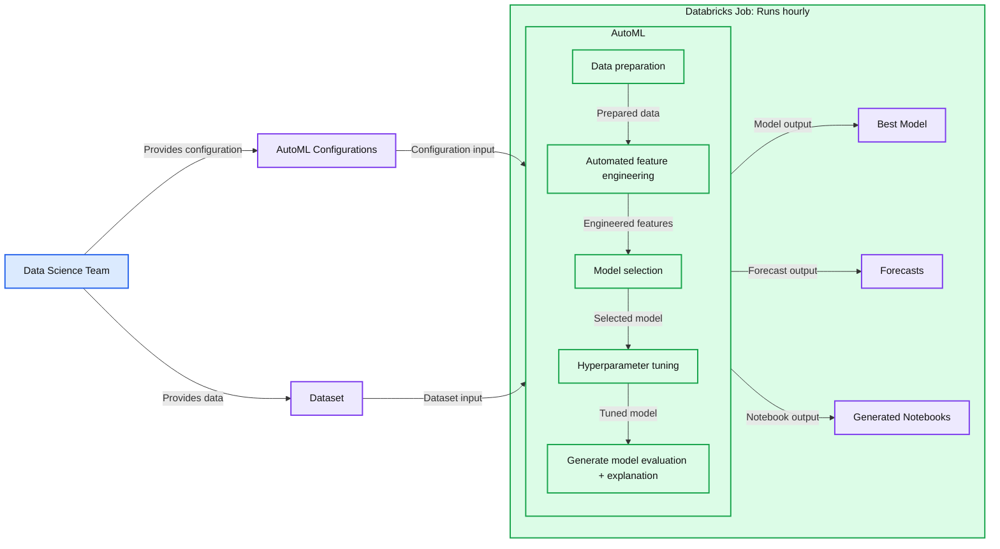

# Providence Health: Scaling ML/AI Projects with Databricks

- Source: https://www.databricks.com/blog/providence-health-automl
- Published: 2024-11-14
- Authors: Susan McNerney (Providence Health), Dan McCurley
- Categories: data-science-machine-learning, databricks-ai, industries, healthcare-and-life-sciences, company, customers
- Images: 1 total, 1 extracted as architecture

**Key takeaways**

- By working with Databricks solutions architects and product engineers, Providence Health was able to improve our initial results and support 7x the number of departments at a time (from ~40 to 300+) while delivering accurate departmental arrivals and occupancy forecasting in well under an hour. This was accomplished by optimizing code both on the Databricks AutoML and the Providence side. Providence's goal of providing baseline forecasts daily has been achieved and continues to scale.

[Providence Health's extensive network](https://www.providence.org/) spans 50+ hospitals and numerous other facilities across multiple states, presenting many challenges in predicting patient volume and daily census within specific departments. This information is critical to making informed decisions about short-term and long-term staffing needs, transfer of patients, and general operational awareness.  In the early stages of Databricks adoption, Providence sought to create a simple baseline census model that would get new requests going quickly, aid in exploration and in many cases provide an initial forecast.  We also realized that scaling this census to support thousands of departments in near real-time was going to take some work.

 

We began our implementation of [Databricks](https://www.databricks.com/product/machine-learning) tools with[Databricks AutoML](https://www.databricks.com/product/automl). We appreciated the ability to automatically run forecasts from a few lines of code every time our scheduled workflow ran. AutoML doesn't require a detailed model setup, making it ideal for getting a first look at our data in a forecast. We created a[notebook](https://www.databricks.com/product/collaborative-notebooks) that defined our forecasting classes and included a few lines of AutoML code. When we ran the forecasts from our scheduled workflows, AutoML not only created model training experiments but also automatically generated the supporting notebooks and data analysis. This capability enabled us to review any specific job run, assess forecast performance, compare the performance of different trials, and access other essential details as needed.

**Summary:** A data science team supplies configurations and a dataset to an hourly Databricks AutoML job that produces a best model, forecasts, and generated notebooks.

**Components:**

- Data Science Team: human contributors.
- AutoML Configurations: settings for AutoML.
- Dataset: input data; storage technology unspecified.
- Databricks Job: scheduled execution that runs hourly.
- AutoML: automated machine learning pipeline.
- Data preparation: AutoML processing stage.
- Automated feature engineering: AutoML processing stage.
- Model selection: AutoML processing stage.
- Hyperparameter tuning: AutoML processing stage.
- Generate model evaluation + explanation: AutoML processing stage.
- Best Model: model output; model technology unspecified.
- Forecasts: prediction output.
- Generated Notebooks: notebook output; language unspecified.

**Flows:**

- Data Science Team -> AutoML Configurations: provides configuration.
- Data Science Team -> Dataset: provides data.
- AutoML Configurations -> AutoML: configuration input.
- Dataset -> AutoML: dataset input.
- Data preparation -> Automated feature engineering: prepared data.
- Automated feature engineering -> Model selection: engineered features.
- Model selection -> Hyperparameter tuning: selected model.
- Hyperparameter tuning -> Generate model evaluation + explanation: tuned model.
- AutoML -> Best Model: model output.
- AutoML -> Forecasts: forecast output.
- AutoML -> Generated Notebooks: notebook output.

**Numbers:** Runs hourly, a one-hour scheduling interval. No numeric values or sizes are visible.

source image: https://www.databricks.com/sites/default/files/inline-images/ProvHealth_Diagram.png?v=1731613472

Providence prides itself on being an industry leader in machine learning and AI. Our initial trial of 40+ emergency departments averaged a census delivery forecast that was well over our benchmark of 1 hour.  Given our goal of near real-time forecasting, this was clearly not an acceptable result. Fortunately, Providence and Databricks have partnered over the last few years to find creative solutions to difficult problems in healthcare technology and we saw an opportunity to continue that relationship.

 

By working closely with Databricks solutions architects and product engineers, we were able to improve our initial results and support 7x the number of departments at a time (from ~40 to 300+) while delivering accurate departmental arrivals and occupancy forecasting in well under an hour. This was accomplished by optimizing code both on the Databricks AutoML and the Providence side. Today, our goal of providing baseline forecasts daily has been achieved and continues to scale.  For models not currently in AutoML, we use other Databricks Notebooks with MLFlow and we are looking forward to including them in AutoML in the near future. As we continue our ongoing optimization work,  we anticipate the ability to provide thousands of forecasts to Providence customers in near real-time.

 

*This blog post was jointly authored by *[*Susan McNerney*](https://www.linkedin.com/in/susanmcnerney/)* (Providence Health) and *[*Dan McCurley*](https://www.linkedin.com/in/mccurleydan/)* (Databricks).*

 

### Additional Reading:

[Learn more about low-code ML solutions from Databricks using Mosaic AutoML](https://www.databricks.com/resources/webinar/low-code-machine-learning?scid=7018Y000001Fi1CQAS&utm_medium=paid+search&utm_source=google&utm_campaign=17107065832&utm_adgroup=144823373414&utm_content=od+webinar&utm_offer=low-code-machine-learning&utm_ad=665885918373&utm_term=databricks%20automl&gad_source=1&gclid=Cj0KCQjwvpy5BhDTARIsAHSilynBAV8wL5PNFiqD1WxQ1Ojrovd-bZeZN5D-x9woipVnxkKBJapif4waApvCEALw_wcB)

[Get started with AutoML experiments through a low-code UI or a Python API](https://docs.databricks.com/en/machine-learning/automl/index.html)
