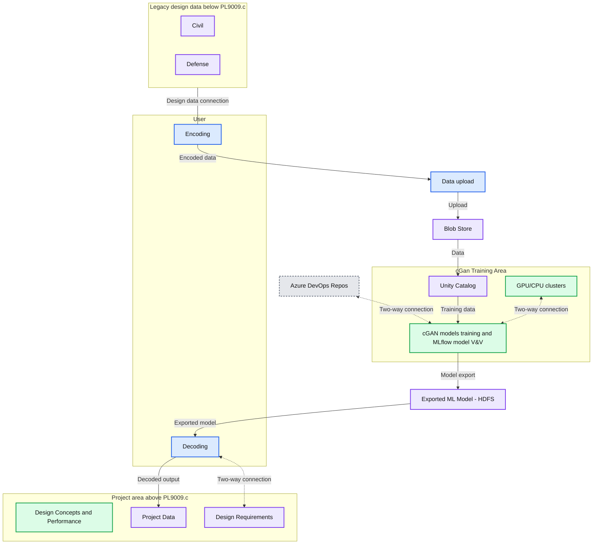

# Rolls-Royce: Harnessing the Power of Databricks for Image Generation

- Source: https://www.databricks.com/blog/rolls-royce-mosaic-ai
- Published: 2024-08-08
- Authors: Jack Kelleher, Marjorie Adriaenssens, Puneet Jain, Marco Nunez (Rolls-Royce), Nima Ameri (Rolls-Royce), Shiva Babu (Rolls-Royce), Siddharth Ravichandran (Rolls-Royce), Yashwant Gurbani (Rolls-Royce)
- Categories: engineering, data-science-machine-learning, databricks-ai, industries, manufacturing, company, customers
- Images: 1 total, 1 extracted as architecture

Rolls-Royce has witnessed the transformative power of the Databricks [Data + AI Platform](https://www.databricks.com/product/data-intelligence-platform) in various AI projects. One example is a collaboration between Rolls-Royce and Databricks, focused on optimizing conditional Generative Adversarial Network (cGAN) training processes, that demonstrate the numerous benefits of using [Databricks](https://www.databricks.com/product/machine-learning) tools.

 

For this joint cGAN training optimization project, the team considered using numerical, text and image data. The primary goal was to enhance Rolls-Royce’s design space exploration capabilities and overcome the limitations of parametric models. This was achieved by enabling the reuse of legacy simulation data to drive the identification and assessment of innovative design concepts that satisfy a specified design condition without requiring a traditional geometry modeling and simulation process.

 

### Watch the video:[how Rolls-Royce uses cloud-based GenAI to support preliminary engineering design](https://youtu.be/KlAIvPnC7QE) 

The joint Databricks and Rolls-Royce team investigated best practices for model configuration, including consideration of the dimensionality limits. The approach included embedding knowledge of unsuccessful solutions into the training dataset to help the neural network avoid certain areas and find solutions faster. Another aspect of the project was handling multi-objective constraints in the design process, in this project we were working with multiple requirements that were potentially in conflict: for example, we were trying to reduce the model weight while also trying to increase its efficiency. The goal was to produce a solution that is broadly optimized, not just optimal for a particular facet of the design.

 

The conceptual architecture for the cGAN project is below.

**Summary:** Legacy design data is encoded and uploaded for cGAN training, with exported models decoded into project data and connected to design requirements.

**Components:**

- Data upload: input preparation, technology unspecified.
- Blob Store: blob storage.
- DevOps Repos: Azure source repositories.
- cGan Training Area: training environment containing GPU/CPU clusters, Unity Catalog, cGAN training, and MLflow.
- GPU/CPU clusters: training compute.
- Unity Catalog: data catalog.
- cGAN models training: conditional generative adversarial network training.
- cGAN model V&V: MLflow model verification and validation.
- Exported ML Model: file marked HDFS.
- User: area containing Encoding and Decoding.
- Encoding: design-data encoding, technology unspecified.
- Decoding: model-output decoding, technology unspecified.
- Legacy design data [< PL9009.c]: Civil and Defense data stores; also contains a Decoding label.
- Project area [> PL9009.c]: Design Concepts and Performance, Project Data, and Design Requirements.

**Flows:**

- Legacy design data -> Encoding: connection shown without an arrowhead.
- Encoding -> Data upload: encoded design data.
- Data upload -> Blob Store: uploaded data.
- Blob Store -> Unity Catalog: data supplied to the catalog.
- Unity Catalog -> cGAN models training: training data.
- DevOps Repos -> cGAN models training: dashed two-way connection.
- GPU/CPU clusters -> cGAN models training: dashed two-way connection.
- cGAN models training -> Exported ML Model: model export along the path beside MLflow.
- Exported ML Model -> Decoding: exported model supplied for decoding.
- Decoding -> Project Data: decoded output.
- Decoding -> Design Requirements: dashed two-way connection.

**Numbers:**

- `10` and `01` inside the Blob Store icon.
- `< PL9009.c` in the Legacy design data heading.
- `> PL9009.c` in the Project area heading.
- `2-way connection` in the legend.
- `© 2024` in the footer.

source image: https://www.databricks.com/sites/default/files/inline-images/rolls-royce-diagram_0.png

Description of the conceptual architecture:

 

1. **Data Modeling:** Data tables are set up to ensure they are optimized for the specific use case. This involves generating identity columns, setting table properties, and managing unique tuples.
2. **ML Model Training:** the developed ML models are trained using a 2D representation of 3D results from typical simulation studies. This involves embedding knowledge of unsuccessful solutions to help the neural network avoid certain areas and find solutions faster.
3. **Implementation: **Once we developed and optimized models and algorithms, we would then implement them into the product design process
4. **Optimization: **Based on current results, we plan to continually optimize the models and algorithms by adjusting parameters, refining the dataset, and ultimately changing the approach to handling multi-objective constraints.
5. **Model export: **The model trained with legacy data can be exported in a standard format, enabling the option of taking a copy to a secure environment where transfer learning can be conducted with project data characterized by a restrictive Export Control or IP classification.
6. **Next Steps:** Moving forward, we plan to include mechanisms to handle Multi-Objective Constraints. We need to handle multiple requirements that can conflict with each other, which requires developing an algorithm or method to balance these conflicting objectives and arrive at an optimal solution.

 

There were many benefits to Rolls-Royce in leveraging the Databricks Data + AI Platform and Databricks tools for this project:

 

1. **Total Cost of Ownership (TCO): **Databricks provides a unified lakehouse architecture that accelerates innovation while significantly reducing costs. As data needs grow exponentially, Databricks is a cost-effective solution for data processing. This is particularly beneficial for large-scale projects at enterprises like Rolls-Royce.
2. **Faster Time-to-Model:** Databricks tools reduce model training and deployment complexity, enabling faster time-to-model. This is achieved through features such as AutoML and Managed MLflow which automate ML development and manage the full lifecycle of ML models.
3. **From Experimentation to Deployment:** Databricks provides a seamless transition from experimentation to deployment. This is crucial as moving from experiments to production deployments can be challenging.
4. I**mprovement of Model Accuracy: **Databricks enables a rapid assessment of model architectures through provisioning access to bespoke packages such as Ray, simplifying the execution of hyperparameter studies, and enabling both scalability (through the execution of more complex use cases that would not be viable through standards machines) and concurrent development (multiple individuals working on or having access to the model).  This not only speeds up the model development/testing process but also improves accuracy.
5. **Data Management / Governance Benefits: **The Databricks Data + AI Platform provides complete control over both the models and the data. This level of control is crucial for compliance-centric industries like aerospace. The implementation of Unity Catalog establishes a crucial governance framework, providing a unified view of all data assets and making it easier to manage and control access to sensitive data.
6. **Insights Gained from the Models: **The integration of MLflow in Databricks ensures transparency and reproducibility, key factors in any AI project. It allows for efficient experiment tracking, results sharing, and collaborative model tuning. These insights are invaluable in driving business innovation and enhancing productivity.

 

In conclusion, Databricks provides a robust, efficient, and secure platform for implementing simulation genAI projects. The collaboration between Rolls-Royce and Databricks has demonstrated the transformative power of this new technology. Given the three-dimensional nature of engines, future work will include exploring the transition from 2D models to 3D models.

 

*This blog post was jointly authored by [Marco Nunez](https://www.linkedin.com/in/marconunezprofile/) (Rolls-Royce), [Nima Ameri](https://www.linkedin.com/in/nima-ameri-31166218/) (Rolls-Royce), [Shiva Babu](https://www.linkedin.com/in/shivababu/) (Rolls-Royce), [Siddharth Ravichandran](https://www.linkedin.com/in/sid-ravichandran/) (Rolls-Royce), [Yashwant Gurbani](https://www.linkedin.com/in/yashwant-gurbani/) (Rolls-Royce), [Jack Kelleher](https://www.linkedin.com/in/jack-kelleher-0810/) (Databricks), [Marjorie Adriaenssens](https://www.linkedin.com/in/marjorieadriaenssens/) (Databricks), and [Puneet Jain](https://www.linkedin.com/in/puneetjain159/) (Databricks).*
