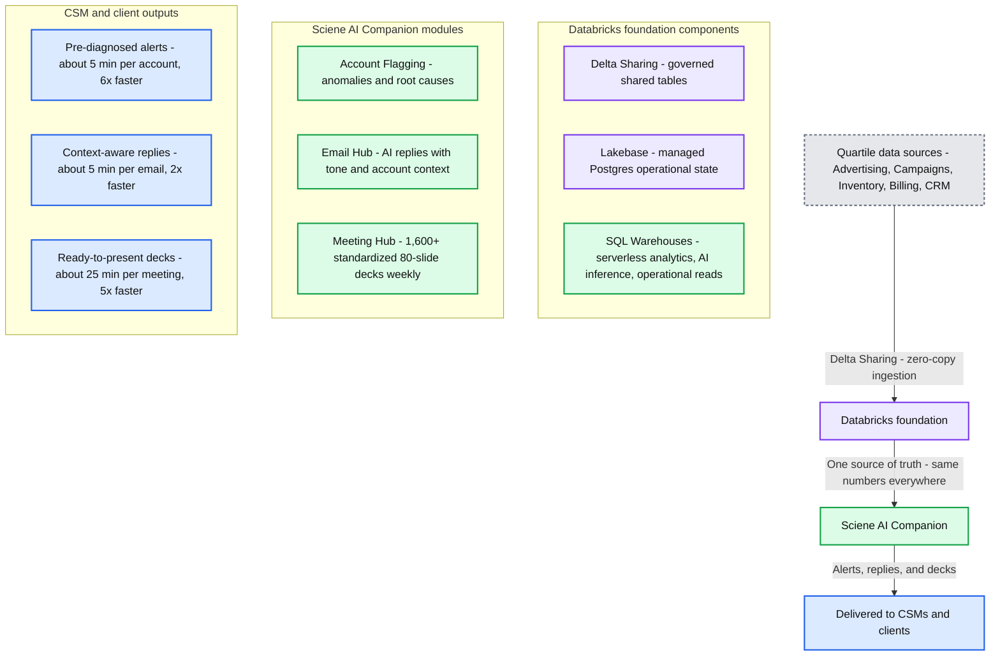

# Sciene AI Companion: building an autonomous Customer Success platform on Databricks

*AI Companion, making customers feel unique at scale*

- Source: https://www.databricks.com/blog/sciene-ai-companion-building-autonomous-customer-success-platform-databricks
- Published: 2026-06-16
- Authors: Renata Fencz, Solano Campos, Rodrigo Mohr, Ricardo Morandini
- Categories: platform, solutions, engineering, data-science-machine-learning, databricks-ai, industries, retail-and-consumer-goods, data-strategy, industry-insights, company, customers
- Images: 1 total, 1 extracted as architecture

**Key takeaways**

- Sciene's AI Companion helps Quartile standardize and scale Customer Success work by generating context-aware emails, meeting decks, and account diagnostics across a large global team.
- Scalable Customer Success, customers get faster, data-informed service while the business grows its capacity through AI-enabled CSMs. The platform significantly improved productivity, saving up to 6× time on key workflows and repetitive tasks.
- Built end-to-end on Databricks - Delta Sharing, Lakebase, and SQL Warehouses provide one governed foundation for data engineering, AI inference and operational reads — zero drift between workloads.

Sciene develops AI products that standardize and scale high-volume, relationship-centered enterprise workflows. When Quartile, the world’s largest retail media optimization platform, managing performance marketing for over 1,000 brands, started using Sciene's platform to scale their Customer Success operation, it transformed the way they work across geographies and time zones.

In digital advertising, Customer Success Managers (CSMs) are the bridge between an agency and its customers, analyzing campaign performance, preparing strategy presentations, proactively flagging problems, and maintaining the ongoing relationship that keeps accounts healthy and growing. This role demands both analytical depth and personal touch. At scale, though, that combination breaks down.

CSMs spend hours each week assembling decks from scratch, reconstructing account context, and triaging accounts without a systematic read across the book of business. Without the right tooling and technology, they can’t keep pace.

This is a perfect application for generative AI. Sciene, extending beyond Quartile, is trying to solve how to introduce AI efficiency to relationship-driven business processes while maintaining vital personalization to the essential human connection.

## Barriers to applied AI in Customer Success

Sciene's platform had to solve three problems simultaneously:

1. **Personalization at scale** - whether an email draft, a meeting deck or an account diagnosis, each AI-generated output must have business context: the account's performance and metrics, the individual CSM's personal style and communication standards.
While tackling this once is simple, doing it for 350+ CSMs with distinct communication styles across the globe, and multiple weekly interactions of 1,000 accounts with its own unique history.
2. **High-volume content generation** - produce 1,600 standardized decks of 80 slides every week, draft email replies for every customer — with consistent quality and zero processing bottlenecks.
3. **Root-cause diagnosis, not just detection** - Customers need more than account change alerts; they require explanations for why changes occurred and guidance on what to do next. The solution must connect advertising, campaign, inventory, billing, and CRM data to diagnose anomalies, which can stem from seasonal shifts, competitive actions, or global market changes.

From data availability to CSM presentation, Sciene has a very narrow processing window. The platform must ingest, model, run AI inference, and serve results at a real-time pace. All pipelines, AI workloads, and the operational layer must use the same governed source of truth — making Databricks the architectural solution.

## Databricks for Customer Success: Inside Sciene's AI Companion

To address all the requirements, Sciene built an AI Companion platform, structuring three modules to solve distinct bottlenecks in how users are served:

- **Email Hub - drafting email replies with complete context awareness.** Generates quick, thoughtful, data-informed responses, written in the CSM's voice and adhering to corporate principles. This preserves customer relationships and saves significant time. An internal survey showed reply time dropped from 15–30 minutes to about 3 minutes with AI Companion, making it 8x faster.
- **Meeting Hub - generating standardized presentations at scale.** It centralizes talking points and previous meeting summaries to generate an 80+ slide deck, ensuring customers receive a consistent, up-to-date experience. This preparation time is cut from over 2 hours to around 10 minutes—12x faster—meaning CSMs are prepared quickly.
- **Account Flagging System - detecting business fluctuations automatically.** Beyond an alerts dashboard, the system identifies what changed and diagnoses the root cause, eliminating hours of manual investigation. CSMs receive a pre-diagnosed briefing instead of a spreadsheet scavenger hunt, leading to faster customer intervention. A CSM survey showed diagnosing a flagged account dropped from 30+ minutes to ~5 minutes—6x faster.

None of this replaces the CSM's judgment — it removes the work that was getting in the way of it. The CSM still owns the account, the relationship, and the call on what to do next; AI Companion just makes sure they walk into every customer conversation with the context already in hand.

### AI augmenting strategic human workflows

Sciene AI Companion is deployed across Quartile's entire CS organization managing over 1,000 brands. With data assembly and drafting handled, CSMs spend more of their week on what's always been the core of the role — deeper account strategy, sharper customer conversations, and the judgment calls that matter the most. The impact flows downstream: customers receive faster, more data-informed service and the business operates a CS organization that scales with efficiency.

## Why Databricks: Governance and context at the core

AI Companion's architecture was built on one principle: all consumers (data pipelines, AI models, dashboards) must read from the same governed tables with no synchronization drift.

Sciene evaluated that the alternative to use a stitched stack of separate databases, compute, and AI serving infrastructure would create massive maintenance overhead due to multiple data copies, complex reconciliation, and inevitable data drift. Databricks eliminates this entirely by using:

- **Delta Sharing** brings Quartile's data into Sciene's environment with zero copies, zero exports, and zero drift — the same governed tables Quartile runs its business on are immediately available for ingestion and modeling. Without Delta Sharing, Sciene would need to build and maintain custom ETL pipelines for every data source, introducing latency and reconciliation risk at every step. This also enables the Sciene ecosystem to grow to new spaces while keeping data decentralized.
- [**Lakebase**](https://www.databricks.com/product/lakebase)**,** Databricks' managed Postgres, holds the operational state, alerts configurations and history, meeting metadata, user actions, AI-generated content — with transactional responsiveness and lakehouse governance. It bridges the gap between analytical and operational workloads without forcing Sciene to run a separate database outside the Databricks ecosystem.
- **Databricks SQL Warehouses** serve analytical workloads, AI inference, and operational reads from the same governed tables on serverless endpoints — no cluster management, no warm-up cost. Every consumer sees the same numbers because every consumer queries the same layer.

As a result: data engineering never ships custom exports, the application never recomputes analytical logic, AI workloads never maintain their own data store. One foundation, no drift.

**Summary:** Quartile data sources feed a Databricks foundation that supports Sciene AI Companion modules and delivers alerts, replies, and presentation decks to CSMs and clients.

**Components:**
- Advertising: performance metrics, spend, and ROAS; technology unspecified.
- Campaigns: status, bids, targeting, and budgets; technology unspecified.
- Inventory: stock levels, Buy Box, and FBA; technology unspecified.
- Billing: invoices, payments, and pacing; technology unspecified.
- CRM: contacts, meetings, and history; technology unspecified.
- Delta Sharing ingestion: zero-copy ingestion.
- Databricks foundation: shared data and operational infrastructure.
- Delta Sharing: governed tables shared directly, with no copies, exports, or drift.
- Lakebase: managed Postgres for operational state, alerts, metadata, and AI content.
- SQL Warehouses: serverless compute for analytics, AI inference, and operational reads.
- One source of truth: the same numbers everywhere.
- Sciene AI Companion: application layer with three modules.
- Account Flagging: automatic anomaly detection and root-cause diagnosis.
- Email Hub: AI-drafted replies using tone of voice and account context.
- Meeting Hub: standardized presentation deck generation.
- Pre-diagnosed alerts: output delivered to CSMs and clients.
- Context-aware replies: output delivered to CSMs and clients.
- Ready-to-present decks: output delivered to CSMs and clients.
- Color legend: Quartile data sources, Databricks foundation, Sciene AI Companion, and CSM + client outputs.

**Flows:**
- Data sources -> Databricks foundation: zero-copy ingestion through Delta Sharing.
- Databricks foundation -> Sciene AI Companion: one source of truth with the same numbers everywhere.
- Sciene AI Companion -> CSMs and clients: pre-diagnosed alerts, context-aware replies, and ready-to-present decks.

**Numbers:**
- Meeting Hub: 1,600+ standardized 80-slide decks generated weekly.
- Pre-diagnosed alerts: ~5 min per account, 6× faster.
- Context-aware replies: ~5 min per email, 2× faster.
- Ready-to-present decks: ~25 min per meeting, 5× faster.
- Zero-copy ingestion; no copies or exports.

source image: https://www.databricks.com/sites/default/files/inline-images/sciene-arch.png

### How the Databricks foundation powers each module

The same architecture supports all three AI Companion modules in slightly different ways:

- **Email Hub** combines fresh account data with the CSM's communication style and company principles, all grounded in AI Platform queries in Databricks. This eliminates data staleness of copies retrieval. Customers receive timely, deeply informed replies because the data layer scales, not because each reply maintains its own context.
- **Meeting Hub** creates every deck with the most recent state of the account, drawing slide content from the same governed tables that power reporting elsewhere in the business. One source of truth means customers see numbers that always match — decks never disagree with dashboards.
- **Account Flagging** runs a daily evaluation across advertising performance, campaign status, inventory, billing, and CRM data. Writes severity-ranked alerts into Lakebase, where the application picks them up immediately. The CSM can intervene before the customer even notices a problem. Threshold tuning and new alert definitions are configuration changes, not code releases.

### The foundation for AI expansion on Databricks

The Databricks Data + AI Platform's unified architecture enables new capabilities. Sciene is exploring deeper integration with the Databricks AI platform, including Databricks Apps for scalable AI inference, MLflow for experiment tracking across AI Companion's multiple generation tasks, and Unity Catalog Lakeflow Connect for extending governance and data ingestion across the growing number of AI-generated assets the platform produces.

As Databricks releases new features, Sciene's platform incorporates them, making AI Companion faster and more capable without requiring architectural changes.

To learn more about how Sciene partners with Databricks to build data- and AI-native products for enterprise workflows, visit [sciene.com](https://sciene.com) or reach out to your Sciene or Databricks contact.
