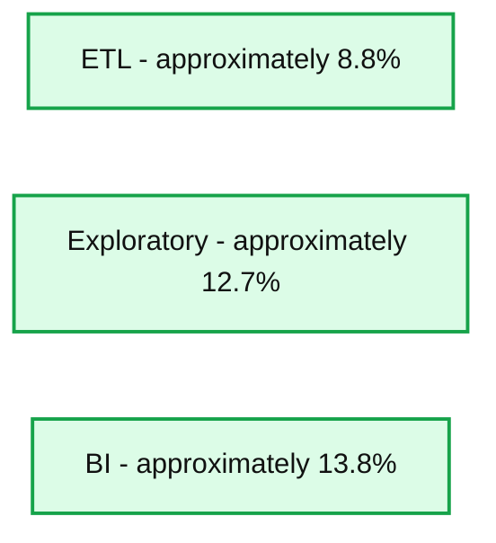

# Season's Speedings: Databricks SQL Delivers 4x Performance Boost Over Two Years

- Source: https://www.databricks.com/blog/seasons-speedings-databricks-sql-delivers-4x-performance-boost-over-two-years
- Published: 2024-11-07
- Authors: Jeremy Lewallen, Kent Marten, Ina Felsheim, Maggie Wu
- Categories: platform, product, engineering, data-warehousing
- Images: 1 total, 1 extracted as architecture

As the season of giving approaches, we at Databricks have been making our list and checking it twice--but instead of toys and treats, we've been wrapping up powerful performance improvements for our users. Through analyzing billions of production queries and listening closely to our community's wishes, we're excited to deliver a package of enhancements that make your data workloads run faster and more efficiently than ever. 

 

## **Crafting performance magic for every workload**

Just as Santa's workshop crafts everything from traditional wooden toys to the latest electronic gadgets, Databricks SQL has become the ultimate data workshop, expertly handling diverse workloads for users of all needs. Some teams need robust ETL engines to power their data assembly lines, while others require interactive dashboards for instant insights, and still others seek powerful tools for data exploration and discovery. By carefully analyzing customer feedback and usage patterns across billions of queries, we've identified the top items on our users' wish lists:

- ETL teams needing high-powered processing lines to meet production deadlines
- BI users requesting instantly responsive dashboards for their growing data collections
- Data scientists and analysts seeking lightning-fast tools for exploring complex datasets

## **Santa’s favorite data warehouse gets even faster**

At Databricks, we understand that performance is paramount for delivering a seamless user experience and optimizing costs. At the Data and AI Summit (DAIS) 2024, we introduced the Databricks Performance Index, intended to measure the impact of our AI performance optimizations on real-world workloads. A little over five months later, we're proud to announce that Databricks SQL is now 77% faster than when it launched in 2022. The Databricks Performance Index is derived statistically from repeating workloads, accounting for changes irrelevant to the engine, and computed against billions of production queries. Lower is better. 

 

This isn't just a benchmark. We track millions of real customer queries that run repeatedly over time. Analyzing these similar workloads allows us to observe a 77% speed improvement, reflecting the cumulative impact of our continued optimizations. 

 

## **Data “fast” bricks**

- **ETL workloads: 9% faster since DAIS 24’ - ** Extract, Transform, and Load (ETL) workloads are now, on average, **9% more efficient**, enabling quicker data ingestion and transformation. This improvement allows your data pipelines to run smoother and complete tasks faster.
- **Business Intelligence (BI): 14% faster since DAIS 24’ - **Databricks SQL now delivers **14% better performance for BI workloads**, providing faster query responses and more responsive dashboards. This enhancement ensures your business intelligence tools operate seamlessly, even as data volumes grow.
- **Exploratory workloads: 13% faster since DAIS 24’ - **Exploratory data analysis is now **13% faster**, empowering data scientists and analysts to iterate quickly and derive insights more efficiently. This boost accelerates the discovery process, enabling your team to make data-driven decisions with greater agility.

In other words, if you were using Databricks SQL six months ago for BI workloads, those same workloads are now, **on average, 14% faster**—and you didn’t have to make any changes to enjoy these improvements, like a touch of Santa’s magic.

*Databricks Performance Index is derived statistically from repeating workloads, accounting for changes irrelevant to the engine, and computed against billions of production queries. Higher is better.*

**Summary:** Databricks SQL performance improved from June to October 2024 across ETL, Exploratory, and BI workloads, with BI showing the largest improvement.

**Components:**
- ETL: Databricks SQL workload category.
- Exploratory: Databricks SQL workload category.
- BI: Databricks SQL workload category.

**Flows:**
- none. No arrows are shown.

**Numbers:**
- Period: June to October '24.
- Vertical axis: 0%, 2%, 4%, 6%, 8%, 10%, 12%, 14%.
- Approximate bar heights, without printed values: ETL 8.8%, Exploratory 12.7%, BI 13.8%.

source image: https://www.databricks.com/sites/default/files/inline-images/DBSQL-performance-numbers-Oct2024.png

*Databricks Performance Index is derived statistically from repeating workloads, accounting for changes irrelevant to the engine, and computed against billions of production queries. Higher is better.*

 

### **Deck the halls with data wins: Databricks SQL unwraps new performance features**

As organizations scale their analytics workloads on Databricks SQL, three key areas consistently emerge as priorities for optimization: complex joins that slow query performance, supporting concurrent workloads seamlessly, and accelerating queries for both beginners and experts. Based on analysis across our customer base, we've developed targeted performance improvements to address each of these areas. Here are some examples:

1. **Making JOINs faster and more efficient**
  - Complex joins are one of the most common performance challenges we see in customer workloads
  - We've rolled out two major improvements
    - Enhanced bloom filters and broadcast joins that reduce data shuffling, significantly cutting join times across customer workloads
    - Increased I/O pruning that reduces data scanned, making joins both faster and more cost-effective
2. ** Increasing concurrency with Intelligent Workload Management (WLM)**
  - For customers with high-concurrency needs, our 2024 WLM update enables:
    - Parallelizing up to 4x more concurrent queries from the queue
    - Improved cluster resource utilization
    - Reduced query wait times
3. **Automating statistics collection for predictive optimization**
  - Manual statistics management can lead to unpredictable query performance
  - Our new Predictive Optimization with ANALYZE:
    - Automatically maintains statistics for optimal query execution
    - Delivers 14-33% performance gains on TPC-DS benchmarks
    - Optimizes query planning for consistent performance

You can try all of these improvements now. Predictive Optimization with statistics is now in Gated Public Preview - [sign up here](https://forms.gle/DTYH8EUm5thKi8Nz6) to ensure your queries run faster and more consistently without manual tuning.

## **Stocking stuffers for your budget: Databricks SQL brings even more cost savings**

Reducing the total cost of ownership is a crucial priority for Databricks, and our latest improvements are designed to deliver substantial savings for our customers.

### **Faster downscaling for cost savings**

Building on our earlier advances this year that made downscaling **5x faster** than our 2023 AI models, we've further refined our algorithms to handle additional scenarios even more efficiently. These latest improvements allow Databricks SQL to detect and release idle compute resources more rapidly, leading to reduced **DBU compute expenses** for our customers. With faster downscaling and improved TCO, we're wrapping up the year with a gift that keeps on giving: more savings!

### **Upcoming cost-saving features in Private Preview**

**Enhanced compression:** We're rolling out an advanced** data compression method**, which promises even more significant cost savings by reducing data storage sizes and improving I/O efficiency. This move will further lower your storage expenses while maintaining high performance.

 

## **Join us in the season of giving**

The greatest gift is time. Our engineers have been working hard on productivity and user interface improvements that will reduce the time needed to do tasks. We do this by incorporating AI to automate tasks, by reducing friction as you move between tools in your data ecosystem, serverless and more. Like a new bicycle, these gifts are so big that they get their own gift bags and bows. Here are some highlights: 

- October 2024: [Introducing the New SQL Editor](https://www.databricks.com/blog/introducing-new-sql-editor)
- October 2024: [How to embed AI/BI Dashboards into your websites and applications](https://www.databricks.com/blog/how-embed-aibi-dashboards-your-websites-and-applications)
- September 2024: [What’s new with Databricks SQL](https://www.databricks.com/blog/whats-new-with-databricks-sql)
- September 2024: [Next-Level Interactivity in AI/BI Dashboards](https://www.databricks.com/blog/next-level-interactivity-aibi-dashboards)
- September 2024: [How to share AI/BI Dashboards with everyone in your organization](https://www.databricks.com/blog/sharing-aibi-dashboards)
- August 2024: [Onboarding your new AI/BI Genie](https://www.databricks.com/blog/onboarding-your-new-aibi-genie)
- August 2024: [Databricks SQL Serverless is now available on the Google Cloud Platform](https://www.databricks.com/blog/databricks-sql-serverless-now-available-google-cloud-platform)

Let Databricks SQL give you the gift of enhanced performance and reduced costs this holiday season. Whether running ETL pipelines, powering business intelligence tools, or conducting exploratory data analysis, our latest improvements are designed to help you achieve more with less.

Ready to experience these benefits firsthand? Contact your Databricks representative to start a proof-of-concept today and discover how Databricks SQL can transform your data operations. Our team is here to support you every step of the way, ensuring you maximize the value of your data intelligence platform.

What's at the top of every data team's wish list this year? It’s no secret–the best data warehouse is a lakehouse! Unwrap your [free trial](https://www.databricks.com/try-databricks) of Databricks SQL today.

### **Learn more**

To dive deeper into our performance optimizations and cost-saving features, check out our previous blog post: [**Databricks SQL Year in Review (Part I): AI-optimized Performance and Serverless Compute**](https://www.databricks.com/blog/databricks-sql-year-review-part-i-ai-optimized-performance-and-serverless-compute). Stay tuned for the next iteration of Performance and Total Cost of Ownership improvements in the first part of 2025.
