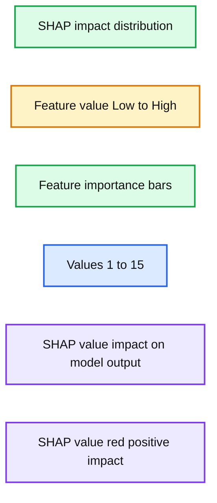

# Supercharge Your Machine Learning Projects With Databricks AutoML

*With a glass-box approach to automated machine learning, Databricks AutoML empowers both beginner and expert data scientists to get their ML models to production faster.*

- Source: https://www.databricks.com/blog/supercharge-your-machine-learning-projects-with-databricks-automl.html
- Published: 2022-04-18
- Authors: Kasey Uhlenhuth, Ari Paul, Nicolas Pelaez, Xiangrui Meng, Ying Xiong
- Categories: platform, product, engineering, data-science-machine-learning
- Images: 3 total, 1 extracted as architecture

Machine Learning (ML) is at the heart of innovation across industries, creating new opportunities to add value and reduce cost. At the same time, ML is hard to do and it takes an enormous amount of skill and time to build and deploy reliable ML models. Databricks [AutoML](https://www.databricks.com/product/automl) — now generally available (GA) with Databricks Runtime ML 10.4 – automatically trains models on a data set and generates customizable source code, significantly reducing the time-to value of ML projects. This glass-box approach to automated ML provides a realistic path to production with low to no code, while also giving ML experts a jumpstart by creating baseline models that they can reproduce, tune, and improve.

## What can Databricks AutoML do for you?

No matter your background in data science, AutoML can help you get to production machine learning quickly. All you need is a training dataset and AutoML does the rest. AutoML prepares the data for training, runs data exploration, trials multiple model candidates, and generates a Python notebook with the source code tailored to the provided dataset for each trial run. It also automatically distributes hyperparameter tuning and records all experiment artifacts and results in MLflow. It is ridiculously easy to [get started](https://docs.databricks.com/applications/machine-learning/automl.html)with AutoML, and hundreds of customers are using this tool today to solve a variety of problems.

[Fabletics](https://www.databricks.com/p/webinar/automl-rapid-simplified-machine-learning-for-everyone), for example, is leveraging AutoML — from data prep to model deployment — to predict customer churn. [Allscripts](https://www.allscripts.com/), a leader in electronic healthcare systems, is applying AutoML to improve their customer service experience by predicting outages. Both customers chose AutoML not just for its simplicity, but also its transparency and openness. While most automated machine learning solutions in the market today are opaque boxes with no visibility under the hood, Databricks AutoML generates editable notebooks with the source code of the model, visualizations and summary of the input data, and explanations on feature importance and model behavior.

**Summary:** SHAP analysis showing feature impact distributions and relative feature importance for Values 1 through 15.

**Components:**

- SHAP impact distribution plot
- Feature value color scale from Low to High
- SHAP feature importance bar chart
- Features Value 1 through Value 15

**Flows:**

- none

**Numbers:** 1, 2, 3, 4, 5, 6, 7, 8, 9, 10, 11, 12, 13, 14, 15; SHAP axis ticks -0.4, -0.2, 0.0, 0.2, 0.4, 0.6, 0.8; importance axis ticks 0.00, 0.05, 0.10, 0.15, 0.20; labels Low and High

source image: https://www.databricks.com/wp-content/uploads/2022/04/db-134-blog-img-3.jpg

Our customers' use-cases also signify the broad relevance of AutoML. The team of data scientists at Fabletics uses AutoML to quickly generate baseline models that they can tune and improve. At Allscripts, on the other hand, 3 customer success engineers with no prior background in data science were able to train and deploy classification models in a few weeks. In both cases, the results were impressive - Fabletics was able to generate and tune models in 30 minutes (which previously had taken them days), and Allscripts saw massive improvement in their customer service operations when they put their AutoML model into production. AutoML is now the starting point for new ML initiatives at both companies, and their deployments are part of multi-task workflows they've built within the Databricks Lakehouse.

## AutoML is now generally available - here's how to get started

**Databricks AutoML is now** [**generally available**](https://docs.databricks.com/applications/machine-learning/automl.html) (GA); here's how you can get up and running with AutoML in a few quick steps -

**Step1: Ingest data into the lakehouse.** For this example, where we want a predictive troubleshooting model based on server logs, we have generated some training data. We have done this right in our notebook, which you can import here, and in just a few seconds, ingested this data into your lakehouse

In this example, there are 5 million rows of network logs being generated with some of the data being biased towards causing network failures and other random data meant to simulate noise or uncorrelated data. Each row of data is labeled with a classification stating if the system had failed recently or not.

**Step 2: Let AutoML automatically train the models for you.** We can simply feed the data into Databricks AutoML, tell it which field we'd like it to predict, and AutoML will begin training and tracking many different approaches to creating the best model for the provided data. Even as a seasoned ML practitioner, the amount of time saved by automatically iterating over many models and surfacing the resulting metrics is amazing.

**Step 3: Choose the model that best fits your needs and optimize.** In only a couple of minutes AutoML is able to train several models and churns out model performance metrics. For this specific set of data, the highest-performing model was a decision tree, but there was also a logistic regression model that performed well. Both models had satisfactory f1 scores, which shows the model fits the validation data well. But that's not all - each model created by AutoML comes with customizable source-code notebooks specific to the dataset and model. This means that once a trained model shows promise, it's exceptionally easy to begin tailoring it to meet the desired threshold or specifications.

**Step 4: Deploy with MLflow.** Select the best model - as defined by your metrics - and register it to the MLflow Model Registry. From here, you can serve the model using [MLflow Model Serving](https://www.databricks.com/blog/2020/06/25/announcing-mlflow-model-serving-on-databricks.html) on Databricks as a REST endpoint.

Ready to get started? Take it for a spin, or dive deeper into AutoML with the below resources.

## Learn more about AutoML

- Take it for a spin! Check out the AutoML [free trial](https://www.databricks.com/try/databricks-free-automl)
- Dive deeper into the Databricks AutoML [documentation](https://www.databricks.com/product/automl)
- Check out this [introductory video](https://www.youtube.com/watch?v=zQEiwJqqeeA): AutoML - A glass-box approach to automated machine learning
- Check out this fabulous use-case with our customer [Fabletics](https://www.databricks.com/p/webinar/automl-rapid-simplified-machine-learning-for-everyone): Using AutoML to predict customer churn
- Learn more about time-series forecasting with AutoML in this [blog](https://www.databricks.com/blog/2022/02/09/jumpstart-your-machine-learning-forecasting-with-databricks-automl.html)
