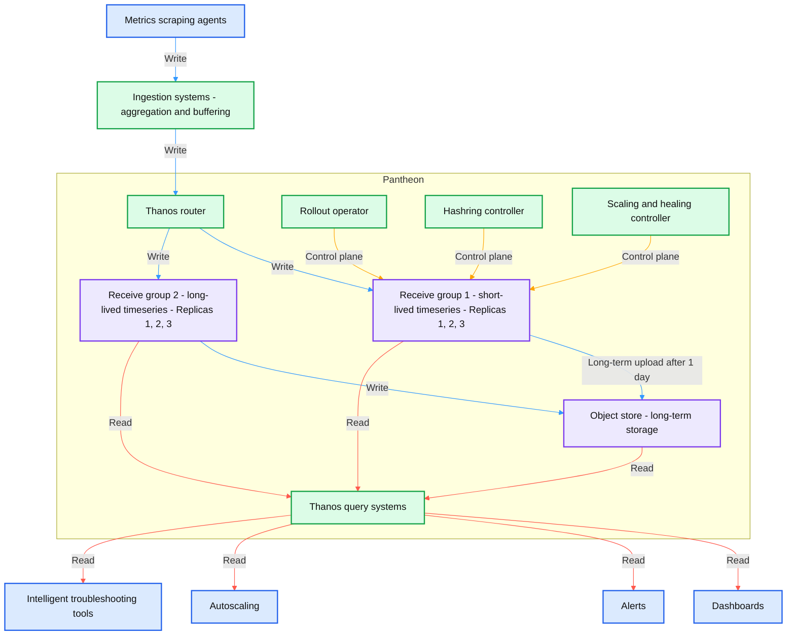
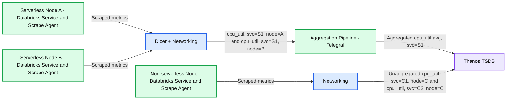
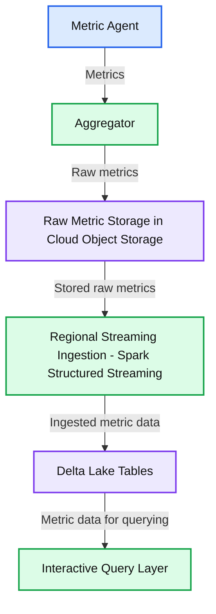

# 10 trillion samples a day: Scaling beyond traditional monitoring infra at Databricks

*How we built a monitoring platform designed for Databricks’ exponential growth*

- Source: https://www.databricks.com/blog/10-trillion-samples-day-scaling-beyond-traditional-monitoring-infra-databricks
- Published: 2026-05-05
- Authors: David Yuan, Yi Jin, Karan Bavishi, HC Zhu, Joey Beyda
- Categories: engineering
- Images: 3 total, 3 extracted as architecture

**Key takeaways**

- Databricks’ monitoring systems manage over 5 billion active timeseries in real-time across AWS, Azure, and GCP.
- To keep these systems reliable and low-touch despite rapid scaling, we rearchitected our TSDB and aggregation layers by customizing open-source monitoring solutions.
- In the face of heavy growth in high-cardinality troubleshooting metrics, we developed a novel Lakehouse-based platform called Hydra. This approach has unlocked rich debugging capabilities at massive scale and 50x cheaper storage than our existing stack.

Databricks’ monitoring infrastructure has more than tripled in size over the last year, now tracking 5 billion active timeseries in real-time and ingesting over 10 trillion samples per day. At this massive scale, we found that off-the-shelf solutions were inefficient or difficult to tailor to our requirements. This post shares what we built instead: a scalable platform that leverages the best of the open-source monitoring ecosystem while baking in customizations for our unique needs.

Engineers across Databricks depend on monitoring systems that quickly alert us to issues, automate scaling and rollbacks, and enable [intelligent troubleshooting](https://www.databricks.com/blog/how-we-debug-1000s-databases-ai-databricks). These systems need to be highly reliable so that we can be confident we won’t fly blind during a potential incident. However, it proved no easy feat to develop this infrastructure for Databricks scale:

- Besides requirements for scalability, reliability, and efficiency, we run our systems globally in roughly 70 cloud regions across each of the 3 major clouds. We need to support equivalent performance despite differences in clouds, and even individual regions.
- In the face of this breadth and variety, operating large-scale infrastructure can quickly become unsustainable. The system needs to be as “hands off” as possible – self-healing and self-scaling, rather than our oncalls directly managing each regional stack – and still provide simple interfaces for users.
- With the growth of serverless and AI workloads at Databricks, churn across our infrastructure has skyrocketed, causing rapid increases in the cardinality of metrics. We could no longer process and store high-cardinality monitoring data as we always had, but we still aimed to maintain the debugging workflows relied on by engineers.

Up against these challenges, Databricks’ old monitoring stack was beset with reliability issues. We set out to develop a new, dependable platform that would meet our engineers’ expectations. We have since tackled 3 key problems:

1. Architecting a reliable and efficient timeseries database (TSDB)
2. Introducing metric aggregation to shield TSDBs from cardinality
3. Enabling highly dimensional troubleshooting with the Databricks lakehouse

## Thanos timeseries databases

### What are TSDBs?

TSDBs are a core component of traditional monitoring system architectures. These specialized databases are designed to ingest large amounts of timeseries metrics data and serve high-QPS, low-latency, real-time reads. They are especially optimal for monitoring query patterns such as alerts and dashboard refreshes, which require issuing the same set of queries repeatedly and getting lightning-fast results based on the newest data.

Databricks’ old TSDBs had been built for an order of magnitude lower scale, and became a major bottleneck for us in recent years. In fact, the #1 reliability problem for the entire monitoring infrastructure was the difficulty of scaling up our TSDBs. This is an infrequent operation for many other companies, but something we needed to do almost daily given Databricks’ exponential growth.

So we developed a new TSDB codenamed **Pantheon**, which is a fork of the open-source CNCF [Thanos](https://thanos.io/) project. We’ve successfully scaled to over 160 instances of Thanos across all regions in three cloud providers, with a total of around 5 billion in-memory active timeseries and over 10 trillion samples ingested daily. Our largest instance hosts about 300 million in-memory timeseries and supports nearly 1,000 PromQL queries per second; we also run small 3-node deployments and everything in between. Because of the breadth, scale, and variety of our deployments, we often uncover Thanos edge cases and performance optimizations and contribute these back to the open-source community.

**Migrating to Pantheon has allowed us to save millions of dollars in annual cloud costs, while reducing monitoring infrastructure downtime by ~5x and eliminating many sources of manual toil. **The Pantheon architecture is shown below, and the following sections explain several key design decisions that made these achievements possible.

**Summary:** Pantheon routes ingested metrics through Thanos receive groups with replicated storage and long-term object storage, serving queries for dashboards, alerts, autoscaling, and troubleshooting.

**Components:**

- Metrics scraping agents: collect metrics; technology unspecified.
- Ingestion systems: aggregation and buffering; technology unspecified.
- Pantheon: contains Thanos routing, query, storage, and control components.
- Thanos router: routes writes using Thanos.
- Thanos query systems: serve reads using Thanos.
- Receive group 1: short-lived timeseries with Replica 1, Replica 2, and Replica 3.
- Receive group 2: long-lived timeseries with Replica 1, Replica 2, and Replica 3.
- Object store: long-term storage; technology unspecified.
- Rollout operator: control plane; technology unspecified.
- Hashring controller: control plane; technology unspecified.
- Scaling and healing controller: control plane; technology unspecified.
- Dashboards: metrics consumer; technology unspecified.
- Alerts: metrics consumer; technology unspecified.
- Autoscaling: metrics consumer; technology unspecified.
- Intelligent troubleshooting tools: metrics consumer; technology unspecified.
- Arrow legend: blue indicates write path, red indicates read path, and orange indicates control plane.

**Flows:**

- Metrics scraping agents -> Ingestion systems: metrics writes.
- Ingestion systems -> Thanos router: aggregated and buffered metrics writes.
- Thanos router -> Receive group 1: timeseries writes.
- Thanos router -> Receive group 2: timeseries writes.
- Receive group 1 -> Object store: long-term data uploaded after 1 day.
- Receive group 2 -> Object store: long-term storage writes.
- Receive group 1 -> Thanos query systems: timeseries read path.
- Receive group 2 -> Thanos query systems: timeseries read path.
- Object store -> Thanos query systems: long-term data read path.
- Thanos query systems -> Dashboards: read results.
- Thanos query systems -> Alerts: read results.
- Thanos query systems -> Autoscaling: read results.
- Thanos query systems -> Intelligent troubleshooting tools: read results.
- Rollout operator -> Receive group 1: control plane through a shared connector.
- Hashring controller -> Receive group 1: control plane through a shared connector.
- Scaling and healing controller -> Receive group 1: control plane through a shared connector.

**Numbers:**

- Receive groups numbered 1 and 2.
- Replicas numbered 1, 2, and 3 in each receive group.
- Long-term data uploaded after 1 day.

source image: https://www.databricks.com/sites/default/files/inline-images/thanos-timeseries-databases.png

### Storage architecture

A key element of Thanos is its **tiered storage **architecture. The most recent timeseries are kept in-memory, the last 24 hours’ timeseries are kept on-disk, and all older data is kept on object storage. This means alerts and other real-time queries can meet strict performance requirements, as they typically depend on the newest data. At the same time, leveraging object storage allows the system to essentially decouple compute from storage; a cluster can scale up without needing to rebalance all its historical data across database nodes.

This architecture addressed our key bottleneck (scaleups) and laid the foundation for Pantheon’s cost savings. We’ve applied several other optimizations:

- **Memory retention: **We deploy two Receive groups with distinct memory-retention policies: one optimized for long-lived timeseries from persistent services, keeping two hours of samples in memory, and another optimized for short-lived timeseries from Databricks’ ephemeral workloads, keeping only 30 minutes’ worth in memory. This split reflects the lifespan we observed for serverless workloads at Databricks, and significantly reduces memory footprint and cloud cost while preserving correctness.
- **Receive group structure: **Each group is intentionally implemented as three isolated Kubernetes StatefulSets, corresponding to three replicas, instead of a single large hash ring. This design preserves three-way replication with quorum writes, while providing stronger operational and data isolation. This setup allows us to roll or restart an entire StatefulSet in parallel during releases or node rotations without violating quorum or impacting write availability, which materially simplifies day-to-day operations.
- **Multitenancy: **Pantheon uses Thanos multitenancy to host disjoint sets of tenants across Receive groups. At the router layer, we apply rule-based tenant attribution, inferring the tenant for each data sample by inspecting the metric name and selected labels. This enables samples within the same write batch to be routed to different tenants — and therefore different Receive groups — without requiring upstream client changes.
- **At-least-once uploads: **To further optimize cost while preserving correctness, only two of the three StatefulSets upload blocks to object storage. This reduces redundant upload traffic and cloud storage costs while maintaining data durability and consistency guarantees through replication and quorum semantics.

### Pantheon control plane

At our global scale, manual operations, best-effort Kubernetes automation, or vanilla Thanos behaviors are insufficient. Every release, scale event, or host failure must be handled** safely, automatically, and with minimal human intervention, **while preserving quorum and data availability. To achieve this, Pantheon introduces a purpose-built **control plane** responsible for orchestrating Thanos components’ lifecycle and capacity decisions. It consists of three key controllers:

- **Rollout Operator: **Coordinates releases and scaling across three isolated Receive StatefulSets, guaranteeing quorum for both reads and writes. It enables faster releases through parallel StatefulSet updates, ensuring that at most one replica is unavailable at any time.
- **Hashring Controller:** Manages which Receive endpoints are visible to the router. Only healthy, fully ready pods are added to the hashring, and removals are staged during scale-down or maintenance. This decouples traffic management from pod lifecycle and prevents accidental quorum violations or partial routing during dynamic cluster changes.
- **Autoscaling and Self-Healing Controller:** Scales clusters based on Pantheon-specific ingestion and resource pressure rather than generic Kubernetes signals. A built-in healer system continuously detects and remediates common failure modes — such as bad hosts, overloaded pods, or a corrupted WAL — allowing the system to self-recover without operator intervention. At our scale, these automations kick in dozens of times per week.

## Cardinality and aggregation

### What is cardinality and why is it important?

Metric owners often add labels such as node ID or pod ID to help them debug issues on specific dimensions and mitigate incidents faster. However, this leads to a classic observability challenge: managing cardinality. A metric’s cardinality is the number of unique combinations of its labels. If the number of pods you are monitoring increases 10x, so does the cardinality of any metric with a pod ID label. Cardinality is the primary scaling factor for a TSDB, and growth in the cardinality of existing metrics increases costs and scaling pressure on Pantheon.

Rapid infra growth is a challenge we are blessed with at Databricks. At the same time as our customer base and product usage have grown significantly, many customers have recently adopted our [serverless computing](https://www.databricks.com/glossary/serverless-computing) architecture, and our serverless compute platform [launches](https://www.databricks.com/blog/booting-databricks-vms-7x-faster-serverless-compute) tens of millions of VMs daily. As more workloads move over to serverless, the infra we’re monitoring becomes higher-churn, and the lifetime of these identifier labels keeps getting shorter.

This has caused cardinality to balloon, eating into the scalability and cost wins from Pantheon. Thus, we had to get a lot smarter about what metrics data we stored. This is where “aggregation” came in: dropping expensive labels from serverless systems during ingestion, while still providing an aggregated fleetwide view to service owners. **An automated aggregation strategy for metrics has allowed us to “bend the curve” of cardinality growth, ensuring the monitoring infra doesn’t need to scale faster than the rest of Databricks.**

### Aggregation architecture

Building reliable aggregation infra at scale is hard because it is stateful. Aggregators managing millions of input counters must be able to handle resets correctly – if an input timeseries disappears, the aggregated output value should continue to increase monotonically rather than dip. With metrics partitioned across aggregators, you also must handle scenarios such as pod restarts and load imbalance.

These problems are often solved by using a messaging system like Kafka for partitioning assignments and maintaining previous data; this is costly at our scale and adds ingestion delay that impacts real-time usecases. The alternative approach is to store in-memory state in aggregators and reroute metrics between aggregators to honor assignment. However, this leads to data loss when an aggregator is redeployed; in an initial version of our aggregation infrastructure, this behavior made aggregated metrics almost unintelligible to our users.

To make this work seamlessly, we instead developed our own aggregation system using [Telegraf](https://github.com/influxdata/telegraf) and Databricks’ “auto-sharder” service [Dicer](https://www.databricks.com/blog/open-sourcing-dicer-databricks-auto-sharder). This architecture uses intelligent sticky routing instead of rerouting metrics across aggregators, which addressed the redeployment failure modes. With other optimizations we’ve added on top of Telegraf, we’ve been able to scale the pipeline to over 1GB/s in our largest region and thousands of aggregation rules.

**Summary:** Serverless node metrics pass through Dicer and Telegraf aggregation before reaching Thanos TSDB, while non-serverless metrics reach Thanos without aggregation.

**Components:**
- Serverless Node A: contains a Databricks Service and Scrape Agent.
- Serverless Node B: contains a Databricks Service and Scrape Agent.
- Non-serverless Node: contains a Databricks Service and Scrape Agent.
- Dicer + Networking: routes serverless metrics.
- Aggregation Pipeline: uses Telegraf.
- Networking: carries non-serverless metrics.
- Thanos TSDB: stores aggregated and unaggregated metrics.
- Serverless metric labels: `cpu_util, svc=S1, node=A` and `cpu_util, svc=S1, node=B`.
- Aggregated metric label: `cpu_util:avg, svc=S1`.
- Non-serverless metric labels: `cpu_util, svc=C1, node=C` and `cpu_util, svc=C2, node=C`.

**Flows:**
- Serverless Node A -> Dicer + Networking: scraped metrics.
- Serverless Node B -> Dicer + Networking: scraped metrics.
- Dicer + Networking -> Aggregation Pipeline: `cpu_util, svc=S1, node=A` and `cpu_util, svc=S1, node=B`.
- Aggregation Pipeline -> Thanos TSDB: aggregated `cpu_util:avg, svc=S1`.
- Non-serverless Node -> Networking: scraped metrics.
- Networking -> Thanos TSDB: unaggregated `cpu_util, svc=C1, node=C` and `cpu_util, svc=C2, node=C`.

**Numbers:** none

source image: https://www.databricks.com/sites/default/files/inline-images/aggregation-architecture-two.png

This new aggregation pipeline effectively became the shield protecting our TSDBs from long-term cardinality growth as well as unexpected metric surges. For example, a recent Databricks infrastructure incident resulted in a 2-5x surge in metrics load across various regions. Telegraf absorbed most of this load, and Pantheon only saw a 20% surge, allowing engineers across the company to run debugging and alerting queries without any impact.

## High-cardinality data on the lakehouse

### The problem with aggregation

Our aggregation infrastructure allows us to shield Pantheon from exponential cardinality growth, but this comes at a cost — it removes the exact dimensions engineers need during incidents. Consider a global fleet with:

- Millions of active nodes in the last 2 hours
- Multiple tenants per node
- Short-lived workloads
- Rapid autoscaling

Aggregated metrics tell you:

- Region-level CPU usage is elevated
- Service-level latency is spiking

But they don’t tell you:

- Which tenant is causing swap pressure
- Which node crashed
- Which shard is isolated
- Which workload is noisy

Databricks engineers still needed a solution for troubleshooting workflows that relied on these high-cardinality labels. These “needle in the haystack” scenarios required efficiently storing and processing massive amounts of raw data, which Pantheon couldn’t. To support these usecases, we sought out a different storage architecture that would not be limited by cardinality growth.

### Enter the lakehouse!

Our key insight: the Databricks lakehouse is a perfect fit! It decouples storage (cheap object storage + Delta Lake) from compute (streaming + query clusters) and is massively scalable on both dimensions.

**Using the best of Databricks’ capabilities, we developed a new platform for raw troubleshooting data called Hydra, which has made high-cardinality debugging practical at massive scale.** Hydra ingests 20 billion unaggregated, active timeseries from millions of nodes worldwide, while achieving 5 minutes end-to-end data freshness and 50x cheaper data storage than Thanos.

These wins were enabled by Hydra’s lakehouse-native design:

**Summary:** Hydra’s lakehouse pipeline moves metrics from a metric agent through aggregation, cloud object storage, Spark streaming ingestion, and Delta Lake tables to an interactive query layer.

**Components:**
- Metric Agent: metric collection; technology unspecified.
- Aggregator: metric aggregation; technology unspecified.
- Raw Metric Storage in Cloud Object Storage: durable raw metric storage; cloud provider unspecified.
- Regional Streaming Ingestion: Spark Structured Streaming.
- Delta Lake Tables: Delta Lake storage.
- Interactive Query Layer: query access; technology unspecified.

**Flows:**
- Metric Agent -> Aggregator: metrics.
- Aggregator -> Raw Metric Storage in Cloud Object Storage: raw metrics.
- Raw Metric Storage in Cloud Object Storage -> Regional Streaming Ingestion: stored raw metrics for ingestion.
- Regional Streaming Ingestion -> Delta Lake Tables: ingested metric data.
- Delta Lake Tables -> Interactive Query Layer: metric data for querying.

**Numbers:** none

source image: https://www.databricks.com/sites/default/files/inline-images/hydras-lakehouse-native-design-three.png

- We use [Apache Spark™ Structured Streaming](https://docs.databricks.com/aws/en/structured-streaming/tutorial) on Databricks to run continuous ingestion jobs that incrementally process metric data as it arrives, writing it in Delta Lake. Structured Streaming lets you express streaming computations the same way you write batch jobs, but with continuous, incremental processing and exactly-once semantics for reliable ingestion.
- To efficiently discover and ingest millions of object storage files, we leverage[Databricks Auto Loader](https://docs.databricks.com/aws/en/ingestion/cloud-object-storage/auto-loader), a high-throughput Structured Streaming source that tracks and incrementally processes new files without requiring manual listing or state management. Auto Loader automatically persists metadata about discovered files and scales to handle near-real-time arrival patterns.
- We also partition ingestion by region, deploying independent streaming jobs across geographies. This enables each pipeline to autoscale independently, minimizes cross-region latency, and reduces blast radius in case of failures. Together, these design choices allow raw metric data to be queryable within minutes of emission, even at multi-billion series volume, while keeping dashboard systems performant.

### Unifying interfaces

Building Hydra was not just an infrastructure challenge; it was an interface design challenge. From the beginning, we designed Hydra around Critical User Journeys (CUJs) for our engineers rather than around storage layers or ingestion pipelines. Our goal was simple: engineers should be able to work with high-cardinality metrics using the same interfaces they already rely on.

**Querying Through Grafana**

Most engineers begin their debugging workflow in Grafana. They expect to write PromQL, use existing dashboards, drill into labels, and pivot quickly during incidents.

To preserve this workflow, Hydra integrates directly with Grafana by enabling PromQL queries to run against data stored in Databricks. We built a PromQL-to-SQL conversion layer that translates PromQL expressions into SQL queries executed on Delta tables in the Lakehouse. This approach allows engineers to continue using familiar PromQL syntax and dashboards without modification. At the same time, the underlying queries are executed against large-scale Delta tables rather than an in-memory TSDB.

**Direct SQL Access in Databricks**

While Grafana is ideal for live debugging, some investigations require deeper analysis. Engineers may need to join metrics with deployment metadata, correlate metrics with logs, run wide time-range scans, perform anomaly detection, or export datasets for advanced analytics.

Hydra also exposes the underlying Delta tables directly within Databricks. Engineers can query these tables using Databricks SQL or notebooks, enabling flexible analysis that goes beyond traditional monitoring workflows.

Because the data resides in the Lakehouse, it becomes joinable with other enterprise datasets and governed under the same security and access controls. This turns observability data into a first-class analytical asset rather than an isolated monitoring silo.

**Unified Metric Semantics**

A key design principle of Hydra is that engineers should not need to understand our ingestion architecture. Whether a metric is accessed through the TSDB-backed aggregated path, or the Lakehouse-backed raw metric path, the interface remains consistent.

Metric names, label semantics, and metadata dimensions are unified across environments. Service teams emit metrics once using a standardized interface. The platform handles aggregation, raw preservation, ingestion, storage, and query routing. This unified model reduces cognitive overhead and eliminates the need for teams to manage separate configurations for different observability backends.

Going forward, we are looking into improving the performance of Hydra so it achieves similar data freshness to Pantheon and the two experiences converge even further.

## Takeaways

To scale the Databricks monitoring infrastructure, we’ve needed to optimize for reliability, efficiency, operability, and developer journeys. “Scaling” for us has meant more than just upsizing our deployments. It has meant:

- Baking in resilience and automation to our foundational architecture, to achieve “hands-off” operations for these global and ever-changing systems
- Rethinking from first principles the sort of systems that were necessary for various monitoring usecases, from alerting to troubleshooting to analysis across data sources
- Evolving our architecture as the rest of Databricks’ infra has transformed alongside us

These will be never-ending journeys for us, and they are illustrative of why infrastructure engineering is such a dynamic space at Databricks. If you like solving tough engineering problems and would like to join us for the ride, check out [databricks.com/careers](https://www.databricks.com/company/careers)!
