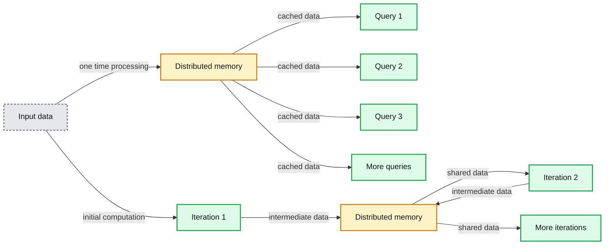

# Putting Apache Spark to Use: Fast In-Memory Computing for Your Big Data Applications

- Source: https://www.databricks.com/blog/2013/11/21/putting-spark-to-use.html
- Published: 2013-11-21
- Authors: Pat McDonough
- Categories: engineering, open-source
- Images: 3 total, 2 extracted as architecture

*A version of this post appears on the [Cloudera Blog](https://blog.cloudera.com/).*

---

Apache [Hadoop](https://www.databricks.com/glossary/hadoop) has revolutionized big data processing, enabling users to store and process huge amounts of data at very low costs. [MapReduce](https://www.databricks.com/glossary/mapreduce) has proven to be an ideal platform to implement complex batch applications as diverse as sifting through system logs, running ETL, computing web indexes, and powering personal recommendation systems. However, its reliance on persistent storage to provide fault tolerance and its one-pass computation model make MapReduce a poor fit for low-latency applications and iterative computations, such as machine learning and graph algorithms.

Apache Spark addresses these limitations by generalizing the MapReduce computation model, while dramatically improving performance and ease of use.

## Fast and Easy Big Data Processing with Spark

At its core, Spark provides a general programming model that enables developers to write application by composing arbitrary operators, such as mappers, reducers, joins, group-bys, and filters. This composition makes it easy to express a wide array of computations, including iterative machine learning, streaming, complex queries, and batch.

In addition, Spark keeps track of the data that each of the operators produces, and enables applications to reliably store this data in memory. This is the key to Spark’s performance, as it allows applications to avoid costly disk accesses. As illustrated in the figure below, this feature enables:

**Summary:** The diagram shows Spark using distributed in-memory data to support low-latency parallel queries and efficient iterative computations.

**Components:**

- Input data source
- Distributed memory cache
- Query 1 computation
- Query 2 computation
- Query 3 computation
- Iteration 1 computation
- Iteration 2 computation
- Additional queries or iterations

**Flows:**

- Input -> Distributed memory: one-time processing
- Distributed memory -> Query 1: cached data
- Distributed memory -> Query 2: cached data
- Distributed memory -> Query 3: cached data
- Distributed memory -> Additional queries: cached data
- Input -> Iteration 1: initial computation
- Iteration 1 -> Distributed memory: intermediate data
- Distributed memory -> Iteration 2: shared data
- Iteration 2 -> Distributed memory: intermediate data
- Distributed memory -> Additional iterations: shared data

**Numbers:** 1, 2, 3, and ellipsis indicating additional queries or iterations

source image: https://www.databricks.com/wp-content/uploads/2013/11/using-ram.png

- Low-latency computations by caching the working dataset in memory and then performing computations at memory speeds, and
- Efficient iterative algorithm by having subsequent iterations share data through memory, or repeatedly accessing the same dataset

Spark’s ease-of-use comes from its general programming model, which does not constrain users to structure their applications into a bunch of map and reduce operations. Spark’s parallel programs look very much like sequential programs, which make them easier to develop and reason about. Finally, Spark allows users to easily combine batch, interactive, and streaming jobs in the same application. As a result, a Spark job can be up to 100x faster and requires writing 2-10x less code than an equivalent Hadoop job.

## Using Spark for Advanced Data Analysis and Data Science

### Interactive Data Analysis

One of Spark’s most useful features is the interactive shell, bringing Spark’s capabilities to the user immediately – no IDE and code compilation required. The shell can be used as the primary tool for exploring data interactively, or as means to test portions of an application you’re developing.

The screenshot to the right shows a Spark Python shell in which the user loads a file and then counts the number of lines that contain “Holiday”.

As illustrated in this example, Spark can read and write data from and to [HDFS](https://www.databricks.com/glossary/hadoop-distributed-file-system-hdfs). Thus, as soon as Spark is installed, a Hadoop user can immediately start analyzing HDFS data. Then, by caching a dataset in memory, a user can perform a large variety of complex computations interactively!

Spark also provides a Scala shell, and APIs in Java, Scala, and Python for stand-alone applications.

### Faster Batch

Some of the earliest deployments of Spark have focused on how to improve performance in existing MapReduce applications. Remember that MapReduce is actually a generic execution framework and is not exclusive to it’s most well-known implementation in core Hadoop. Spark provides MapReduce as well, and because it can efficiently use memory (while using lineage to recover from failure if necessary), some implementations are simply faster in Spark’s MapReduce as compared to Hadoop’s MapReduce right off the bat, before you even get in to leveraging cache for iterative programs.

The example below illustrates Spark’s implementation of MapReduce’s most famous example, word count. You can see that Spark supports operator chaining. This becomes very useful when doing a bit of pre- or post-processing on your data, such as filtering data prior to running a complex MapReduce job.

Spark’s batch capabilities have been proven in real-world scenarios. A very large Silicon Valley Internet company did a plain-vanilla port of a single MR job implementing feature extraction in a model training pipeline, and saw a 3x speedup.

### Iterative Algorithms

**Summary:** Logistic regression runtime comparison showing Hadoop taking about 110 seconds and Spark taking about 3 seconds.

**Components:**

- Hadoop batch processing
- Spark in-memory processing
- Time axis measured in seconds

**Flows:**

- none

**Numbers:** 0, 20, 40, 60, 80, 100, 120, 140 seconds; Hadoop about 110 seconds; Spark about 3 seconds

source image: https://www.databricks.com/wp-content/uploads/2013/11/logistic-regression-performance.png

 Spark allow users and applications to explicitly cache a dataset by calling the cache() operation. This means that your applications can now access data from RAM instead of disk, which can dramatically improve the performance of iterative algorithms that access the same dataset repeatedly. This use case covers an important class of applications, as all machine learning and graph algorithms are iterative in nature.

Two of the world’s largest Internet companies leverage Spark’s efficient iterative execution to provide content recommendations and ad targeting. Machine-learning algorithms such as logistic regression have run 100x faster than previous Hadoop-based implementations (see the plot to the right), while other algorithms such as collaborative filtering or alternating direction method of multipliers have run over 15x faster.

The following example uses logistic regression to find the best hyperplane that separates two sets of points in a multi-dimensional feature space. Note the cached dataset “points” is accessed repeatedly from memory, whereas in MapReduce, each iteration will read data from the disk, which incurs a huge overhead.

### Real-Time Stream Processing

With a low-latency data analysis system at your disposal, it’s natural to extend the engine towards processing live data streams. Spark has an API for working with streams, providing exactly-once semantics and full recovery of stateful operators. It also has the distinct advantage of giving you the same Spark APIs to process your streams, including reuse of your regular Spark application code.

The code snippet below shows a simple job processing a network stream, filtering for words beginning with a hashtag and performing a word count on every 10 seconds of data. Compare this to the previous word-count example and you’ll see how almost the exact same code is used, but this time processing a live data stream.

Although the Spark Streaming API was released less than a year ago, users have deployed it in production to provide monitoring and alerting against stateful, aggregated data from system logs, achieving very fast processing with only seconds of latency.

### Faster Decision-Making

Many companies use big data to make or facilitate user’s decisions in the form of recommendation systems, ad targeting, or predictive analytics. One of the key properties of any decision is latency — that is, the time it takes to make the decision from the moment the input data is available. Reducing decision latency can significantly increase their effectiveness, and ultimately increase the company’s return on investment. Since many of these decisions are based on complex computations (such as machine learning and statistical algorithms), Spark is an ideal fit to speed up decisions.

Not surprisingly, Spark has been deployed to improve decision quality as well as to reduce latency. Examples range from ad targeting, to improving the quality of video delivery over the Internet.

### Unified Pipelines

Many of today’s Big Data deployments go beyond MapReduce by integrating other frameworks for streaming, batch, and interactive computation. Users can dramatically reduce the complexity of their data processing pipelines by replacing several systems with Spark.

For instance, today, many companies use MapReduce to generate reports and answer historical queries, and deploy a separate system for stream processing to follow key metrics in real-time. This approach requires one to maintain and manage two different systems, as well as develop applications for two different computation models. It would also require one to make sure the results provided by the two stacks are consistent (for example, a count computed by the streaming application and the same count computed by MapReduce).

Recently, users have deployed Spark to implement stream processing as well as batch processing for providing historical reports. This not only simplifies deployment and maintenance, but dramatically simplifies application development. For example, maintaining the consistency of real-time and historical metrics is no longer a problem as they are computed using the same code. A final benefit of the unification is improved performance, as there is no need to move the data between different systems: once in-memory, the data can be shared between the streaming computations and historical (or interactive) queries.

### Your Turn: Go Get Started

Spark is very easy to get started writing powerful Big Data applications. Your existing Hadoop and/or programming skills will have you productively interacting with your data in minutes. Go get started today:

- [Download Spark](https://spark.incubator.apache.org/downloads.html)
- [Quick Start](https://spark.incubator.apache.org/docs/latest/quick-start.html)
- Spark Summit (2013 Conference Talks and Training)
