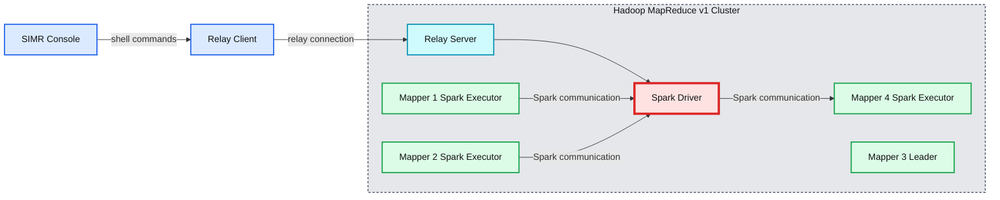

# Apache Spark In MapReduce (SIMR)

- Source: https://www.databricks.com/blog/2014/01/01/simr.html
- Published: 2014-01-01
- Authors: Ali Ghodsi, Ahir Reddy
- Categories: solutions, engineering, open-source
- Images: 2 total, 1 extracted as architecture

Apache [Hadoop](https://www.databricks.com/glossary/hadoop) integration has always been a key goal of Apache Spark and [YARN](http://hortonworks.com/wp-content/uploads/2013/06/YARN.png) users have long been able to run [Spark on YARN](https://spark.incubator.apache.org/docs/latest/running-on-yarn.html). However, up to now, it has been relatively hard to run Spark on Hadoop [MapReduce](https://www.databricks.com/glossary/mapreduce) v1 clusters, i.e. clusters that do not have YARN installed. Typically, users would have to get permission to install Spark/Scala on some subset of the machines, a process that could be time consuming. Enter [SIMR (Spark In MapReduce)](http://databricks.github.io/simr/), which has been released in conjunction with [Apache Spark 0.8.1](https://www.databricks.com/blog/2013/12/19/release-0_8_1.html).

SIMR allows anyone with access to a Hadoop MapReduce v1 cluster to run Spark out of the box. A user can run Spark directly on top of Hadoop MapReduce v1 without any administrative rights, and without having Spark or Scala installed on any of the nodes. The only requirements are [HDFS](https://www.databricks.com/glossary/hadoop-distributed-file-system-hdfs) access and MapReduce v1. SIMR is open sourced under the [Apache license](https://apache.org/licenses/LICENSE-2.0.html) and was jointly developed by Databricks and UC Berkeley [AMPLab](http://amplab.cs.berkeley.edu).

The basic idea is that a user can download the package of SIMR ([3 files](http://databricks.github.io/simr/#download)) that matches their [Hadoop cluster](https://www.databricks.com/glossary/hadoop-cluster) and immediately start using Spark. SIMR includes the interactive Spark shell, and allows users to use the shell backed by the computational power of the cluster. It is a simple as `./simr --shell`:

 

Running a Spark program simply requires bundling it along with its dependencies into a jar and launching the job through SIMR. SIMR uses the following command line syntax for running jobs:

SIMR simply launches a MapReduce job with the desired number of map slots, and ensures that Spark/Scala and your job gets shipped to all those nodes. It then designates one of the mappers as the master and runs the Spark driver inside it. On the rest of the mappers it launches Spark executors that will execute tasks on behalf of the driver. Voila, your Spark job is running inside MapReduce on the cluster.

SIMR lets users interact with the driver program. For example, users can type into the Spark shell and see its output interactively. The way this works is that SIMR runs a relay server on the master mapper and a relay client on the machine that launched SIMR. Any input from the client and output from the driver are relayed back and forth between the client and the master mapper.

To make all this work, SIMR makes extensive use of HDFS. The master mapper is elected using leader election by writing to HDFS and picking the mapper that firsts gets to write to HDFS. Similarly, the executors launched inside the rest of the mappers find out the driver’s URL by reading it from a specific file from HDFS. Thus, SIMR uses MapReduce and HDFS in place of a cluster manager.

**Summary:** SIMR connects a console and relay client to a leader mapper running the Spark driver and relay server, with Spark executors distributed across Hadoop MapReduce mapper nodes.

**Components:**

- SIMR Console: SIMR shell client
- Relay Client: SIMR relay component
- Hadoop MapReduce v1 Cluster: cluster resource environment
- Mapper 1: MapReduce mapper with a Spark executor
- Mapper 2: MapReduce mapper with a Spark executor
- Mapper 3: leader mapper with a Spark driver and relay server
- Mapper 4: MapReduce mapper with a Spark executor
- Spark Executor: Spark execution process
- Spark Driver: Spark application driver
- Relay Server: SIMR relay component

**Flows:**

- SIMR Console -> Relay Client: shell commands
- Relay Client -> Relay Server: relay connection
- Spark Executor on Mapper 1 -> Spark Driver: Spark communication
- Spark Executor on Mapper 2 -> Spark Driver: Spark communication
- Spark Driver -> Spark Executor on Mapper 4: Spark communication

**Numbers:** v1, 1, 2, 3, 4

source image: https://www.databricks.com/wp-content/uploads/2014/01/simr-arch.png

SIMR is not intended to be used in production mode, but rather to enable users to explore and use Spark before running it on a proper resource manager, such as YARN, Mesos, or Standalone Mode. MapReduce 2 (YARN) users can of course use the existing [Spark on YARN](https://spark.incubator.apache.org/docs/latest/running-on-yarn.html) solution, or explore other [Spark deployment options](https://spark.incubator.apache.org/docs/latest/index.html#launching-on-a-cluster).

We hope SIMR will enable users to try out Spark without any heavy operational burden. Towards this goal, we have pre-built several SIMR binaries for different versions of Hadoop. Please go ahead and try it and let us know if you have any feedback.

SIMR resources:

- [Homepage](http://databricks.github.io/simr)
- [Download](http://databricks.github.io/simr#download)
- [Source code](https://github.com/databricks/simr)
