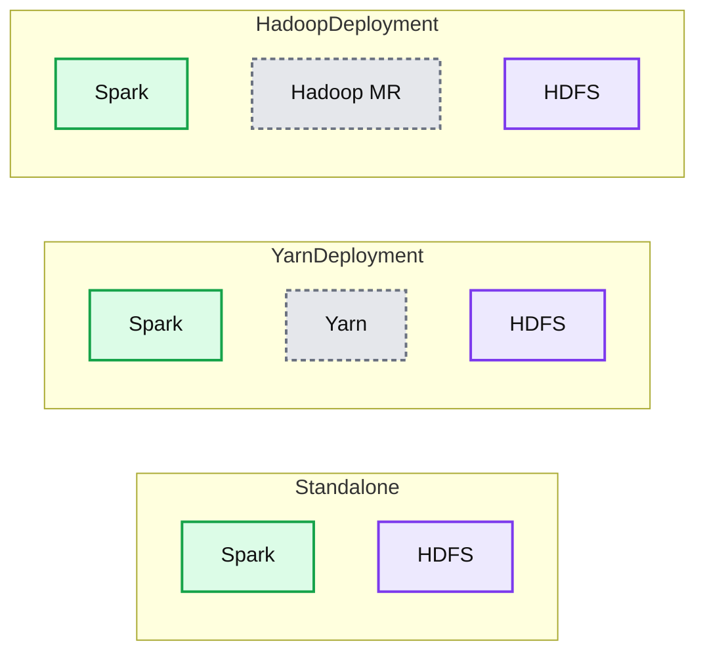

# Apache Spark and Hadoop: Working Together

- Source: https://www.databricks.com/blog/2014/01/21/spark-and-hadoop.html
- Published: 2014-01-21
- Authors: Ion Stoica
- Categories: solutions, engineering, open-source
- Images: 1 total, 1 extracted as architecture

We are often asked how does [Apache Spark](https://spark.incubator.apache.org) fits in the [Hadoop ecosystem](https://www.databricks.com/glossary/hadoop-ecosystem), and how one can run Spark in a existing Hadoop cluster. This blog aims to answer these questions.

First, Spark is intended to *enhance*, not replace, the Hadoop stack. From day one, Spark was designed to read and write data from and to [HDFS](https://www.databricks.com/glossary/hadoop-distributed-file-system-hdfs), as well as other storage systems, such as HBase and Amazon’s S3. As such, Hadoop users can enrich their processing capabilities by combining Spark with Hadoop [MapReduce](https://www.databricks.com/glossary/mapreduce), HBase, and other big data frameworks.

Second, we have constantly focused on making it as easy as possible for *every Hadoop user* to take advantage of Spark’s capabilities. No matter whether you run Hadoop 1.x or Hadoop 2.0 (YARN), and no matter whether you have administrative privileges to configure the [Hadoop cluster](https://www.databricks.com/glossary/hadoop-cluster) or not, there is a way for you to run Spark! In particular, there are three ways to deploy Spark in a Hadoop cluster: standalone, YARN, and SIMR.

**Summary:** The diagram compares three ways to deploy Spark alongside Hadoop and HDFS: standalone, YARN, and Hadoop MapReduce.

**Components:**

- Spark: distributed processing technology
- HDFS: Hadoop distributed file system
- YARN: Hadoop cluster resource manager
- Hadoop MR: Hadoop MapReduce

**Flows:**

- none

**Numbers:** none

source image: https://www.databricks.com/wp-content/uploads/2014/01/SparkHadoop.png

**Standalone deployment**: With the standalone deployment one can statically allocate resources on all or a subset of machines in a Hadoop cluster and run Spark side by side with Hadoop MR. The user can then run arbitrary Spark jobs on her HDFS data. Its simplicity makes this the deployment of choice for many Hadoop 1.x users.

[**Hadoop Yarn**](https://hadoop.apache.org/docs/current2/hadoop-yarn/hadoop-yarn-site/YARN.html)** deployment**: Hadoop users who have already deployed or are planning to deploy [Hadoop Yarn](https://hadoop.apache.org/docs/current2/hadoop-yarn/hadoop-yarn-site/YARN.html) can simply run Spark on YARN without any pre-installation or administrative access required. This allows users to easily integrate Spark in their Hadoop stack and take advantage of the full power of Spark, as well as of other components running on top of Spark.

**Spark In MapReduce (**[**SIMR**](https://www.databricks.com/blog/2014/01/01/simr.html)**)**: For the Hadoop users that are not running YARN yet, another option, in addition to the standalone deployment, is to use SIMR to launch Spark jobs inside MapReduce. With SIMR, users can start experimenting with Spark and use its shell within a couple of minutes after downloading it! This tremendously lowers the barrier of deployment, and lets virtually everyone play with Spark.

## Interoperability with other Systems

Spark interoperates not only with Hadoop, but with other popular big data technologies as well.

- [**Apache Hive**](https://hive.apache.org/): Through [Shark](https://github.com/amplab/shark/wiki), Spark enables [Apache Hive](https://www.databricks.com/glossary/apache-hive) users to run their unmodified queries much faster. Hive is a popular [data warehouse](https://www.databricks.com/glossary/data-warehouse) solution running on top of Hadoop, while Shark is a system that allows the Hive framework to run on top of Spark instead of Hadoop. As a result, Shark can accelerate Hive queries by as much as 100x when the input data fits into memory, and up 10x when the input data is stored on disk.
- [**AWS EC2**](https://aws.amazon.com/): Users can easily run Spark (and Shark) on top of Amazon’s EC2 either using the scripts that come with Spark, or the hosted versions of Spark and Shark on Amazon’s Elastic MapReduce.
- [**Apache Mesos**](https://mesos.apache.org/): Spark runs on top of Mesos, a cluster manager system which provides efficient resource isolation across distributed applications, including [MPI](https://www.mcs.anl.gov/research/projects/mpi/) and Hadoop. Mesos enables *fine grained* sharing which allows a Spark job to dynamically take advantage of the idle resources in the cluster during its execution. This leads to considerable performance improvements, especially for long running Spark jobs.
