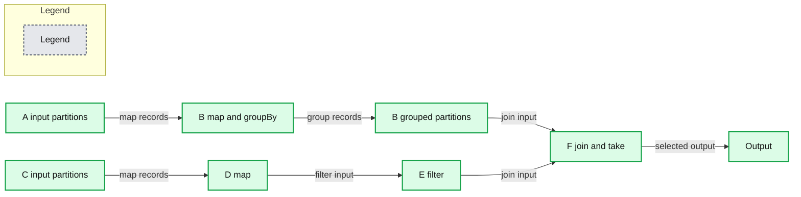
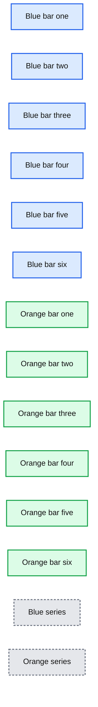

# Apache Spark: A Delight for Developers

- Source: https://www.databricks.com/blog/2014/03/20/apache-spark-a-delight-for-developers.html
- Published: 2014-03-20
- Authors: Jai Ranganathan, Matei Zaharia
- Categories: engineering, open-source
- Images: 3 total, 2 extracted as architecture

This article was cross-posted in the [Cloudera developer blog](https://blog.cloudera.com/).

[Apache Spark](https://spark.apache.org/) is well known today for its [performance benefits](https://blog.cloudera.com/) over [MapReduce](https://www.databricks.com/glossary/mapreduce), as well as its [versatility](https://blog.cloudera.com/). However, another important benefit — the elegance of the development experience — gets less mainstream attention.

In this post, you’ll learn just a few of the features in Spark that make development purely a pleasure.

## Language Flexibility

Spark natively provides support for a variety of popular development languages. Out of the box, it supports Scala, Java, and Python, with some promising work ongoing [to support R](http://amplab-extras.github.io/SparkR-pkg/).

One common element among these languages (with the temporary exception of Java, which is due for a major update imminently in the form of Java 8) is that they all provide concise ways to express operations using “closures” and lambda functions. [Closures](https://en.wikipedia.org/wiki/Closure_(computer_programming)) allow users to define functions in-line with the core logic of the application, thereby preserving application flow and making for tight and easy-to-read code:

**Closures in Python with Spark:**

**Closures in Scala with Spark:**

**Closures in Java with Spark:**

On the performance front, a lot of work has been done to optimize all three of these languages to run efficiently on the Spark engine. Spark is written in Scala, which runs on the JVM, so Java can run efficiently in the same JVM container. Via the smart use of [Py4J](https://www.py4j.org/), the overhead of Python accessing memory that is managed in Scala is also minimal.

## APIs That Match User Goals

When developing in MapReduce, you are often forced to stitch together basic operations as custom Mapper/Reducer jobs because there are no built-in features to simplify this process. For that reason, many developers turn to the higher-level APIs offered by frameworks like Apache Crunch or Cascading to write their MapReduce jobs.

In contrast, Spark natively provides a rich and ever-growing library of operators. Spark APIs include functions for:

- `cartesian`
- `cogroup`
- `collect`
- `count`
- `countByValue`
- `distinct`
- `filter`
- `flatMap`
- `fold`
- `groupByKey`
- `join`
- `map`
- `mapPartitions`
- `reduce`
- `reduceByKey`
- `sample`
- `sortByKey`
- `subtract`
- `take`
- `union`

and many more. In fact, there are more than 80 operators available out of the box in Spark!

While many of these operations often boil down to Map/Reduce equivalent operations, the high-level API matches user intentions closely, allowing you to write much more concise code.

An important note here is that while scripting frameworks like Apache Pig provide many high-level operators as well, Spark allows you to access these operators in the context of a full programming language — thus, you can use control statements, functions, and classes as you would in a typical programming environment.

## Automatic Parallelization of Complex Flows

When constructing a complex pipeline of MapReduce jobs, the task of correctly parallelizing the sequence of jobs is left to you. Thus, a scheduler tool such as Apache Oozie is often required to carefully construct this sequence.

With Spark, a whole series of individual tasks is expressed as a single program flow that is lazily evaluated so that the system has a complete picture of the execution graph. This approach allows the core scheduler to correctly map the dependencies across different stages in the application, and automatically parallelize the flow of operators without user intervention.

This capability also has the property of enabling certain optimizations to the engine while reducing the burden on the application developer. Win, and win again!

For example, consider the following job:

**Summary:** The diagram shows Apache Spark automatically organizing six parallel processing stages for map, groupBy, filter, join, and take operations.

**Components:**

- A: Spark input partitions
- B: Spark map and groupBy stages
- C: Spark input partitions
- D: Spark map stage
- E: Spark filter stage
- F: Spark join and take stage

**Flows:**

- A -> B: mapped records
- B -> B: grouped records
- C -> D: mapped records
- D -> E: filtered input records
- B -> F: join input
- E -> F: join input
- F -> F: selected output records

**Numbers:** none

source image: https://www.databricks.com/wp-content/uploads/2014/03/spark-devs1.png

This simple application expresses a complex flow of six stages. But the actual flow is completely hidden from the user — the system automatically determines the correct parallelization across stages and constructs the graph correctly. In contrast, alternate engines would require you to manually construct the entire graph as well as indicate the proper parallelization.

## Interactive Shell

Spark also lets you access your datasets through a simple yet specialized Spark shell for Scala and Python. With the Spark shell, developers and users can get started accessing their data and manipulating datasets without the full effort of writing an end-to-end application. Exploring terabytes of data without compiling a single line of code means you can understand your application flow by literally test-driving your program before you write it up.

Just open up a shell, type a few commands, and you’re off to the races!

## Performance

While this post has focused on how Spark not only improves performance but also programmability, we should’t ignore one of the best ways to make developers more efficient: performance!

Developers often have to run applications many times over the development cycle, working with subsets of data as well as full data sets to repeatedly follow the develop/test/debug cycle. In a Big Data context, each of these cycles can be very onerous, with each test cycle, for example, being hours long.

While there are various ways systems to alleviate this problem, one of the best is to simply run your program fast. Thanks to the performance benefits of Spark, the development lifecycle can be materially shortened merely due to the fact that the test/debug cycles are much shorter.

And your end-users will love you too!

**Summary:** The chart compares two unnamed series, with the blue bars increasing substantially across six categories while the orange bars remain small.

**Components:**

- Blue bar series
- Orange bar series
- Six unnamed categories

**Flows:**

- none

**Numbers:** none

source image: https://www.databricks.com/wp-content/uploads/2014/03/spark-dev3.png

## Example: WordCount

To give you a sense of the practical impact of these benefits in a concrete example, the following two snippets of code reflect a WordCount implementation in MapReduce versus one in Spark. The difference is self-explanatory:

**WordCount the MapReduce way:**

**WordCount the Spark way:**

One cantankerous data scientist at Cloudera, Uri Laserson, wrote his first PySpark job recently after several years of tussling with raw MapReduce. Two days into Spark, he declared his intent to never write another MapReduce job again.

Uri, we got your back, buddy: [Spark will ship inside CDH 5.](https://blog.cloudera.com/)

## Further Reading

- [Spark Quick Start](https://spark.apache.org/docs/latest/quick-start.html)
- [Spark API for Scala](https://spark.apache.org/docs/latest/api/scala/index.html#org.apache.spark.package)
- [Spark API for Java](https://spark.apache.org/docs/latest/api/java/index.html)
- [Spark API for Python](https://spark.apache.org/docs/latest/api/python/index.html)

*Jai Ranganathan is Director of Product at Cloudera.*

*Matei Zaharia is CTO of Databricks.*
