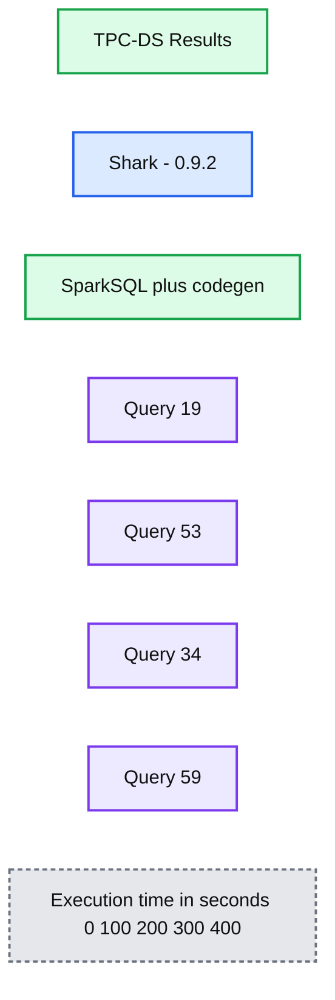
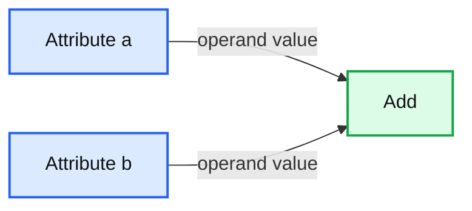

# Exciting Performance Improvements on the Horizon for Spark SQL

- Source: https://www.databricks.com/blog/2014/06/02/exciting-performance-improvements-on-the-horizon-for-spark-sql.html
- Published: 2014-06-02
- Authors: Michael Lumb, Zongheng Yang
- Categories: engineering, open-source
- Images: 2 total, 2 extracted as architecture

[Read Rise of the Data Lakehouse](https://www.databricks.com/resources/ebook/rise-data-lakehouse?itm_data=performanceimprovementsonhorizonsparksql-blog-riselakehousebook) to explore why lakehouses are the data architecture of the future with the father of the data warehouse, Bill Inmon.

---

With [Apache Spark 1.0](https://www.databricks.com/blog/2014/05/30/announcing-spark-1-0.html) out the door, we’d like to give a preview of the next major initiatives in the Spark project. Today, the most active component of Spark is [Spark SQL](https://www.databricks.com/blog/2014/03/26/spark-sql-manipulating-structured-data-using-spark-2.html) - a tightly integrated relational engine that inter-operates with the core Spark API. Spark SQL was released in Spark 1.0, and will provide a lighter weight, agile execution backend for future versions of Shark. In this post, we’d like to highlight some of the ways in which tight integration into Scala and Spark provide us powerful tools to optimize query execution with Spark SQL. This post outlines one of the most exciting features, dynamic code generation, and explains what type of performance boost this feature can offer using queries from a well-known benchmark, TPC-DS. As a baseline, we compare performance against the current Shark release. We’re happy to report that in these cases Spark SQL outperforms Shark, sometimes dramatically. Note that the following tests were run on a development branch of Spark SQL, which includes several new performance features.

**Summary:** TPC-DS benchmark results compare Shark 0.9.2 with SparkSQL plus code generation across four queries, showing lower execution times for SparkSQL.

**Components:**

- TPC-DS Results benchmark chart
- Shark 0.9.2 baseline
- SparkSQL plus codegen
- Query 19
- Query 53
- Query 34
- Query 59
- Execution time axis in seconds

**Flows:**

- none

**Numbers:** 0 sec, 100 sec, 200 sec, 300 sec, 400 sec, Shark 0.9.2, Query 19, Query 53, Query 34, Query 59

source image: https://www.databricks.com/wp-content/uploads/2014/06/SharkVsSparkSql.png

*While this is only a few queries from the TPC-DS benchmark, we plan to release more comprehensive results in the future.*

Now that we have seen where things are headed, let's dive into the technical details of how we plan to get there.  This is the first in a series of blog posts about optimizations coming in Spark SQL.

## Runtime Bytecode Generation

One of the more expensive operations that needs to be performed by a database is the evaluation of expressions in the query. The memory model of the JVM can increase the cost of this evaluation significantly.  To understand why this is the case, let’s look at a concrete example:

In the above query, there is one expression that is going to be evaluated for each row of the table, a + b.  Typically, this expression would be represented by an expression tree.

**Summary:** The diagram shows an Add expression node receiving two child attribute nodes, a and b.

**Components:**

- Add expression node
- Attribute a
- Attribute b

**Flows:**

- Attribute a -> Add: operand value
- Attribute b -> Add: operand value

**Numbers:** none

source image: https://www.databricks.com/wp-content/uploads/2014/06/ExpressionTree.png

Each node of the tree is represented by an object with an evaluation method that knows how to calculate the result of the expression given an input row.  In this example, when the evaluate method is called on the Add object, it would in turn call evaluate on each of its children and then compute the sum of the returned values. What is wrong with this approach from a performance perspective?  In practice, the performance hit comes from several details of this interpreted execution:

- **Virtual Function Calls** - Each time evaluate is called on a given expression object,  a [virtual function](https://en.wikipedia.org/wiki/Virtual_function) call is made.  These types of function calls can disrupt pipelining in the processor, slowing down execution.  The problem worsens when the expressions are very complex, such as those in the TPC-DS benchmark.
- **Boxing of Primitive Values** - Since evaluate needs to be able to return many different types of values depending on the expression (Integer, String, Float, etc.) it needs to have a generic return type of Object.  This means that an extra object needs to be allocated for each step of the evaluation.  While modern JVMs have gotten better at cheaply allocating short-lived objects, this cost can really add up.
- **Cost of Genericity** - These expression trees need to be able to handle many different data types.  However, the actual function that is required to add two integers is different from that that is required to add two doubles, for example.  This genericity means that the evaluation code often requires extra if-statements that branch based on the type of data being processed.

Altogether, the above issues can lead to a significant increase in query execution time. Fortunately, there is another way!  In a development branch of Spark SQL, we have implemented a version of our expression evaluator that dynamically generates custom bytecode for each query.  While such generation may sound like a difficult task, its actually straightforward to implement using a new feature in Scala 2.10, [runtime reflection](https://docs.scala-lang.org/overviews/reflection/overview.html). At a high level, bytecode generation means that, instead of using an expression tree to evaluate a + b, Spark SQL will create new classes at runtime that have custom code similar to the following:

Compared to the interpreted evaluation, the generated code works on primitive values (and thus doesn't allocate any objects) and includes no extra function calls.

## Using Quasiquotes

While Spark SQL is not the only system to perform dynamic generation of code for query execution, the use of Scala reflection greatly simplifies the implementation, making it much easier to extend and improve.  Key to this functionality a new feature in Scala, known as [Quasiquotes](https://docs.scala-lang.org/overviews/quasiquotes/intro.html).  Quasiquotes make it easy to build trees of Scala code at runtime, without having to build complex ASTs by hand. To use a quasiquote, you simple prefix a string in Scala with the letter "q".  In doing so, you tell the Scala compiler to treat the contents of the string as code, instead of text.  You can also used $ variables to splice together different fragments of code. For example, the code to generate the above addition expression could be expressed simply as follows:

In practice, the generated code is a little more complicated, as it also needs to handle null values.  If you'd like to see the full version of the generated code for our example expression, it is available [here](https://gist.github.com/marmbrus/9efb31d2b5154aea6652).

## Conclusion

Dynamic code generation is just the tip of the iceberg, and we have a lot more improvements in store, including: improved Parquet integration, the ability to automatically query semi-structured data (such as JSON), and JDBC access to Spark SQL.  Stay tuned for more updates on other optimization we are making to Spark SQL!
