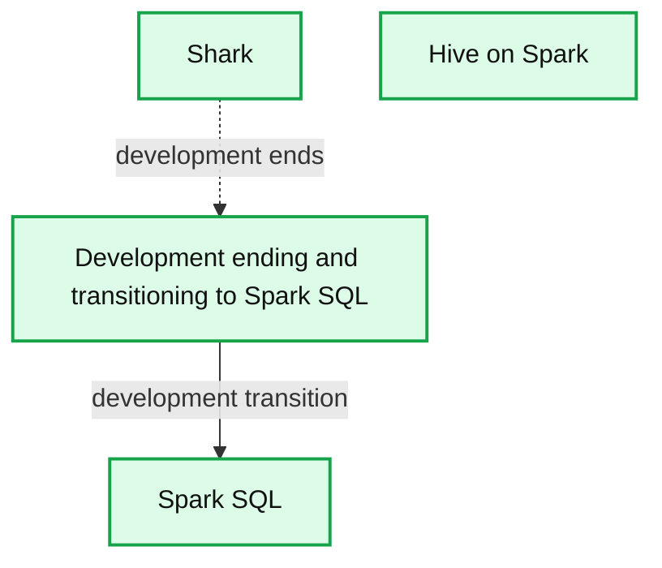

# Shark, Spark SQL, Hive on Spark, and the future of SQL on Apache Spark

- Source: https://www.databricks.com/blog/2014/07/01/shark-spark-sql-hive-on-spark-and-the-future-of-sql-on-spark.html
- Published: 2014-07-01
- Authors: Reynold Xin
- Categories: engineering, open-source
- Images: 1 total, 1 extracted as architecture

With the introduction of Spark SQL and the new Hive on Apache Spark effort ([HIVE-7292](https://issues.apache.org/jira/browse/HIVE-7292)), we get asked a lot about our position in these two projects and how they relate to Shark. At the [Spark Summit](https://www.databricks.com/dataaisummit) today, we announced that we are ending development of Shark and will focus our resources towards Spark SQL, which will provide a superset of Shark’s features for existing Shark users to move forward. In particular, Spark SQL will provide both a seamless upgrade path from Shark 0.9 server and new features such as integration with general Spark programs.

**Summary:** The diagram shows Shark development transitioning to Spark SQL, alongside Hive on Spark for helping existing Hive users migrate to Spark.

**Components:**

- Shark: SQL engine project
- Spark SQL: New SQL engine designed for Spark
- Hive on Spark: Spark-based path for existing Hive users

**Flows:**

- Shark development -> Spark SQL: Development ends and transitions to Spark SQL

**Numbers:** none

source image: https://www.databricks.com/wp-content/uploads/2020/07/sql-directions-1024x691-min.png

## Shark

When the Shark project started 3 years ago, Hive (on [MapReduce](https://www.databricks.com/glossary/mapreduce)) was the only choice for SQL on [Hadoop](https://www.databricks.com/glossary/hadoop). Hive compiled SQL into scalable MapReduce jobs and could work with a variety of formats (through its SerDes). However, it delivered less than ideal performance. In order to run queries interactively, organizations deployed expensive, proprietary enterprise data warehouses (EDWs) that required rigid and lengthy ETL pipelines.

The stark contrast in performance between Hive and EDWs led to a huge debate in the industry questioning the inherent deficiency of query processing on general data processing engines. Many believed SQL interactivity necessitates an expensive, specialized runtime built for query processing (i.e. EDWs). Shark became [one of the first interactive SQL on Hadoop systems](https://amplab.cs.berkeley.edu/publication/shark-sql-and-rich-analytics-at-scale/), and was the only one built on top of a general runtime (Spark). It demonstrated that none of the deficiencies that made Hive slow were fundamental, and a general engine such as Spark could marry the best of both worlds: it can be as fast as an EDW, and scales as well as Hive/MapReduce.

Why should you care about this seemingly academic debate? As organizations are looking for ways to give them an edge in businesses, they are employing techniques beyond the simple roll-up and drill-down capabilities that SQL provides. Building a SQL query engine on top of a general runtime unifies many disparate, powerful models, such as batch, streaming, machine learning. It enables data scientists and engineers to employ more sophisticated methods faster. Ideas from Shark were embraced quickly and even inspired some of the major efforts in speeding up Hive.

## From Shark to Spark SQL

Shark built on the Hive codebase and achieved performance improvements by swapping out the physical execution engine part of Hive. While this approach enabled Shark users to speed up their Hive queries, Shark inherited a large, complicated code base from Hive that made it hard to optimize and maintain. As we moved to push the boundary of performance optimizations and integrating sophisticated analytics with SQL, we were constrained by the legacy that was designed for MapReduce.

It is for this reason that we are ending development in Shark as a separate project and moving all our development resources to Spark SQL, a new component in Spark. We are applying what we learned in Shark to Spark SQL, designed from ground-up to leverage the power of Spark. This new approach enables us to innovate faster, and ultimately deliver much better experience and power to users.

For **SQL users**, Spark SQL provides state-of-the-art SQL performance and maintains compatibility with Shark/Hive. In particular, like Shark, Spark SQL supports all existing Hive data formats, user-defined functions (UDF), and the Hive metastore. With features that will be introduced in Apache Spark 1.1.0, Spark SQL beats Shark in [TPC-DS performance](https://www.databricks.com/blog/2014/06/02/exciting-performance-improvements-on-the-horizon-for-spark-sql.html) by almost an order of magnitude.

For **Spark users**, Spark SQL becomes the narrow-waist for manipulating (semi-) structured data as well as ingesting data from sources that provide schema, such as JSON, Parquet, Hive, or EDWs. It truly unifies SQL and sophisticated analysis, allowing users to mix and match SQL and more imperative programming APIs for advanced analytics.

For **open source hackers**, Spark SQL proposes a novel, elegant way of building query planners. It is incredibly easy to add new optimizations under this framework. We have been completely overwhelmed by the support and enthusiasm that the open source community has shown Spark SQL, largely thanks to this new design. Already after merely three months, over 40 contributors have contributed code to it. Thank you.

## Hive on Spark Project (HIVE-7292)

While Spark SQL is becoming the standard for SQL on Spark, we do realize many organizations have existing investments in Hive. Many of these organizations, however, are also eager to migrate to Spark. The Hive community proposed a [new initiative](https://issues.apache.org/jira/browse/HIVE-7292) to the project that would add Spark as an alternative execution engine to Hive. For these organizations, this effort will provide a clear path for them to migrate the execution to Spark. We are delighted to work with and support the Hive community to provide a smooth experience for end-users.

In short, we firmly believe Spark SQL will be the future of not only SQL, but also structured data processing on Spark. We are hard at work and will bring you a lot more in the next several releases. And for organizations with legacy Hive deployments, Hive on Spark will provide them a clear path to Spark.
