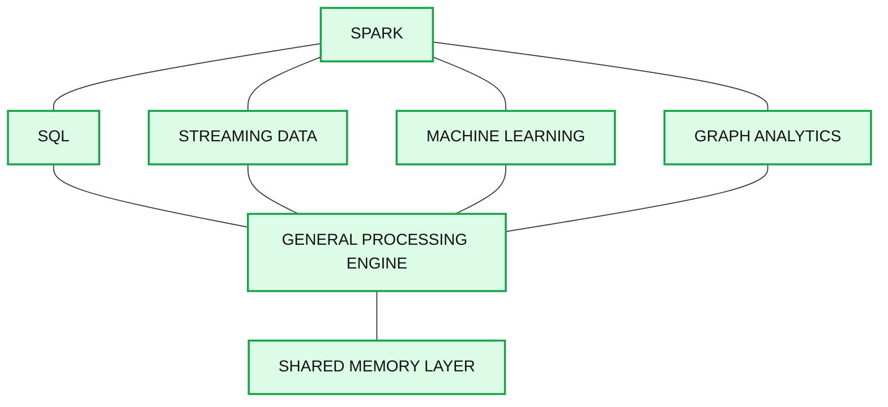
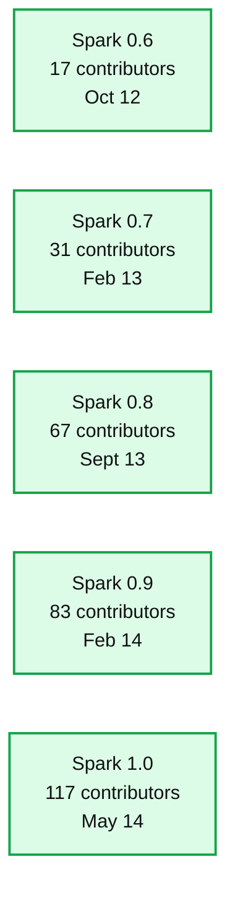

# The State of Apache Spark in 2014

- Source: https://www.databricks.com/blog/2014/07/18/the-state-of-apache-spark-in-2014.html
- Published: 2014-07-18
- Authors: Matei Zaharia
- Categories: engineering, open-source
- Images: 2 total, 2 extracted as architecture

This post originally appeared in insideBIGDATA and is reposted here with permission.

---

With the second [Spark Summit](https://www.databricks.com/dataaisummit) behind us, we wanted to take a look back at our journey since 2009 when Apache Spark, the fast and general engine for large-scale data processing, was initially developed. It has been exciting and extremely gratifying to watch Spark mature over the years, thanks in large part to the vibrant, open source community that latched onto it and busily began contributing to make Spark what it is today.

The idea for Spark first emerged in the AMPLab (AMP stands for Algorithms, Machines, and People) at the University of California, Berkeley. With its significant industry funding and exposure, the AMPlab had a unique perspective on what is important and what issues exist among early adopters of big data. We had worked with most of the early users of [Hadoop](https://www.databricks.com/glossary/hadoop) and consistently saw the same issues arise. Spark itself started as the solution to one such problem—speeding machine learning applications on clusters, which machine learning researchers in the lab were having trouble doing using Hadoop. However, we soon realized that we could easily cover a much broader set of applications.

## The Vision

When we worked with early Hadoop users, we saw that they were all excited about the scalability of [MapReduce](https://www.databricks.com/glossary/mapreduce). However, as soon as these users began using MapReduce, they needed more than the system could offer. First, users wanted faster data analysis—instead of waiting tens of minutes to run a query, as was required with MapReduce’s batch model, they wanted to query data interactively, or even continuously in real-time. Second, users wanted more sophisticated processing, such as iterative machine learning algorithms, which were not supported by the rigid, one-pass model of MapReduce.

At this point, several systems had started to emerge as point solutions to these problems, e.g., systems that ran only interactive queries, or only machine learning applications. However, these systems were difficult to use with Hadoop, as they would require users to learn and stitch together a zoo of different frameworks to build pipelines. Instead, we decided to try to generalize the MapReduce model to support more types of computation in a single framework.

We achieved this using only two simple extensions to the model. First, we added support for storing and operating on data in memory—a key optimization for the more complex, iterative algorithms required in applications like machine learning, and one that proved shrewd with the continued drop in memory prices. Second, we modeled execution as general directed acyclic graphs (DAGs) instead of the rigid model of map-and-reduce, which led to significant speedups even on disk. With these additions we were able to cover a wide range of emerging workloads, matching and sometimes exceeding the performance of specialized systems while keeping a single, simple unified programming model.

This decision allowed, over time, new functionality such as Shark (SQL over Spark), Spark Streaming (stream processing), MLlib (efficient implementations of machine learning algorithms), and GraphX (graph computation over Spark) to be built. These modules in Spark are not separate systems, but libraries that users can combine together into a program in powerful ways. Combined with the more than 80 basic data manipulation operators in Spark, they make it dramatically simpler to build big data applications compared to previous, multi-system pipelines. And we have sought to make them available in a variety of programming languages, including Java, Scala, and Python (available today) and soon R.

**Summary:** The diagram shows Spark as a general processing engine with a shared memory layer supporting SQL, streaming data, machine learning, and graph analytics.

**Components:**

- Spark: Apache Spark
- SQL: Spark SQL
- Streaming Data: Spark Streaming
- Machine Learning: Spark machine learning
- Graph Analytics: Spark graph analytics
- General Processing Engine: Spark processing layer
- Shared Memory Layer: Spark shared memory

**Flows:**

- none

**Numbers:** none

source image: https://www.databricks.com/wp-content/uploads/2014/07/Databricks_stack.png

*Figure 1: The Spark Stack*

As interest in Spark increased, we received a lot of questions about how Spark related to Hadoop and whether Spark was its replacement. The reality is that Hadoop consists of three parts: a file system ([HDFS](https://www.databricks.com/glossary/hadoop-distributed-file-system-hdfs)), resource management (YARN/Mesos), and a processing layer (MapReduce). Spark is only a processing engine and thus is an alternative for that last layer. Having it operate over HDFS data was a natural starting point because the volume of data in HDFS was growing rapidly. However, Spark’s architecture has also allowed it to support a host of storage systems beyond Hadoop. Spark is now being used as a processing layer for other data stores (e.g., Cassandra, MongoDB) or even to seamlessly join data from multiple data stores (e.g., HDFS and an operational data store).

## Success Comes from the Community

Perhaps the one decision that has made Spark so robust is our continuing commitment to keep it 100 percent open source and work with a large set of contributors from around the world. That commitment continues to pay dividends in Spark’s future and effectiveness.

In a relatively short time, enthusiasm rose among the open source community and is still growing. Indeed, in just the last 12 months, Spark has had more than 200 people from more than 50 organizations contribute code to the project, making it the most active open source project in the Hadoop ecosystem. Even after reaching this point, Spark is still enjoying steady growth, moving us toward the inflection point of the hockey stick adoption curve.

Not only has the community invested countless hours in development, but it has also gotten people excited about Spark and brought users together to share ideas. One of the more exciting events was the first Spark Summit held in December 2013 in San Francisco, which drew nearly 500 attendees. At this year’s Summit, held June 30, we had double the amount of participants. The 2014 Summit included more than 50 community talks on applications, data science, and research using Spark. In addition, Spark community meetups have sprouted all over the United States and internationally, and we anticipate that number to grow.

**Summary:** The chart shows Apache Spark contributor growth across five releases from October 2012 to May 2014.

**Components:**

- Spark 0.6 release using Apache Spark, with 17 contributors
- Spark 0.7 release using Apache Spark, with 31 contributors
- Spark 0.8 release using Apache Spark, with 67 contributors
- Spark 0.9 release using Apache Spark, with 83 contributors
- Spark 1.0 release using Apache Spark, with 117 contributors

**Flows:**

- None visible

**Numbers:**

- Spark 0.6: 17 contributors, Oct ’12
- Spark 0.7: 31 contributors, Feb ’13
- Spark 0.8: 67 contributors, Sept ’13
- Spark 0.9: 83 contributors, Feb ’14
- Spark 1.0: 117 contributors, May ’14

source image: https://www.databricks.com/wp-content/uploads/2014/07/Databricks_contrib.png

*Figure 2: Spark Contributors By Release*

## Spark in the Enterprise

We have seen a real rise in excitement among enterprises as well. After going through the initial proof-of-concept process, Spark has found its place in the enterprise ecosystem and every major Hadoop distributor has made Spark part of their distribution. For many of these distributions, support came from the bottom up: we heard from vendors that customers were downloading and using Spark on their own and then contacting vendors to ask them to support it.

Spark is being used across many verticals including large Internet companies, government agencies, financial service companies, and some major players such as Yahoo, eBay, Alibaba, and NASA. These enterprises are deploying Spark for a variety of use cases including ETL, machine learning, data product creation, and complex event processing with streaming data. Vertical-specific cases include churn analysis, fraud detection, risk analytics, and 360-degree customer views. And many companies are conducting advanced analytics using Spark’s scalable machine learning library (MLlib), which contains high-quality algorithms that leverage iteration to yield better results.

Finally, in addition to being used directly by customers, Spark is increasingly the backend for a growing number of higher-level business applications. Major business intelligence vendors such as Microstrategy, Pentaho, and Qlik have all certified their applications on Spark, while a number of innovative startups such as Adatao, Tresata, and Alpine are basing products on it. These applications bring the capabilities of Spark to a much broader set of users throughout the enterprise.

## Spark’s Future

We recently released version 1.0 of Apache Spark – a major milestone for the project. This version includes a number of added capabilities such as:

- A stable application programming interface to provide compatibility across all 1.x releases.
- Spark SQL to provide schema-aware data modeling and SQL language support.
- Support for Java 8 lambda syntax to simplify writing applications in Java.
- Enhanced MLlib with several new algorithms; MLlib continues to be extremely active on its own with more than 40 contributors since it was introduced in September 2013.
- Major updates to Spark’s streaming and graph libraries.

These wouldn’t have happened without the support of the community. Many of these features were requested directly by users, while others were contributed by the dozens of developers who worked on this release. One of our top priorities is to continue to make Spark more robust and focus on key enterprise features, such as security, monitoring, and seamless ecosystem integration.

Additionally, the continued success of Spark is dependent on a vibrant ecosystem. For us, it is exciting to see the community innovate and enhance above, below, and around Spark. Maintaining compatibility across the various Spark distributions will be critical, as we’ve seen how destructive forking and fragmentation can be to open source efforts. We would like to define and center compatibility around the Apache version of Spark, where we continue to make all our contributions. We are excited to see the community rally around this vision.

While Spark has come far in the past five years, we realize that there is still a lot to do. We are working hard on new features and improvements in both the core engine and the libraries built on top. We look forward to future Spark releases, an expanded ecosystem, and future Summits and meetups where people are generating ideas that go far beyond what we imagined years ago at UC Berkeley.
