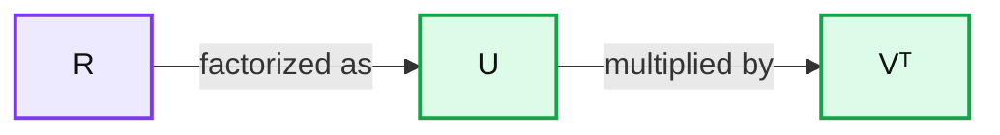
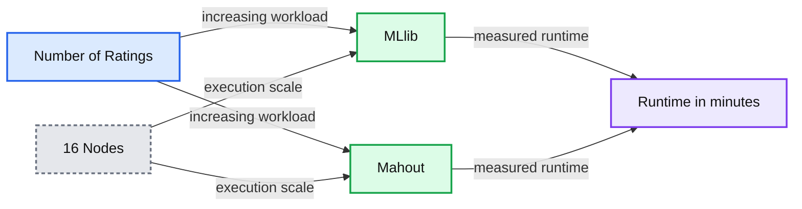

# Scalable Collaborative Filtering with Apache Spark MLlib

- Source: https://www.databricks.com/blog/2014/07/23/scalable-collaborative-filtering-with-spark-mllib.html
- Published: 2014-07-23
- Authors: Burak Yavuz, Reynold Xin
- Categories: engineering, open-source, data-science-machine-learning
- Images: 2 total, 2 extracted as architecture

Recommendation systems are among the most popular applications of machine learning. The idea is to predict whether a customer would like a certain item: a product, a movie, or a song. Scale is a key concern for recommendation systems, since computational complexity increases with the size of a company's customer base. In this blog post, we discuss how Apache Spark MLlib enables building recommendation models from billions of records in just a few lines of Python ([Scala/Java APIs also available](https://spark.apache.org/docs/latest/mllib-collaborative-filtering.html)).

from pyspark.mllib.recommendation import ALS

## load training and test data into (user, product, rating) tuples

def parseRating(line):
 fields = line.split()
 return (int(fields[0]), int(fields[1]), float(fields[2]))
 training = sc.textFile("...").map(parseRating).cache()
 test = sc.textFile("...").map(parseRating)

## train a recommendation model

model = ALS.train(training, rank = 10, iterations = 5)

## make predictions on (user, product) pairs from the test data

predictions = model.predictAll(test.map(lambda x: (x[0], x[1])))

## What’s Happening under the Hood?

Recommendation algorithms are usually divided into:

(1) **Content-based filtering**: recommending items similar to what users already like. An example would be to play a Megadeth song after a Metallica song.

(2) **Collaborative filtering**: recommending items based on what similar users like, e.g., recommending video games after someone purchased a game console because other people who bought game consoles also bought video games.

**Summary:** The diagram shows the rating matrix R factorized into low-rank user factors U and product factors Vᵀ.

**Components:**

- R: rating matrix
- U: user factor matrix
- Vᵀ: transposed product factor matrix

**Flows:**

- R -> U and Vᵀ: equals the product of the two factor matrices

**Numbers:** none

source image: https://www.databricks.com/wp-content/uploads/2014/07/als-illustration.png

Spark MLlib implements a collaborative filtering algorithm called **Alternating Least Squares (ALS)**, which has been implemented in many machine learning libraries and widely studied and used in both academia and industry. ALS models the rating matrix (R) as the multiplication of low-rank user (U) and product (V) factors, and learns these factors by minimizing the reconstruction error of the observed ratings. The unknown ratings can subsequently be computed by multiplying these factors. In this way, companies can recommend products based on the predicted ratings and increase sales and customer satisfaction.

ALS is an iterative algorithm. In each iteration, the algorithm alternatively fixes one factor matrix and solves for the other, and this process continues until it converges. MLlib features a blocked implementation of the ALS algorithm that leverages Spark’s efficient support for distributed, iterative computation. It uses native LAPACK to achieve high performance and scales to billions of ratings on commodity clusters.

## Scalability, Performance, and Stability

Recently we did an experiment to benchmark ALS implementations in Spark MLlib at scale. The benchmark was conducted on EC2 using m3.2xlarge instances set up by the Spark EC2 script. We ran Spark using out-of-the-box configurations. To help understand state-of-the-art, we also built Mahout from GitHub and tested it. This benchmark is reproducible on EC2 using the scripts at [https://github.com/databricks/als-benchmark-scripts](https://github.com/databricks/als-benchmark-scripts).

We ran 5 iterations of ALS on scaled copies of the [Amazon Reviews dataset](https://snap.stanford.edu/data/web-Amazon.html), which contains 35 million ratings collected from 6.6 million users on 2.4 million products. For each user, we create pseudo-users that have the same ratings. That is, for every rating as (userId, productId, rating), we generate (userId+i, productId, rating) where 0

**Summary:** Benchmark chart comparing ALS runtime for MLlib and Mahout across increasing numbers of ratings on 16 nodes.

**Components:**

- MLlib: Spark machine learning library
- Mahout: Hadoop machine learning framework
- Number of Ratings: workload scale from 0 M to 1000 M
- Runtime: measured duration in minutes
- 16 Nodes: execution cluster size

**Flows:**

- Number of Ratings -> MLlib: increasing ALS workload, with runtime rising to approximately 31 minutes
- Number of Ratings -> Mahout: increasing ALS workload, with runtime rising to approximately 47 minutes

**Numbers:** 16 nodes; runtime axis 0, 5, 10, 15, 20, 25, 30, 35, 40, 45, 50 min; number of ratings axis 0 M, 250 M, 500 M, 750 M, 1000 M; MLlib plotted runtimes approximately 1, 2, 5, 13, 20, 31 min; Mahout plotted runtimes approximately 23, 47 min

source image: https://www.databricks.com/wp-content/uploads/2014/07/als-perf.png

 The current version of Mahout runs on Hadoop [MapReduce](https://www.databricks.com/glossary/mapreduce), whose scheduling overhead and lack of support for iterative computation substantially slows down ALS. Mahout recently announced switching to Spark as the execution engine, which will hopefully address the performance concerns.

Spark MLlib demonstrated excellent performance and scalability, as demonstrated in the chart above. MLlib can also scale to much larger datasets and to larger number of nodes, thanks to its fault-tolerance design. With 50 nodes, we ran 10 iterations of MLlib's ALS on 100 copies of the Amazon Reviews dataset in only 40 minutes. And with EC2 spot instances the total cost was less than $2. Users can use Spark MLlib to reduce the model training time and the cost for ALS, which is historically very expensive to run because the algorithm is very communication intensive and computation intensive.

| # ratings | # users | # products | time |
|---|---|---|---|
| 3.5 billion | 660 million | 2.4 million | 40 mins |

 

It is our belief at Databricks and the broader Spark community that machine learning frameworks need to be performant, scalable, and be able to cover a wide range of workloads including data exploration and feature extraction. MLlib integrates seamlessly with other Spark components, delivers best-in-class performance, and substantially simplifies operational complexity by running on top of a fault-tolerant engine. That said, our work is not done and we are working on making machine learning easier. Stay tuned for more exciting features.

 

Note: The blog post was updated on July 24, 2014 to reflect a new performance optimization that will be included in Spark MLlib 1.1. The runtime for 3.5B ratings went down from 90 mins in MLlib 1.0 to 40 mins in MLlib 1.1.
