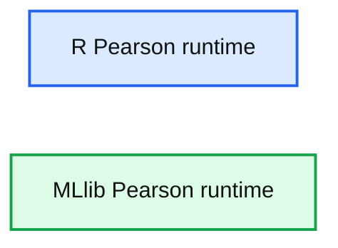

# Statistics Functionality in Apache Spark 1.1

- Source: https://www.databricks.com/blog/2014/08/27/statistics-functionality-in-spark.html
- Published: 2014-08-27
- Authors: Doris Xin, Burak Yavuz, Hossein Falaki
- Categories: engineering, open-source, data-science-machine-learning
- Images: 1 total, 1 extracted as architecture

One of our philosophies in Apache Spark is to provide rich and friendly built-in libraries so that users can easily assemble data pipelines. With Spark, and MLlib in particular, quickly gaining traction among data scientists and machine learning practitioners, we’re observing a growing demand for data analysis support outside of model fitting. To address this need, we have started to add scalable implementations of common statistical functions to facilitate various components of a data pipeline.

We’re pleased to announce Apache Spark 1.1. ships with built-in support for several statistical algorithms common in exploratory data pipelines:

- **correlations**: data dependence analysis
- **hypothesis testing**: goodness of fit; independence test
- **stratified sampling**: scaling training set with controlled label distribution
- **random data generation**: randomized algorithms; performance tests

As ease of use is one of the main missions of Spark, we’ve devoted a great deal of effort to API designing for the statistical functions. Spark's statistics APIs borrow inspirations from widely adopted statistical packages, such as R and SciPy.stats, which are shown in a recent O’Reilly survey to be the most popular tools among data scientists.

## Correlations

[Correlations](https://en.wikipedia.org/wiki/Correlation) provide quantitative measurements of the statistical dependence between two random variables. Implementations for correlations are provided under mllib.stat.Statistics.

| MLlib | - corr(x, y = None, method = "pearson" | "spearman") |
|---|---|
| R | - cor(x, y = NULL, method = c("pearson", "kendall", "spearman")) |
| SciPy | - pearsonr(x, y)- spearmanr(a, b = None) |

As shown in the table, R and SciPy.stats present us with two very different directions for correlations API in MLlib. We ultimately converged on the R style of having a single function that takes in the correlation method name as a string argument out of considerations for extensibility as well as conciseness of the API list. The initial set of methods contains "pearson" and "spearman", the two most commonly used correlations.

## Hypothesis testing

[Hypothesis testing](https://en.wikipedia.org/wiki/Hypothesis_testing) is essential for data-driven applications. A test result shows the statistical significance of an event unlikely to have occurred by chance. For example, we can test whether there is a significant association between two samples via independence tests. In Apache Spark 1.1, we implemented chi-squared tests for goodness-of-fit and independence:

| MLlib | - chiSqTest(observed: Vector, expected: Vector)- chiSqTest(observed: Matrix)- chiSqTest(data: RDD[LabeledPoint]) |
|---|---|
| R | - chisq.test(x, y = NULL, correct = TRUE, p = rep(1/length(x), length(x)), rescale.p = FALSE, simulate.p.value = FALSE) |
| SciPy | - chisquare(f_obs, f_exp = None, ddof = 0, axis = 0) |

When designing the chi-squared test APIs, we took the greatest common denominator of the parameters in R’s and SciPy’s APIs and edited out some of the less frequently used parameters for API simplicity. Note that as with R and SciPy, the input data types determine whether the goodness of fit or the independence test is conducted. We added a special case support for input type RDD[LabeledPoint] to enable feature selection via chi-squared independence tests.

## Stratified sampling

It is common for a large population to consist of various-sized subpopulations (strata), for example, a training set with many more positive instances than negatives. To sample such populations, it is advantageous to sample each stratum independently to reduce the total variance or to represent small but important strata. This sampling design is called [stratified sampling](https://en.wikipedia.org/wiki/Stratified_sampling). Unlike the other statistics functions, which reside in MLlib, we placed the stratified sampling methods in Spark Core, as sampling is widely used in data analysis. We provide two versions of stratified sampling, sampleByKey and sampleByKeyExact. Both apply to an RDD of key-value pairs with key indicating the stratum, and both take a map from users that specifies the sampling probability for each stratum. Neither R nor SciPy provides built-in support for stratified sampling.

| MLlib | - sampleByKey(withReplacement, fractions, seed)- sampleByKeyExact(withReplacement, fractions, seed) |
|---|---|

Similar to RDD.sample, sampleByKey applies Bernoulli sampling or Poisson sampling to each item independently, which is cheap but doesn’t guarantee the exact sample size for each stratum (the size of the stratum times the corresponding sampling probability). sampleByKeyExact utilizes scalable sampling algorithms that guarantee the exact sample size for each stratum with high probability, but it requires multiple passes over the data. We have a separate method name to underline the fact that it is significantly more expensive.

## Random data generation

Random data generation is useful for testing of existing algorithms and implementing randomized algorithms, such as random projection. We provide methods under mllib.random.RandomRDDs for generating RDDs that contains i.i.d. values drawn from a distribution, e.g., uniform, standard normal, or Poisson.

| MLlib | - normalRDD(sc, size, [numPartitions, seed])- normalVectorRDD(sc, numRows, numCols, [numPartitions, seed]) |
|---|---|
| R | - rnorm(n, mean=0, sd=1) |
| SciPy | - randn(d0, d1, ..., dn)- normal([loc, scale, size])- standard_normal([size]) |

The random data generation APIs exemplify a case where we added Spark-specific customizations to a commonly supported API. We show a side-by-side comparison of MLlib’s normal distribution data generation APIs vs. those of R and SciPy in the table above. We provide 1D (RDD[Double]) and 2D (RDD[Vector]) support, compared to only 1D in R and arbitrary dimension in NumPy, since both are prevalent in MLlib functions. In addition to the Spark specific parameters, such as SparkContext and number of partitions, we also allow users to set the seed for reproducibility. Apart from the built-in distributions, users can plug in their own via RandomDataGenerator.

## What about SparkR?

At this point you may be asking why we’re providing native support for statistics functions inside Spark given the existence of the SparkR project. As an R package, SparkR is a great lightweight solution for empowering familiar R APIs with distributed computation support. What we’re aiming to accomplish with these built-in Spark statistics APIs is cross language support as well as seamless integration with other components of Spark, such as Spark SQL and Streaming, for a unified data product development platform. We expect these features to be callable from SparkR in the future.

## Concluding remarks

Besides a set of familiar APIs, statistics functionality in Spark also brings R and SciPy users huge benefits including scalability, fault tolerance, and seamless integration with existing big data pipelines. Both R and SciPy run on a single machine, while Spark can easily scale up to hundreds of machines and distribute the computation. We compared the running times of MLlib’s Pearson’s correlation on a 32-node cluster with R’s, not counting the time needed for moving data to the node with R installed. The results shown below demonstrates a clear advantage of Spark over R on performance and scalability.

**Summary:** Benchmark chart comparing Pearson runtime for R and MLlib as input size increases.

**Components:**

- R Pearson implementation
- MLlib Pearson implementation
- Runtime axis
- Input size axis

**Flows:**

- none

**Numbers:** 1000; 0, 150, 300, 450, 600; 1.00E+06, 3.00E+06, 5.00E+06, 7.00E+06, 9.00E+06

source image: https://www.databricks.com/wp-content/uploads/2014/08/Spark-vs-R-pearson.png

As the Statistics APIs are experimental, we’d love feedback from the community on the usability of these designs. We also welcome contributions from the community to enhance statistics functionality in Spark.
