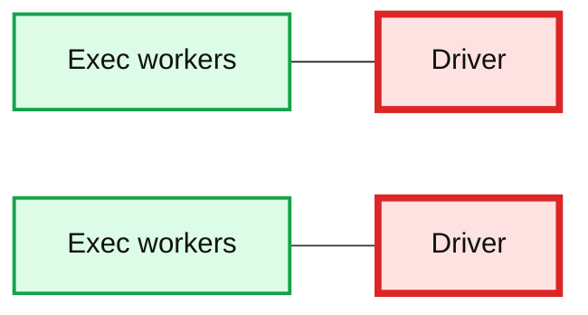
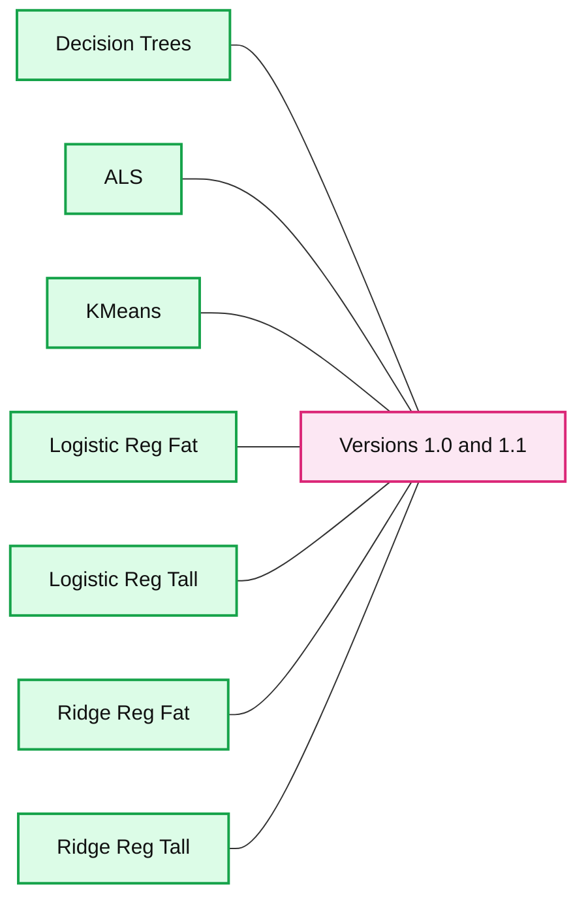

# Apache Spark 1.1: MLlib Performance Improvements

- Source: https://www.databricks.com/blog/2014/09/22/spark-1-1-mllib-performance-improvements.html
- Published: 2014-09-22
- Authors: Burak Yavuz
- Categories: engineering, open-source, data-science-machine-learning
- Images: 3 total, 3 extracted as architecture

With an ever-growing community, Apache Spark has had it’s [1.1 release](https://www.databricks.com/blog/2014/09/11/announcing-spark-1-1.html). MLlib has had its fair share of contributions and now supports many new features. We are excited to share some of the performance improvements observed in MLlib since the 1.0 release, and discuss two key contributing factors: torrent broadcast and tree aggregation.

## Torrent broadcast

The beauty of Spark as a unified framework is that any improvements made on the core engine come for free in its standard components like MLlib, Spark SQL, Streaming, and GraphX. In Apache Spark 1.1, we changed the default broadcast implementation of Spark from the traditional `HttpBroadcast` to `TorrentBroadcast`, a BitTorrent like protocol that evens out the load among the driver and the executors. When an object is broadcasted, the driver divides the serialized object into multiple chunks, and broadcasts the chunks to different executors. Subsequently, executors can fetch chunks individually from other executors that have fetched the chunks previously.

**Summary:** The diagram shows two drivers surrounded by multiple executors in a distributed Spark broadcast architecture.

**Components:**

- Driver: Spark driver coordinating distributed computation.
- Exec: Spark executors performing worker tasks.

**Flows:**

- none visible

**Numbers:** none

source image: https://www.databricks.com/wp-content/uploads/2014/09/broadcast.png

How does this change in Spark Core affect MLlib’s performance?

A common communication pattern in machine learning algorithms is the one-to-all broadcast of intermediate models at the beginning of each iteration of training. In large-scale machine learning, models are usually huge and broadcasting them via http can make the driver a severe bottleneck because all executors (workers) are fetching the models from the driver. With the new torrent broadcast, this load is shared among executors as well. It leads to significant speedup, and MLlib takes it for free.

## Tree aggregation

Similar to broadcasting models at the beginning of each iteration, the driver builds new models at the end of each iteration by aggregating partial updates collected from executors. This is the basis of the [MapReduce](https://www.databricks.com/glossary/mapreduce) paradigm. One performance issue with the `reduce` or `aggregate` functions in Spark (and the original MapReduce) is that the aggregation time scales linearly with respect to the number of partitions of data (due to the CPU cost in merging partial results and the network bandwidth limit).

**Summary:** The diagram shows executors distributed across several groups with drivers coordinating aggregation.

**Components:**

- Exec: Spark executor
- Driver: Spark driver

**Flows:**

- none visible

**Numbers:** none

source image: https://www.databricks.com/wp-content/uploads/2014/09/aggregation.png

```mermaid
%% Shows Spark executors and drivers involved in aggregation
flowchart LR
  E1[Exec]
  E2[Exec]
  E3[Exec]
  E4[Exec]
  E5[Exec]
  E6[Exec]
  E7[Exec]
  D1[Driver]
  E8[Exec]
  E9[Exec]
  E10[Exec]
  E11[Exec]
  D2[Driver]

  classDef client fill:#dbeafe,stroke:#2563eb,stroke-width:2px,color:#111
  classDef service fill:#dcfce7,stroke:#16a34a,stroke-width:2px,color:#111
  classDef store fill:#ede9fe,stroke:#7c3aed,stroke-width:2px,color:#111
  classDef cache fill:#fef3c7,stroke:#d97706,stroke-width:2px,color:#111
  classDef queue fill:#cffafe,stroke:#0891b2,stroke-width:2px,color:#111
  classDef critical fill:#fee2e2,stroke:#dc2626,stroke-width:4px,color:#111
  classDef external fill:#e5e7eb,stroke:#6b7280,stroke-width:2px,color:#111,stroke-dasharray:4 3
  classDef decision fill:#fce7f3,stroke:#db2777,stroke-width:2px,color:#111

  class E1,E2,E3,E4,E5,E6,E7,E8,E9,E10,E11 service
  class D1,D2 client
```

In MLlib 1.1, we introduced a new aggregation communication pattern based on multi-level aggregation trees. In this setup, model updates are combined partially on a small set of executors before they are sent to the driver, which dramatically reduces the load the driver has to deal with. Tests showed that these functions reduce the aggregation time by an order of magnitude, especially on datasets with a large number of partitions.

## Performance improvements

Changing the way models are broadcasted and aggregated has a huge impact on performance. Below, we present empirical results comparing the performance on some of the common machine learning algorithms in MLlib. The x-axis can be thought of the speedup the 1.1 release has over the 1.0 release. Speedups between 1.5-5x can be observed across all algorithms. The tests were performed on an EC2 cluster with 16 slaves, using m3.2xlarge instances. The scripts to run the tests are a part of the “spark-perf” test suite which can be found on [https://github.com/databricks/spark-perf](https://github.com/databricks/spark-perf).

**Summary:** Benchmark chart comparing Spark MLlib speedups for versions 1.0 and 1.1 across seven algorithms and matrix shapes.

**Components:**

- Decision Trees benchmark
- ALS benchmark
- KMeans benchmark
- Logistic Reg Fat benchmark
- Logistic Reg Tall benchmark
- Ridge Reg Fat benchmark
- Ridge Reg Tall benchmark
- Spark 1.0 baseline
- Spark 1.1 comparison

**Flows:**

- none

**Numbers:** 0, 1, 2, 3, 4, 5, 6, 1.0, 1.1, 1,000,000 x 10,000, 10,000 x 1,000,000, 16, m3.2xlarge, 1.5-5x

source image: https://www.databricks.com/wp-content/uploads/2014/09/mllib-perf-test.png

 For ridge regression and logistic regression, the Tall identifier corresponds to a tall-skinny matrix (1,000,000 x 10,000) and Fat corresponds to a short-fat matrix (10,000 x 1,000,000).

Performance improvements in distributed machine learning typically come from a combination of communication pattern improvements and algorithmic improvements. We focus on the former in this post, and algorithmic improvements will be discussed later. So [download](https://spark.apache.org/downloads.html) Spark 1.1 now, enjoy the performance improvements, and stay tuned for future posts.
