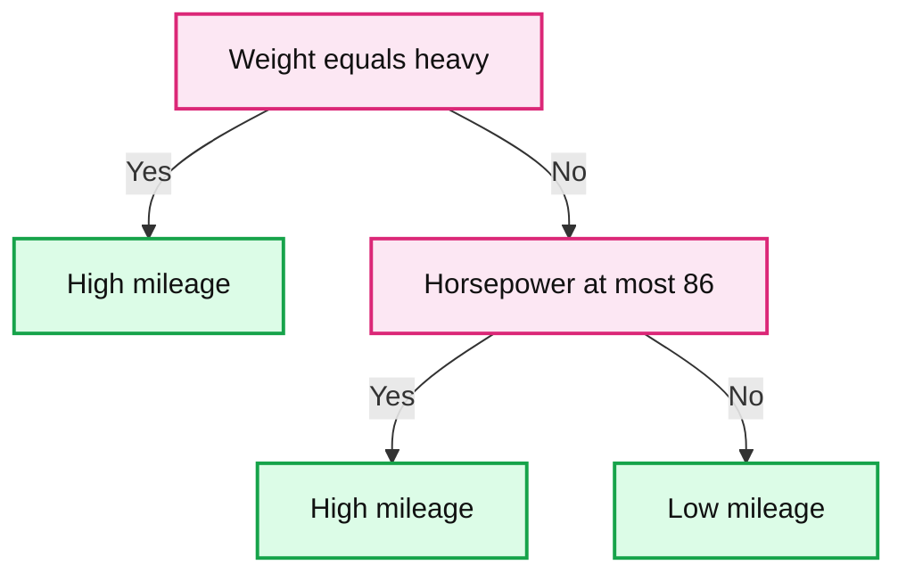
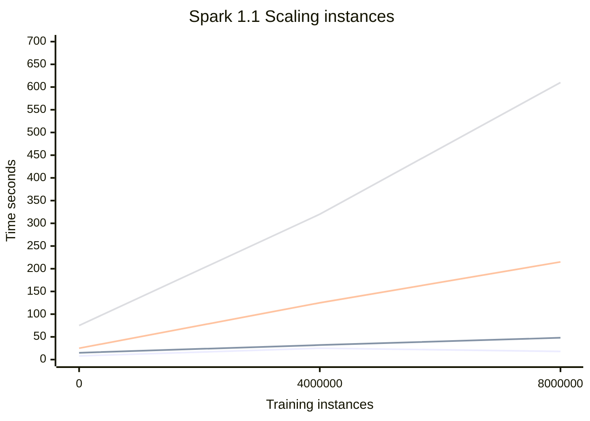
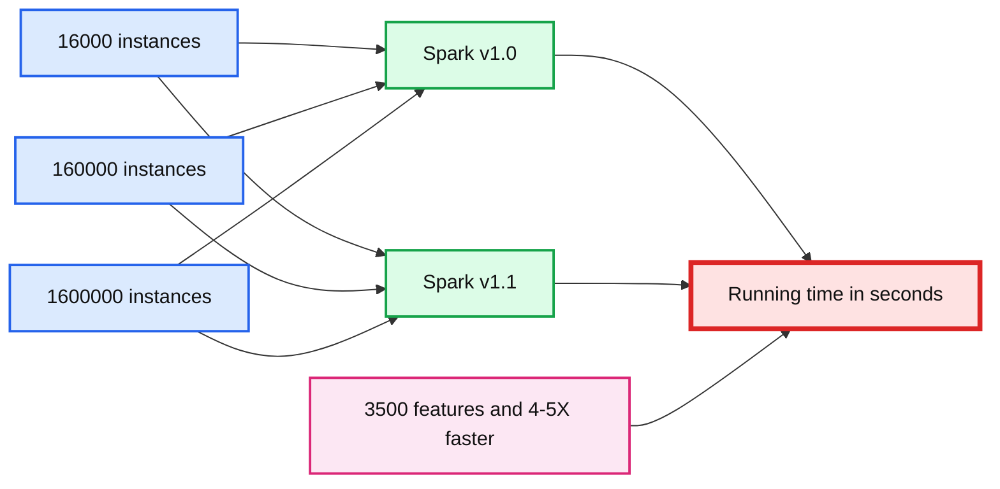
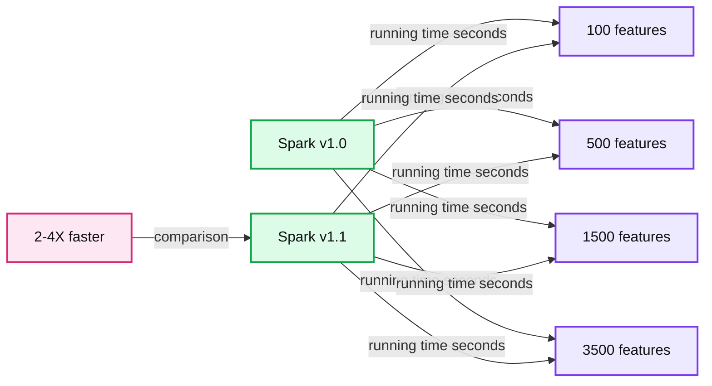

# Scalable Decision Trees in MLlib

- Source: https://www.databricks.com/blog/2014/09/29/scalable-decision-trees-in-mllib.html
- Published: 2014-09-29
- Authors: Manish Amde, Joseph Bradley
- Categories: engineering, data-science-machine-learning
- Images: 5 total, 5 extracted as architecture

This is a post written together with one of our friends at Origami Logic. Origami Logic provides a Marketing Intelligence Platform that uses Apache Spark for heavy lifting analytics work on the backend.

---

Decision trees and their ensembles are industry workhorses for the machine learning tasks of classification and regression. Decision trees are easy to interpret, handle categorical and continuous features, extend to multi-class classification, do not require feature scaling and are able to capture non-linearities and feature interactions.

Due to their popularity, almost every machine learning library provides an implementation of the decision tree algorithm. However, most are designed for single-machine computation and seldom scale elegantly to a distributed setting. Apache Spark is an ideal platform for a scalable distributed decision tree implementation since Spark's in-memory computing allows us to efficiently perform multiple passes over the training dataset.

About a year ago, open-source developers joined forces to come up with a fast distributed decision tree implementation that has been a part of the Spark MLlib library since release 1.0. The Spark community has actively improved the decision tree code since then. This blog post describes the implementation, highlighting some of the important optimizations and presenting test results demonstrating scalability.

**New in Spark 1.1**: MLlib decision trees now support multiclass classification and include several performance optimizations. There are now APIs for Python, in addition to Scala and Java.

## Algorithm Background

At a high level, a decision tree model can be thought of as hierarchical if-else statements that test feature values in order to predict a label. An example model for a binary classification task is shown below. It is based upon car mileage data from the 1970s! It predicts the mileage of the vehicle (high/low) based upon the weight (heavy/light) and the horsepower.

**Summary:** A decision tree predicts car mileage from vehicle weight and horsepower.

**Components:**

- Weight test: checks whether weight is heavy.
- High mileage leaf: predicts high mileage.
- Horsepower test: checks whether horsepower is at most 86.
- Low mileage leaf: predicts low mileage.

**Flows:**

- Weight test -> High mileage leaf: Yes, weight is heavy
- Weight test -> Horsepower test: No, weight is not heavy
- Horsepower test -> High mileage leaf: Yes, horsepower is at most 86
- Horsepower test -> Low mileage leaf: No, horsepower exceeds 86

**Numbers:** 86



<sub>source image: https://www.databricks.com/wp-content/uploads/2014/09/decision-tree-example.png</sub>

A model is learned from a training dataset by building a tree top-down. The if-else statements, also known as splitting criteria, are chosen to maximize a notion of information gain --- it reduces the variability of the labels in the underlying (two) child nodes compared the parent node. The learned decision tree model can later be used to predict the labels for new instances.

These models are interpretable, and they often work well in practice. Trees may also be combined to build even more powerful models, using ensemble tree algorithms. Ensembles of trees such as random forests and boosted trees are often top performers in industry for both classification and regression tasks.

## Simple API

The example below shows how a decision tree in MLlib can be easily trained using a few lines of code using the new Python API in Spark 1.1. It reads a dataset, trains a decision tree model and then measures the training error of the model. Java and Scala examples can be found in [the Spark documentation on DecisionTree](https://spark.apache.org/docs/latest/mllib-decision-tree.html).

## Optimized Implementation

Spark is an ideal compute platform for a scalable distributed decision tree implementation due to its sophisticated DAG execution engine and in-memory caching for iterative computation. We mention a few key optimizations.

**Level-wise training**: We select the splits for all nodes at the same level of the tree simultaneously. This level-wise optimization reduces the number of passes over the dataset exponentially: we make one pass for each level, rather than one pass for each node in the tree. It leads to significant savings in I/O, computation and communication.

**Approximate quantiles**: Single machine implementations typically use sorted unique feature values for continuous features as split candidates for the best split calculation. However, finding sorted unique values is an expensive operation over a distributed dataset. The MLlib decision tree uses quantiles for each feature as split candidates. It's a standard tradeoff for improving decision tree performance without significant loss of accuracy.

**Avoiding the map operation**: The early prototype implementations of the decision tree used both map and reduce operations when selecting best splits for tree nodes. The current code uses significantly less computation and communication by exploiting the known structure of the pre-computed split candidates to avoid the map step.

**Bin-wise computation**: The best split computation discretizes features into bins, and those bins are used for computing sufficient statistics for splitting. We precompute the binned representations of each instance, saving computation on each iteration.

## Scalability

We demonstrate the scalability of MLlib decision trees with empirical results on various datasets and cluster sizes.

#### Scaling with dataset size

The two figures below show the training times of decision trees as we scale the number of instances and features in the dataset. The training times increased linearly, highlighting the scalability of the implementation.

**Summary:** Spark 1.1 decision-tree training time increases with the number of training instances across datasets with 100, 500, 1500, and 3500 features.

**Components:**

- Spark 1.1 decision-tree training benchmark
- Training instances axis
- Training time axis in seconds
- Dataset series for 100, 500, 1500, and 3500 features

**Flows:**

- Training instances -> Training time: measured decision-tree training duration

**Numbers:** Spark 1.1; 0, 100, 200, 300, 400, 500, 600, 700 seconds; 0, 4000000, 8000000 training instances; 100, 500, 1500, 3500 features



<sub>source image: https://www.databricks.com/wp-content/uploads/2014/09/DT-scaling-instances.png</sub>

**Summary:** Spark 1.1 decision tree training time increases with the number of features across datasets of 16,000 to 8,000,000 instances.

**Components:**

- Spark 1.1 benchmark
- X axis number of features
- Y axis training time in seconds
- Series for 16,000 instances
- Series for 160,000 instances
- Series for 1,600,000 instances
- Series for 8,000,000 instances

**Flows:**

- Number of features -> Training time: benchmark measurement
- Instance count -> Training time: dataset-size comparison

**Numbers:**

- Spark version: 1.1
- X axis: 0, 1,000, 2,000, 3,000, 4,000 features
- Y axis: 0, 100, 200, 300, 400, 500, 600, 700 seconds
- Instance counts: 16,000, 160,000, 1,600,000, 8,000,000
- Approximate plotted feature values: 250, 500, 1,500, 3,500
- Approximate plotted times: 0 to 610 seconds

```text
%% mermaid failed to render; kept as text
%% Shows Spark 1.1 training time scaling with number of features and dataset size
flowchart LR
    title[Spark 1.1 Scaling number of features]
    features[Number of features]
    time[Training time in seconds]
    small[16000 instances]
    medium[160000 instances]
    large[1600000 instances]
    huge[8000000 instances]

    title --> features: benchmark axis
    features --> time: measured against
    small --> time: plotted series
    medium --> time: plotted series
    large --> time: plotted series
    huge --> time: plotted series

    classDef client fill:#dbeafe,stroke:#2563eb,stroke-width:2px,color:#111
    classDef service fill:#dcfce7,stroke:#16a34a,stroke-width:2px,color:#111
    classDef store fill:#ede9fe,stroke:#7c3aed,stroke-width:2px,color:#111
    classDef cache fill:#fef3c7,stroke:#d97706,stroke-width:2px,color:#111
    classDef queue fill:#cffafe,stroke:#0891b2,stroke-width:2px,color:#111
    classDef critical fill:#fee2e2,stroke:#dc2626,stroke-width:4px,color:#111
    classDef external fill:#e5e7eb,stroke:#6b7280,stroke-width:2px,color:#111,stroke-dasharray:4 3
    classDef decision fill:#fce7f3,stroke:#db2777,stroke-width:2px,color:#111

    class title client
    class features,time service
    class small,medium,large,huge store
```

<sub>source image: https://www.databricks.com/wp-content/uploads/2014/09/DT-scaling-features.png</sub>

These tests were run on an EC2 cluster with a master node and 15 worker nodes, using r3.2xlarge instances (8 virtual CPUs, 61 GB memory). The trees were built out to 6 levels, and the datasets were generated by the [spark-perf library](https://github.com/databricks/spark-perf).

#### Spark 1.1 speedups

The next two figures show improvements in Apache Spark 1.1, relative to the original Apache Spark 1.0 implementation. On the same datasets and cluster, the new implementation is 4-5X faster on many datasets!

**Summary:** Benchmark chart comparing Spark v1.0 and v1.1 decision-tree running times across datasets with 3500 features.

**Components:**

- Spark v1.0 benchmark
- Spark v1.1 benchmark
- Dataset groups by number of instances
- Running time measurement in seconds

**Flows:**

- None visible.

**Numbers:** 1.0, 1.1, 3500, 4-5X, 16000, 160000, 1600000, 0, 200, 400, 600, 800, sec



<sub>source image: https://www.databricks.com/wp-content/uploads/2014/09/DT-speedups-instances.png</sub>

**Summary:** Benchmark chart comparing Spark v1.0 and v1.1 decision-tree running times across datasets with different feature counts.

**Components:**

- Spark v1.0 benchmark series
- Spark v1.1 benchmark series
- Feature-count categories
- Running-time axis
- Speedup annotation

**Flows:**

- none

**Numbers:** 1.0, 1.1, 1.6 million training instances, 2-4X faster, 0, 100, 200, 400, 500, 600, 800, 1500, 3500, running time in seconds



<sub>source image: https://www.databricks.com/wp-content/uploads/2014/09/DT-speedups-features.png</sub>

## What’s Next?

The tree-based algorithm development beyond release 1.1 will focus primarily on ensemble algorithms such as random forests and boosting. We will also keep optimizing the decision tree code for performance and plan to add support for more options in the upcoming releases.

To get started using decision trees yourself, [download Spark 1.1 today](https://spark.apache.org/)!

## Further Reading

- See examples and the API in [the MLlib decision tree documentation](https://spark.apache.org/docs/latest/mllib-decision-tree.html).
- Watch [the decision tree presentation](https://www.databricks.com/dataaisummit) from the 2014 Spark Summit.
- Check out [video](https://www.youtube.com/user/FunctionalTV/post) and [slides](https://speakerdeck.com/jkbradley/mllib-decision-trees-at-sf-scala-baml-meetup) from another talk on decision trees at a Sept. 2014 SF Scala/Bay Area Machine Learning meetup.

 

### Acknowledgements

The Spark MLlib decision tree work was initially performed jointly with Hirakendu Das (Yahoo Labs), Evan Sparks (UC Berkeley AMPLab), and Ameet Talwalkar and Xiangrui Meng (Databricks). More contributors have joined since then, and we welcome your input too!
