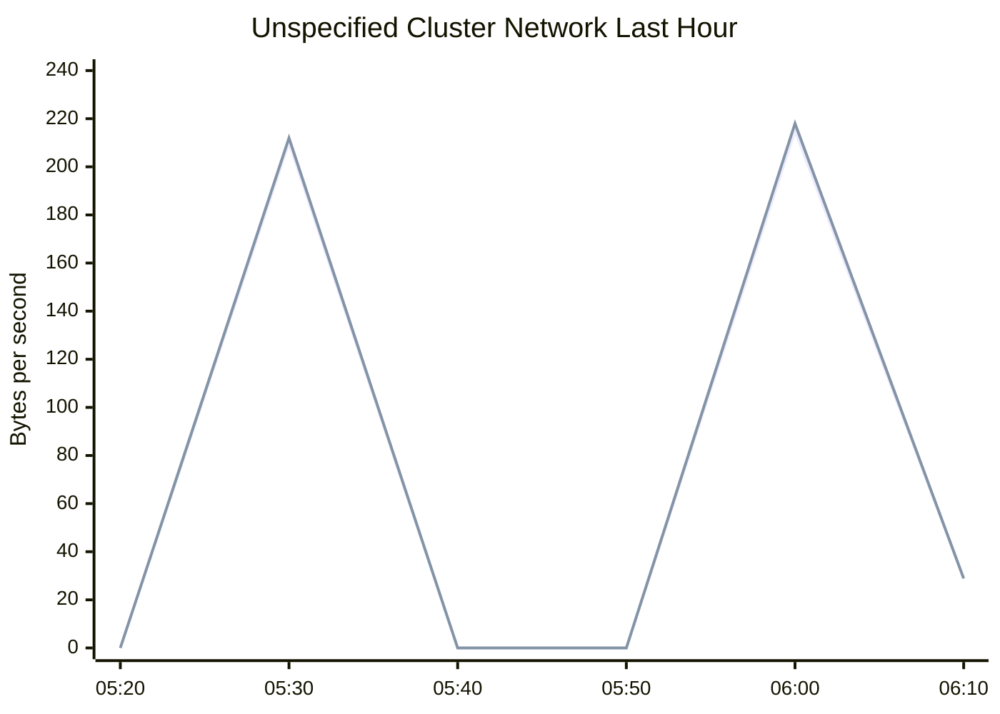

# Apache Spark the Fastest Open Source Engine for Sorting a Petabyte

- Source: https://www.databricks.com/blog/2014/10/10/spark-petabyte-sort.html
- Published: 2014-10-10
- Authors: Reynold Xin
- Categories: engineering, open-source
- Images: 1 total, 1 extracted as architecture

**Update November 5, 2014**: Our benchmark entry has been reviewed by the benchmark committee and Apache Spark has won the [Daytona GraySort contest](http://sortbenchmark.org/) for 2014! Please see this [new blog post for update](https://www.databricks.com/blog/2014/11/05/spark-officially-sets-a-new-record-in-large-scale-sorting.html).

Apache Spark has seen phenomenal adoption, being widely slated as the successor to Hadoop [MapReduce](https://www.databricks.com/glossary/mapreduce), and being deployed in clusters from a handful to thousands of nodes. While it was clear to everybody that Spark is more efficient than MapReduce for data that fits in memory, we heard that some organizations were having trouble pushing it to large scale datasets that could not fit in memory. Therefore, since the inception of Databricks, we have devoted much effort, together with the Spark community, to improve the stability, scalability, and performance of Spark. Spark works well for gigabytes or terabytes of data, and it should also work well for petabytes.

To evaluate these improvements, we decided to participate in the [Sort Benchmark](http://sortbenchmark.org/). With help from Amazon Web Services, we participated in the Daytona Gray category, an industry benchmark on how fast a system can sort 100 TB of data (1 trillion records). Although our entry is still under review, we are eager to share with you our submission. The previous world record was 72 minutes, set by Yahoo using a Hadoop MapReduce cluster of 2100 nodes. Using Spark on 206 EC2 nodes, we completed the benchmark in 23 minutes. This means that Spark sorted the same data **3X faster** using **10X fewer machines**. All the sorting took place on disk ([HDFS](https://www.databricks.com/glossary/hadoop-distributed-file-system-hdfs)), without using Spark's in-memory cache.

Additionally, while no official petabyte (PB) sort competition exists, we pushed Spark further to also sort 1 PB of data (10 trillion records) on 190 machines in under 4 hours. This PB time beats previously reported results based on Hadoop MapReduce in 2009 (16 hours on 3800 machines). To the best of our knowledge, this is the first petabyte-scale sort ever done in a public cloud.

|  | **Hadoop World Record** | **Spark 100 TB *** | **Spark 1 PB** |
|---|---|---|---|
| Data Size | 102.5 TB | 100 TB | 1000 TB |
| Elapsed Time | 72 mins | 23 mins | 234 mins |
| # Nodes | 2100 | 206 | 190 |
| # Cores | 50400 | 6592 | 6080 |
| # Reducers | 10,000 | 29,000 | 250,000 |
| Rate | 1.42 TB/min | 4.27 TB/min | 4.27 TB/min |
| Rate/node | 0.67 GB/min | 20.7 GB/min | 22.5 GB/min |
| Sort Benchmark Daytona Rules | Yes | Yes | No |
| Environment | dedicated data center | EC2 (i2.8xlarge) | EC2 (i2.8xlarge) |

- not an official sort benchmark record

**** ****

## Why sorting?

At the core of sorting is the *shuffle* operation, which moves data across all machines. Shuffle underpins almost all distributed data processing workloads. For example, a SQL query joining two disparate data sources uses shuffle to move tuples that should be joined together onto the same machine, and collaborative filtering algorithms such as [ALS](https://www.databricks.com/blog/2014/07/23/scalable-collaborative-filtering-with-spark-mllib.html) rely on shuffle to send user/product ratings and weights across the network.

Most data pipelines start with a large amount of raw data, but as the pipeline progresses, the amount of data is reduced due to filtering out irrelevant data or more compact representation of intermediate data. A SQL query on 100 TB of raw input data most likely only shuffles a tiny fraction of the 100 TB across the network. This pattern is also reflected in the naming of MapReduce itself.

Sorting, however, is one of the most challenging because there is no reduction of data along the pipeline. Sorting 100 TB of input data requires shuffling 100 TB of data across the network. As a matter of fact, the Daytona competition requires us to replicate both input and output data for fault-tolerance, and thus sorting 100 TB of data effectively generates 500 TB of disk I/O and 200 TB of network I/O.

For the above reasons, when we were looking for metrics to measure and improve Spark, sorting, one of the most demanding workloads, became a natural choice to focus on.

**** ****

## Tell me the technical work that went behind making this possible

A lot of development has gone into improving Spark for very large scale workloads. In particular, there are three major pieces of work that are highly relevant to this benchmark.

First and foremost, in Apache Spark 1.1 we introduced a new shuffle implementation called **sort-based shuffle** ([SPARK-2045](https://issues.apache.org/jira/browse/SPARK-2045)). The previous Spark shuffle implementation was hash-based that required maintaining P (the number of reduce partitions) concurrent buffers in memory. In sort-based shuffle, at any given point only a single buffer is required. This has led to substantial memory overhead reduction during shuffle and can support workloads with hundreds of thousands of tasks in a single stage (our PB sort used 250,000 tasks).

Second, we revamped the **network module** in Spark based on Netty’s Epoll native socket transport via JNI ([SPARK-2468](https://issues.apache.org/jira/browse/SPARK-2468)). The new module also maintains its own pool of memory, thus bypassing JVM’s memory allocator, reducing the impact of garbage collection.

Last but not least, we created a new **external shuffle service** ([SPARK-3796](https://issues.apache.org/jira/browse/SPARK-3796)) that is decoupled from the Spark executor itself. This new service builds on the aforementioned network module and ensures that Spark can still serve shuffle files even when the executors are in GC pauses.

**Summary:** Time-series benchmark showing inbound and outbound cluster network throughput over the last hour.

**Components:**

- Unspecified cluster network using inbound and outbound traffic series
- In series shown in green
- Out series shown in blue
- Throughput chart measured in bytes per second

**Flows:**

- none

**Numbers:** 0, 20 G, 40 G, 60 G, 80 G, 100 G, 120 G, 140 G, 160 G, 180 G, 200 G, 220 G, 240 G, 05:20, 05:30, 05:40, 05:50, 06:00, 06:10, Now 28.9 G, Min 793.7 k, Avg 113.2 G, Max 221.7 G, Now 28.9 G, Min 798.1 k, Avg 113.9 G, Max 223.6 G

source image: https://www.databricks.com/wp-content/uploads/2014/10/ganglia-network-daytona.png

 With these three changes, our Spark cluster was able to sustain 3GB/s/node I/O activity during the map phase, and 1.1 GB/s/node network activity during the reduce phase, saturating the 10Gbps link available on these machines.

**** ****

## What other nitty-gritty details have you not told me yet?

**TimSort**: In Apache Spark 1.1, we switched our default sorting algorithm from quicksort to [TimSort](https://en.wikipedia.org/wiki/Timsort), a derivation of merge sort and insertion sort. It performs better than quicksort in most real-world datasets, especially for datasets that are partially ordered. We use TimSort in both the map and reduce phases.

**Exploiting Cache Locality**: In the sort benchmark, each record is 100 bytes, where the sort key is the first 10 bytes. As we were profiling our sort program, we noticed the cache miss rate was high, because each comparison required an object pointer lookup that was random. We redesigned our record in-memory layout to represent each record as one 16-byte record (two longs in the JVM), where the first 10 bytes represent the sort key, and the last 4 bytes represent the position of the record (in reality it is slightly more complicated than this due to endianness and signedness). This way, each comparison only required a cache lookup that was mostly sequential, rather than a random memory lookup. Originally proposed by Chris Nyberg et al. in AlphaSort, this is a common technique used in high-performance systems.

Spark's nice programming abstraction and architecture allow us to implement these improvements in the user space (without modifying Spark) in a few lines of code. Combining TimSort with our new layout to exploit cache locality, the CPU time for sorting was reduced by a factor of 5.

**Fault-tolerance at Scale**: At scale a lot of things can break. In the course of this experiment, we have seen nodes going away due to network connectivity issues, the Linux kernel spinning in a loop, or nodes pausing due to memory defrag. Fortunately, Spark is fault-tolerant and recovered from these failures.

**Power of the Cloud (AWS)**: As mentioned previously, we leveraged 206 i2.8xlarge instances to run this I/O intensive experiment. These instances deliver high I/O throughput via SSDs. We put these instances in a placement group in a VPC to enable enhanced networking via single root I/O virtualization (SR-IOV). Enabling enhanced networking results in higher performance (10Gbps), lower latency, and lower jitter. We would like to thank everyone involved at AWS for their help making this happen including: the AWS EC2 services team, AWS EC2 Business Development team, AWS product marketing and AWS solutions architecture team. Without them this experiment would not have been possible.

## Isn’t Spark in-memory only?

This has always been one of the most common misconceptions about Spark, especially for people new to the community. Spark is well known for its in-memory performance, but from its inception Spark was designed to be a general execution engine that works both in-memory and on-disk. Almost all Spark operators perform external operations when data does not fit in memory. More generally, Spark’s operators are a strict superset of MapReduce.

As demonstrated by this experiment, Spark is capable of processing datasets many times larger than the aggregate memory in a cluster.

## Summary

Databricks, with the help of the Spark community, has contributed many improvements to Apache Spark to improve its performance, stability, and scalability. This enabled Databricks to use Apache Spark to sort 100 TB of data on 206 machines in 23 minutes, which is 3X faster than the previous Hadoop 100TB result on 2100 machines. Similarly, Databricks sorted 1 PB of data on 190 machines in less than 4 hours, which is over 4X faster than the previous Hadoop 1PB result on 3800 machines.

Outperforming large Hadoop MapReduce clusters on sorting not only validates the work we have done, but also demonstrates that Spark is fulfilling its promise to serve as a faster and more scalable engine for data processing of all sizes. We hope that Spark enables equally dramatic improvements in time and cost for all our users.
