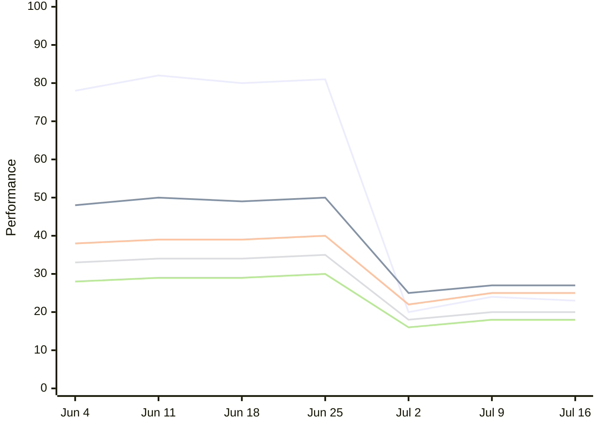
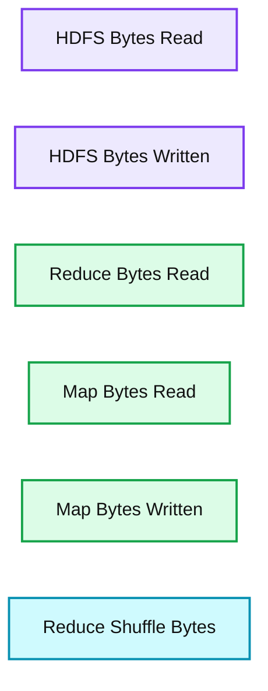

# Efficient Similarity Algorithm Now in Apache Spark, Thanks to Twitter

- Source: https://www.databricks.com/blog/2014/10/20/efficient-similarity-algorithm-now-in-spark-twitter.html
- Published: 2014-10-20
- Authors: Reza Zadeh
- Categories: engineering, open-source, data-science-machine-learning
- Images: 2 total, 2 extracted as architecture

Our friends at Twitter have contributed to MLlib, and this post uses material from Twitter’s description of its [open-source contribution](https://blog.twitter.com/engineering/en_us/a/2014/all-pairs-similarity-via-dimsum), with permission. The associated [pull request](https://github.com/apache/spark/pull/1778) is slated for release in Apache Spark 1.2.

---

## Introduction

We are often interested in finding users, hashtags and ads that are very similar to one another, so they may be recommended and shown to users and advertisers. To do this, we must consider many pairs of items, and evaluate how “similar” they are to one another.

We call this the “all-pairs similarity” problem, sometimes known as a “similarity join.” We have developed a new efficient algorithm to solve the similarity join called “Dimension Independent Matrix Square using [MapReduce](https://www.databricks.com/glossary/mapreduce),” or [DIMSUM](https://arxiv.org/abs/1304.1467) for short, which made one of Twitter’s most expensive batch computations 40% more efficient.

To describe the problem we’re trying to solve more formally, when given a dataset of sparse vector data, the all-pairs similarity problem is to find all similar vector pairs according to a similarity function such as [cosine similarity](https://en.wikipedia.org/wiki/Cosine_similarity), and a given similarity score threshold.

Not all pairs of items are similar to one another, and yet a naive algorithm will spend computational effort to consider even those pairs of items that are not very similar. The brute force approach of considering all pairs of items quickly breaks, since its computational effort scales quadratically.

For example, for a million vectors, it is not feasible to check all roughly trillion pairs to see if they’re above the similarity threshold. Having said that, there exist clever sampling techniques to focus the computational effort on only those pairs that are above the similarity threshold, thereby making the problem feasible. We’ve developed the DIMSUM sampling scheme to focus the computational effort on only those pairs that are highly similar, thus making the problem feasible.

## Intuition

The main insight that allows gains in efficiency is sampling columns that have many non-zeros with lower probability. On the flip side, columns that have fewer non-zeros are sampled with higher probability. This sampling scheme can be shown to provably accurately estimate cosine similarities, because those columns that have many non-zeros have more trials to be included in the sample, and thus can be sampled with lower probability.

There is an in-depth description of the algorithm on the [Twitter Engineering blog post](https://blog.twitter.com/engineering/en_us/a/2014/all-pairs-similarity-via-dimsum).

## Experiments

We run DIMSUM on a production-scale ads dataset. Upon replacing the traditional cosine similarity computation in late June, we observed 40% improvement in several performance measures, plotted below.

**Summary:** The chart shows several production performance measures over time, with sharp drops around Jun 25 and Jul 4 after the algorithm change.

**Components:**

- Production performance measure traces
- Time axis with calendar dates

**Flows:**

- none

**Numbers:** Jun 4, Jun 11, Jun 18, Jun 25, Jul 2, Jul 9, Jul 16

source image: https://www.databricks.com/wp-content/uploads/2014/10/Dimsum-first.png

**Summary:** Legend identifying Hadoop and Spark byte metrics by color.

**Components:**

- HDFS Bytes Read - HDFS
- HDFS Bytes Written - HDFS
- Reduce Bytes Read - Reduce phase
- Map Bytes Read - Map phase
- Map Bytes Written - Map phase
- Reduce Shuffle Bytes - Reduce shuffle

**Flows:**

- none

**Numbers:** none

source image: https://www.databricks.com/wp-content/uploads/2014/10/Dimsum-second.png

## Usage from Spark

The algorithm is available in Apache Spark MLlib as a method in RowMatrix. This makes it easy to use and access:

// Arguments for input and threshold
 val filename = args(0)
 val threshold = args(1).toDouble

// Load and parse the data file.
 val rows = sc.textFile(filename).map { line =>
 val values = line.split(' ').map(_.toDouble)
 Vectors.dense(values)
 }
 val mat = new RowMatrix(rows)

// Compute similar columns perfectly, with brute force.
 val simsPerfect = mat.columnSimilarities()

// Compute similar columns with estimation using DIMSUM
 val simsEstimate = mat.columnSimilarities(threshold)

Here is an [example invocation of DIMSUM](https://github.com/apache/spark/blob/master/examples/src/main/scala/org/apache/spark/examples/mllib/CosineSimilarity.scala). This functionality will be available as of Spark 1.2.

Additional information can be found in the [GigaOM article](https://gigaom.com/2014/09/24/twitter-open-sourced-a-recommendation-algorithm-for-massive-datasets/) covering the DIMSUM algorithm.
