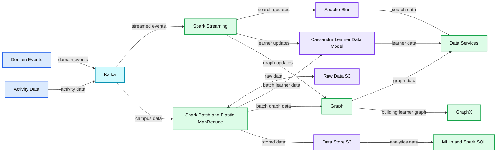

# Pearson uses Apache Spark Streaming for next generation adaptive learning platform

- Source: https://www.databricks.com/blog/2014/12/08/pearson-uses-spark-streaming-for-next-generation-adaptive-learning-platform.html
- Published: 2014-12-08
- Authors: Dibyendu Bhattacharya
- Categories: company, partners, data-streaming
- Images: 2 total, 2 extracted as architecture

This is a guest blog post from our friends at Pearson outlining their Apache Spark use case.

---

## Introduction of Pearson

Pearson is a British multinational publishing and education company headquartered in London. It is the largest education company and the largest book publisher in the world. Recently, Pearson announced a new organization structure in order to accelerate their push into digital learning, education services and emerging markets. I am part of Pearson Higher Education group, which provides textbooks and digital technologies to teachers and students across Higher Education. Pearson's higher education brands include eCollege, Mastering/MyLabs and Financial Times Publishing.

## What we wanted to do

We are building a next generation adaptive learning platform which delivers immersive learning experiences designed for the way today’s students read, think, and learn. This learning platform is a scalable, reliable, cloud-based platform providing services to power the next generation of products for Higher Education. With a common data platform, we analyze student performance across product and institution boundaries and deliver efficacy insights to learners and institutions, which we were not able to deliver before. This platform will help Pearson to build new products faster and offer the world's greatest collection of educational content, while delivering most advanced data, analytics, adaptive and personalized capabilities for education.

## Why we chose Apache Spark and Spark Streaming

Now to get the deep understanding of millions of learners, we needed a big data approach, and we found that a huge opportunity exists for ground-breaking industry-leading innovation in learner analytics. We have various use cases ranging from Near Real Time services, building Learner Graph, developing a common learner model for performing adaptive learning and recommendation, and different search based analytics etc. We found Apache Spark is one product which can bring all such capabilities into one platform. Spark supports both batch and real time mode of data processing along with graph analytics and machine learning libraries.

Pearson Near Real Time architecture is designed using Spark Streaming. Spark MLLib will be useful for Pearson Machine Learning use cases and Spark Graph Library will be useful for building learner graph in single common platform. Having common APIs and data processing semantics, Spark will help Pearson to build its skills and capabilities in a single platform rather than learning and managing various disparate tools.

Having a single platform and common API paradigm is one of the key reason we have moved our real time stack to Spark Streaming from our earlier solution which was designed using Apache Storm.

## What we did

Pearson's stream processing architecture is built using Apache Kafka and Spark Streaming.

Apache Kafka is a distributed messaging infrastructure and in Pearson's implementation, all students' activity and contextual data comes to Kafka cluster from different learning applications. Spark Streaming collects this data from Kafka in near-real-time and perform necessary transformations and aggregation on the fly to build the common learner data model and persists the data in NoSQL store (presently we are using Cassandra). For search related use cases, Spark Streaming consumes messages from Kafka and index them into Apache Blur, which is a distributed search engine on top of [HDFS](https://www.databricks.com/glossary/hadoop-distributed-file-system-hdfs). For both these use cases, we needed a reliable, fault-tolerant Kafka consumer which can consume messages from Kafka topics without any data loss scenarios. Below diagram shows a high level overview of different components in this data pipeline.

**Summary:** Data from domain events and activity data enters Kafka, then flows through Spark Streaming and batch processing into search, learner data, graph, storage, and analytics systems.

**Components:**

- Domain Events
- Activity Data
- Kafka
- Spark Streaming
- Spark Batch and Elastic MapReduce
- Raw Data S3
- Apache Blur search
- Cassandra Common Learner Data Model
- Graph
- Data Store S3
- Data Services
- GraphX Building Learner Graph
- MLlib and Spark SQL for machine learning and analytics

**Flows:**

- Domain Events -> Kafka: domain event messages
- Activity Data -> Kafka: activity messages
- Kafka -> Spark Streaming: streamed events
- Kafka -> Spark Batch and Elastic MapReduce: campus data
- Spark Batch and Elastic MapReduce -> Raw Data S3: raw data
- Raw Data S3 -> Spark Batch and Elastic MapReduce: stored raw data
- Spark Streaming -> Apache Blur: streaming search updates
- Spark Streaming -> Cassandra Common Learner Data Model: learner model updates
- Spark Streaming -> Graph: graph updates
- Spark Batch and Elastic MapReduce -> Cassandra Common Learner Data Model: batch learner data
- Spark Batch and Elastic MapReduce -> Graph: batch graph data
- Spark Batch and Elastic MapReduce -> Data Store S3: stored data
- Apache Blur -> Data Services: search data
- Cassandra Common Learner Data Model -> Data Services: learner data
- Graph -> Data Services: graph data
- Graph -> GraphX Building Learner Graph: learner graph
- Data Store S3 -> MLlib and Spark SQL: data for machine learning and analytics

**Numbers:** none

source image: https://www.databricks.com/wp-content/uploads/2014/12/pearson-1.png

Next figure highlights the functionality of the Spark Streaming application. All the student/instructor activities and domain events from different learning applications are combined together to continuously update the learning model of each student.

**Summary:** Spark Streaming combines Kafka activity and domain events, then produces search indices and learner models for Blur and Cassandra.

**Components:**

- Kafka - event messaging technology
- Spark Streaming Application - streaming computation
- map, join, ... - processing operations
- Blur - search index store
- Cassandra - learner model store
- activity events - input event stream
- domain events - input event stream
- search indices - output data
- learner models - output data

**Flows:**

- Kafka -> Spark Streaming Application: activity events
- Kafka -> Spark Streaming Application: domain events
- Spark Streaming Application -> Blur: search indices
- Spark Streaming Application -> Cassandra: learner models

**Numbers:** none

source image: https://www.databricks.com/wp-content/uploads/2014/12/pearson-2.png

```mermaid
%% Shows Kafka events processed by Spark Streaming and written to Blur and Cassandra
flowchart LR
    K[Kafka]
    A[activity events]
    D[domain events]
    S[Spark Streaming Application]
    M[map, join, ...]
    I[search indices]
    L[learner models]
    B[Blur]
    C[Cassandra]

    K -->|activity events| A
    K -->|domain events| D
    A -->|activity events| S
    D -->|domain events| S
    S -->|processing| M
    M -->|search indices| I
    M -->|learner models| L
    I -->|search indices| B
    L -->|learner models| C

    classDef client   fill:#dbeafe,stroke:#2563eb,stroke-width:2px,color:#111
    classDef service  fill:#dcfce7,stroke:#16a34a,stroke-width:2px,color:#111
    classDef store    fill:#ede9fe,stroke:#7c3aed,stroke-width:2px,color:#111
    classDef cache    fill:#fef3c7,stroke:#d97706,stroke-width:2px,color:#111
    classDef queue    fill:#cffafe,stroke:#0891b2,stroke-width:2px,color:#111
    classDef critical fill:#fee2e2,stroke:#dc2626,stroke-width:4px,color:#111
    classDef external fill:#e5e7eb,stroke:#6b7280,stroke-width:2px,color:#111,stroke-dasharray:4 3
    classDef decision fill:#fce7f3,stroke:#db2777,stroke-width:2px,color:#111

    class K queue
    class A,D,I,L queue
    class S,M service
    class B,C store
```

In real time streaming use cases, Kafka is becoming a most adopted platform for distributed messaging system and this prompts various streaming layer like Spark Streaming to have a built-in Kafka Consumer, so that streaming layer can seamlessly fit into this architecture. When we started working on Spark Streaming and Kafka, we wanted to achieve better performance and stronger guarantees than those provided by the built-in high-level Kafka receiver of Spark Streaming. Hence, we chose to write our custom Kafka receiver. This custom Kafka Consumer for Spark Streaming uses the Low Level Kafka Consumer APIs, and is the most robust, high performant Kafka consumer available for Spark. This consumer handles Kafka node failures, leader changes, manages committed offset in ZK and can have tunable data rate throughput. It also solves the data loss scenarios on Receiver failures.

Pearson runs Spark Streaming in Amazon Cloud with YARN managed cluster. The building of common learner data model architecture using Spark Streaming will be in production by end of 2014. The Search based solution will be in production by Q1 2015. Other solutions like Learner Graph or advanced Machine Learning solution will be developed in 2015.

## To Learn More:

For more information, please refer to my recent [talk](https://www.youtube.com/watch?v=n7lfYhJgtJo&list=PLU6n9Voqu_1FM8nmVwiWWDRtsEjlPqhgP&index=25) [(slides)](https://www.slideshare.net/lucidworks/near-real-time-indexing-kafka-messages-into-apache-blur-presented-by-dibyendu-bhattacharya-pearson-north-america) at the Lucene/SolrRevolution conference.
