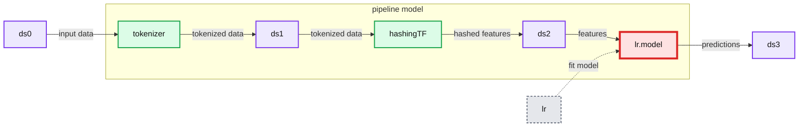
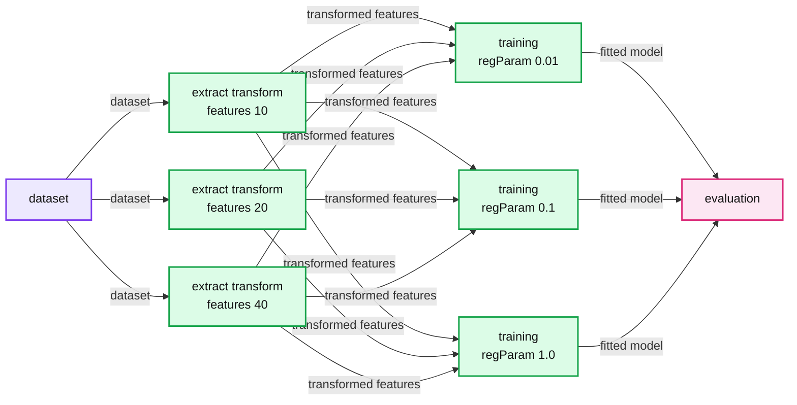

# ML Pipelines: A New High-Level API for MLlib

- Source: https://www.databricks.com/blog/2015/01/07/ml-pipelines-a-new-high-level-api-for-mllib.html
- Published: 2015-01-07
- Authors: Joseph Bradley, Evan Sparks, Shivaram Venkataraman
- Categories: engineering, data-science-machine-learning
- Images: 3 total, 3 extracted as architecture

MLlib’s goal is to make practical machine learning (ML) scalable and easy. Besides new algorithms and performance improvements that we have seen in each release, a great deal of time and effort has been spent on making MLlib *easy*. Similar to Spark Core, MLlib provides APIs in three languages: Python, Java, and Scala, along with user guide and example code, to ease the learning curve for users coming from different backgrounds. In Apache Spark 1.2, Databricks, jointly with AMPLab, UC Berkeley, continues this effort by introducing a pipeline API to MLlib for easy creation and tuning of practical ML pipelines.

A practical ML pipeline often involves a sequence of data pre-processing, feature extraction, model fitting, and validation stages. For example, classifying text documents might involve text segmentation and cleaning, extracting features, and training a classification model with cross-validation. Though there are many libraries we can use for each stage, connecting the dots is not as easy as it may look, especially with large-scale datasets. Most ML libraries are not designed for distributed computation or they do not provide native support for pipeline creation and tuning. Unfortunately, this problem is often ignored in academia, and it has received largely ad-hoc treatment in industry, where development tends to occur in manual one-off pipeline implementations.

In this post, we briefly describe the work done to address ML pipelines in MLlib, a joint effort between Databricks and AMPLab, UC Berkeley, and inspired by the [scikit-learn](https://scikit-learn.org/stable) project and some earlier work on [MLI](https://amplab.cs.berkeley.edu/publication/mli-an-api-for-distributed-machine-learning/).

## Dataset abstraction

In the new pipeline design, a dataset is represented by Spark SQL’s SchemaRDD and an ML pipeline by a sequence of dataset transformations. **(Update**: SchemaRDD was renamed to DataFrame in Spark 1.3).  Each transformation takes an input dataset and outputs the transformed dataset, which becomes the input to the next stage. We leverage on Spark SQL for several reasons: data import/export, flexible column types and operations, and execution plan optimization.

Data import/export is the start/end point of an ML pipeline.  MLlib currently provides import/export utilities for several application-specific types: LabeledPoint for classification and regression, Rating for collaborative filtering, and so on.  However, realistic datasets may contain many types, such as user/item IDs, timestamps, or raw records.  The current utilities cannot easily handle datasets with combinations of these types, and they use inefficient text storage formats adopted from other ML libraries.

Feature transformations usually form the majority of a practical ML pipeline. A feature transformation can be viewed as appending new columns created from existing columns. For example, text tokenization breaks a document up into a bag of words, and tf-idf converts a bag of words into a feature vector, while during the transformations the labels need to be preserved for model fitting. More complex feature transformations are quite common in practice. Hence, the dataset needs to support columns of different types, including dense and sparse vectors, and operations that create new columns from existing ones.

**Summary:** The diagram shows a text dataset transformed by a tokenizer and tf-idf into a feature-enriched dataset.

**Components:**

- Input dataset with id, label, and text
- Tokenizer
- Tokenized dataset with id, label, text, and words
- Tf-idf transformer
- Feature dataset with id, label, text, words, and features

**Flows:**

- Input dataset -> tokenizer: text
- Tokenizer -> tokenized dataset: words
- Tokenized dataset -> tf-idf: words
- Tf-idf -> feature dataset: features

**Numbers:** none

source image: https://www.databricks.com/wp-content/uploads/2015/01/pipeline-0.png

```mermaid
%% Text dataset transformation from raw text to tf-idf features
flowchart LR
    A[Dataset with id label text] -->|text| B[Tokenizer]
    B -->|words| C[Dataset with id label text words]
    C -->|words| D[Tf-idf]
    D -->|features| E[Dataset with id label text words features]

    classDef client   fill:#dbeafe,stroke:#2563eb,stroke-width:2px,color:#111
    classDef service  fill:#dcfce7,stroke:#16a34a,stroke-width:2px,color:#111
    classDef store    fill:#ede9fe,stroke:#7c3aed,stroke-width:2px,color:#111
    classDef cache    fill:#fef3c7,stroke:#d97706,stroke-width:2px,color:#111
    classDef queue    fill:#cffafe,stroke:#0891b2,stroke-width:2px,color:#111
    classDef critical fill:#fee2e2,stroke:#dc2626,stroke-width:4px,color:#111
    classDef external fill:#e5e7eb,stroke:#6b7280,stroke-width:2px,color:#111,stroke-dasharray:4 3
    classDef decision fill:#fce7f3,stroke:#db2777,stroke-width:2px,color:#111

    class A,C,E store
    class B,D service
```

In the example above, id, text, and words are carried over during transformations. They are unnecessary for model fitting, but useful in prediction and model inspection. It doesn’t provide much information if the prediction dataset only contains the predicted labels. If we want to inspect the prediction results, e.g., checking false positives, it is quite useful to look at the predicted labels along with the raw input text and tokenized words. The columns needed at each stage are quite different. It would be ideal that the underlying execution engine can optimize for us and only load the required columns.

Fortunately, Spark SQL already provides most of the desired functions and we don’t need to reinvent the wheel. Spark SQL supports import/export SchemaRDDs from/to Parquet, an efficient columnar storage format, and easy conversions between RDDs and SchemaRDDs. It also supports pluggable external data sources like Hive and [Avro](https://spark-packages.org/package/databricks/spark-avro). Creating (or declaring to be more precise) new columns from existing columns is easy with user-defined functions. The materialization of SchemaRDD is lazy. Spark SQL knows how to optimize the execution plan based on the columns requested, which fits our needs well. SchemaRDD supports standard data types. To make it a better fit for ML, we worked together with the Spark SQL team and added Vector type as a user-defined type that supports both dense and sparse feature vectors.

We show a simple Scala code example for ML dataset import/export and simple operations. More complete dataset examples in [Scala](https://github.com/apache/spark/blob/branch-1.2/examples/src/main/scala/org/apache/spark/examples/mllib/DatasetExample.scala) and [Python](https://github.com/apache/spark/blob/branch-1.2/examples/src/main/python/mllib/dataset_example.py) can be found under the `examples/` folder of the Spark repository. We refer users to Spark SQL’s user guide to learn more about SchemaRDD and the operations it supports.

val sqlContext = SQLContext(sc)
 import sqlContext._ // implicit conversions

// Load a LIBSVM file into an RDD[LabeledPoint].
 val labeledPointRDD: RDD[LabeledPoint] =
 MLUtils.loadLibSVMFile("/path/to/libsvm")

// Save it as a Parquet file with implicit conversion
 // from RDD[LabeledPoint] to SchemaRDD.
 labeledPointRDD.saveAsParquetFile("/path/to/parquet")

// Load the parquet file back into a SchemaRDD.
 val dataset = parquetFile("/path/to/parquet")

// Collect the feature vectors and print them.
 dataset.select('features).collect().foreach(println)

## Pipeline

The new pipeline API lives under a new package named “spark.ml”. A pipeline consists of a sequence of stages. There are two basic types of pipeline stages: Transformer and Estimator. A Transformer takes a dataset as input and produces an augmented dataset as output. E.g., a tokenizer is a Transformer that transforms a dataset with text into an dataset with tokenized words. An Estimator must be first fit on the input dataset to produce a model, which is a Transformer that transforms the input dataset. E.g., logistic regression is an Estimator that trains on a dataset with labels and features and produces a logistic regression model.

Creating a pipeline is easy: simply declare its stages, configure their parameters, and chain them in a pipeline object. For example the following code creates a simple text classification pipeline consisting of a tokenizer, a hashing term frequency feature extractor, and logistic regression.

val tokenizer = new Tokenizer()
 .setInputCol("text")
 .setOutputCol("words")
 val hashingTF = new HashingTF()
 .setNumFeatures(1000)
 .setInputCol(tokenizer.getOutputCol)
 .setOutputCol("features")
 val lr = new LogisticRegression()
 .setMaxIter(10)
 .setRegParam(0.01)
 val pipeline = new Pipeline()
 .setStages(Array(tokenizer, hashingTF, lr))

The pipeline itself is an Estimator, and hence we can call fit on the entire pipeline easily.

val model = pipeline.fit(trainingDataset)

The fitted model consists of the tokenizer, the hashing TF feature extractor, and the fitted logistic regression model. The following diagram draws the workflow, where the dash lines only happen during pipeline fitting.

**Summary:** The diagram shows an ML pipeline transforming input data through tokenization and hashing before fitting and applying a logistic regression model.

**Components:**

- ds0: Input dataset
- tokenizer: Tokenizer transformation
- ds1: Tokenized dataset
- hashingTF: Hashing term frequency transformation
- ds2: Feature dataset
- lr: Logistic regression estimator
- lr.model: Fitted logistic regression model
- ds3: Output dataset
- pipeline model: Fitted pipeline containing the stages

**Flows:**

- ds0 -> tokenizer: Input data
- tokenizer -> ds1: Tokenized data
- ds1 -> hashingTF: Tokenized data
- hashingTF -> ds2: Hashed feature data
- ds2 -> lr.model: Features used for prediction
- lr -> lr.model: Model fitting
- lr.model -> ds3: Predictions and transformed data

**Numbers:** none

source image: https://www.databricks.com/wp-content/uploads/2015/01/pipeline-1.png

The fitted pipeline model is a transformer that can be used for prediction, model validation, and model inspection.

model.transform(testDataset)
 .select('text, 'label, 'prediction)
 .collect()
 .foreach(println)

One unfortunate characteristic of ML algorithms is that they have many hyperparameters that must be tuned. These hyperparameters - e.g. degree of regularization - are distinct from the model parameters being optimized by MLlib. It is hard to guess the best combination of hyperparameters without expert knowledge on both the data and the algorithm. Even with expert knowledge, it may become unreliable as the size of the pipeline and the number of hyperparameters grows. Hyperparameter tuning (choosing parameters based on performance on held-out data) is usually necessary to obtain meaningful results in practice. For example, we have two hyperparameters to tune in the following pipeline and we put three candidate values for each. Therefore, there are nine combinations in total (four shown in the diagram below) and we want to find the one that leads to the model with the best evaluation result.

**Summary:** The diagram shows hyperparameter tuning across feature extraction and training configurations, followed by evaluation.

**Components:**

- Dataset using Spark MLlib input data
- Feature extraction and transformation with 10 features
- Feature extraction and transformation with 20 features
- Feature extraction and transformation with 40 features
- Training with regParam 0.01
- Training with regParam 0.1
- Training with regParam 1.0
- Evaluation using a model evaluator

**Flows:**

- Dataset -> Feature extraction configurations: dataset
- Feature extraction configurations -> Training configurations: transformed features and candidate models
- Training configurations -> Evaluation: fitted models and evaluation results

**Numbers:** 10, 20, 40, 0.01, 0.1, 1.0

source image: https://www.databricks.com/wp-content/uploads/2015/01/pipeline-2.png

We support cross-validation for hyperparameter tuning. We view cross-validation as a meta-algorithm, which tries to fit the underlying estimator with user-specified combinations of parameters, cross-evaluate the fitted models, and output the best one. Note that there is no specific requirement on the underlying estimator, which could be a pipeline, as long as it could be paired with an Evaluator that outputs a scalar metric from predictions, e.g., precision. Tuning a pipeline is easy:

// Build a parameter grid.
 val paramGrid = new ParamGridBuilder()
 .addGrid(hashingTF.numFeatures, Array(10, 20, 40))
 .addGrid(lr.regParam, Array(0.01, 0.1, 1.0))
 .build()

// Set up cross-validation.
 val cv = new CrossValidator()
 .setNumFolds(3)
 .setEstimator(pipeline)
 .setEstimatorParamMaps(paramGrid)
 .setEvaluator(new BinaryClassificationEvaluator)

// Fit a model with cross-validation.
 val cvModel = cv.fit(trainingDataset)

It is important to note that users can embed their own transformers or estimators into an ML pipeline, as long as they implement the pipeline interfaces. The API makes it easy to use and share code maintained outside MLlib. More complete code examples in [Java](https://github.com/apache/spark/blob/branch-1.2/examples/src/main/java/org/apache/spark/examples/ml/JavaCrossValidatorExample.java) and [Scala](https://github.com/apache/spark/blob/branch-1.2/examples/src/main/scala/org/apache/spark/examples/ml/CrossValidatorExample.scala) can be found under the ‘examples/’ folder of the Spark repository. We refer users to the [spark.ml user guide](https://spark.apache.org/docs/latest/ml-guide.html) for more information about the pipeline API.

## Concluding remarks

The blog post describes the ML pipeline API introduced in Spark 1.2 and the rationale behind it. The work is covered by several JIRAs: [SPARK-3530](https://issues.apache.org/jira/browse/SPARK-3530), [SPARK-3569](https://issues.apache.org/jira/browse/SPARK-3569), [SPARK-3572](https://issues.apache.org/jira/browse/SPARK-3572), [SPARK-4192](https://issues.apache.org/jira/browse/SPARK-4192), and [SPARK-4209](https://issues.apache.org/jira/browse/SPARK-4209). We refer users to the design docs posted on each JIRA page for more information about the design choices. And we would like to thank everyone who participated in the discussion and provided valuable feedback.

That being said, the pipeline API is experimental in Spark 1.2 and the work is still far from done. For example, more feature transformers can help users quickly assemble pipelines. We would like to mention some ongoing work relevant to the pipeline API:

- [SPARK-5097](https://issues.apache.org/jira/browse/SPARK-5097): Adding data frame APIs to SchemaRDD
- [SPARK-4586](https://issues.apache.org/jira/browse/SPARK-4586): Python API for ML pipeline
- [SPARK-3702](https://issues.apache.org/jira/browse/SPARK-3702): Class hierarchy for learning algorithms and models

The pipeline API is part of Spark 1.2, which is available for download at [https://spark.apache.org/](https://spark.apache.org/). We look forward to hearing back from you about it, and we welcome your contributions and feedback.
