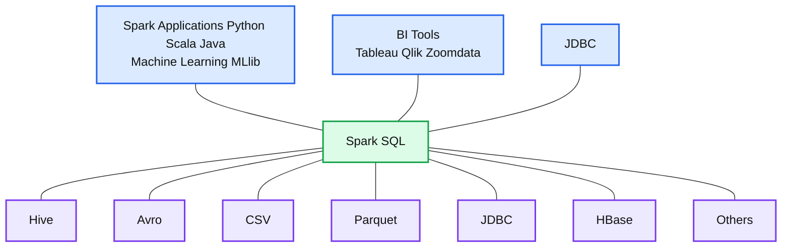

# Spark SQL Data Sources API: Unified Data Access for the Apache Spark Platform

- Source: https://www.databricks.com/blog/2015/01/09/spark-sql-data-sources-api-unified-data-access-for-the-spark-platform.html
- Published: 2015-01-09
- Authors: Michael Armbrust
- Categories: engineering, open-source
- Images: 1 total, 1 extracted as architecture

[Read Rise of the Data Lakehouse](https://www.databricks.com/resources/ebook/rise-data-lakehouse?itm_data=sparksqlapiunifieddataaccess-blog-riselakehousebook) to explore why lakehouses are the data architecture of the future with the father of the data warehouse, Bill Inmon.

---

Since the inception of Spark SQL in Apache Spark 1.0, one of its most popular uses has been as a conduit for pulling data into the Spark platform.  Early users loved Spark SQL’s support for reading data from existing [Apache Hive](https://www.databricks.com/glossary/apache-hive) tables as well as from the popular Parquet columnar format. We’ve since added support for other formats, such as [JSON](https://spark.apache.org/docs/latest/sql-programming-guide.html#json-datasets).  In Apache Spark 1.2, we've taken the next step to allow Spark to integrate natively with a far larger number of input sources.  These new integrations are made possible through the inclusion of the new Spark SQL Data Sources API.

**Summary:** The diagram shows Spark SQL as a unified access layer connecting Spark applications, BI tools, JDBC, and multiple structured data sources.

**Components:**

- Spark Applications using Python, Scala, and Java
- Machine Learning using MLlib
- BI Tools using Tableau, Qlik, and Zoomdata
- JDBC access
- Spark SQL
- Hive data source
- Avro data source
- CSV data source
- Parquet data source
- JDBC data source
- HBase data source
- Other data sources

**Flows:**

- none

**Numbers:** none

source image: https://www.databricks.com/wp-content/uploads/2020/09/DataSourcesApiDiagram-min.png

The Data Sources API provides a pluggable mechanism for accessing structured data though Spark SQL. Data sources can be more than just simple pipes that convert data and pull it into Spark. The tight optimizer integration provided by this API means that filtering and column pruning can be pushed all the way down to the data source in many cases.  Such integrated optimizations can vastly reduce the amount of data that needs to be processed and thus can significantly speed up Spark jobs.

Using a data sources is as easy as referencing it from SQL (or your favorite Spark language):

Another strength of the Data Sources API is that it gives users the ability to manipulate data in all of the languages that Spark supports, regardless of how the data is sourced. Data sources that are implemented in Scala, for example, can be used by pySpark users without any extra effort required of the library developer. Furthermore, Spark SQL makes it easy to join data from different data sources using a single interface. Taken together, these capabilities further unify the [big data analytics](https://www.databricks.com/glossary/big-data-analytics) solution provided by Apache Spark 1.2.

Even though this API is still young, there are already several libraries built on top of it, including [Apache Avro](https://spark-packages.org/package/databricks/spark-avro), [Comma Separated Values (csv)](https://spark-packages.org/package/databricks/spark-csv), and even [dBASE Table File Format (dbf](https://github.com/mraad/spark-dbf)).  Now that Apache Spark 1.2 has been officially released, we expect this list to grow quickly. We know of efforts underway to support HBase, JDBC, and more. Check out [Spark Packages](http://spark-packages.org/) to find an up-to-date list of libraries that are available.

For developers that are interested in writing a library for their favorite format, we suggest that you study [the reference library for reading Apache Avro](https://github.com/databricks/spark-avro), check out the [example sources](https://github.com/apache/spark/tree/master/sql/core/src/test/scala/org/apache/spark/sql/sources), or [watch this meetup video](https://www.youtube.com/watch?v=GQSNJAzxOr8).

Additionally, stay tuned for extensions to this API.  In Apache Spark 1.3 we are hoping to add support for partitioning, persistent tables, and optional user specified schema.
