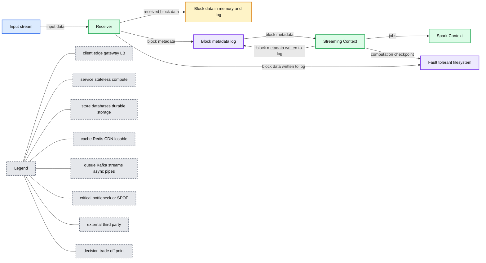
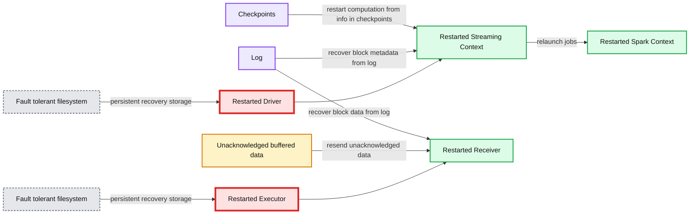

# Improved Fault-tolerance and Zero Data Loss in Apache Spark Streaming

- Source: https://www.databricks.com/blog/2015/01/15/improved-driver-fault-tolerance-and-zero-data-loss-in-spark-streaming.html
- Published: 2015-01-15
- Authors: Tathagata Das
- Categories: engineering, open-source, data-engineering, data-streaming
- Images: 2 total, 2 extracted as architecture

Real-time stream processing systems must be operational 24/7, which requires them to recover from all kinds of failures in the system. Since its beginning, [Apache Spark Streaming](https://www.databricks.com/blog/2015/07/30/diving-into-apache-spark-streamings-execution-model.html) has included support for recovering from failures of both driver and worker machines. However, for some data sources, input data could get lost while recovering from the failures. In Apache Spark 1.2, we have added preliminary support for write ahead logs (also known as journaling) to Spark Streaming to improve this recovery mechanism and give stronger guarantees of zero data loss for more data sources. In this blog, we are going to elaborate on how this feature works and how developers can enable it to get those guarantees in Spark Streaming applications.

## Background

Spark and its [RDD](https://www.databricks.com/blog/2016/07/14/a-tale-of-three-apache-spark-apis-rdds-dataframes-and-datasets.html) abstraction is designed to seamlessly handle failures of any worker nodes in the cluster. Since Spark Streaming is built on Spark, it enjoys the same fault-tolerance for worker nodes. However, the demand of high uptimes of a Spark Streaming application require that the application also has to recover from failures of the[driver process](https://spark.apache.org/docs/latest/cluster-overview.html), which is the main application process that coordinates all the workers. Making the Spark driver fault-tolerant is tricky because it is an arbitrary user program with arbitrary computation patterns. However, Spark Streaming applications have an inherent structure in the computation -- it runs the same Spark computation periodically on every micro-batch of data. This structure allows us to save (aka, checkpoint) the application state periodically to reliable storage and recover the state on driver restarts.

For sources like files, this driver recovery mechanism was sufficient to ensure zero data loss as all the data was reliably stored in a fault-tolerant file system like [HDFS](https://www.databricks.com/glossary/hadoop-distributed-file-system-hdfs) or S3. However, for other sources like Kafka and Flume, some of the received data that was buffered in memory but not yet processed could get lost. This is because of how Spark applications operate in a distributed manner. When the driver process fails, all the executors running in a standalone/yarn/mesos cluster are killed as well, along with any data in their memory. In case of Spark Streaming, all the data received from sources like Kafka and Flume are buffered in the memory of the executors until their processing has completed. This buffered data cannot be recovered even if the driver is restarted. To avoid this data loss, we have introduced write ahead logs in Spark Streaming in the Apache Spark 1.2 release.

## Write Ahead Logs

Write Ahead Logs (also known as a journal) are used in database and file systems to ensure the durability of any data operations. The intention of the operation is first written down into a durable log , and then the operation is applied to the data. If the system fails in the middle of applying the operation, it can recover by reading the log and reapplying the operations it had intended to do. Let us see how we use this concept to ensure the durability of the received data.

Sources like Kafka and Flume use Receivers to receive data. They run as long-running tasks in the executors, and are responsible for receiving the data from the source, and if supported by the source, acknowledge the received data. They store the received data in the memory of the executors and the driver then runs tasks on the executors to process the tasks.

When write ahead logs are enabled, all the received data is also saved to log files in a fault-tolerant file system. This allows the received data to durable across any failure in Spark Streaming. Additionally, if the receiver correctly acknowledges receiving data only after the data has been to write ahead logs, the buffered but unsaved data can be resent by the source after the driver is restarted. These two together can ensure that there is zero data loss - all data is either recovered from the logs or resent by the source.

## Configuration

Write ahead logs can be enabled if required by do the following.

- Setting the checkpoint directory using streamingContext.checkpoint(path-to-directory). This directory can be set to any Hadoop API compatible file system, and is used to save both streaming checkpoints as well as write ahead logs.
- [Setting the SparkConf property](https://spark.apache.org/docs/latest/configuration.html#spark-properties) spark.streaming.receiver.writeAheadLog.enable to true (default is false).

When the logs are enabled, all receivers enjoy the benefit of recovering data that were reliably received. It is recommended that the in-memory replication be disabled (by setting the appropriate[persistence level](https://spark.apache.org/docs/latest/rdd-programming-guide.html#rdd-persistence) in the input stream) as the fault-tolerant file system used for the write ahead log likely to be replicating the data as well.

Additionally, if you want to recover even the buffered data, you will have to use a source that support acking (like Kafka, Flume and Kinesis), and[implement a reliable receiver](https://spark.apache.org/docs/latest/streaming-custom-receivers.html) that correctly acks the source when data is reliably stored in the log. The built in Kafka and Flume Polling receivers already are reliable.

Finally, it is worth noting that there may be a slight reduction in the data ingestion throughput on enabling the write ahead logs. Since all the received data will be written to a fault-tolerant file system, the write throughput of the file system, and the network bandwidth used for the replication can become potential bottlenecks. In that case, either create[more receivers be used for increasing the parallelism of receiving the data](https://spark.apache.org/docs/latest/streaming-programming-guide.html#reducing-the-processing-time-of-each-batch) and/or use better hardware to increase the throughput of the fault-tolerant file system.

## Implementation Details

Let us dive a bit deeper to understand how the write ahead logs work. In the context, let us walk through the general Spark Streaming architecture.

When a Spark Streaming application starts (i.e., the driver starts), the associated StreamingContext (starting point of all streaming functionality) uses the SparkContext to launch Receivers as long running tasks. These Receivers receive and save the streaming data into Spark’s memory for processing. The lifecycle of this data received through users is as follows (refer to the diagram below).

- Receiving data (blue arrows) - A Receiver chunks up the stream of data into blocks, that are stored in the memory of the executor. Additionally, if enabled, the data is also written to a write ahead log in a fault tolerant file systems.
- Notifying driver (green arrows) - The metadata of the received blocks are sent to the StreamingContext in the driver. This metadata includes  - (i) reference ids of the blocks for locating their data in the executor memory, (ii) offset information of the block data in the logs (if enabled).
- Processing the data (red arrow) - Every batch interval, the StreamingContext uses the block information to generate RDDs and jobs on them. The SparkContext executes these jobs by running tasks to process the in-memory blocks in the executors.
- Checkpointing the computation (orange arrow) - To recover, the streaming computation (i.e. the DStreams set up with the StreamingContext) is periodically checkpointed to another set of files in the same fault-tolerant file system.

**Summary:** The diagram shows Spark Streaming fault tolerance through computation checkpointing, block metadata logging, and executor block data written to memory and durable logs.

**Components:**

- Application Driver
- Streaming Context
- Spark Context
- Executor
- Receiver
- Fault-tolerant filesystem
- Input stream
- Block data in memory and log
- Block metadata log

**Flows:**

- Input stream -> Receiver: input data
- Receiver -> Block data in memory and log: received block data
- Receiver -> Block metadata log: block metadata
- Block metadata log -> Streaming Context: block metadata
- Streaming Context -> Spark Context: jobs
- Streaming Context -> Fault-tolerant filesystem: computation checkpoint
- Streaming Context -> Block metadata log: block metadata written to log
- Receiver -> Fault-tolerant filesystem: block data written to log

**Numbers:** none

source image: https://www.databricks.com/wp-content/uploads/2020/09/blog-ha-52-min.png

When a failed driver is restart, the following occurs (see the next diagram).

- *Recover computation (orange arrow)* - The checkpointed information is used to restart the driver, reconstruct the contexts and restart all the receivers.
- *Recover block metadata (green arrow)* - The metadata of all the blocks that will be necessary to continue the processing will be recovered.
- *Re-generate incomplete jobs (red arrow)* - For the batches with processing that has not completed due to the failure, the RDDs and corresponding jobs are regenerated using the recovered block metadata.
- *Read the block saved in the logs (blue arrow)* - When those jobs are executed, the block data is read directly from the write ahead logs. This recovers all the necessary data that were reliably saved to the logs.
- *Resend unacknowledged data (purple arrow)* - The buffered data that was not saved to the log at the time of failure will be sent again by the source. as it had not been acknowledged by the receiver.

**Summary:** The diagram shows how Spark Streaming recovers computation and receiver data after a driver restart using checkpoints, logs, and a fault-tolerant filesystem.

**Components:**

- Restarted Driver using Spark Streaming and Spark Context
- Restarted Streaming Context
- Restarted Spark Context
- Restarted Executor using a Restarted Receiver
- Log for block metadata and data
- Fault-tolerant filesystem
- Checkpoints
- Unacknowledged buffered data

**Flows:**

- Checkpoints -> Restarted Streaming Context: restart computation from checkpoint information
- Restarted Streaming Context -> Restarted Spark Context: relaunch jobs
- Log -> Restarted Streaming Context: recover block metadata
- Log -> Restarted Receiver: recover block data
- Unacknowledged buffered data -> Restarted Receiver: resend unacknowledged data
- Fault-tolerant filesystem -> Restarted Driver: persistent recovery storage
- Fault-tolerant filesystem -> Restarted Executor: persistent recovery storage

**Numbers:** none

source image: https://www.databricks.com/wp-content/uploads/2015/01/blog-ha-4.jpg

So with the write ahead logs as well as the reliable receivers, Spark Streaming can guarantee that no input data will be lost due to driver failures (or for that matter, any failures).

## Future Directions

Some of the possible future directions regarding write ahead logs are as follows.

- Systems like Kafka can replicate data for reliability. Enabling write ahead logs effectively replicates the same data twice - once by Kafka and another time by Spark Streaming. Future versions of Spark will include native support for fault tolerance with Kafka that avoids a second log.
- Performance improvements (especially throughput) in writing to the write ahead logs.

## Credits

Major credits for implementing this feature goes to the following.

- Tathagata Das (Databricks) - Overall design and major parts of the implementation.
- Hari Shreedharan (Cloudera) - Writing and reading of write ahead logs.
- Saisai Shao (Intel) - Improvements to the built in Kafka support.

## Further References

- Refer to the [Spark Streaming Programming Guide](https://spark.apache.org/docs/latest/streaming-programming-guide.html) for more information about checkpoint and write ahead logs.
- Spark [Meetup talk](http://youtu.be/jcJq3ZalXD8?t=27m13s) on this topic
- Associated JIRA - [SPARK-3129](https://issues.apache.org/jira/browse/SPARK-3129)
