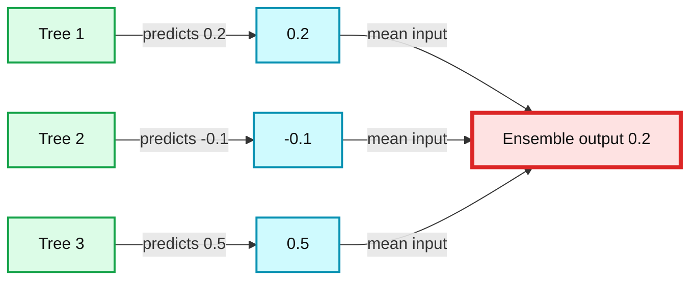
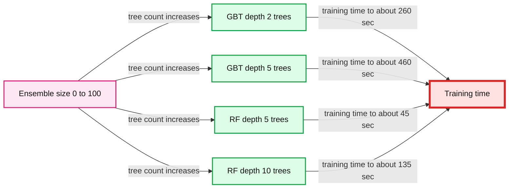
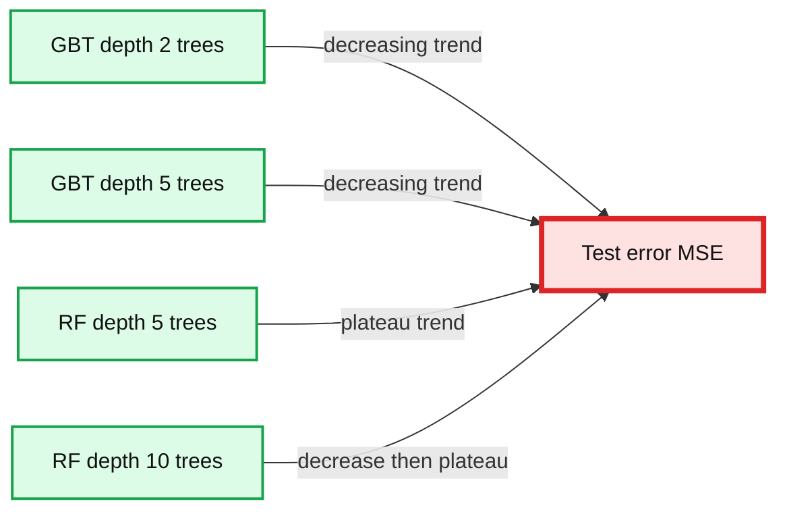
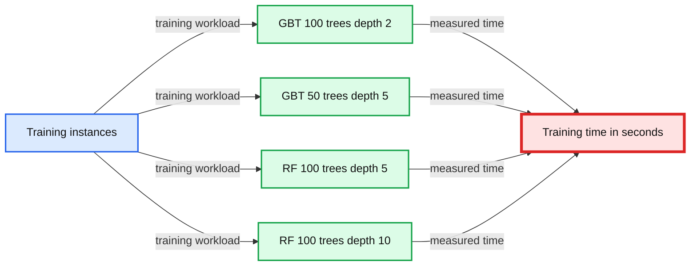
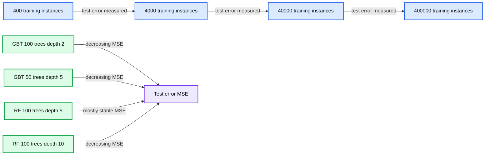
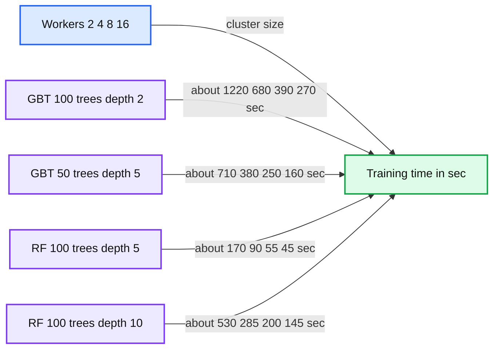

# Random Forests and Boosting in MLlib

- Source: https://www.databricks.com/blog/2015/01/21/random-forests-and-boosting-in-mllib.html
- Published: 2015-01-21
- Authors: Joseph Bradley, Manish Amde
- Categories: engineering, data-science-machine-learning, open-source
- Images: 6 total, 6 extracted as architecture

This is a post written together with Manish Amde from Origami Logic.

---

Apache Spark 1.2 introduces [Random Forests](https://en.wikipedia.org/wiki/Random_forest) and [Gradient-Boosted Trees (GBTs)](https://en.wikipedia.org/wiki/Gradient_boosting#Gradient_tree_boosting) into MLlib. Suitable for both classification and regression, they are among the most successful and widely deployed machine learning methods. Random Forests and GBTs are *ensemble learning algorithms*, which combine multiple decision trees to produce even more powerful models. In this post, we describe these models and the distributed implementation in MLlib. We also present simple examples and provide pointers on how to get started.

## Ensemble Methods

Simply put, [ensemble learning algorithms](https://en.wikipedia.org/wiki/Ensemble_learning) build upon other machine learning methods by combining models. The combination can be more powerful and accurate than any of the individual models.

In MLlib 1.2, we use [Decision Trees](https://en.wikipedia.org/wiki/Decision_tree) as the base models. We provide two ensemble methods: [Random Forests](https://en.wikipedia.org/wiki/Random_forest) and [Gradient-Boosted Trees (GBTs)](https://en.wikipedia.org/wiki/Gradient_boosting#Gradient_tree_boosting). The main difference between these two algorithms is the order in which each component tree is trained.

Random Forests train each tree independently, using a random sample of the data. This randomness helps to make the model more robust than a single decision tree, and less likely to overfit on the training data.

GBTs train one tree at a time, where each new tree helps to correct errors made by previously trained trees. With each tree added, the model becomes even more expressive.

In the end, both methods produce a weighted collection of Decision Trees. The ensemble model makes predictions by combining results from the individual trees. The figure below shows a simple example of an ensemble with three trees.

**Summary:** An ensemble regression model combines predictions from three decision trees using their mean to produce a final prediction.

**Components:**

- Tree 1: Decision tree
- Tree 2: Decision tree
- Tree 3: Decision tree
- Ensemble output: Regression prediction using mean aggregation

**Flows:**

- Tree 1 -> Prediction 1: prediction 0.2
- Tree 2 -> Prediction 2: prediction -0.1
- Tree 3 -> Prediction 3: prediction 0.5
- Prediction 1 -> Ensemble output: contributes to mean
- Prediction 2 -> Ensemble output: contributes to mean
- Prediction 3 -> Ensemble output: contributes to mean

**Numbers:** 1, 2, 3, 0.2, -0.1, 0.5, 0.2

source image: https://www.databricks.com/wp-content/uploads/2015/01/Ensemble-example.png

In the example regression ensemble above, each tree predicts a real value. These three predictions are then combined to produce the ensemble's final prediction. Here, we combine predictions using the mean (but the algorithms use different techniques depending on the prediction task).

## Distributed Learning of Ensembles

In MLlib, both Random Forests and GBTs partition data by instances (rows). The implementation builds upon the original Decision Tree code, which distributes learning of single trees (described in [an earlier blog post](https://www.databricks.com/blog/2014/09/29/scalable-decision-trees-in-mllib.html)). Many of our optimizations are based upon [Google's PLANET project](http://static.googleusercontent.com/media/research.google.com/en/us/pubs/archive/36296.pdf), one of the major published works on learning ensembles of trees in the distributed setting.

*Random Forests*: Since each tree in a Random Forest is trained independently, multiple trees can be trained in parallel (in addition to the parallelization for single trees). MLlib does exactly that: A variable number of sub-trees are trained in parallel, where the number is optimized on each iteration based on memory constraints.

*GBTs*: Since GBTs must train one tree at a time, training is only parallelized at the single tree level.

We would like to highlight two key optimizations used in MLlib:

- Memory: Random Forests use a different subsample of the data to train each tree. Instead of replicating data explicitly, we save memory by using a TreePoint structure which stores the number of replicas of each instance in each subsample.
- Communication: Whereas Decision Trees are usually trained by selecting from all features at each decision node in the tree, Random Forests often limit the selection to a random subset of features at each node. MLlib’s implementation takes advantage of this subsampling to reduce communication: e.g., if only 1/3 of the features are used at each node, then we can reduce communication by a factor of 1/3.

For more details, see the [Ensembles Section in the MLlib Programming Guide](https://spark.apache.org/docs/latest/mllib-ensembles.html).

## Using MLlib Ensembles

We demonstrate how to learn ensemble models using MLlib. The following Scala examples show how to read in a dataset, split the data into training and test sets, learn a model, and print the model and its test accuracy. Refer to the [MLlib Programming Guide](https://spark.apache.org/docs/latest/mllib-ensembles.html) for examples in Java and Python. Note that GBTs do not yet have a Python API, but we expect it to be in the Spark 1.3 release (via [Github PR 3951](https://github.com/apache/spark/pull/3951)).

#### Random Forest Example

import org.apache.spark.mllib.tree.RandomForest
 import org.apache.spark.mllib.tree.configuration.Strategy
 import org.apache.spark.mllib.util.MLUtils

// Load and parse the data file.
 val data =
 MLUtils.loadLibSVMFile(sc, "data/mllib/sample_libsvm_data.txt")
 // Split data into training/test sets
 val splits = data.randomSplit(Array(0.7, 0.3))
 val (trainingData, testData) = (splits(0), splits(1))

// Train a RandomForest model.
 val treeStrategy = Strategy.defaultStrategy("Classification")
 val numTrees = 3 // Use more in practice.
 val featureSubsetStrategy = "auto" // Let the algorithm choose.
 val model = RandomForest.trainClassifier(trainingData,
 treeStrategy, numTrees, featureSubsetStrategy, seed = 12345)

// Evaluate model on test instances and compute test error
 val testErr = testData.map { point =>
 val prediction = model.predict(point.features)
 if (point.label == prediction) 1.0 else 0.0
 }.mean()
 println("Test Error = " + testErr)
 println("Learned Random Forest:n" + model.toDebugString)

#### Gradient-Boosted Trees Example

import org.apache.spark.mllib.tree.GradientBoostedTrees
 import org.apache.spark.mllib.tree.configuration.BoostingStrategy
 import org.apache.spark.mllib.util.MLUtils

// Load and parse the data file.
 val data =
 MLUtils.loadLibSVMFile(sc, "data/mllib/sample_libsvm_data.txt")
 // Split data into training/test sets
 val splits = data.randomSplit(Array(0.7, 0.3))
 val (trainingData, testData) = (splits(0), splits(1))

// Train a GradientBoostedTrees model.
 val boostingStrategy =
 BoostingStrategy.defaultParams("Classification")
 boostingStrategy.numIterations = 3 // Note: Use more in practice
 val model =
 GradientBoostedTrees.train(trainingData, boostingStrategy)

// Evaluate model on test instances and compute test error
 val testErr = testData.map { point =>
 val prediction = model.predict(point.features)
 if (point.label == prediction) 1.0 else 0.0
 }.mean()
 println("Test Error = " + testErr)
 println("Learned GBT model:n" + model.toDebugString)

## Scalability

We demonstrate the scalability of MLlib ensembles with empirical results on a binary classification problem. Each figure below compares Gradient-Boosted Trees ("GBT") with Random Forests ("RF"), where the trees are built out to different maximum depths.

These tests were on a regression task of predicting song release dates from audio features (the [YearPredictionMSD dataset](https://archive.ics.uci.edu/ml/datasets/YearPredictionMSD) from the UCI ML repository). We used EC2 r3.2xlarge machines. Algorithm parameters were left as defaults except where noted.

#### Scaling model size: Training time and test error

The two figures below show the effect of increasing the number of trees in the ensemble. For both, increasing trees require more time to learn (first figure) but also provide better results in terms of test Mean Squared Error (MSE) (second figure).

Comparing the two methods, Random Forests are faster to train, but they often require deeper trees than GBTs to achieve the same error. GBTs can further reduce the error with each iteration, but they can begin to overfit (increase test error) after too many iterations. Random Forests do not overfit as easily, but their test error plateaus.

**Summary:** Benchmark chart showing training time scaling with ensemble size for gradient boosted trees and random forests.

**Components:**

- GBT depth-2 trees
- GBT depth-5 trees
- RF depth-5 trees
- RF depth-10 trees
- Ensemble size axis
- Training time axis

**Flows:**

- Ensemble size -> GBT depth-2 trees: increasing tree count raises training time
- Ensemble size -> GBT depth-5 trees: increasing tree count raises training time most sharply
- Ensemble size -> RF depth-5 trees: increasing tree count raises training time modestly
- Ensemble size -> RF depth-10 trees: increasing tree count raises training time

**Numbers:** 0, 2, 5, 10, 20, 40, 50, 60, 80, 100, 100, 200, 300, 400, 500

source image: https://www.databricks.com/wp-content/uploads/2015/01/Ensembles-trees-x-time.png

Below, for a basis for understanding the MSE, note that the left-most points show the error when using a single decision tree (of depths 2, 5, or 10, respectively).

**Summary:** The chart compares test MSE as ensemble size increases for four gradient-boosted tree and random forest models.

**Components:**

- GBT depth 2 trees using gradient-boosted trees
- GBT depth 5 trees using gradient-boosted trees
- RF depth 5 trees using random forests
- RF depth 10 trees using random forests
- Test error MSE metric

**Flows:**

- GBT depth 2 trees -> Test error MSE: decreasing error with more trees
- GBT depth 5 trees -> Test error MSE: decreasing error with more trees
- RF depth 5 trees -> Test error MSE: nearly constant error
- RF depth 10 trees -> Test error MSE: decreasing then plateauing error

**Numbers:** 2, 5, 5, 10, 0, 20, 40, 60, 80, 100, 80, 85, 90, 95, 100, 105, 110, 115

source image: https://www.databricks.com/wp-content/uploads/2015/01/Ensembles-trees-x-mse.png

*Details: 463,715 training instances. 16 workers.*

#### Scaling training dataset size: Training time and test error

The next two figures show the effect of using larger training datasets. With more data, both methods take longer to train but achieve better test results.

**Summary:** Benchmark chart showing training time scaling with training set size for gradient boosted trees and random forests.

**Components:**

- GBT: 100 trees, depth 2
- GBT: 50 trees, depth 5
- RF: 100 trees, depth 5
- RF: 100 trees, depth 10
- Training time axis in seconds
- Training instances axis

**Flows:**

- Training instances -> GBT 100 trees depth 2: training workload
- Training instances -> GBT 50 trees depth 5: training workload
- Training instances -> RF 100 trees depth 5: training workload
- Training instances -> RF 100 trees depth 10: training workload

**Numbers:** 0, 50, 100, 150, 200, 250, 300, 200000, 400000, 100, 2, 50, 5, 100, 5, 100, 10

source image: https://www.databricks.com/wp-content/uploads/2015/01/Ensembles-ntrain-x-time.png

**Summary:** Benchmark chart showing test error decreasing as training instances increase for gradient boosted trees and random forests.

**Components:**

- GBT with 100 trees and depth 2
- GBT with 50 trees and depth 5
- RF with 100 trees and depth 5
- RF with 100 trees and depth 10
- Training instances axis
- Test error MSE axis

**Flows:**

- 400 training instances -> 4000 training instances: measured test error
- 4000 training instances -> 40000 training instances: measured test error
- 40000 training instances -> 400000 training instances: measured test error

**Numbers:** 170, 150, 130, 110, 90, 70; 400, 4000, 40000, 400000; GBT 100 trees, depth 2; GBT 50 trees, depth 5; RF 100 trees, depth 5; RF 100 trees, depth 10

source image: https://www.databricks.com/wp-content/uploads/2015/01/Ensembles-ntrain-x-mse.png

*Details: 16 workers.*

#### Strong scaling: Faster training with more workers

This final figure shows the effect of using a larger compute cluster to solve the same problem. Both methods are significantly faster when using more workers. For example, GBTs with depth-2 trees train about 4.7 times faster on 16 workers than on 2 workers, and larger datasets produce even better speedups.

**Summary:** Benchmark chart showing training time decreasing as cluster size increases for four MLlib ensemble configurations.

**Components:**

- GBT: 100 trees, depth 2, gradient-boosted trees
- GBT: 50 trees, depth 5, gradient-boosted trees
- RF: 100 trees, depth 5, random forest
- RF: 100 trees, depth 10, random forest
- Workers, the cluster-size variable
- Training time, the measured duration

**Flows:**

- Workers -> Training time: increasing workers reduces measured training time

**Numbers:** 0, 2, 4, 6, 8, 10, 12, 14, 16, 100, 50, 5, 10, 200, 400, 600, 800, 1000, 1200, 1400, sec

source image: https://www.databricks.com/wp-content/uploads/2015/01/Ensembles-workers-x-time.png

*Details: 463,715 training instances.*

## What’s Next?

GBTs will soon include a Python API. The other top item for future development is pluggability: ensemble methods can be applied to almost any classification or regression algorithm, not only Decision Trees. The Pipelines API introduced by Spark 1.2’s [experimental spark.ml package](https://spark.apache.org/docs/latest/ml-guide.html) will allow us to generalize ensemble methods to be truly pluggable.

To get started using decision trees yourself, [download Spark 1.2 today](https://spark.apache.org/)!

## Further Reading

- See examples and the API in [the MLlib ensembles documentation](https://spark.apache.org/docs/latest/mllib-ensembles.html).
- Learn more background info about the decision trees used to build ensembles in [this previous blog post](https://www.databricks.com/blog/2014/09/29/scalable-decision-trees-in-mllib.html).

## Acknowledgements

MLlib ensemble algorithms have been developed collaboratively by the authors of this blog post, Qiping Li (Alibaba), Sung Chung (Alpine Data Labs), and Davies Liu (Databricks). We also thank Lee Yang, Andrew Feng, and Hirakendu Das (Yahoo) for help with design and testing. We will welcome your contributions too!
