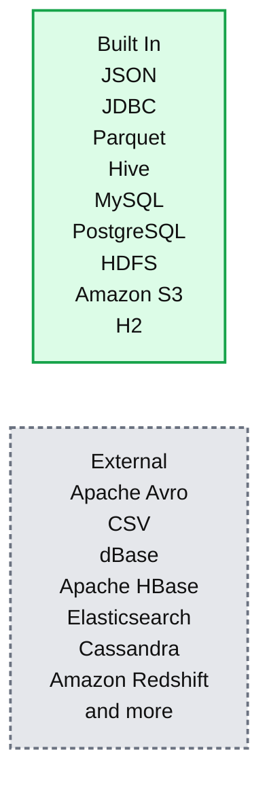
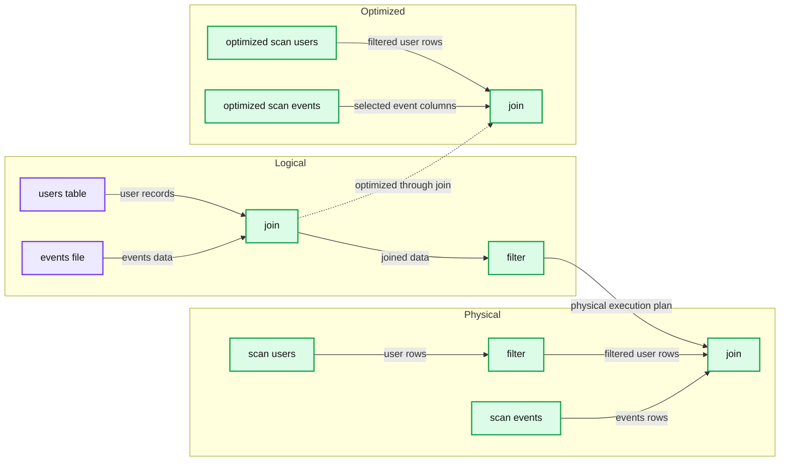

# What's new for Spark SQL in Apache Spark 1.3

- Source: https://www.databricks.com/blog/2015/03/24/spark-sql-graduates-from-alpha-in-spark-1-3.html
- Published: 2015-03-24
- Authors: Michael Armbrust
- Categories: engineering, open-source
- Images: 3 total, 3 extracted as architecture

[Read Rise of the Data Lakehouse](https://www.databricks.com/resources/ebook/rise-data-lakehouse?itm_data=sparksqlgraduatesfromalpha-blog-riselakehousebook) to explore why lakehouses are the data architecture of the future with the father of the data warehouse, Bill Inmon.

---

The Apache Spark 1.3 release represents a major milestone for Spark SQL.  In addition to several major features, we are very excited to announce that the project has officially graduated from Alpha, after being introduced only a little under a year ago.  In this blog post we will discuss exactly what this step means for compatibility moving forward, as well as highlight some of the major features of the release.

## Graduation from Alpha

While we know many organizations (including all of Databricks' customers) have already begun using Spark SQL in production, the graduation from Alpha comes with a promise of stability for those building applications using this component.  Like the rest of the Spark stack, we now promise binary compatibility for all public interfaces through the Apache Spark 1.X release series.

Since the SQL language itself and our interaction with [Apache Hive](https://www.databricks.com/glossary/apache-hive) represent a very large interface, we also wanted to take this chance to articulate our vision for how the project will continue to evolve. A large number of Spark SQL users have data in Hive metastores and legacy workloads which rely on Hive QL. As a result, Hive compatibility will remain a major focus for Spark SQL moving forward

More specifically, the HiveQL interface provided by the HiveContext remains the most complete dialect of SQL that we support and we are committed to continuing to maintain compatibility with this interface.  In places where our semantics differ in minor ways from Hive's (i.e. [SPARK-5680](https://issues.apache.org/jira/browse/SPARK-5680)), we continue to aim to provide a superset of Hive's functionality.  Additionally, while we are excited about all of the new data sources that are available through the improved native Data Sources API (see more below), we will continue to support reading tables from the Hive Metastore using Hive's SerDes.

The new DataFrames API (also discussed below) is currently marked experimental.  Since this is the first release of this new interface, we wanted an opportunity to get feedback from users on the API before it is set in stone.  That said, we do not anticipate making any major breaking changes to DataFrames, and hope to remove the experimental tag from this part of Spark SQL in Apache Spark 1.4.  You can track progress and report any issues at [SPARK-6116](https://issues.apache.org/jira/browse/SPARK-6116).

## Improved Data Sources API

The Data Sources API was another major focus for this release, and provides a single interface for loading and storing data using Spark SQL.  In addition to the sources that come prepackaged with the Apache Spark distribution, this API provides an integration point for external developers to add support for custom data sources.  At Databricks, we have already contributed libraries for reading data stored in [Apache Avro](https://spark-packages.org/package/databricks/spark-avro) or [CSV](https://spark-packages.org/package/databricks/spark-csv) and we look forward to contributions from others in the community (check out [spark packages](http://spark-packages.org/) for a full list of sources that are currently available).

**Summary:** Spark SQL supports built-in and external data sources through a unified interface.

**Components:**

- Built-In: JSON, JDBC, Parquet, Hive, MySQL, PostgreSQL, HDFS, Amazon S3, H2
- External: Apache Avro, CSV, dBase, Apache HBase, Elasticsearch, Cassandra, Amazon Redshift, and more

**Flows:**

- None visible.

**Numbers:** none

source image: https://www.databricks.com/wp-content/uploads/2015/03/Screen-Shot-2015-03-23-at-3.42.56-PM.png

## Unified Load/Save Interface

In this release we added a unified interface to SQLContext and DataFrame for loading and storing data using both the built-in and external data sources.  These functions provide a simple way to load and store data, independent of whether you are writing in Python, Scala, Java, R or SQL.  The examples below show how easy it is to both load data from Avro and convert it into parquet in different languages.

### Scala

### Python

### Java

### SQL

## Automatic Partition Discovery and Schema Migration for Parquet

Parquet has long been one of the fastest data sources supported by Spark SQL.  With its columnar format, queries against parquet tables can execute quickly by avoiding the cost of reading unneeded data.

In the Apache Spark 1.3 release we added two major features to this source.  First, organizations that store lots of data in parquet often find themselves evolving the schema over time by adding or removing columns.  With this release we add a new feature that will scan the metadata for all files, merging the schemas to come up with a unified representation of the data.  This functionality allows developers to read data where the schema has changed overtime, without the need to perform expensive manual conversions.

Additionally, the parquet datasource now supports auto-discovering data that has been partitioned into folders, and then prunes which folders are scanned based on predicates in queries made against this data.  This optimization means that you can greatly speed up may queries simply by breaking up your data into folders.  For example:

In Apache Spark 1.4, we plan to provide an interface that will allow other formats, such as ORC, JSON and CSV, to take advantage of this partitioning functionality.

## Persistent Data Source Tables

Another feature that has been added in Apache Spark 1.3 is the ability to persist metadata about Spark SQL Data Source tables to the Hive metastore.  These tables allow multiple users to share the metadata about where data is located in a convenient manner.  Data Source tables can live alongside native Hive tables, which can also be read by Spark SQL.

## Reading from JDBC Sources

Finally, a Data Source for reading from JDBC has been added as built-in source for Spark SQL.  Using this library, Spark SQL can extract data from any existing relational databases that supports JDBC.  Examples include mysql, postgres, H2, and more.  Reading data from one of these systems is as simple as creating a virtual table that points to the external table.  Data from this table can then be easily read in and joined with any of the other sources that Spark SQL supports.

This functionality is a great improvement over Spark's earlier support for JDBC (i.e., JdbcRDD).  Unlike the pure RDD implementation, this new DataSource supports automatically pushing down predicates, converts the data into a DataFrame that can be easily joined, and is accessible from Python, Java, and SQL in addition to Scala.

## Introducing DataFrames

While we have already talked about the DataFrames in [other blog posts](https://www.databricks.com/blog/2015/02/17/introducing-dataframes-in-spark-for-large-scale-data-science.html) and [talks at the Spark Summit East](https://www.slideshare.net/databricks/spark-sqlsse2015public), any post about Apache Spark 1.3 would be remiss if it didn't mention this important new API. DataFrames evolve Spark’s RDD model, making it faster and easier for Spark developers to work with structured data by providing simplified methods for filtering, aggregating, and projecting over large datasets. Our DataFrame implementation was inspired by Pandas' and R's data frames, and are fully interoperable with these implementations.  Additionally, Spark SQL DataFrames are available in Spark’s Java, Scala, and Python API’s as well as the upcoming (unreleased) R API.

**Summary:** Spark SQL transforms SQL ASTs and DataFrames through analysis, optimization, physical planning, cost-based selection, and code generation into RDDs.

**Components:**

- SQL AST - Spark SQL query representation
- DataFrame - Spark SQL structured data abstraction
- Unresolved Logical Plan - unanalyzed query plan
- Catalog - metadata source for analysis
- Logical Plan - analyzed query plan
- Optimized Logical Plan - Catalyst-optimized query plan
- Physical Plans - candidate execution plans
- Cost Model - plan cost evaluator
- Selected Physical Plan - chosen execution plan
- RDDs - Spark execution representation

**Flows:**

- SQL AST -> Unresolved Logical Plan: query structure
- DataFrame -> Unresolved Logical Plan: structured operations
- Catalog -> Logical Plan: metadata for resolution
- Unresolved Logical Plan -> Logical Plan: logical analysis
- Logical Plan -> Optimized Logical Plan: logical optimization
- Optimized Logical Plan -> Physical Plans: physical planning
- Physical Plans -> Cost Model: candidate plans
- Cost Model -> Selected Physical Plan: cost-based selection
- Selected Physical Plan -> RDDs: generated execution code

**Numbers:** none

source image: https://www.databricks.com/wp-content/uploads/2015/03/Screen-Shot-2015-03-23-at-3.59.28-PM.png

```mermaid
%% Spark SQL query planning flow from input representations to RDDs
flowchart LR
    A[SQL AST] -->|query structure| C[Unresolved Logical Plan]
    B[DataFrame] -->|structured operations| C
    D[Catalog] -->|metadata for resolution| E[Logical Plan]
    C -->|logical analysis| E
    E -->|logical optimization| F[Optimized Logical Plan]
    F -->|physical planning| G[Physical Plans]
    G -->|candidate plans| H[Cost Model]
    H -->|cost based selection| I[Selected Physical Plan]
    I -->|generated execution code| J[RDDs]

    classDef client   fill:#dbeafe,stroke:#2563eb,stroke-width:2px,color:#111
    classDef service  fill:#dcfce7,stroke:#16a34a,stroke-width:2px,color:#111
    classDef store    fill:#ede9fe,stroke:#7c3aed,stroke-width:2px,color:#111
    classDef cache    fill:#fef3c7,stroke:#d97706,stroke-width:2px,color:#111
    classDef queue    fill:#cffafe,stroke:#0891b2,stroke-width:2px,color:#111
    classDef critical fill:#fee2e2,stroke:#dc2626,stroke-width:4px,color:#111
    classDef external fill:#e5e7eb,stroke:#6b7280,stroke-width:2px,color:#111,stroke-dasharray:4 3
    classDef decision fill:#fce7f3,stroke:#db2777,stroke-width:2px,color:#111

    class A,B client
    class C,E,F,G,I service
    class D,J store
    class H decision
```

Internally, DataFrames take advantage of the Catalyst query optimizer to intelligently plan the execution of your big data analyses. This planning permeates all the way into physical storage, where optimizations such as predicate pushdown are applied based on analysis of user programs.  Since this planning is happening at the logical level, optimizations can even occur across function calls, as shown in the example below.

**Summary:** The diagram shows Spark SQL transforming a logical join and filter plan into physical execution plans, then optimizing scans through predicate pushdown and column pruning.

**Components:**

- `add_demographics` function using Spark SQL DataFrames
- Users table using a partitioned Hive table
- Events file loaded from `/data/events` in Parquet format
- Logical plan filter
- Logical plan join
- Physical plan events scan
- Physical plan users scan
- Physical plan filter
- Optimized events scan
- Optimized users scan

**Flows:**

- Events file -> Logical plan join: events data
- Users table -> Logical plan join: user records
- Logical plan join -> Logical plan filter: joined data
- Logical plan filter -> Physical plan: filter operation
- Physical plan events scan -> Physical plan join: events rows
- Physical plan users scan -> Physical plan filter: user rows
- Physical plan filter -> Physical plan join: filtered user rows
- Optimized events scan -> Optimized physical plan join: pushed-down event predicates and selected columns
- Optimized users scan -> Optimized physical plan join: pushed-down user location filter and selected columns

**Numbers:** none

source image: https://www.databricks.com/wp-content/uploads/2015/03/Screen-Shot-2015-03-23-at-4.00.33-PM.png

In this example, Spark SQL is able to push the filtering of users by their location through the join, greatly reducing its cost to execute.  This optimization is possible even though the original author of the `add_demographics` function did not provide a parameter for specifying how to filter users!

This is only example of how Spark SQL DataFrames can make developers more efficient by providing a simple interface coupled with powerful optimization.

 

To learn more about Spark SQL, Dataframes, or Apache Spark 1.3, checkout the [SQL programming guide](https://spark.apache.org/docs/latest/sql-programming-guide.html#dataframes) on the Apache Spark website. Stay tuned to this blog for updates on other components of the [Apache Spark 1.3](https://www.databricks.com/blog/2015/03/13/announcing-spark-1-3.html) release!
