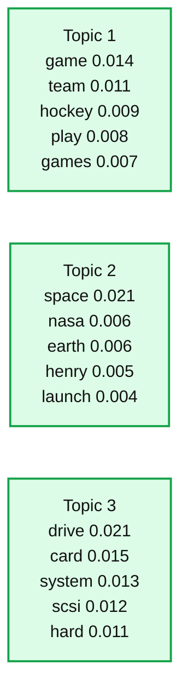
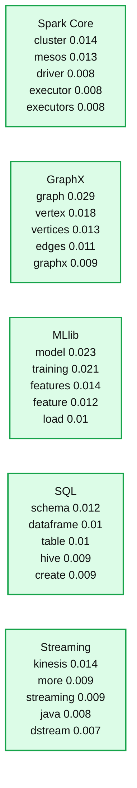
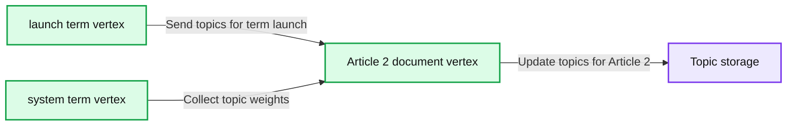

# Topic modeling with LDA: MLlib meets GraphX

- Source: https://www.databricks.com/blog/2015/03/25/topic-modeling-with-lda-mllib-meets-graphx.html
- Published: 2015-03-25
- Authors: Joseph Bradley
- Categories: engineering, data-science-machine-learning, open-source
- Images: 4 total, 4 extracted as architecture

*Topic models* automatically infer the topics discussed in a collection of documents. These topics can be used to summarize and organize documents, or used for featurization and dimensionality reduction in later stages of a Machine Learning (ML) pipeline.

With Apache Spark 1.3, MLlib now supports *Latent Dirichlet Allocation (LDA)*, one of the most successful topic models. LDA is also the first MLlib algorithm built upon GraphX. In this blog post, we provide an overview of LDA and its use cases, and we explain how GraphX was a natural choice for implementation.

## Topic Models

At a high level, topic modeling aims to find structure within an unstructured collection of documents. After learning this “structure,” a topic model can answer questions such as: What is document X discussing? How similar are documents X and Y? If I am interested in topic Z, which documents should I read first?

## LDA

Topic modeling is a very broad field. Apache Spark 1.3 adds Latent Dirichlet Allocation (LDA), arguably the most successful topic model to date. Initially developed for both text analysis and population genetics, LDA has since been extended and used in many applications from time series to image analysis. First, let’s describe LDA in terms of text analysis.

What are topics? LDA is not given topics, so it must infer them from raw text. LDA defines a topic as a distribution over words. For example, when we run MLlib’s LDA on a [dataset of articles from 20 newsgroups](http://kdd.ics.uci.edu/databases/20newsgroups/20newsgroups.html), the first few topics are:

**Summary:** Table showing the five highest-weighted terms for three inferred topics: sports, space exploration, and computers.

**Components:**

- Topic 1: terms game, team, hockey, play, games with weights
- Topic 2: terms space, nasa, earth, henry, launch with weights
- Topic 3: terms drive, card, system, scsi, hard with weights

**Flows:**

- none

**Numbers:**

- Topic 1 weights: 0.014, 0.011, 0.009, 0.008, 0.007
- Topic 2 weights: 0.021, 0.006, 0.006, 0.005, 0.004
- Topic 3 weights: 0.021, 0.015, 0.013, 0.012, 0.011



<sub>source image: https://www.databricks.com/wp-content/uploads/2015/03/20newsgroups.png</sub>

 

Looking at these highest-weighted words in 3 topics, we can quickly understand what each topic is about: sports, space exploration, and computers.  LDA’s success largely stems from its ability to produce interpretable topics.

## Use Cases

In addition to inferring these topics, LDA infers a distribution over topics for each document.  E.g., document X might be 60% about “space exploration,” 30% about “computers” and 10% about other topics.

These topic distributions can be used in many ways:

- **Clustering**: Topics are cluster centers and documents are associated with multiple clusters (topics).  This clustering can help organize or summarize document collections.
- **Feature generation**: LDA can generate features for other ML algorithms to use.  As mentioned above, LDA infers a distribution over topics for each document; with K topics, this gives K numerical features.  These features can then be plugged into algorithms such as Logistic Regression or Decision Trees for prediction tasks.
- **Dimensionality reduction:** Each document’s distribution over topics gives a concise summary of the document.  Comparing documents in this reduced feature space can be more meaningful than comparing in the original feature space of words.

## Using LDA in MLlib

We give a short example of using LDA.  We describe the process here and provide the actual code in [this Github gist](https://gist.github.com/jkbradley/ab8ae22a8282b2c8ce33).  Our example first loads and pre-processes documents.  The most important part of preprocessing is choosing a vocabulary.  In our example, we split text into terms (words) and then remove (a) non-alphabetic terms, (b) short terms with

**Summary:** A topic-weight table showing the highest-weight terms associated with Spark Core, GraphX, MLlib, SQL, and Streaming.

**Components:**

- Spark Core: cluster, mesos, driver, executor, executors
- GraphX: graph, vertex, vertices, edges, graphx
- MLlib: model, training, features, feature, load
- SQL: schema, dataframe, table, hive, create
- Streaming: kinesis, more, streaming, java, dstream

**Flows:**

- none

**Numbers:** 0.014, 0.013, 0.008, 0.008, 0.008, 0.029, 0.018, 0.013, 0.011, 0.009, 0.023, 0.021, 0.014, 0.012, 0.01, 0.012, 0.01, 0.01, 0.009, 0.009, 0.014, 0.009, 0.009, 0.008, 0.007



<sub>source image: https://www.databricks.com/wp-content/uploads/2015/03/Spark-docs.png</sub>

LDA has Scala and Java APIs in Spark 1.3.  The Python API will be added soon.

## Implementation: GraphX

There are many algorithms for learning an LDA model.  We chose Expectation-Maximization (EM) for its simplicity and fast convergence.  Because EM for LDA has an implicit graphical structure, building LDA on top of GraphX was a natural choice.

LDA has 2 main types of data: terms (words) and documents.  We store this data on a bipartite graph (illustrated below) which has term vertices (left) and document vertices (right).  Each term vertex stores weights indicating which topics that term is relevant to; likewise, each document vertex stores its current estimate of the topics discussed in the document.

**Summary:** Bipartite GraphX graph connecting term vertices to article vertices when terms appear in articles, with topic data stored on vertices.

**Components:**

- Hockey term vertex - GraphX graph vertex
- Launch term vertex - GraphX graph vertex
- System term vertex - GraphX graph vertex
- Article 1 document vertex - GraphX graph vertex
- Article 2 document vertex - GraphX graph vertex
- Topic weights for launch - topic data store
- Topic distribution for Article 2 - topic data store

**Flows:**

- Hockey -> Article 1: term appears in document
- System -> Article 1: term appears in document
- Launch -> Article 2: term appears in document
- System -> Article 2: term appears in document

**Numbers:** 1, 2

```text
%% mermaid failed to render; kept as text
%% Bipartite term and article graph with topic data stores
flowchart LR
    hockey[Hockey term]
    launch[Launch term]
    system[System term]
    article1[Article 1]
    article2[Article 2]
    weights[Topic weights for launch]
    distribution[Topic distribution for Article 2]

    hockey -->|term appears in document| article1
    system -->|term appears in document| article1
    launch -->|term appears in document| article2
    system -->|term appears in document| article2

    classDef client fill:#dbeafe,stroke:#2563eb,stroke-width:2px,color:#111
    classDef service fill:#dcfce7,stroke:#16a34a,stroke-width:2px,color:#111
    classDef store fill:#ede9fe,stroke:#7c3aed,stroke-width:2px,color:#111
    classDef cache fill:#fef3c7,stroke:#d97706,stroke-width:2px,color:#111
    classDef queue fill:#cffafe,stroke:#0891b2,stroke-width:2px,color:#111
    classDef critical fill:#fee2e2,stroke:#dc2626,stroke-width:4px,color:#111
    classDef external fill:#e5e7eb,stroke:#6b7280,stroke-width:2px,color:#111,stroke-dasharray:4 3
    classDef decision fill:#fce7f3,stroke:#db2777,stroke-width:2px,color:#111

    hockey,launch,system client
    article1,article2 service
    weights,distribution store

    %% Legend
    %% client = clients edge gateway LB
    %% service = stateless compute
    %% store = databases durable storage
    %% cache = Redis CDN anything losable
    %% queue = Kafka streams async pipes
    %% critical = bottleneck or SPOF
    %% external = third party
    %% decision = trade off point
```

<sub>source image: https://www.databricks.com/wp-content/uploads/2015/03/graph.png</sub>

Whenever a term appears in a document, the graph has an edge between the corresponding term vertex and document vertex.  E.g., in the figure above, Article 1 contains the terms “hockey” and “system.”

These edges also illustrate the algorithm’s communication.  On each iteration, every vertex updates its data (topic weights) by collecting data from its neighbors.  Below, Article 2 updates its topic estimates by collecting data from connected term vertices.

**Summary:** Term vertices send topic information for “launch” and “system” to Article 2, which updates its topics in durable storage.

**Components:**

- “launch” term vertex - technology not shown
- “system” term vertex - technology not shown
- Article 2 document vertex - technology not shown
- Topic storage - database technology not shown

**Flows:**

- “launch” term vertex -> Article 2: topics for term “launch”
- “system” term vertex -> Article 2: topic weights
- Article 2 -> Topic storage: update topics for Article 2

**Numbers:** none



<sub>source image: https://www.databricks.com/wp-content/uploads/2015/03/update.png</sub>

GraphX was thus a natural choice for LDA.  As MLlib grows, we expect more graph-structured learning algorithms in the future!

## Scalability

Parallelization of LDA is not straightforward, and there have been many research papers proposing different strategies.  The key problem is that all methods involve a large amount of communication.  This is evident in the graph description above: terms and documents need to update their neighbors with new data on each iteration, and there are *many* neighbors.

We chose the Expectation-Maximization algorithm partly because it converges to a solution in a small number of iterations.  Fewer iterations means less communication.

Before adding LDA to Spark, we ran tests on a large Wikipedia dataset.  Here are the numbers:

- Training set size: 4.6 million documents
- Vocabulary size: 1.1 million terms
- Training set size: 1.1 billion tokens (~239 words/document)
- 100 topics
- 16-worker EC2 cluster
- Timing results: 176 sec/iteration on average over 10 iterations

## What’s Next?

Spark contributors are currently developing additional LDA algorithms: online Variational-Bayes (a fast approximate algorithm) and Gibbs sampling (a slower but sometimes more accurate algorithm).  We are also adding helper infrastructure such as Tokenizers for automatic data preparation and more prediction functionality.

To get started using LDA, [download Spark 1.3](https://spark.apache.org/downloads.html) today!

To see examples and learn the API details, check out the [MLlib documentation](https://spark.apache.org/docs/latest/mllib-clustering.html#latent-dirichlet-allocation-lda).

## Acknowledgements

The development of LDA has been a collaboration between many Spark contributors:

Joseph K. Bradley, Joseph Gonzalez, David Hall, Guoqiang Li, Xiangrui Meng, Pedro Rodriguez, Avanesov Valeriy, and Xusen Yin.

## Additional resources

Learn more about topic models and LDA with these overviews:

- Overview of topic models:  [D. Blei and J. Lafferty.   “Topic Models.”  In A. Srivastava and M. Sahami, editors, Text Mining: Classification, Clustering, and Applications. Chapman & Hall/CRC Data Mining and Knowledge Discovery Series, 2009.](http://www.cs.columbia.edu/~blei/papers/BleiLafferty2009.pdf)
- [Wikipedia on LDA](https://en.wikipedia.org/wiki/Latent_Dirichlet_allocation), with mathematical details

Get in-depth background from these research papers:

- Original LDA papers
  - [Blei, Ng, and Jordan.  "Latent Dirichlet Allocation."  JMLR, 2003.](http://www.cs.columbia.edu/~blei/papers/BleiNgJordan2003.pdf)
    - Application: text document analysis
  - [Pritchard et al. “Inference of population structure using multilocus genotype data.” Genetics 155: 945--959, 2000.](https://misuse.ncbi.nlm.nih.gov/error/abuse.shtml)
    - Application: population genetics analysis
- Paper which clearly explains several algorithms, including EM:  [Asuncion, Welling, Smyth, and Teh. "On Smoothing and Inference for Topic Models."  UAI, 2009.](https://arxiv.org/pdf/1205.2662.pdf)
