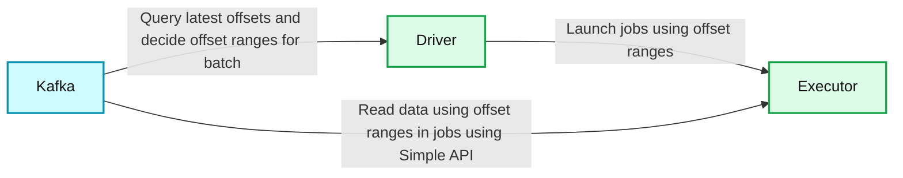

# Improvements to Kafka integration of Spark Streaming

- Source: https://www.databricks.com/blog/2015/03/30/improvements-to-kafka-integration-of-spark-streaming.html
- Published: 2015-03-30
- Authors: Cody Koeninger, Davies Liu, Tathagata Das
- Categories: engineering, open-source, data-engineering, data-streaming
- Images: 2 total, 2 extracted as architecture

[Apache Kafka](https://kafka.apache.org/) is rapidly becoming one of the most popular open source stream ingestion platforms. We see the same trend among the users of Spark Streaming as well. Hence, in Apache Spark 1.3, we have focused on making significant improvements to the Kafka integration of Spark Streaming. This has resulted the following additions:

1. New** Direct API** for Kafka - This allows each Kafka record to be processed exactly once despite failures, without using [Write Ahead Logs](https://www.databricks.com/blog/2015/01/15/improved-driver-fault-tolerance-and-zero-data-loss-in-spark-streaming.html). This makes Spark Streaming + Kafka pipelines more efficient while providing stronger fault-tolerance guarantees.
2. **Python API** for Kafka - So that you can start processing Kafka data purely from Python.

In this article, we are going to discuss these improvements in more detail.

## Direct API for Kafka

*[Primary Contributor - Cody]*

Spark Streaming has supported Kafka since its inception, and Spark Streaming has been used with Kafka in production at many places (see [this](https://www.slideshare.net/databricks/spark-streaming-state-of-the-union-strata-san-jose-2015) talk). However, the Spark community has demanded better fault-tolerance guarantees and stronger reliability semantics overtime.  To meet this demand, Spark 1.2 introduced [Write Ahead Logs (WAL)](https://www.databricks.com/blog/2015/01/15/improved-driver-fault-tolerance-and-zero-data-loss-in-spark-streaming.html). It ensures that no data received from any reliable data sources (i.e., transactional sources like Flume, Kafka, and Kinesis) will be lost due to failures (i.e., at-least-once semantics). Even for unreliable (i.e. non-transactional) sources like plain old sockets, it minimizes data loss.

However, for sources that allow replaying of data streams from arbitrary positions in the streams (e.g. Kafka), we can achieve even stronger fault-tolerance semantics because these sources let Spark Streaming have more control on the consumption of the data stream. Spark 1.3 introduces the concept of a **Direct API,** which can achieve exactly-once semantics even without using Write Ahead Logs. Let’s look at the details of Spark’s direct API for Apache Kafka.

## How did we build it?

At a high-level, the earlier Kafka integration worked with Write Ahead Logs (WALs) as follows:

1. The Kafka data is continuously received by Kafka Receivers running in the Spark workers/executors. This used the high-level consumer API of Kafka.
2. The received data is stored in Spark’s worker/executor memory as well as to the WAL (replicated on [HDFS](https://www.databricks.com/glossary/hadoop-distributed-file-system-hdfs)). The Kafka Receiver updated Kafka’s offsets to Zookeeper only after the data has been persisted to the log.
3. The information about the received data and its WAL locations is also stored reliably. On failure, this information is used to re-read the data and continue processing.

**Summary:** The diagram shows Spark Streaming receiving data from Kafka through an executor receiver, persisting it to a WAL, and updating offsets in Zookeeper.

**Components:**

- Spark Streaming: streaming application
- Driver: launches jobs on data
- Executor: runs streaming computation
- Receiver: continuously receives Kafka data
- Kafka: messaging system
- WAL: durable write-ahead log
- Zookeeper: stores Kafka offsets

**Flows:**

- Driver -> Executor: launch jobs on data
- Kafka -> Receiver: continuously received data through the high-level API
- Receiver -> WAL: save data to WAL
- Receiver -> Zookeeper: update offsets

**Numbers:** none

```text
%% mermaid failed to render; kept as text
%% Shows Spark Streaming Kafka receiver integration with WAL persistence and offset tracking
flowchart LR
    D[Driver]
    E[Executor]
    R[Receiver]
    K[Kafka]
    W[WAL]
    Z[Zookeeper]

    D -->|Launch jobs on data| E
    K -->|Continuously receive data using high-level API| R
    R -->|Save data to WAL| W
    R -->|Update offsets| Z

    classDef client   fill:#dbeafe,stroke:#2563eb,stroke-width:2px,color:#111
    classDef service  fill:#dcfce7,stroke:#16a34a,stroke-width:2px,color:#111
    classDef store    fill:#ede9fe,stroke:#7c3aed,stroke-width:2px,color:#111
    classDef cache    fill:#fef3c7,stroke:#d97706,stroke-width:2px,color:#111
    classDef queue    fill:#cffafe,stroke:#0891b2,stroke-width:2px,color:#111
    classDef critical fill:#fee2e2,stroke:#dc2626,stroke-width:4px,color:#111
    classDef external fill:#e5e7eb,stroke:#6b7280,stroke-width:2px,color:#111,stroke-dasharray:4 3
    classDef decision fill:#fce7f3,stroke:#db2777,stroke-width:2px,color:#111
    D,E client
    R service
    K queue
    W,Z store
```

<sub>source image: https://www.databricks.com/wp-content/uploads/2015/03/Screen-Shot-2015-03-29-at-10.11.42-PM.png</sub>

 

While this approach ensures that no data from Kafka is lost, there is still a small chance that some records may get processed more than once due to failures (that is, at-least-once semantics). This can occur when some received data is saved reliably to WAL but the system fails before updating the corresponding Kafka offsets in Zookeeper. This leads to an inconsistency - Spark Streaming considers that data to have been received, but Kafka considers that the data was not successfully sent as the offset in Zookeeper was not updated. Hence, Kafka will send the data again after the system recovers from the failure.

This inconsistency arises because the two systems cannot be atomically updated with the information that describes what has already been sent. To avoid this, only one system needs to maintain a consistent view of what has been sent or received. Additionally, that system needs to have complete control over the replay of the data stream during the recovery from failures. Therefore, we decided to keep all the consumed offset information *only* in Spark Streaming, which can use Kafka’s [Simple Consumer API](https://kafka.apache.org/documentation.html#simpleconsumerapi) to replay data from arbitrary offsets as required due to failures.

To build this (primary contributor was Cody), the new Direct Kafka API takes a completely different approach from Receivers and WALs. Instead of receiving the data continuously using Receivers and storing it in a WAL, we simply decide at the beginning of every batch interval what is the range of offsets to consume. Later, when each batch’s jobs are executed, the data corresponding to the offset ranges is read from Kafka for processing (similar to how HDFS files are read). These offsets are also saved reliably (with [checkpoints](https://spark.apache.org/docs/latest/streaming-programming-guide.html#checkpointing)) and used to recompute the data to recover from failures.

**Summary:** The diagram shows Spark Streaming’s direct Kafka integration without Receivers or WALs.

**Components:**

- Driver: Spark Streaming driver
- Executor: Spark Streaming executor
- Kafka: Apache Kafka

**Flows:**

- Kafka -> Driver: Query latest offsets and decide offset ranges for batch
- Driver -> Executor: Launch jobs using offset ranges
- Kafka -> Executor: Read data using offset ranges in jobs using the Simple API

**Numbers:** none



<sub>source image: https://www.databricks.com/wp-content/uploads/2015/03/Screen-Shot-2015-03-29-at-10.14.11-PM.png</sub>

Note that Spark Streaming can reread and reprocess segments of the stream from Kafka to recover from failures. However, due to the exactly-once nature of RDD transformations, the final recomputed results are exactly same as that would have been without failures.

Thus this direct API eliminates the need for both WALs and Receivers for Kafka, while ensuring that each Kafka record is effectively received by Spark Streaming exactly once. This allows one to build a Spark Streaming + Kafka pipelines with end-to-end exactly-once semantics (if your updates to downstream systems are idempotent or transactional). Overall, it makes such streaming processing pipelines more fault-tolerant, efficient, and easier to use.

## How to use it?

The new API is simpler to use than the previous one.

// Define the Kafka parameters, broker list must be specified
 val kafkaParams = Map("metadata.broker.list" -> "localhost:9092,anotherhost:9092")

// Define which topics to read from
 val topics = Set("sometopic", "anothertopic")

// Create the direct stream with the Kafka parameters and topics
 val kafkaStream = KafkaUtils.createDirectStream[String, String, StringDecoder, StringDecoder](streamingContext, kafkaParams, topics)

Since this direct approach does not have any receivers, you do not have to worry about creating multiple input DStreams to create more receivers. Nor do you have to configure the number of Kafka partitions to be consumed per receiver. Each Kafka partition will be automatically read in parallel.  Furthermore, each Kafka partition will correspond to a RDD partition, thus simplifying the parallelism model.

In addition to the new streaming API, we have also introduced `KafkaUtils.createRDD(),` which can be used to run batch jobs on Kafka data.

// Define the offset ranges to read in the batch job
 val offsetRanges = Array(
 OffsetRange("some-topic", 0, 110, 220),
 OffsetRange("some-topic", 1, 100, 313),
 OffsetRange("another-topic", 0, 456, 789)
 )

// Create the RDD based on the offset ranges
 val rdd = KafkaUtils.createRDD[String, String, StringDecoder, StringDecoder](sparkContext, kafkaParams, offsetRanges)

If you want to learn more about the API and the details of how it was implemented, take a look at the following.

- [Spark Streaming + Kafka Integration Guide](https://spark.apache.org/docs/latest/streaming-kafka-integration.html)
- Cody’s [blog post](https://github.com/koeninger/kafka-exactly-once/blob/master/blogpost.md) with more details
- Full word count example of the Direct API in [Scala](https://github.com/apache/spark/blob/master/examples/src/main/scala/org/apache/spark/examples/streaming/DirectKafkaWordCount.scala) and Java
- [Scala](https://spark.apache.org/docs/latest/api/scala/index.html#org.apache.spark.streaming.kafka.KafkaUtils$) and Java documentation of the Direct API
- Updated [Fault-tolerance Semantics in Spark Streaming Programming Guide](https://spark.apache.org/docs/latest/streaming-programming-guide.html#fault-tolerance-semantics)

## Python API for Kafka

*[Primary Contributor - Davies]*

In Spark 1.2, the basic Python API of Spark Streaming was added so that developers could write distributed stream processing applications purely in Python. In Spark 1.3, we have extended the Python API to include Kafka (primarily contributed by Davies Liu). With this, writing stream processing applications in Python with Kafka becomes a breeze. Here is a sample code.

kafkaStream = KafkaUtils.createStream(streamingContext,
 "zookeeper-server:2181", "consumer-group", {"some-topic": 1})

lines = kafkaStream.map(lambda x: x[1])

Instructions to run the example can be found in the Kafka integration guide. Note that for running the example or any python applications using the Kafka API, you will have to add the Kafka Maven dependencies to the path. This is can be easily done in Spark 1.3 as you can directly add Maven dependencies to spark-submit (recommended way to launch Spark applications). See the “Deploying” section in the [Kafka integration guide](https://spark.apache.org/docs/latest/streaming-kafka-integration.html) for more details.

Also note that this is using the earlier Kafka API. Extending Python to the Direct API is [in progress](https://issues.apache.org/jira/browse/SPARK-5946) and expected to be available in Spark 1.4. Additionally, we want to add Python APIs for the rest of the built-in sources to the to achieve parity between the Scala, Java and Python streaming APIs.

## Future Directions

We will continuously improve the stability and performance of Kafka integration. Some of the improvements we intend to make are as follows:

- Automatically updating Zookeeper as batches complete successfully, to make Zookeeper based Kafka monitoring tools work - [SPARK-6051](https://issues.apache.org/jira/browse/SPARK-6051)
- Python API for the Direct API - [SPARK-5946](https://issues.apache.org/jira/browse/SPARK-5946)
- Extending this direct API approach to Kinesis - [SPARK-6599](https://issues.apache.org/jira/browse/SPARK-6599)
- Connection pooling for Kafka Simple Consumer API across batches
