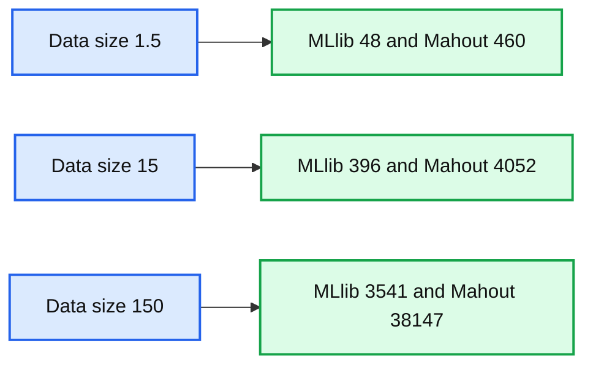

# New MLlib Algorithms in Apache Spark 1.3: FP-Growth and Power Iteration Clustering

- Source: https://www.databricks.com/blog/2015/04/17/new-mllib-algorithms-in-spark-1-3-fp-growth-and-power-iteration-clustering.html
- Published: 2015-04-17
- Authors: Jacky Li, Fan Jiang, Youhua Zhang, Stephen Boesch, Bing Xiao
- Categories: engineering, data-science-machine-learning, open-source
- Images: 3 total, 3 extracted as architecture

This is a guest blog post from Huawei’s big data global team.

Huawei, a Fortune Global 500 private company, has put together a global team since 2013 to work on Apache Spark community projects and contribute back to the community. This blog post describes two new MLlib algorithms contributed from Huawei in Apache Spark 1.3 and their use cases: FP-growth for frequent pattern mining and Power Iteration Clustering for graph clustering.

---

 

## FP-Growth: Scalable Frequent Itemset Mining

As smartphones and the mobile internet become more and more popular, a huge amount of data traffic is transmitted each second on the global internet. In a typical network of millions subscribers, traffic rates can reach terabytes per second, which drives gigabytes of event logs generated per second from the underneath network equipment. At Huawei, we are often interested in analyzing traffic patterns from these logs, so we can leverage usage information to make the network more efficient. A common technique for analyzing network data is *frequent pattern mining*. Frequent pattern mining can reveal the most frequently visited site in a particular period or find popular routing paths that generate most traffic in a particular region. Finding these patterns allows us to improve utilization of the network; for instance, information on routing hotspots can influence the placement of gateway and routers in the network.

## FP-Growth

The FP-growth mining problem models its input as a set of *transactions*. Each transaction is simply a set of *items* and the algorithm looks for common subsets of items that appear across transactions. For a subset to be considered a pattern, it must appear in some minimum proportion of all transactions, termed the *support*. In the case of a telco network, items would be individual network nodes, and a transaction could represent one path of nodes. Then the algorithm would return sub-paths of the network that are frequently traversed.

A naive way to do this is to generate all possible itemsets and count their occurrence, which is not scalable because it quickly becomes a combinatorial explosion problem as the input data size increases. To solve this problem, we chose FP-growth, a classic algorithm that finds all frequent itemsets without generating and testing all candidates. And to make FP-growth work on large-scale datasets, we at Huawei has implemented a parallel version of FP-growth, as described in [Li et al., PFP: Parallel FP-growth for query recommendation](https://dl.acm.org/citation.cfm?doid=1454008.1454027), and contributed it to Apache Spark 1.3.

Here is a brief description of the algorithm. The algorithm takes an RDD of transactions from user, and works in two steps to output frequent itemsets. In the first step, item frequency is calculated and infrequent items are filtered (because frequent itemsets must consist of frequent items). In the second step, suffix trees (FP-trees) are constructed and grown from the filtered transactions, and then frequent itemsets can be extracted from the suffix trees. The work is distributed based on the suffixes of the filtered transactions, and `combineByKey` is used to reduce the amount of shuffle data.

## Scalability

We have compared MLlib’s FP-growth implementation against Mahout on our production datasets. The results are plotted as below.

**Summary:** Benchmark chart comparing MLlib and Mahout running times across support levels for a 1.5GB dataset.

**Components:**

- MLlib: Spark machine learning library
- Mahout: Machine learning framework
- Support: support-level axis
- Time: running-time axis

**Flows:**

- Support level 0.3 -> MLlib: 112 time units
- Support level 0.3 -> Mahout: 880 time units
- Support level 0.5 -> MLlib: 48 time units
- Support level 0.5 -> Mahout: 460 time units
- Support level 0.8 -> MLlib: 44 time units
- Support level 0.8 -> Mahout: 400 time units

**Numbers:** 0, 0.3, 0.5, 0.8, 44, 48, 112, 400, 460, 880, 1.5GB

```mermaid
%% Benchmark running times for MLlib and Mahout across support levels
xychart-beta
    x-axis "Support" [0.3, 0.5, 0.8]
    y-axis "Time" 0 --> 900
    bar "MLlib" [112, 48, 44]
    bar "Mahout" [880, 460, 400]
```

source image: https://www.databricks.com/wp-content/uploads/2015/04/Screen-Shot-2015-04-17-at-8.16.01-AM1.png

Experiment 1: Running times for different support levels using a 1.5GB data set.

**Summary:** Benchmark chart comparing MLlib and Mahout running times across data sizes.

**Components:**

- MLlib benchmark series
- Mahout benchmark series
- Data Size axis
- Time axis

**Flows:**

- none

**Numbers:** 0, 5000, 10000, 15000, 20000, 25000, 30000, 35000, 40000, 1.5, 15, 150, 48, 460, 396, 4052, 3541, 38147

source image: https://www.databricks.com/wp-content/uploads/2015/04/Screen-Shot-2015-04-17-at-8.20.13-AM.png

Experiment 2: Running times for different data sizes (GB).

As shown in the figures, MLlib is about 7~9 times faster than Mahout on a 1.5GB dataset, and MLlib achieves good scalability as the dataset grows 10 times and 100 times. In the largest test, MLlib is about 11 times faster than Mahout.

## Examples

MLlib’s FP-growth is available in Scala/Java in Apache Spark 1.3. Its Python API was merged recently and it will be available in 1.4. Following example code demonstrates its API usage:

import org.apache.spark.mllib.fpm.FPGrowth

// the input data set containing all transactions
 val transactions = sc.textFile("...").map(_.split(" ")).cache()

// run the FP-growth algorithm
 val model = new FPGrowth()
 .setMinSupport(0.5)
 .setNumPartitions(10)
 .run(transactions)

// print the frequent itemset result
 model.freqItemsets.collect().foreach { itemset =>
 println(itemset.items.mkString("[", ",", "]") + ", " + itemset.freq)
 }

For more information about MLlib’s FP-growth, please visit its [user guide](https://spark.apache.org/docs/latest/mllib-frequent-pattern-mining.html) and check out full examples in [Scala](https://github.com/apache/spark/blob/master/examples/src/main/scala/org/apache/spark/examples/mllib/FPGrowthExample.scala) on GitHub.

## Power Iteration Clustering: Spectral Clustering on GraphX

Communication service providers like Huawei must manage, operate, and optimize increasingly dynamic traffic workloads on heterogeneous networks. Among various algorithms being used in this effort, unsupervised learning including clustering plays an important role, for example, in identifying similar behaviors among users or network clusters. Graph clustering algorithms are commonly used in the telecom industry for this purpose, and can be applied to data center management and operation.

## Power Iteration Clustering

We have implemented Power Iteration Clustering (PIC) in MLlib, a simple and scalable graph clustering method described in Lin and Cohen, Power Iteration Clustering. PIC takes an undirected graph with similarities defined on edges and outputs clustering assignment on nodes. PIC uses truncated [power iteration](https://en.wikipedia.org/wiki/Power_iteration) to find a very low-dimensional embedding of the nodes, and this embedding leads to effective graph clustering.

PIC is a graph algorithm and it can be easily described in a graph language. So it was natural to implement PIC using GraphX in Spark and take advantage of GraphX’ graph processing APIs and optimization. MLlib’s PIC is among the first MLlib algorithms built upon GraphX. In particular, we store the normalized similarity matrix as a graph with normalized similarities defined as edge properties. The edge properties are cached and remain static during the power iterations. The embedding of nodes is defined as node properties on the same graph topology. We update the embedding through power iterations, where aggregateMessages is used to compute matrix-vector multiplications, the essential operation in a power iteration method. Finally, k-means is used to cluster nodes using the embedding.

## Examples

MLlib’s PIC is available in Scala/Java in Apache Spark 1.3. Its Python support will be added in a future release. The following example code demonstrates its API usage:

import org.apache.spark.mllib.clustering.PowerIterationClustering

// pairwise similarities
 val similarities: RDD[(Long, Long, Double)] = ...

val pic = new PowerIteartionClustering()
 .setK(3)
 .setMaxIterations(20)
 val model = pic.run(similarities)

model.assignments.collect().foreach { a =>
 println(s"${a.id} -> ${a.cluster}")
 }

A more concrete example can be found at [PowerIterationClusteringExample](https://github.com/apache/spark/blob/master/examples/src/main/scala/org/apache/spark/examples/mllib/PowerIterationClusteringExample.scala), and the following is a clustering assignment produced by it with five circles:

**Summary:** Scatter plot of labeled input data arranged in five concentric, non-linear similarity groups.

**Components:**

- Labeled input data - technology not shown
- X axis
- Y axis
- Five concentric point groups

**Flows:**

- none

**Numbers:** Axis values from -3 to 3; visible point labels include 1000, 2000, 3000, 4000, and 5000.

```mermaid
%% Shows labeled input data arranged in five concentric groups
flowchart LR
    A[Labeled input data plot]

    classDef client fill:#dbeafe,stroke:#2563eb,stroke-width:2px,color:#111
    classDef service fill:#dcfce7,stroke:#16a34a,stroke-width:2px,color:#111
    classDef store fill:#ede9fe,stroke:#7c3aed,stroke-width:2px,color:#111
    classDef cache fill:#fef3c7,stroke:#d97706,stroke-width:2px,color:#111
    classDef queue fill:#cffafe,stroke:#0891b2,stroke-width:2px,color:#111
    classDef critical fill:#fee2e2,stroke:#dc2626,stroke-width:4px,color:#111
    classDef external fill:#e5e7eb,stroke:#6b7280,stroke-width:2px,color:#111,stroke-dasharray:4 3
    classDef decision fill:#fce7f3,stroke:#db2777,stroke-width:2px,color:#111
    class A service
```

source image: https://www.databricks.com/wp-content/uploads/2015/04/Screen-Shot-2015-04-17-at-8.25.54-AM.png

What we notice is that PIC is able to distinguish clearly the degree of similarity – as represented by the Euclidean distance among the points – even though their relationship is non-linear. For more information about PIC in MLlib, please visit its [user guide](https://spark.apache.org/docs/latest/mllib-clustering.html#power-iteration-clustering-pic).

## Summary

Both FP-growth and PIC are included in Apache Spark 1.3. So you can [download it](https://spark.apache.org/downloads.html) now and try them out. At Huawei, our team is working on improving MLlib’s FP-growth implementation further and exploring possible enhancements to PIC. In addition, we plan to work on MLlib’s pipeline API, such as model persistence and re-deployment of the models, and share use cases of MLlib algorithms from our customers.

## Acknowledgement

Xiangrui Meng at Databricks provided tremendous help to us, including design discussions and code reviews. We also want to thank all community members who helped code reviews and expanded the work, e.g., adding Python support and model import/export.
