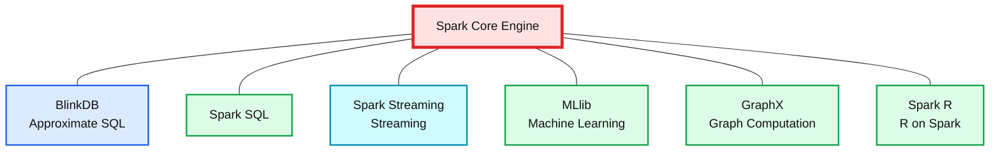
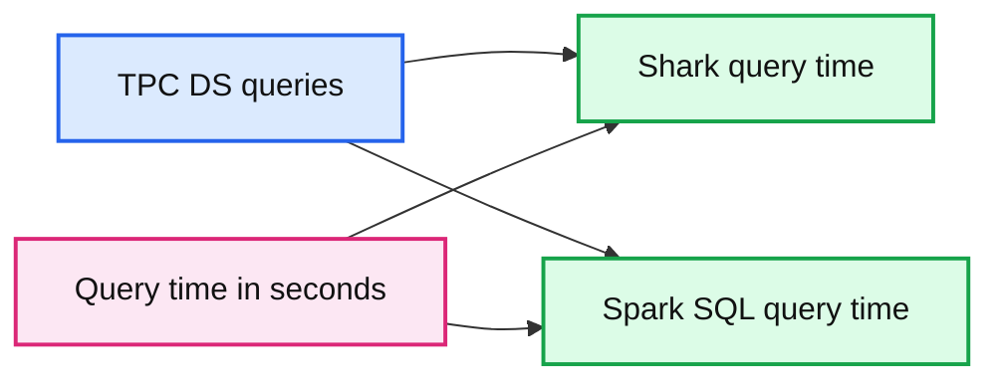
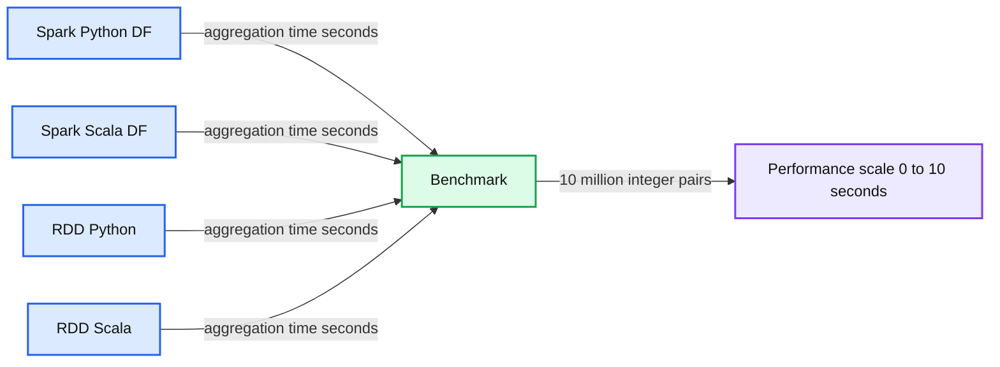

# Recent performance improvements in Apache Spark: SQL, Python, DataFrames, and More

- Source: https://www.databricks.com/blog/2015/04/24/recent-performance-improvements-in-apache-spark-sql-python-dataframes-and-more.html
- Published: 2015-04-24
- Authors: Reynold Xin
- Categories: engineering, open-source
- Images: 4 total, 4 extracted as architecture

[Read Rise of the Data Lakehouse](https://www.databricks.com/resources/ebook/rise-data-lakehouse?itm_data=improvementsapachesparksqlpythondataframes-blog-riselakehousebook) to explore why lakehouses are the data architecture of the future with the father of the data warehouse, Bill Inmon.

---

In this post, we look back and cover recent performance efforts in Apache Spark. In a follow-up blog post next week, we will look forward and share with you our thoughts on the future evolution of Spark's performance.

2014 was the most active year of Spark development to date, with major improvements across the entire engine. One particular area where it made great strides was performance: Spark [set a new world record in 100TB sorting](https://www.databricks.com/blog/2014/11/05/spark-officially-sets-a-new-record-in-large-scale-sorting.html), beating the previous record held by Hadoop MapReduce by three times, using only one-tenth of the resources; it received a new [SQL query engine](https://www.databricks.com/blog/2015/04/13/deep-dive-into-spark-sqls-catalyst-optimizer.html) with a state-of-the-art optimizer; and many of its built-in algorithms became [five times faster](https://www.databricks.com/blog/2014/09/22/spark-1-1-mllib-performance-improvements.html).

Back in 2010, we at the AMPLab at UC Berkeley designed Spark for interactive queries and iterative algorithms, as these were two major use cases not well served by batch frameworks like MapReduce. As a result, early users were drawn to Spark because of the significant performance improvements in these workloads. However, performance optimization is a never-ending process, and as Spark’s use cases have grown, so have the areas looked at for further improvement. User feedback and detailed measurements helped the Apache Spark developer community to prioritize areas to work in. Starting with the core engine, I will cover some of the recent optimizations that have been made.

*The Spark ecosystem*

**Summary:** The diagram shows the Spark ecosystem layered over the shared Spark Core Engine, with BlinkDB marked as alpha or pre-alpha.

**Components:**

- BlinkDB - approximate SQL
- Spark SQL
- Spark Streaming - streaming
- MLlib - machine learning
- GraphX - graph computation
- Spark R - R on Spark
- Spark Core Engine

**Flows:**

- none

**Numbers:** none



<sub>source image: https://www.databricks.com/wp-content/uploads/2014/11/Spark_Ecosystem_Chart11.jpg</sub>

The Spark ecosystem

## Core engine

One unique thing about Spark is its user-facing APIs (SQL, streaming, machine learning, etc.) run over a common core execution engine. Whenever possible, specific workloads are sped up by making optimizations in the core engine. As a result, these optimizations speed up *all* components. We’ve often seen very surprising results this way: for example, when core developers decreased latency to introduce Spark Streaming, we also saw SQL queries become two times faster.

In the core engine, the major improvements in 2014 were in communication. First, *shuffle* is the operation that moves data point-to-point across machines. It underpins almost all workloads. For example, a SQL query joining two data sources uses shuffle to move tuples that should be joined together onto the same machine, and product recommendation algorithms such as ALS use shuffle to send user/product weights across the network.

The last two releases of Spark featured a new sort-based shuffle layer and a new network layer based on [Netty](https://en.wikipedia.org/wiki/Netty_%28software%29) with zero-copy and explicit memory management. These two make Spark more robust in very large-scale workloads. In our own experiments at Databricks, we have used this to run petabyte shuffles on 250,000 tasks. These two changes were also the key to Spark [setting the current world record in large-scale sorting](https://www.databricks.com/blog/2014/11/05/spark-officially-sets-a-new-record-in-large-scale-sorting.html), beating the previous [Hadoop](https://www.databricks.com/glossary/hadoop)-based record by 30 times in per-node performance.

In addition to shuffle, core developers rewrote Spark’s *broadcast* primitive to use a BitTorrent-like protocol to reduce network traffic. This speeds up workloads that need to send a large parameter to multiple machines, including SQL queries and many machine learning algorithms. We have seen more than [five times performance improvements](https://github.com/apache/spark/pull/3417) for these workloads.

## Python API (PySpark)

Python is perhaps the most popular programming language used by data scientists. The Spark community views Python as a first-class citizen of the Spark ecosystem. When it comes to performance, Python programs historically lag behind their JVM counterparts due to the more dynamic nature of the language.

Spark’s core developers have worked extensively to bridge the performance gap between JVM languages and Python. In particular, PySpark can now run on *PyPy* to leverage the just-in-time compiler, in some cases [improving performance by a factor of 50](https://github.com/apache/spark/pull/2144). The way Python processes communicate with the main Spark JVM programs have also been redesigned to enable *worker reuse*. In addition, broadcasts are handled via a more optimized serialization framework, enabling PySpark to broadcast data larger than 2GB. The latter two have made general Python program performance two to 10 times faster.

## SQL

One year ago, Shark, an earlier SQL on Spark engine based on Hive, was deprecated and we at Databricks built a new query engine based on a new query optimizer, [Catalyst](https://www.databricks.com/blog/2015/04/13/deep-dive-into-spark-sqls-catalyst-optimizer.html), designed to run natively on Spark. It was a controversial decision, within the Apache Spark developer community as well as internally within Databricks, because building a brand new query engine necessitates astronomical engineering investments. One year later, more than 115 open source contributors have joined the project, making it one of the most active open source query engines.

*Shark vs. Spark SQL*

**Summary:** Benchmark chart comparing Shark and Spark SQL query times across TPC-DS queries.

**Components:**

- Shark: legacy SQL query engine
- Spark SQL: Spark SQL query engine
- TPC-DS Query Number: benchmark query identifiers
- Query Time in seconds: performance metric

**Flows:**

- TPC-DS Query Number -> Shark: benchmark query execution
- TPC-DS Query Number -> Spark SQL: benchmark query execution

**Numbers:** Query numbers 3, 7, 19, 27, 34, 42, 52, 53, 59, 63, 68, 73, 79, 89, 98; query time axis 0, 100, 200, 300, 400, 500 seconds



<sub>source image: https://www.databricks.com/wp-content/uploads/2015/04/sparksql-tpcds-perf.jpg</sub>

Shark vs. Spark SQL

Despite being less than a year old, Spark SQL is outperforming Shark on almost all benchmarked queries. In TPC-DS, a decision-support benchmark, Spark SQL is outperforming Shark often by an order of magnitude, due to [better optimizations and code generation](https://www.databricks.com/blog/2015/04/13/deep-dive-into-spark-sqls-catalyst-optimizer.html).

## Machine learning (MLlib) and Graph Computation (GraphX)

From early on, Spark was packaged with powerful standard libraries that can be optimized along with the core engine. This has allowed for a number of rich optimizations to these libraries. For instance, Spark 1.1 featured a new communication pattern for aggregating machine learning models using [multi-level aggregation trees](https://www.databricks.com/blog/2014/09/22/spark-1-1-mllib-performance-improvements.html). This has reduced the model aggregation time by an order of magnitude. This new communication pattern, coupled with the more efficient broadcast implementation in core, results in speeds 1.5 to five times faster across all algorithms.

**Summary:** Benchmark chart comparing Spark 1.0 and Spark 1.1 performance across six MLlib algorithms.

**Components:**

- Ridge Regression Tall: MLlib benchmark
- Ridge Regression Fat: MLlib benchmark
- Logistic Regression Tall: MLlib benchmark
- Logistic Regression Fat: MLlib benchmark
- Kmeans: MLlib benchmark
- ALS: MLlib benchmark
- Decision Trees: MLlib benchmark
- Spark 1.0: baseline version
- Spark 1.1: improved version

**Flows:**

- Spark 1.0 -> MLlib algorithms: baseline performance
- Spark 1.1 -> MLlib algorithms: improved performance

**Numbers:** 0, 1, 2, 3, 4, 5, 6, Spark 1.0, Spark 1.1

```text
%% mermaid failed to render; kept as text
%% Shows Spark MLlib performance benchmarks by algorithm and Spark version
flowchart LR
    S10[Spark 1.0] -->|baseline performance| B[MLlib algorithms]
    S11[Spark 1.1] -->|improved performance| B

    B --> RT[Ridge Reg Tall]
    B --> RF[Ridge Reg Fat]
    B --> LT[Logistic Reg Tall]
    B --> LF[Logistic Reg Fat]
    B --> K[Kmeans]
    B --> A[ALS]
    B --> D[Decision Trees]

    classDef client fill:#dbeafe,stroke:#2563eb,stroke-width:2px,color:#111
    classDef service fill:#dcfce7,stroke:#16a34a,stroke-width:2px,color:#111
    classDef store fill:#ede9fe,stroke:#7c3aed,stroke-width:2px,color:#111
    classDef cache fill:#fef3c7,stroke:#d97706,stroke-width:2px,color:#111
    classDef queue fill:#cffafe,stroke:#0891b2,stroke-width:2px,color:#111
    classDef critical fill:#fee2e2,stroke:#dc2626,stroke-width:4px,color:#111
    classDef external fill:#e5e7eb,stroke:#6b7280,stroke-width:2px,color:#111,stroke-dasharray:4 3
    classDef decision fill:#fce7f3,stroke:#db2777,stroke-width:2px,color:#111

    S10,S11 client
    B service
    RT,RF,LT,LF,K,A,D service
```

<sub>source image: https://www.databricks.com/wp-content/uploads/2015/04/mllib-perf.jpg</sub>

In addition to optimizations in communication, *Alternative Least Squares (ALS)*, a common collaborative filtering algorithm, was also re-implemented 1.3, which provided another factor of two speedup for ALS over what the above chart shows. In addition, all the built-in algorithms in GraphX have also seen 20% to 50% runtime performance improvements, due to a new optimized API.

## DataFrames: Leveling the Field for Python and JVM

In Spark 1.3, we introduced a [new *DataFrame* API](https://www.databricks.com/blog/2015/02/17/introducing-dataframes-in-spark-for-large-scale-data-science.html). This new API makes Spark programs more concise and easier to understand, and at the same time exposes more application semantics to the engine. As a result, Spark can use Catalyst to optimize these programs.

**Summary:** Benchmark comparing aggregation performance for Spark Python and Scala DataFrames versus Python and Scala RDDs.

**Components:**

- Spark Python DF using Spark DataFrames
- Spark Scala DF using Spark DataFrames
- RDD Python using Spark RDDs
- RDD Scala using Spark RDDs
- Benchmark measuring aggregation of 10 million integer pairs

**Flows:**

- none

**Numbers:** 10 million integer pairs; 0, 2, 4, 6, 8, 10 seconds



<sub>source image: https://www.databricks.com/wp-content/uploads/2015/02/Screen-Shot-2015-02-16-at-9.46.39-AM.png</sub>

Through the new DataFrame API, Python programs can achieve the same level of performance as JVM programs because the Catalyst optimizer compiles DataFrame operations into JVM bytecode. Indeed, performance sometimes beats hand-written Scala code.

The Catalyst optimizer will also become smarter over time, picking better logical optimizations and physical execution optimizations. For example, in the future, Spark will be able to leverage schema information to create a custom physical layout of data, improving cache locality and reducing garbage collection. This will benefit both Spark SQL and DataFrame programs. As more libraries are converting to use this new DataFrame API, they will also automatically benefit from these optimizations.

The goal of Spark is to offer a single platform where users can get the best distributed algorithms for any data processing task. We will continue to push the boundaries of performance, making Spark faster and more powerful for more users.

Note: An earlier version of this blog post appeared on [O'Reilly Radar](http://radar.oreilly.com/2015/02/recent-performance-improvements-in-apache-spark.html).
