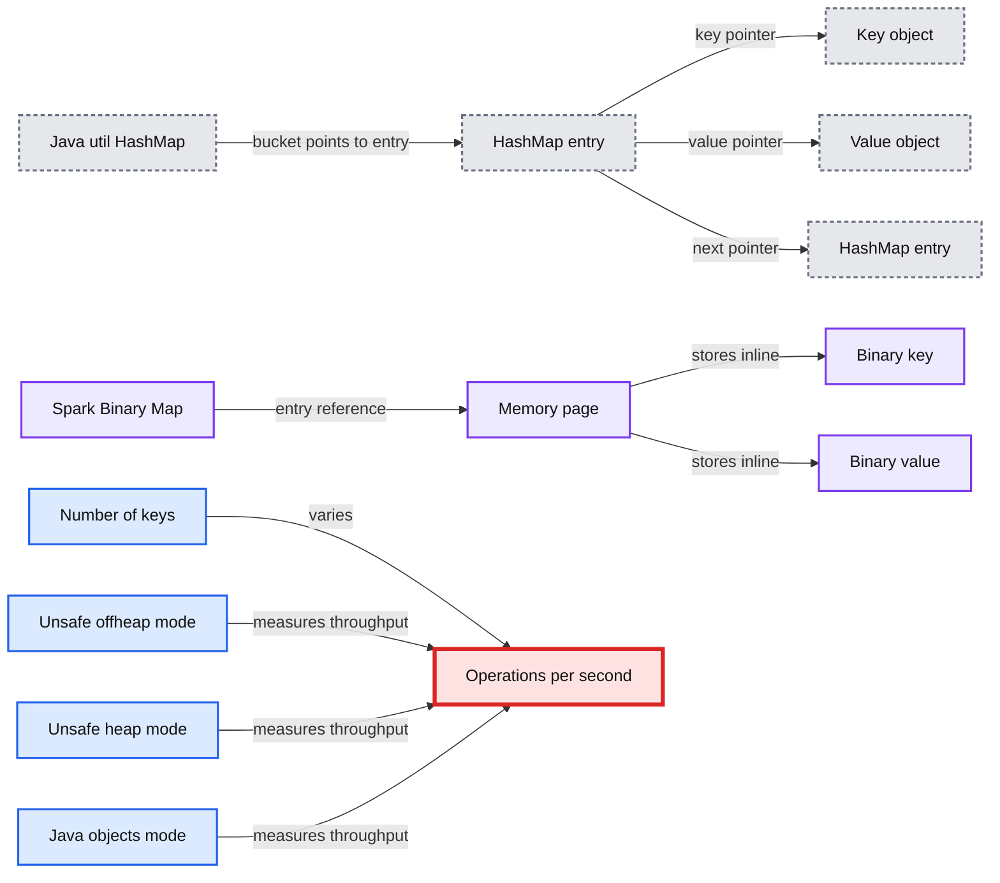
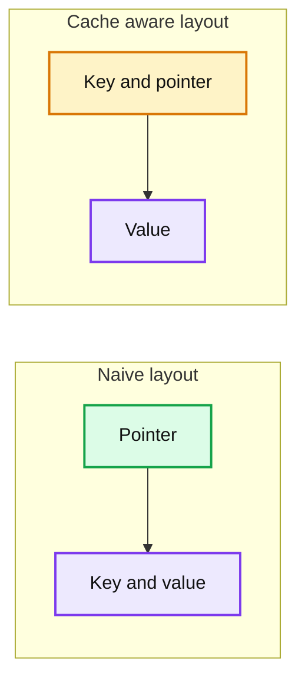
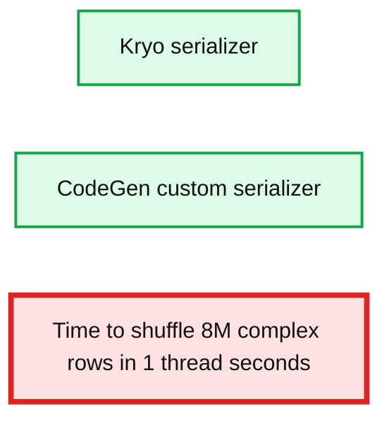

# Project Tungsten: Bringing Apache Spark Closer to Bare Metal

- Source: https://www.databricks.com/blog/2015/04/28/project-tungsten-bringing-spark-closer-to-bare-metal.html
- Published: 2015-04-28
- Authors: Reynold Xin, Josh Rosen
- Categories: engineering, open-source
- Images: 3 total, 3 extracted as architecture

In a previous [blog post](https://www.databricks.com/blog/2015/04/24/recent-performance-improvements-in-apache-spark-sql-python-dataframes-and-more.html), we looked back and surveyed performance improvements made to Apache Spark in the past year. In this post, we look forward and share with you the next chapter, which we are calling *Project Tungsten. *2014 witnessed Spark setting the world record in large-scale sorting and saw major improvements across the entire engine from Python to SQL to machine learning. Performance optimization, however, is a never ending process.

Project [Tungsten](https://www.databricks.com/glossary/tungsten) will be the largest change to Spark’s execution engine since the project’s inception. It focuses on substantially improving the efficiency of *memory and CPU* for [Spark applications](https://www.databricks.com/glossary/what-are-spark-applications), to push performance closer to the limits of modern hardware. This effort includes three initiatives:

1. *Memory Management and Binary Processing:* leveraging application semantics to manage memory explicitly and eliminate the overhead of JVM object model and garbage collection
2. *Cache-aware computation*: algorithms and data structures to exploit memory hierarchy
3. *Code generation*: using code generation to exploit modern compilers and CPUs

The focus on CPU efficiency is motivated by the fact that Spark workloads are increasingly bottlenecked by CPU and memory use rather than IO and network communication. This trend is shown by recent research on the performance of big data workloads ([Ousterhout et al](https://kayousterhout.github.io/trace-analysis/)) and we’ve arrived at similar findings as part of our ongoing tuning and optimization efforts for [Databricks Cloud](https://www.databricks.com/product/data-lakehouse) customers.

Why is CPU the new bottleneck? There are many reasons for this. One is that hardware configurations offer increasingly large aggregate IO bandwidth, such as 10Gbps links in networks and high bandwidth SSD’s or striped HDD arrays for storage. From a software perspective, Spark’s optimizer now allows many workloads to avoid significant disk IO by pruning input data that is not needed in a given job. In Spark’s shuffle subsystem, serialization and hashing (which are CPU bound) have been shown to be key bottlenecks, rather than raw network throughput of underlying hardware. All these trends mean that Spark today is often constrained by CPU efficiency and memory pressure rather than IO.

## 1. Memory Management and Binary Processing

Applications on the JVM typically rely on the JVM’s garbage collector to manage memory. The JVM is an impressive engineering feat, designed as a general runtime for many workloads. However, as Spark applications push the boundary of performance, the overhead of JVM objects and GC becomes non-negligible.

Java objects have a large inherent memory overhead. Consider a simple string “abcd” that would take 4 bytes to store using UTF-8 encoding. JVM’s native String implementation, however, stores this differently to facilitate more common workloads. It encodes each character using 2 bytes with UTF-16 encoding, and each String object also contains a 12 byte header and 8 byte hash code, as illustrated by the following output from the the [Java Object Layout](http://openjdk.java.net/projects/code-tools/jol/) tool.

A simple 4 byte string becomes over 48 bytes in total in the JVM object model!

The other problem with the JVM object model is the overhead of garbage collection. At a high level, generational garbage collection divides objects into two categories: ones that have a high rate of allocation/deallocation (the young generation) ones that are kept around (the old generation). Garbage collectors exploit the transient nature of young generation objects to manage them efficiently. This works well when GC can reliably estimate the life cycle of objects, but falls short if the estimation is off (i.e. some transient objects spill into the old generation). Since this approach is ultimately based on heuristics and estimation, eeking out performance can require the “black magic” of GC tuning, with [dozens of parameters](https://www.oracle.com/java/technologies/javase/gc-tuning-6.html) to give the JVM more information about the life cycle of objects.

Spark, however, is not just a general-purpose application. Spark understands how data flows through various stages of computation and the scope of jobs and tasks. As a result, Spark knows much more information than the JVM garbage collector about the life cycle of memory blocks, and thus should be able to manage memory more efficiently than the JVM.

To tackle both object overhead and GC’s inefficiency, we are introducing an explicit memory manager to convert most Spark operations to operate directly against binary data rather than Java objects. This builds on `sun.misc.Unsafe`, an advanced functionality provided by the JVM that exposes C-style memory access (e.g. explicit allocation, deallocation, pointer arithmetics). Furthermore, Unsafe methods are *intrinsic*, meaning each method call is compiled by JIT into a single machine instruction.

In certain areas, Spark has already started using explicitly managed memory. Last year, Databricks contributed a new Netty-based network transport that explicitly manages all network buffers using a jemalloc like memory manager. That was critical in scaling up Spark’s shuffle operation and winning the Sort Benchmark.

The first pieces of this will appear in Spark 1.4, which includes a hash table that operates directly against binary data with memory explicitly managed by Spark. Compared with the standard Java `HashMap`, this new implementation much less indirection overhead and is invisible to the garbage collector.

**Summary:** The image compares Java HashMap indirection with Spark Binary Map memory layout and benchmarks aggregation throughput across heap, offheap, and Java object modes.

**Components:**

- Java util HashMap
- HashMap entry
- Key
- Value pointer
- Next pointer
- Key object
- Value object
- Spark Binary Map
- Memory page
- Binary key
- Binary value
- Unsafe offheap aggregation mode
- Unsafe heap aggregation mode
- Java objects aggregation mode
- Operations per second benchmark
- Number of keys benchmark

**Flows:**

- Java util HashMap -> HashMap entry: bucket points to entry
- HashMap entry -> Key object: key pointer
- HashMap entry -> Value object: value pointer
- HashMap entry -> HashMap entry: next pointer
- Spark Binary Map -> Memory page: entry reference
- Memory page -> Binary key: stores key inline
- Memory page -> Binary value: stores value inline
- Number of keys -> Operations per second: benchmark varies key count
- Unsafe offheap aggregation mode -> Operations per second: throughput measurement
- Unsafe heap aggregation mode -> Operations per second: throughput measurement
- Java objects aggregation mode -> Operations per second: throughput measurement

**Numbers:**

- X axis key counts: 250000, 500000, 750000, 1000000, 1250000, 1500000, 1750000, 2000000, 2250000, 2500000, 2750000, 3000000, 3250000, 3500000, 3750000, 4000000
- Y axis operations per second: 0, 100000, 200000, 300000, 400000, 500000, 600000, 700000, 800000, 900000, 1000000, 1100000, 1200000
- Chart series count: 3

source image: https://www.databricks.com/wp-content/uploads/2015/04/Screen-Shot-2015-04-27-at-6.08.39-PM.png

This is still work-in-progress, but initial performance results are encouraging. As shown above, we compare the throughput of aggregation operations using different hash map: one with our new hash map’s heap mode, one with offheap, and one with java.util.HashMap. The new hash table supports over 1 million aggregation operations per second in a single thread, about 2X the throughput of java.util.HashMap. More importantly, without tuning any parameters, it has almost no performance degradation as memory utilization increases, while the JVM default one eventually thrashes due to GC.

In Spark 1.4, this hash map will be used for aggregations for DataFrames and SQL, and in 1.5 we will have data structures ready for most other operations, such as sorting and joins. This will in many cases eliminating the need to tune GC to achieve high performance.

## 2. Cache-aware Computation

Before we explain cache-aware computation, let’s revisit “in-memory” computation. Spark is widely known as an in-memory computation engine. What that term really means is that Spark can leverage the memory resources on a cluster efficiently, processing data at a rate much higher than disk-based solutions. However, Spark can also process data orders magnitude larger than the available memory, transparently spill to disk and perform external operations such as sorting and hashing.

Similarly, cache-aware computation improves the speed of data processing through more effective use of L1/ L2/L3 CPU caches, as they are orders of magnitude faster than main memory. When profiling Spark user applications, we’ve found that a large fraction of the CPU time is spent waiting for data to be fetched from main memory. As part of Project Tungsten, we are designing cache-friendly algorithms and data structures so Spark applications will spend less time waiting to fetch data from memory and more time doing useful work.

Consider sorting of records as an example. A standard sorting procedure would store an array of pointers to records and use quicksort to swap pointers until all records are sorted. Sorting in general has good cache hit rate due to the sequential scan access pattern. Sorting a list of pointers, however, has a poor cache hit rate because each comparison operation requires dereferencing two pointers that point to randomly located records in memory.

**Summary:** The diagram compares a naive pointer layout with a cache-aware layout that stores each key alongside its pointer before accessing the value.

**Components:**

- Naive layout
- Pointer
- Key
- Value
- Cache aware layout
- Pointer and key pair
- Value

**Flows:**

- Pointer -> Key: dereference to access the key and value
- Pointer and key pair -> Value: dereference to access the value

**Numbers:** none

source image: https://www.databricks.com/wp-content/uploads/2015/04/Screen-Shot-2015-04-27-at-6.12.51-PM.png

So how do we improve the cache locality of sorting? A very simple approach is to store the sort key of each record side by side with the pointer. For example, if the sort key is a 64-bit integer, then we use 128-bit (64-bit pointer and 64-bit key) to store each record in the pointers array. This way, each quicksort comparison operation only looks up the pointer-key pairs in a linear fashion and requires no random memory lookup. Hopefully the above illustration gives you some idea about how we can redesign basic operations to achieve higher cache locality.

How does this apply to Spark? Most distributed data processing can be boiled down to a small list of operations such as aggregations, sorting, and join. By improving the efficiency of these operations, we can improve the efficiency of Spark applications as a whole. We have already built a version of sort that is cache-aware that is 3X faster than the previous version. This new sort will be used in sort-based shuffle, high cardinality aggregations, and sort-merge join operator. By the end of this year, most Spark’s lowest level algorithms will be upgraded to be cache-aware, increasing the efficiency of all applications from machine learning to SQL.

## 3. Code Generation

About a year ago Spark introduced [code generation for expression evaluation](https://www.databricks.com/blog/2015/04/13/deep-dive-into-spark-sqls-catalyst-optimizer.html) in SQL and DataFrames. Expression evaluation is the process of computing the value of an expression (say “`age > 35 && age ”) on a particular record. At runtime, Spark dynamically generates bytecode for evaluating these expressions, rather than stepping through a slower interpreter for each row. Compared with interpretation, code generation reduces the boxing of primitive data types and, more importantly, avoids expensive [polymorphic function dispatches](https://shipilev.net/blog/2015/black-magic-method-dispatch/)`.

In an [earlier blog post](https://www.databricks.com/blog/2015/04/13/deep-dive-into-spark-sqls-catalyst-optimizer.html), we demonstrated that code generation could speed up many TPC-DS queries by almost an order of magnitude. We are now broadening the code generation coverage to most built-in expressions. In addition, we plan to increase the level of code generation from *record-at-a-time* expression evaluation to *vectorized* expression evaluation, leveraging JIT’s capabilities to exploit better instruction pipelining in modern CPUs so we can process multiple records at once.

We’re also applying code generation in areas beyond expression evaluations to optimize the CPU efficiency of internal components. One area that we are very excited about applying code generation is to speed up the conversion of data from in-memory binary format to wire-protocol for shuffle. As mentioned earlier, shuffle is often bottlenecked by data serialization rather than the underlying network. With code generation, we can increase the throughput of serialization, and in turn increase shuffle network throughput.

**Summary:** Benchmark comparing shuffle time for Kryo and a code-generated serializer.

**Components:**

- Kryo serializer
- CodeGen custom serializer

**Flows:**

- none

**Numbers:** 8M complex rows, 1 thread, seconds, 0, 50, 100, 150, 200

source image: https://www.databricks.com/wp-content/uploads/2015/04/Screen-Shot-2015-04-27-at-6.15.12-PM-1024x383.png

The above chart compares the performance of shuffling 8 million complex rows in one thread using the Kryo serializer and a code generated custom serializer. The code generated serializer exploits the fact that all rows in a single shuffle have the same schema and generates specialized code for that. This made the generated version over 2X faster to shuffle than the Kryo version.

## Tungsten and Beyond

Project Tungsten is a broad initiative that will influence the design of Spark’s core engine over the next several releases. The first pieces will land in Spark 1.4, which includes explicitly managed memory for [aggregation operations](https://github.com/apache/spark/pull/5725) in Spark’s DataFrame API as well as [customized serializers](https://github.com/apache/spark/pull/5497). Expanded coverage of binary memory management and cache-aware data structures will appear in Spark 1.5. Several parts of project Tungsten leverage the DataFrame model. We will also retrofit the improvements onto Spark’s RDD API whenever possible.

There are also a handful of longer term possibilities for Tungsten. In particular, we plan to investigate compilation to LLVM or OpenCL, so Spark applications can leverage SSE/SIMD instructions out of modern CPUs and the wide parallelism in GPUs to speed up operations in machine learning and graph computation.

The goal of Spark has always been to offer a single platform where users can get the best distributed algorithms for any data processing task. Performance is a key part of that goal, and Project Tungsten aims to let Spark applications run at the speed offered by bare metal. Stay tuned for the Databricks blog for longer term articles on the components of Project Tungsten as they ship.

- Note: hand-drawing diagrams inspired by our friends at Confluent (Martin Kleppmann)
