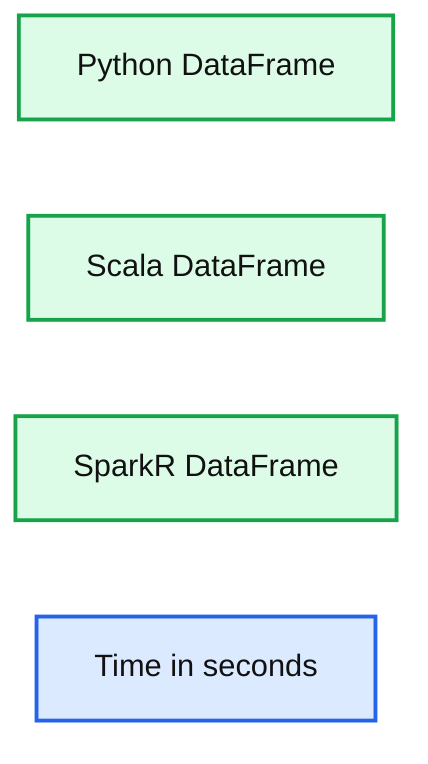

# Announcing SparkR: R on Apache Spark

- Source: https://www.databricks.com/blog/2015/06/09/announcing-sparkr-r-on-spark.html
- Published: 2015-06-09
- Authors: Shivaram Venkataraman
- Categories: engineering, open-source
- Images: 1 total, 1 extracted as architecture

I am excited to announce that the upcoming Apache Spark 1.4 release will include SparkR, an R package that allows data scientists to analyze large datasets and interactively run jobs on them from the R shell.

R is a popular statistical programming language with a number of extensions that support data processing and machine learning tasks. However, interactive data analysis in R is usually limited as the runtime is single-threaded and can only process data sets that fit in a single machine’s memory.  [SparkR](https://www.databricks.com/blog/2016/12/28/10-things-i-wish-i-knew-before-using-apache-sparkr.html), an R package initially developed at the AMPLab, provides an R frontend to Apache Spark and using Spark’s distributed computation engine allows us to run large scale data analysis from the R shell.

## Project History

The SparkR project was initially started in the [AMPLab](https://amplab.cs.berkeley.edu/) as an effort to explore different techniques to integrate the usability of R with the scalability of Spark. Based on these efforts, an initial developer preview of SparkR was [first open sourced in January 2014](https://amplab-extras.github.io/SparkR-pkg/). The project was then developed in the AMPLab for the next year and we made many performance and usability improvements through open source contributions to SparkR. SparkR was recently merged into the Apache Spark project and will be released as an alpha component of Apache Spark in the 1.4 release.

## SparkR DataFrames

The central component in the SparkR 1.4 release is the SparkR DataFrame, a distributed data frame implemented on top of [Spark](https://www.databricks.com/blog/2015/02/17/introducing-dataframes-in-spark-for-large-scale-data-science.html).  Data frames are a fundamental data structure used for data processing in R and the concept of data frames has been extended to other languages with libraries like Pandas etc. Projects like [dplyr](https://github.com/tidyverse/dplyr) have further simplified expressing complex data manipulation tasks on data frames. SparkR DataFrames present an API similar to dplyr and local R data frames but can scale to large data sets using support for distributed computation in Spark.

The following example shows some of the aspects of the DataFrame API in SparkR. (You can see the full example at [https://gist.github.com/shivaram/d0cd4aa5c4381edd6f85](https://gist.github.com/shivaram/d0cd4aa5c4381edd6f85))

## Benefits of Spark integration

In addition to having an easy to use API, SparkR inherits many benefits from being tightly integrated with Spark. These include: **Data Sources API**: By tying into Spark SQL’s [data sources API](https://www.databricks.com/blog/2015/01/09/spark-sql-data-sources-api-unified-data-access-for-the-spark-platform.html) SparkR can read in data from a variety of sources include Hive tables, JSON files, Parquet files etc. **Data Frame Optimizations**: SparkR DataFrames also inherit all of the optimizations made to the computation engine in terms of [code generation, memory management](https://www.databricks.com/blog/2015/04/28/project-tungsten-bringing-spark-closer-to-bare-metal.html). For example, the following chart compares the runtime performance of running group-by aggregation on 10 million integer pairs on a single machine in R, Python and Scala (it uses the same dataset as [https://www.databricks.com/blog/2015/02/17/introducing-dataframes-in-spark-for-large-scale-data-science.html](https://www.databricks.com/blog/2015/02/17/introducing-dataframes-in-spark-for-large-scale-data-science.html)). From the graph we can see that using the optimizations in the computation engine makes SparkR performance similar to that of Scala / Python.

**Summary:** Benchmark chart comparing execution times for Python, Scala, and SparkR DataFrames.

**Components:**

- Python DataFrame using Python
- Scala DataFrame using Scala
- SparkR DataFrame using R on Spark
- Time axis measured in seconds

**Flows:**

- None visible

**Numbers:** 0, 1, 2, 3, 4, 5 seconds

source image: https://www.databricks.com/wp-content/uploads/2015/06/Screen-Shot-2015-06-08-at-7.11.27-PM2-1024x359.png

**Scalability to many cores and machines: **Operations executed on SparkR DataFrames get automatically distributed across all the cores and machines available on the Spark cluster. As a result SparkR DataFrames [can be used on terabytes of data](https://www.databricks.com/blog/2014/11/05/spark-officially-sets-a-new-record-in-large-scale-sorting.html) and run on clusters with thousands of machines.

## Looking forward

We have many other features planned for SparkR in upcoming releases: these include support for [high level machine learning algorithms](https://issues.apache.org/jira/browse/SPARK-6805) and making SparkR DataFrames a stable component of Spark. The SparkR package represents the work of many contributors from various organizations including AMPLab, Databricks, Alteryx and Intel. We’d like to thank our contributors and users who tried out early versions of SparkR and provided feedback.  If you are interested in SparkR, do check out our talks at the upcoming [Spark Summit 2015](https://www.databricks.com/dataaisummit).
