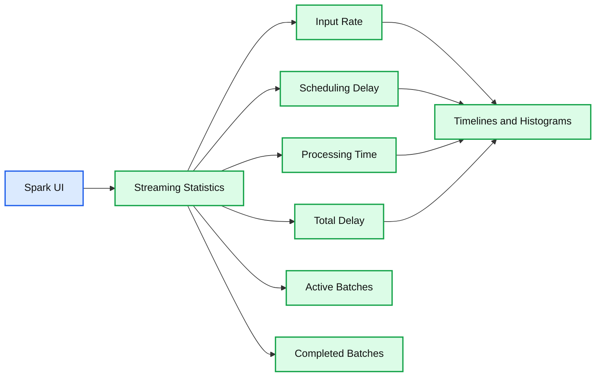

# Announcing Apache Spark 1.4

- Source: https://www.databricks.com/blog/2015/06/11/announcing-apache-spark-1-4.html
- Published: 2015-06-11
- Authors: Patrick Wendell
- Categories: engineering, open-source
- Images: 1 total, 1 extracted as architecture

Today I’m excited to announce the general availability of Apache Spark 1.4! Spark 1.4 introduces SparkR, an R API targeted towards data scientists. It also evolves Spark’s DataFrame API with a large number of new features. Spark's ML pipelines API first introduced in Spark 1.3 graduates from an alpha component. Finally, Spark Streaming and Core add visualization and monitoring to aid in production debugging.  We’ll be publishing in-depth posts covering Spark’s new features over the coming weeks. Here I’ll briefly outline some of the major themes and features in this release.

## SparkR ships in Spark

Spark 1.4 introduces [SparkR, an R API for Spark](https://www.databricks.com/blog/2015/06/09/announcing-sparkr-r-on-spark.html) and Spark's first new language API since PySpark was added in 2012. SparkR is based on Spark’s [parallel DataFrame abstraction](https://www.databricks.com/blog/2015/02/17/introducing-dataframes-in-spark-for-large-scale-data-science.html). Users can create SparkR DataFrames from “local” R data frames, or from any Spark data source such as Hive, HDFS, Parquet or JSON. SparkR DataFrames support all Spark DataFrame operations including aggregation, filtering, grouping, summary statistics, and other analytical functions. They also supports mixing-in SQL queries, and converting query results to and from DataFrames. Because SparkR uses the Spark’s parallel engine underneath, operations take advantage of multiple cores or multiple machines, and can scale to data sizes much larger than standalone R programs.

## Window functions and other DataFrame improvements

This release adds window functions to Spark SQL and in Spark’s DataFrame library. Window functions are popular for data analysts and allow users to compute statistics over window ranges.

In addition, we have also implemented many new features for DataFrames, including enriched support for [statistics and mathematical functions](https://www.databricks.com/blog/2015/06/02/statistical-and-mathematical-functions-with-dataframes-in-spark.html) (random data generation, descriptive statistics and correlations, and contingency tables), as well as functionalities for working with missing data.

To make Dataframe operations execute quickly, this release also ships the initial pieces of [Project Tungsten](https://www.databricks.com/blog/2015/04/28/project-tungsten-bringing-spark-closer-to-bare-metal.html), a broad performance initiative which will be a central theme in Spark's upcoming 1.5 release. Spark 1.4 adds improvements to serializer memory use and options to enable fast binary aggregations.

## ML pipelines graduates from alpha

Spark introduced [a machine learning (ML) pipelines API](https://www.databricks.com/blog/2015/01/07/ml-pipelines-a-new-high-level-api-for-mllib.html) in Spark 1.2. Pipelines enable production ML workloads that include many steps, such as data pre-processing, feature extraction and transformation, model fitting, and validation stages. Pipelines have added many components in the 1.3 and 1.4 releases, and in Spark 1.4, they officially graduates from an alpha component meaning API’s will be stable going forward. As part of graduation this release brings the Python API into parity with the Java and Scala interfaces. Pipelines also add a variety of new feature transformers such as `RegexTokenizer`, `OneHotEncoder`, and `VectorAssembler`, and new algorithms like linear models with elastic-net and tree models are now available within the pipeline API.

## Visualization and monitoring across the stack

Production Spark programs can be complex, with long workflows comprised of many different stages. Spark 1.4 adds visual debugging and monitoring utilities to understand the runtime behavior of Spark applications. An application timeline viewer profiles the completion of stages and tasks inside a running program. Spark 1.4 also exposes a visual representation of the underlying computation graph (or “DAG”) that is tied directly to metrics of physical execution. Spark streaming adds visual monitoring over data streams, to continuously track the latency and throughput. Finally, Spark SQL's JDBC server adds its own monitoring UI to list and track the progress of user-submitted queries.

**Summary:** Spark Streaming’s monitoring dashboard shows input rate, scheduling delay, processing time, total delay, and completed batch statistics.

**Components:**

- Spark UI using Apache Spark Streaming
- Input Rate metric
- Scheduling Delay metric
- Processing Time metric
- Total Delay metric
- Active Batches table
- Completed Batches table
- Timelines charts
- Histograms

**Flows:**

none

**Numbers:** 1 second; 1 minute 36 seconds; 2015/06/08 19:41:44; 96 completed batches; 4176 records; average input rate 43.50 events/sec; 0 active batches; 96 completed batches; scheduling delay average 0 ms; processing time average 113 ms; total delay average 114 ms; chart values 0, 50, 100, 150, 200, 250 events/sec; chart values 0, 200, 400, 600, 800 ms; histogram scales 0, 20, 40, 60, 80 batches; batch times 19:41:45 and 19:43:20; completed batch inputs 19, 19, 44, 59, and 21 events; scheduling delays 0 ms

source image: https://www.databricks.com/wp-content/uploads/2015/06/DAG-visualization.png

This post only scratches the surface of all the new features in Spark 1.4. Stay tuned to the Databricks blog, where we’ll be writing posts about each of the major features in this release.

To download Spark 1.4, head on over to the [Apache Spark download](https://spark.apache.org/downloads.html) page. For a list of major patches in this release, visit the [release notes](https://spark.apache.org/releases/spark-release-1-4-0.html).
