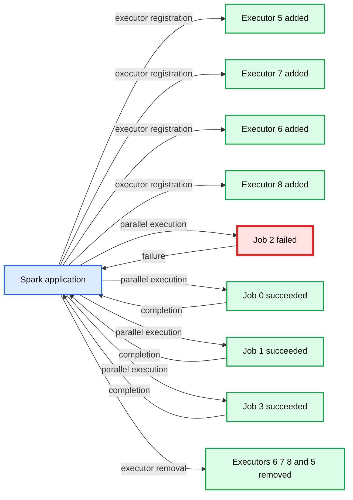
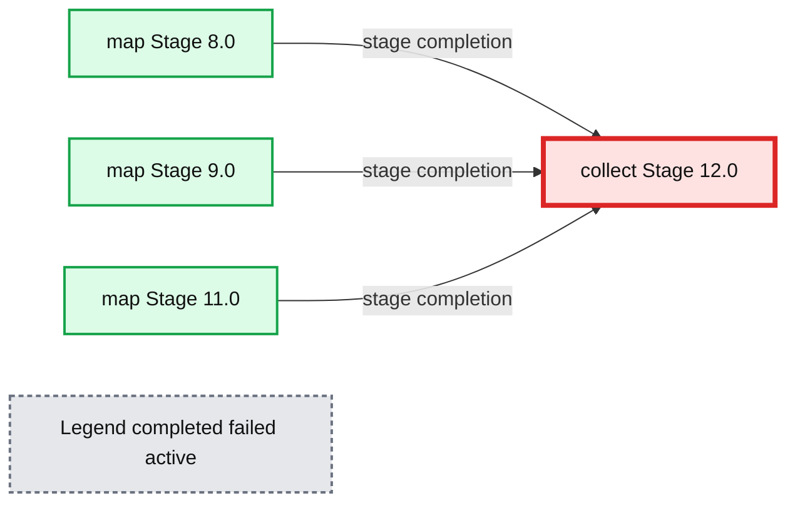
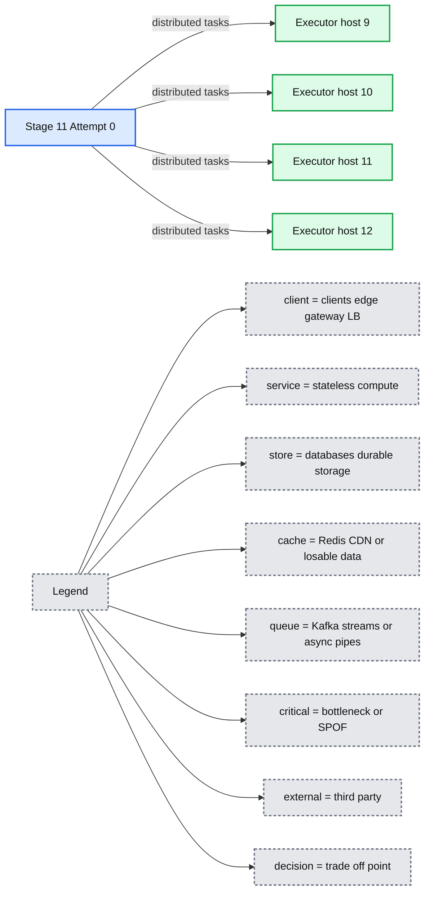
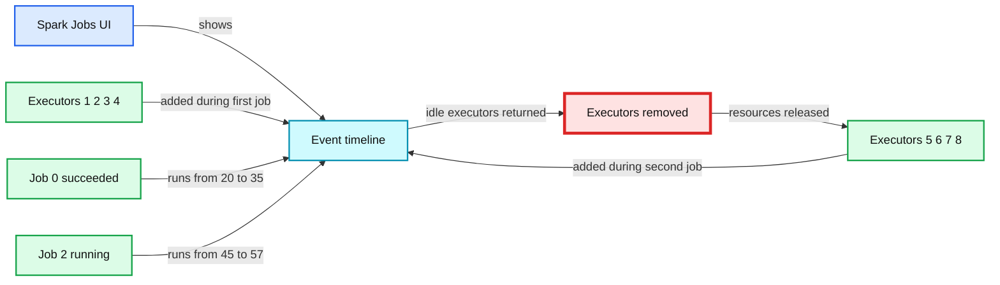
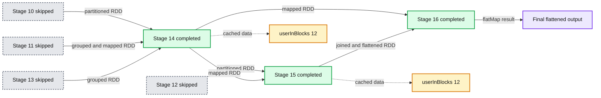
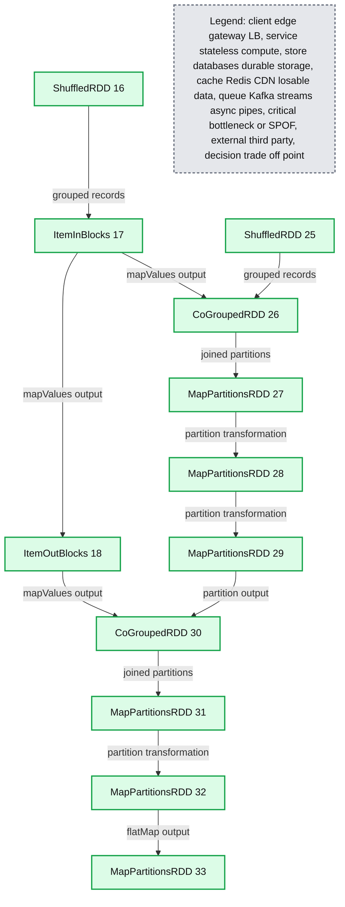

# Understanding your Apache Spark Application Through Visualization

- Source: https://www.databricks.com/blog/2015/06/22/understanding-your-spark-application-through-visualization.html
- Published: 2015-06-22
- Authors: Andrew Or
- Categories: engineering, open-source
- Images: 8 total, 8 extracted as architecture

*The greatest value of a picture is when it forces us to notice what we never expected to see.*
*- John Tukey*

In the past, the Apache Spark UI has been instrumental in helping users debug their applications. [In the latest Spark 1.4 release](https://www.databricks.com/blog/2015/06/11/announcing-apache-spark-1-4.html), we are happy to announce that the data visualization wave has found its way to the Spark UI. The new visualization additions in this release includes three main components:

- Timeline view of Spark events
- Execution DAG
- Visualization of Spark Streaming statistics

This blog post will be the first in a two-part series. This post will cover the first two components and save the last for a future post in the upcoming week.

## Timeline View of Spark Events

Spark events have been part of the user-facing API since early versions of Spark. In the latest release, the Spark UI displays these events in a timeline such that the relative ordering and interleaving of the events are evident at a glance.

The timeline view is available on three levels: *across all jobs*, *within one job*, and *within one stage*. On the landing page, the timeline displays all Spark events in an application across all jobs. Consider the following example:

**Summary:** Spark UI timeline showing executor lifecycle events and four parallel jobs, including one failed job.

**Components:**

- Spark application using Apache Spark
- Executors 5, 6, 7, and 8
- Job 0 succeeded
- Job 1 succeeded
- Job 2 failed
- Job 3 succeeded
- FIFO scheduler

**Flows:**

- Spark application -> Executors 5, 7, 6, and 8: executor registration
- Spark application -> Jobs 0, 1, 2, and 3: parallel job execution
- Jobs 0, 1, and 3 -> Spark application: successful completion
- Job 2 -> Spark application: failed completion
- Spark application -> Executors 6, 7, 8, and 5: executor removal

**Numbers:**

- Total uptime: 2.2 min
- Completed jobs: 3
- Failed jobs: 1
- Executors added: 5, 7, 6, 8
- Executors removed: 6, 7, 8, 5
- Job identifiers: 0, 1, 2, 3
- Console lines: 31, 32, 33, 34
- Timeline marks: 5, 10, 15, 20, 25, 30, 35, 40
- Date and time: 9 June 11:40

source image: https://www.databricks.com/wp-content/uploads/2015/06/Screen-Shot-2015-06-19-at-1.55.07-PM-1024x481.png

The sequence of events here is fairly straightforward. Shortly after all executors have registered, the application runs 4 jobs in parallel, one of which failed while the rest succeeded. Then, when all jobs have finished and the application exits, the executors are removed with it. Now let’s click into one of the jobs.

**Summary:** Spark UI timeline showing Job 1 with five completed stages and three parallel map stages followed by a collect stage.

**Components:**

- Job 1 using Apache Spark
- Event Timeline using Spark UI
- Executors with added and removed states
- Stages with completed, failed, and active states
- Map Stage 8.0
- Map Stage 9.0
- Map Stage 11.0
- Collect Stage 12.0

**Flows:**

- Map Stage 8.0 -> Collect Stage 12.0: completed stage dependency
- Map Stage 9.0 -> Collect Stage 12.0: completed stage dependency
- Map Stage 11.0 -> Collect Stage 12.0: completed stage dependency

**Numbers:** 1, 5, 8.0, 9.0, 11.0, 12.0, 50, 55, 0, 5, 10, 9 June 11:55, 9 June 11:56, 2015/06/09 18:56:07

source image: https://www.databricks.com/wp-content/uploads/2015/06/Screen-Shot-2015-06-19-at-1.56.30-PM-1024x426.png

This job runs word count on 3 files and joins the results at the end. From the timeline, it’s clear that the the 3 word count stages run in parallel as they do not depend on each other. However, the join at the end does depend on the results from the first 3 stages, and so the corresponding stage (the collect at the end) does not begin until all preceding stages have finished. Let’s look further inside one of the stages.

**Summary:** Spark Stage 11 task timeline showing task execution across four executor machines.

**Components:**

- Stage 11 Attempt 0 using Apache Spark
- Executor host 9 using Apache Spark
- Executor host 10 using Apache Spark
- Executor host 11 using Apache Spark
- Executor host 12 using Apache Spark
- Task timeline metrics for scheduling, serialization, shuffle, computation, and result retrieval

**Flows:**

- Stage 11 -> Executor hosts: distributed Spark tasks

**Numbers:**

- Stage 11
- Attempt 0
- Total time across all tasks: 2 s
- Shuffle read: 200.2 KB / 13839
- Executor hosts: 9, 10, 11, 12
- Task 15
- Launch time: 2015/06/09 19:09:45
- Finish time: 2015/06/09 19:09:45
- Scheduler delay: 0 ms
- Task deserialization time: 21 ms
- Shuffle read time: 1 ms
- Executor computing time: 0.1 s
- Shuffle write time: 0 ms
- Result serialization time: 0 ms
- Getting result time: 0 ms

source image: https://www.databricks.com/wp-content/uploads/2015/06/Screen-Shot-2015-06-19-at-1.57.36-PM.png

This stage has 20 partitions (not all are shown) spread out across 4 machines. Each bar represents a single task within the stage. From this timeline view, we can gather several insights about this stage. First, the partitions are fairly well distributed across the machines. Second, a majority of the task execution time comprises of raw computation rather than network or I/O overheads, which is not surprising because we are shuffling very little data. Third, the level of parallelism can be increased if we allocate the executors more cores; currently it appears that each executor can execute no more than two tasks at once.

I would like to take the opportunity to showcase another feature in Spark using this timeline: *dynamic allocation*. This feature allows Spark to scale the number of executors dynamically based on the workload such that cluster resources are shared more efficiently. Let’s see it in action through a timeline.

**Summary:** Spark Jobs timeline showing dynamic executor allocation and two job executions over time.

**Components:**

- Spark Jobs UI showing uptime, scheduling mode, and job counts
- Executor timeline showing added and removed executors
- Job timeline showing succeeded and running jobs
- Executors 1, 2, 3, 4, 5, 6, 7, and 8
- Job 0 count at console
- Job 2 count at console

**Flows:**

- Executor 3 -> Executor timeline: added
- Executor 4 -> Executor timeline: added
- Executor 1 -> Executor timeline: added
- Executor 2 -> Executor timeline: added
- Executor timeline -> Executor 3: removed
- Executor timeline -> Executor 4: removed
- Executor timeline -> Executor 1: removed
- Executor timeline -> Executor 2: removed
- Executor 6 -> Executor timeline: added
- Executor 7 -> Executor timeline: added
- Executor 8 -> Executor timeline: added
- Executor 5 -> Executor timeline: added
- Job 0 -> Job timeline: succeeded
- Job 2 -> Job timeline: running

**Numbers:** 1.2 min, FIFO, 1 active job, 2 completed jobs, executors 1, 2, 3, 4, 5, 6, 7, and 8, Job 0, Job 2, count at console:24, 20, 25, 30, 35, 40, 45, 50, 55, 8 June 20:39

source image: https://www.databricks.com/wp-content/uploads/2015/06/Screen-Shot-2015-06-19-at-1.59.30-PM-1024x424.png

The first thing to note is that the application acquires executors over the course of a job rather than reserving them in advance. Then, shortly after the first job finishes, the set of executors used for the job becomes idle and is returned to the cluster. This allows other applications running in the same cluster to use our resources in the meantime, thereby increasing cluster utilization. Only when a new job comes in does our Spark application acquire a fresh set of executors to run it.

The ability to view Spark events in a timeline is useful for identifying the bottlenecks in an application. The next step in debugging the application is to map a particular task or stage to the Spark operation that gave rise to it.

## Execution DAG

The second visualization addition to the latest Spark release displays the execution DAG for each job. In Spark, a job is associated with a chain of [RDD](https://www.databricks.com/blog/2016/07/14/a-tale-of-three-apache-spark-apis-rdds-dataframes-and-datasets.html) dependencies organized in a direct acyclic graph (DAG) that looks like the following:

**Summary:** Spark UI execution DAG for Job 0, showing two stages and the RDD operation flow for a word-count job.

**Components:**

- Stage 0: Spark stage containing `textFile`, `flatMap`, and `map`
- Stage 1: Spark stage containing `reduceByKey`
- ShuffledRDD 4: Intermediate shuffled RDD connecting the stages

**Flows:**

- `textFile -> flatMap`: RDD dependency
- `flatMap -> map`: RDD dependency
- `map -> reduceByKey`: Shuffle dependency through ShuffledRDD 4

**Numbers:** Job 0, Completed Stages 2, Stage 0, Stage 1, ShuffledRDD 4

```mermaid
%% Spark execution DAG showing two stages and an intermediate shuffle
flowchart LR
    textFile[textFile] -->|RDD dependency| flatMap[flatMap]
    flatMap -->|RDD dependency| map[map]
    map -->|shuffle dependency| shuffledRDD[ShuffledRDD 4]
    shuffledRDD -->|RDD dependency| reduceByKey[reduceByKey]

    subgraph stage0[Stage 0]
        textFile
        flatMap
        map
    end

    subgraph stage1[Stage 1]
        reduceByKey
    end

    classDef client   fill:#dbeafe,stroke:#2563eb,stroke-width:2px,color:#111
    classDef service  fill:#dcfce7,stroke:#16a34a,stroke-width:2px,color:#111
    classDef store    fill:#ede9fe,stroke:#7c3aed,stroke-width:2px,color:#111
    classDef cache    fill:#fef3c7,stroke:#d97706,stroke-width:2px,color:#111
    classDef queue    fill:#cffafe,stroke:#0891b2,stroke-width:2px,color:#111
    classDef critical fill:#fee2e2,stroke:#dc2626,stroke-width:4px,color:#111
    classDef external fill:#e5e7eb,stroke:#6b7280,stroke-width:2px,color:#111,stroke-dasharray:4 3
    classDef decision fill:#fce7f3,stroke:#db2777,stroke-width:2px,color:#111

    class textFile,flatMap,map,reduceByKey service
    class shuffledRDD queue
```

source image: https://www.databricks.com/wp-content/uploads/2015/06/Screen-Shot-2015-06-19-at-2.00.59-PM.png

This job performs a simple word count. First, it performs a *textFile *operation to read an input file in HDFS, then a *flatMap* operation to split each line into words, then a *map* operation to form (word, 1) pairs, then finally a *reduceByKey* operation to sum the counts for each word.

The blue shaded boxes in the visualization refer to the Spark operation that the user calls in his / her code. The dots in these boxes represent RDDs created in the corresponding operations. The operations themselves are grouped by the stage they are run in.

There are a few observations that can be garnered from this visualization. First, it reveals the Spark optimization of pipelining operations that are not separated by shuffles. In particular, after reading from an input partition from HDFS, each executor directly applies the subsequent *flatMap *and *map* functions to the partition in the same task, obviating the need to trigger another stage.

Second, one of the RDDs is cached in the first stage (denoted by the green highlight). Since the enclosing operation involves reading from HDFS, caching this RDD means future computations on this RDD can access at least a subset of the original file from memory instead of from HDFS.

The value of the DAG visualization is most pronounced in complex jobs. As an example, the Alternating Least Squares (ALS) implementation in MLlib computes an approximate product of two factor matrices iteratively. This involves a series of *map*, *join*, *groupByKey* operations under the hood.

**Summary:** Spark UI DAG visualization showing skipped and completed stages for Job 4, including parallelize, map, groupByKey, mapValues, join, and flatMap operations.

**Components:**

- Job 4 - Apache Spark job
- Stages 10, 12, and 13 - skipped Spark stages
- Stage 11 - skipped Spark stage with groupByKey, mapValues, and map
- Stage 14 - completed Spark stage with groupByKey, mapValues, and map
- Stage 15 - completed Spark stage with groupByKey, mapValues, join, and flatMap
- Stage 16 - completed Spark stage with groupByKey, mapValues, join, and flatMap
- userInBlocks 12 - cached or persisted RDD block indicator
- Green markers - cached data points

**Flows:**

- Stage 10 -> Stage 14: partitioned RDD dependency
- Stage 11 -> Stage 14: grouped and mapped RDD dependency
- Stage 12 -> Stage 15: partitioned RDD dependency
- Stage 13 -> Stage 14: grouped RDD dependency
- Stage 14 -> Stage 15: mapped RDD dependency
- Stage 14 -> Stage 16: mapped RDD dependency
- Stage 15 -> Stage 16: joined and flattened RDD dependency
- Stage 16 -> downstream output: final flattened RDD dependency

**Numbers:** Job 4; Completed Stages 22; Skipped Stages 4; Stage 10; Stage 11; Stage 12; Stage 13; Stage 14; Stage 15; Stage 16; userInBlocks 12.

source image: https://www.databricks.com/wp-content/uploads/2015/06/Screen-Shot-2015-06-19-at-2.02.25-PM.png

It is worth noting that, in ALS, caching at the correct places is critical to the performance because the algorithm reuses previously computed results extensively in each iteration. With the DAG visualization, users and developers alike can now pinpoint whether certain RDDs are cached correctly at a glance and, if not, understand quickly why an implementation is slow.

As with the timeline view, the DAG visualization allows the user to click into a stage and expand on details within the stage. The following depicts the DAG visualization for a single stage in ALS.

**Summary:** Spark Stage 16 DAG visualization showing grouped RDD transformations, joins, and map operations in an ALS application.

**Components:**

- ShuffledRDD 16, Spark shuffled RDD under groupByKey
- CoGroupedRDD 26, Spark join grouping RDD
- MapPartitionsRDD 27, Spark partition transformation
- MapPartitionsRDD 28, Spark partition transformation
- ShuffledRDD 25, Spark shuffled RDD under groupByKey
- ItemInBlocks 17, Spark cached RDD under mapValues
- ItemOutBlocks 18, Spark cached RDD under mapValues
- MapPartitionsRDD 29, Spark partition transformation
- CoGroupedRDD 30, Spark join grouping RDD
- MapPartitionsRDD 31, Spark partition transformation
- MapPartitionsRDD 32, Spark partition transformation
- MapPartitionsRDD 33, Spark flatMap transformation

**Flows:**

- ShuffledRDD 16 -> ItemInBlocks 17: grouped records
- ItemInBlocks 17 -> CoGroupedRDD 26: mapValues output
- ShuffledRDD 25 -> CoGroupedRDD 26: grouped records
- CoGroupedRDD 26 -> MapPartitionsRDD 27: joined partitions
- MapPartitionsRDD 27 -> MapPartitionsRDD 28: partition transformation
- ItemInBlocks 17 -> ItemOutBlocks 18: mapValues output
- MapPartitionsRDD 28 -> MapPartitionsRDD 29: partition transformation
- ItemOutBlocks 18 -> CoGroupedRDD 30: mapValues output
- MapPartitionsRDD 29 -> CoGroupedRDD 30: partition output
- CoGroupedRDD 30 -> MapPartitionsRDD 31: joined partitions
- MapPartitionsRDD 31 -> MapPartitionsRDD 32: partition transformation
- MapPartitionsRDD 32 -> MapPartitionsRDD 33: flatMap output

**Numbers:** Stage 16; Attempt 0; Total Time Across All Tasks 0.1 s; Input Size / Records 1088.0 B / 4; Shuffle Read 3.2 KB / 16; Shuffle Write 3.2 KB / 16; RDD identifiers 16, 17, 18, 25, 26, 27, 28, 29, 30, 31, 32, 33.

source image: https://www.databricks.com/wp-content/uploads/2015/06/Screen-Shot-2015-06-19-at-2.03.21-PM.png

In the stage view, the details of all RDDs belonging to this stage are expanded automatically. The user can now find information about specific RDDs quickly without having to resort to guess and check by hovering over individual dots on the job page.

Lastly, I would like to highlight a preliminary integration between the DAG visualization and Spark SQL. Since Spark SQL users are more familiar with higher level physical operators than with low level Spark primitives, the former should be displayed instead. The result is something that resembles a SQL query plan mapped onto the underlying execution DAG.

**Summary:** Spark UI DAG visualization for succeeded Job 8, showing four completed stages and their execution flow.

**Components:**

- Job 8 using Apache Spark
- Stage 112 with parallelize, mapPartitions, Project, and Exchange
- Stage 113 with parallelize, mapPartitions, Project, and Exchange
- Stage 114 with two Exchange operators, ShuffledHashJoin, Project, Aggregate, and Exchange
- Stage 115 with Exchange, Aggregate, and mapPartitions
- Event Timeline and DAG Visualization UI sections

**Flows:**

- parallelize in Stage 112 -> mapPartitions in Stage 112: partitioned data
- mapPartitions in Stage 112 -> Project in Stage 112: transformed records
- Project in Stage 112 -> Exchange in Stage 112: shuffled data
- parallelize in Stage 113 -> mapPartitions in Stage 113: partitioned data
- mapPartitions in Stage 113 -> Project in Stage 113: transformed records
- Project in Stage 113 -> Exchange in Stage 113: shuffled data
- Exchange in Stage 112 -> Exchange in Stage 114: shuffled input
- Exchange in Stage 113 -> Exchange in Stage 114: shuffled input
- Exchange in Stage 114 -> ShuffledHashJoin: join input
- ShuffledHashJoin -> Project in Stage 114: joined records
- Project in Stage 114 -> Aggregate in Stage 114: projected records
- Aggregate in Stage 114 -> Exchange in Stage 114: aggregated data
- Exchange in Stage 114 -> Exchange in Stage 115: shuffled output
- Exchange in Stage 115 -> Aggregate in Stage 115: exchanged data
- Aggregate in Stage 115 -> mapPartitions in Stage 115: aggregated records

**Numbers:** Job 8; Completed Stages: 4; Stage 112; Stage 113; Stage 114; Stage 115

```mermaid
%% Spark Job 8 execution DAG across four completed stages
flowchart LR
  P1[Parallelize Stage 112] -->|partitioned data| M1[MapPartitions Stage 112]
  M1 -->|transformed records| X1[Exchange Stage 112]
  P2[Parallelize Stage 113] -->|partitioned data| M2[MapPartitions Stage 113]
  M2 -->|transformed records| X2[Exchange Stage 113]
  X1 -->|shuffled input| E1[Exchange Stage 114]
  X2 -->|shuffled input| E2[Exchange Stage 114]
  E1 -->|join input| J[ShuffledHashJoin]
  E2 -->|join input| J
  J -->|joined records| PR[Project Stage 114]
  PR -->|projected records| A1[Aggregate Stage 114]
  A1 -->|aggregated data| X3[Exchange Stage 114]
  X3 -->|shuffled output| E3[Exchange Stage 115]
  E3 -->|exchanged data| A2[Aggregate Stage 115]
  A2 -->|aggregated records| M3[MapPartitions Stage 115]

  classDef client fill:#dbeafe,stroke:#2563eb,stroke-width:2px,color:#111
  classDef service fill:#dcfce7,stroke:#16a34a,stroke-width:2px,color:#111
  classDef store fill:#ede9fe,stroke:#7c3aed,stroke-width:2px,color:#111
  classDef cache fill:#fef3c7,stroke:#d97706,stroke-width:2px,color:#111
  classDef queue fill:#cffafe,stroke:#0891b2,stroke-width:2px,color:#111
  classDef critical fill:#fee2e2,stroke:#dc2626,stroke-width:4px,color:#111
  classDef external fill:#e5e7eb,stroke:#6b7280,stroke-width:2px,color:#111,stroke-dasharray:4 3
  classDef decision fill:#fce7f3,stroke:#db2777,stroke-width:2px,color:#111

  class P1,P2 client
  class M1,M2,PR,A1,A2,M3 service
  class X1,X2,E1,E2,X3,E3 queue
  class J critical
```

source image: https://www.databricks.com/wp-content/uploads/2015/06/Screen-Shot-2015-06-19-at-2.04.05-PM.png

Integration with [Spark Streaming](https://www.databricks.com/blog/2015/07/30/diving-into-apache-spark-streamings-execution-model.html) is also implemented in Spark 1.4 but will be showcased in a separate post.

In the near future, the Spark UI will be even more aware of the semantics of higher level libraries to provide more relevant details. Spark SQL will be given its own tab analogous to the existing Spark Streaming one. Within Spark Core, additional information such as number of partitions, call site, and cached percentages will be displayed on the DAG when the user hovers over an RDD.

## Summary

The latest Spark 1.4.0 release introduces several major visualization additions to the Spark UI. This effort stems from the project’s recognition that presenting details about an application in an intuitive manner is just as important as exposing the information in the first place. Future releases will continue the trend of making the Spark UI more accessible to users of both Spark Core and the higher level libraries built on top of it.

Stay tuned for the second half of this two-part series about UI improvements in Spark Streaming!

## Acknowledgment

The features showcased in this post are the fruits of labor of several contributors in the Spark community. In particular, *@sarutak* of *NTT Data* is the main author of the timeline view feature.
