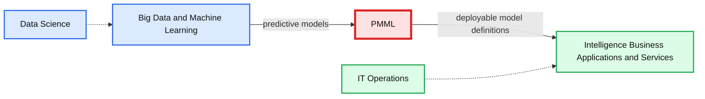

# Guest blog: PMML Support in Apache Spark's MLlib

- Source: https://www.databricks.com/blog/2015/07/02/pmml-support-in-apache-spark-mllib.html
- Published: 2015-07-02
- Authors: Vincenzo Selvaggio
- Categories: engineering, solutions, open-source
- Images: 1 total, 1 extracted as architecture

This is a guest blog from our friend Vincenzo Selvaggio who contributed this feature. He is a Senior Java Technical Architect and Project Manager, focusing on delivering advanced business process solutions for investment banks.

---

The recently released Apache Spark 1.4 introduces PMML support to MLlib for linear models and k-means clustering. This achievement is the result of active discussions from the community on JIRA ([https://issues.apache.org/jira/browse/SPARK-1406](https://issues.apache.org/jira/browse/SPARK-1406)) and GitHub ([https://github.com/apache/spark/pull/3062](https://github.com/apache/spark/pull/3062)) and embraces interoperability between Apache Spark and other platforms when it comes to predictive analytics.

## What is PMML?

Predictive Model Markup Language (PMML) is the leading data mining standard developed by The Data Mining Group (DMG), an independent consortium, and it has been adopted by major  vendors and organizations ([http://dmg.org/pmml/products.html](http://dmg.org/pmml/products.html)). PMML uses XML to represent data mining models. A PMML document is an XML document with the following components:

- a **Header** giving general information such as a description of the model and the application used to generate it
- a **DataDictionary** containing the definition of fields used by the model
- a **Model** defining the structure and the parameters of the data mining model

## Why use PMML?

PMML allows users to build a model in one system, export it and deploy it in a different environment for prediction. In other words, it enables different platforms to speak the same language, removing the need for custom storage formats.

*Image courtesy of Villu Ruusmann*

**Summary:** PMML connects big data and machine learning in data science with business intelligence and applications in IT operations.

**Components:**

- Big Data and Machine Learning: data science technologies
- PMML: predictive model markup language
- Intelligence, Business, Applications and Services: business technologies
- IT operations: operational environment

**Flows:**

- Big Data and Machine Learning -> PMML: predictive models
- PMML -> Intelligence, Business, Applications and Services: deployable model definitions

**Numbers:** none

source image: https://www.databricks.com/wp-content/uploads/2015/07/Screen-Shot-2015-07-02-at-9.53.31-AM-1024x229.png

Image courtesy of Villu Ruusmann

What's more, adopting a standard encourages best practices (established ways of structuring models) and transparency (PMML documents are fully intelligible and not black boxes).

## Why is Spark supporting PMML?

Building a model (producer) and scoring it (consumer) are two tasks very much decoupled as they require different systems and supporting infrastructure.

Model building is a complex task, it is performed on a large amount of historical data and requires a fast and scalable engine to produce correct results: this is where Apache Spark's MLlib shines.

Model scoring is performed by operational applications tuned for high throughput and detached from the analytical platform. Exporting MLlib's models in PMML enables sharing models between Spark and operational apps and is key for the success of predictive analytics.

## A Code Example

In Spark, Exporting a data mining model to PMML is as simple as calling `model.toPMML`. Here a complete example, in Scala, of building a KMeansModel and exporting it to a local file:

import org.apache.spark.mllib.clustering.KMeans
 import org.apache.spark.mllib.linalg.Vectors

// Load and parse the data
 val data = sc.textFile("/path/to/file")
 .map(s => Vectors.dense(s.split(',').map(_.toDouble)))

// Cluster the data into three classes using KMeans
 val numIterations = 20
 val numClusters = 3
 val kmeansModel = KMeans.train(data, numClusters, numIterations)

// Export clustering model to PMML
 kmeansModel.toPMML("/path/to/kmeans.xml")

The PMML document generated is in this file: `[kmeans.pmml](https://www.databricks.com/wp-content/uploads/2015/07/kmeans.pmml_.txt)`

For more examples of models exported and how those may be scored separately from Spark using the JPMML library, see

[https://spark-packages.org/package/selvinsource/spark-pmml-exporter-validator](https://spark-packages.org/package/selvinsource/spark-pmml-exporter-validator).

## Summary

With Apache Spark 1.4 PMML model export has been introduced, making MLlib interoperable with PMML compliant systems. You can find the supported models and how to export those to PMML from the official documentation page:

[https://spark.apache.org/docs/latest/mllib-pmml-model-export.html](https://spark.apache.org/docs/latest/mllib-pmml-model-export.html). We want to thank everyone who helped review and QA the implementation.

There is still work to do for MLlib’s PMML support, for example, supporting PMML export for more models and add Python API. For more details, please visit [https://issues.apache.org/jira/browse/SPARK-8545](https://issues.apache.org/jira/browse/SPARK-8545).
