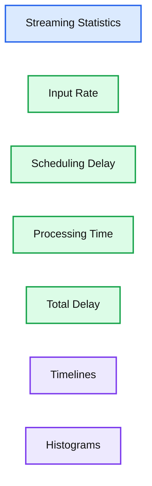
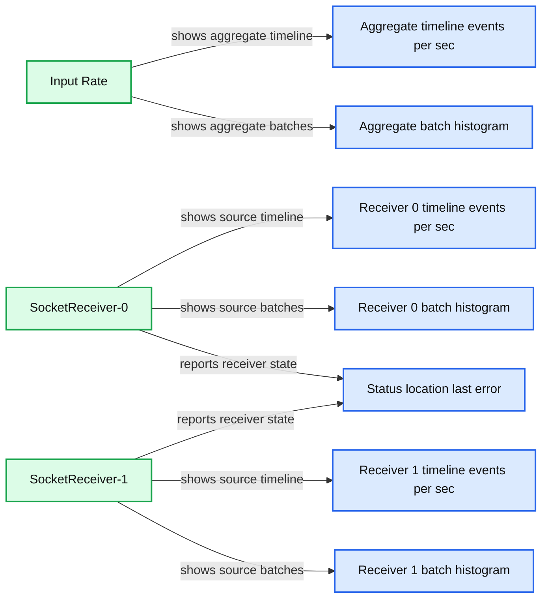
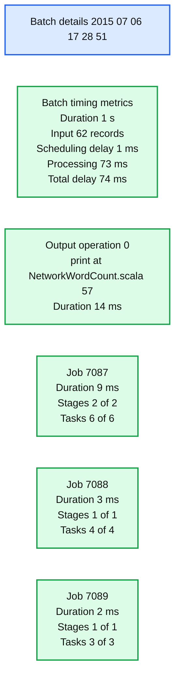
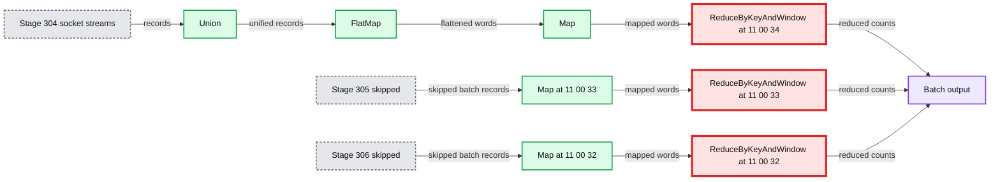

# New Visualizations for Understanding Apache Spark Streaming Applications

- Source: https://www.databricks.com/blog/2015/07/08/new-visualizations-for-understanding-apache-spark-streaming-applications.html
- Published: 2015-07-08
- Authors: Tathagata Das, Shixiong Zhu, Andrew Or
- Categories: engineering, open-source, data-engineering
- Images: 7 total, 6 extracted as architecture

Earlier, we presented [new visualizations](https://www.databricks.com/blog/2015/06/22/understanding-your-spark-application-through-visualization.html) introduced in Apache Spark 1.4.0 to understand the behavior of Spark applications. Continuing the theme, this blog highlights new visualizations introduced specifically for understanding Spark Streaming applications. We have updated the Streaming tab of the Spark UI to show the following:

- Timelines and statistics of events rates, scheduling delays and processing times of past batches.
- Details of all the Spark jobs in each batch.

Additionally, the [execution DAG visualization](https://www.databricks.com/blog/2015/06/22/understanding-your-spark-application-through-visualization.html) is augmented with the streaming information for understanding the job execution in the context of the streaming operations.

Let’s take a look at these in more detail with an end-to-end example of analyzing a streaming application.

## Timelines and Histograms for Processing Trends

When debugging Spark Streaming applications, users are often interested in the rate at which data is being received and the processing time of each batch. The new UI in the streaming tab makes it easy to see the current metrics as well as the trends over that past 1000 batches. While running a streaming application, you will see something like *figure 1* below if you visit the streaming tab in the Spark UI (Red letters such as [A] are our annotations, not part of the UI):

**Summary:** Spark Streaming UI statistics showing application status, input rate, scheduling delay, processing time, total delay, timelines, and histograms.

**Components:**

- Streaming Statistics, Spark Streaming UI
- Input Rate, Spark Streaming metric
- Scheduling Delay, Spark Streaming metric
- Processing Time, Spark Streaming metric
- Total Delay, Spark Streaming metric
- Timelines, historical batch charts
- Histograms, batch distribution charts

**Flows:**

- none

**Numbers:**

- Batch interval: 1 second
- Runtime: 39 minutes 26 seconds
- Start time: 2015/07/06 16:49:27
- Completed batches: 2367
- Records: 151429
- Timeline range: last 1000 batches
- Active batches: 0
- Completed timeline batches: 1000
- Input Rate average: 48.61 events/sec
- Input Rate axis: 0.00, 100.00, 200.00, 300.00 events/sec
- Timeline times: 17:12:15 and 17:28:54
- Histogram axis: 0, 200, 400, 600, 800, 1,000 batches
- Scheduling Delay average: 0 ms
- Scheduling Delay axis: 0.00, 20.00, 40.00, 60.00, 80.00 ms
- Processing Time average: 20 ms
- Processing Time axis: 0.00, 20.00, 40.00, 60.00, 80.00 ms
- Total Delay average: 20 ms
- Total Delay axis: 0.00, 20.00, 40.00, 60.00, 80.00 ms



<sub>source image: https://www.databricks.com/wp-content/uploads/2015/07/image1.png</sub>

Figure 1: Streaming tab in the Spark UI

The first line (marked as **[A]**) shows the current status of the streaming application - in this example, the application has been running for almost 40 minutes at a 1-second batch interval. Below that, the timeline of **Input Rate** (marked as **[B]**) shows that the streaming app has been receiving data at a rate of about 49 events/second across all its sources. In this example, the timeline shows a slight dip in the average rate in the middle (marked as** [C]**), from which the application recovered towards the end of the timeline. If you want get more details, you can click the dropdown beside **Input Rate** (near** [B]**) to show timelines organized by each source, as shown in *figure 2 *below.

**Summary:** Spark Streaming UI showing aggregate and per-source input-rate timelines and batch-count histograms for two socket receivers.

**Components:**

- Input Rate aggregate metric
- Aggregate timeline in events/sec
- Aggregate batch histogram
- SocketReceiver-0 source
- SocketReceiver-0 timeline in events/sec
- SocketReceiver-0 batch histogram
- SocketReceiver-1 source
- SocketReceiver-1 timeline in events/sec
- SocketReceiver-1 batch histogram
- Status, location, last error time, and last error message table

**Flows:**

- Input Rate -> SocketReceiver-0: source-level input-rate breakdown
- Input Rate -> SocketReceiver-1: source-level input-rate breakdown

**Numbers:**

- Last 1000 batches
- 0 active
- 1000 completed
- Aggregate average: 48.61 events/sec
- SocketReceiver-0 average: 10.55 events/sec
- SocketReceiver-1 average: 38.06 events/sec
- Timeline range: 17:12:15 to 17:28:54
- Timeline ticks: 0.00, 100.00, 200.00, 300.00 events/sec
- Histogram ticks: 0, 200, 400, 600, 800, 1,000 batches
- Receiver identifiers: 0 and 1



<sub>source image: https://www.databricks.com/wp-content/uploads/2015/07/image2.png</sub>

Figure 2

*Figure 2* shows that the app had two sources (***SocketReceiver-0*** and ***SocketReceiver-1),*** one of which caused the overall receive rate to dip because it had stopped receiving data for a short duration.

Further down in the page (marked as ***[D]*** in* figure 1*), the timeline for ***Processing Time ***shows that these batches have been processed within 20 ms on average. Having a shorter processing time comparing to the batch interval (1s in this example) means that the ***Scheduling Delay*** (defined as the time a batch waits for previous batches to complete, and marked as ***[E] ***in *figure 1*) is mostly zero because the batches are processed as fast as they are created. This scheduling delay is the key indicator of whether your streaming application is stable or not, and this UI makes it easy to monitor it.

## Batch Details

Referring to *figure 1* once again, you may be curious regarding why some batches towards the right took longer to complete (note** [F]** in *figure 1*). You can easily analyze this through the UI. First of all, you can click on the points in the timeline graph that have higher batch processing times. This will take you to the list of completed batches further down in the page.

Figure 3

It will show all primary details of the individual batch (highlighted in green in *figure 3* above). As you can see, this batch has longer processing time than other batches. The next obvious question is what Spark jobs caused the longer processing time of this batch. You can investigate this by clicking on the batch time (the blue links in the first column), which will take you to the detailed information of the corresponding batch to show you the output operations and their Spark jobs (*Figure 4*).

**Summary:** Spark Streaming batch details showing one output operation and its three associated Spark jobs.

**Components:**

- Batch details for the Spark Streaming application
- Batch timing metrics
- Output operation 0
- Spark job 7087
- Spark job 7088
- Spark job 7089
- Stages and task status indicators

**Flows:**

- none

**Numbers:**

- Timestamp: 2015/07/06 17:28:51
- Batch duration: 1 s
- Input data size: 62 records
- Scheduling delay: 1 ms
- Processing time: 73 ms
- Total delay: 74 ms
- Output operation ID: 0
- Source line: 57
- Output operation duration: 14 ms
- Job IDs: 7087, 7088, 7089
- Job durations: 9 ms, 3 ms, 2 ms
- Stages: 2/2, 1/1, 1/1
- Skipped stages: 2, 3, 3
- Tasks: 6/6, 4/4, 3/3
- Skipped tasks: 10, 15, 15



<sub>source image: https://www.databricks.com/wp-content/uploads/2015/07/image4.png</sub>

Figure 4

*Figure 4* above shows that there was one output operation that generated 3 Spark jobs. You can click on the job IDs to continue digging into the stages and tasks for further analysis.

## Execution DAGs of Streaming RDDs

Once you have started analyzing the tasks and stages generated by the batch jobs, it is useful to get a deeper understanding of the execution graph. As shown in the [previous blog post](https://www.databricks.com/blog/2015/06/22/understanding-your-spark-application-through-visualization.html), Spark 1.4.0 has added visualizations of the execution DAG (that is, directed acyclic graph) that shows the chain of RDD dependencies and how the RDDs are processed with a chain of dependent stages. If these RDDs are generated by DStreams in a streaming application, then the visualization shows additional streaming semantics. Let’s start with a simple streaming word count program in which we count the words received in each batch. See the example [NetworkWordCount](https://github.com/apache/spark/blob/master/examples/src/main/scala/org/apache/spark/examples/streaming/NetworkWordCount.scala). It uses DStream operations ***flatMap, map*** and ***reduceByKey*** compute the word count. The execution DAG of a Spark job in any batch will look like *figure 5* below.

**Summary:** Spark Streaming job DAG showing socket input transformed through flatMap and map, then reduceByKey across two execution stages.

**Components:**

- Socket text stream using Spark Streaming
- flatMap DStream operation
- map DStream operation
- Stage 1847 executing input and map transformations
- reduceByKey DStream operation
- Stage 1848 executing the reduceByKey transformation
- Completed stages table with task status, submission date, and duration

**Flows:**

- Socket text stream -> flatMap: RDD generated at batch time 16:06:50
- flatMap -> map: transformed RDD
- map -> reduceByKey: mapped RDD transferred between stages
- Stage 1847 -> Stage 1848: shuffle data for reduceByKey

**Numbers:**

- Job 924
- Completed stages: 2
- Stage 1847
- Stage 1848
- Batch time 16:06:50
- Submission date 2015/07/06
- Stage 1848 duration: 2 ms
- Stage 1847 duration: 4 ms
- Stage 1848 tasks: 1/1
- Stage 1847 tasks: 5/5
- NetworkWordCount.scala:54
- NetworkWordCount.scala:55

```mermaid
%% Spark Streaming execution DAG with two completed stages
flowchart LR
    input[Socket text stream]
    flatmap[flatMap at 16 06 50]
    map[map at 16 06 50]
    reduce[reduceByKey at 16 06 50]
    stage1847[Stage 1847]
    stage1848[Stage 1848]
    table[Completed stages 2]

    input -->|RDD at batch time| flatmap
    flatmap -->|transformed RDD| map
    map -->|shuffle data| reduce
    stage1847 -->|contains input flatMap and map| map
    reduce -->|executes in| stage1848
    stage1847 -->|completed 5 of 5 tasks| table
    stage1848 -->|completed 1 of 1 task| table

    classDef client fill:#dbeafe,stroke:#2563eb,stroke-width:2px,color:#111
    classDef service fill:#dcfce7,stroke:#16a34a,stroke-width:2px,color:#111
    classDef store fill:#ede9fe,stroke:#7c3aed,stroke-width:2px,color:#111
    classDef cache fill:#fef3c7,stroke:#d97706,stroke-width:2px,color:#111
    classDef queue fill:#cffafe,stroke:#0891b2,stroke-width:2px,color:#111
    classDef critical fill:#fee2e2,stroke:#dc2626,stroke-width:4px,color:#111
    classDef external fill:#e5e7eb,stroke:#6b7280,stroke-width:2px,color:#111,stroke-dasharray:4 3
    classDef decision fill:#fce7f3,stroke:#db2777,stroke-width:2px,color:#111

    class input external
    class flatmap,map,reduce service
    class stage1847,stage1848 critical
    class table store
```



<sub>source image: https://www.databricks.com/wp-content/uploads/2015/07/image5.png</sub>

Figure 5

The black dots in the visualization represents the RDDs generated by DStream at batch time 16:06:50. The blue shaded boxes refer to the DStream operations that were used to transform the RDDs, and the pink boxes refer to the stages in which these transformations were executed. Overall this shows the following:

- The data was received from a single*** socket text stream*** at batch time 16:06:50
- The job used two stages to compute word counts from the data using the transformations ***flatMap***, ***map***, and ***reduceByKey***.

While this was a simple graph, it can get more complex with more input streams and advanced DStream transformations like ***window*** operations and ***updateStateByKey*** operation. For example, if we compute counts over a moving window of 3 batches (that is, using ***reduceByKeyAndWindow***) using data from two socket text streams, the execution DAG of one of the batch jobs would look like *figure 6* below:

**Summary:** Spark Streaming execution DAG showing word counts from three batches of two socket text streams through union, map, flatMap, and reduceByKeyAndWindow operations.

**Components:**

- Stage 304 with socket text stream 0 and socket text stream 1
- Union transformation
- FlatMap transformation
- Map transformation
- Stage 305 skipped with socket text streams and transformations
- Stage 306 skipped with socket text streams and transformations
- Stage 307 with three reduceByKeyAndWindow operations
- Batch output nodes

**Flows:**

- Socket text stream 0 in Stage 304 -> Union: stream records
- Socket text stream 1 in Stage 304 -> Union: stream records
- Union -> FlatMap: unified records
- FlatMap -> Map: flattened words
- Map -> Stage 307 first reduceByKeyAndWindow: mapped words
- Socket text stream 0 in Stage 305 -> Union in Stage 305: skipped batch records
- Socket text stream 1 in Stage 305 -> Union in Stage 305: skipped batch records
- Union in Stage 305 -> FlatMap in Stage 305: skipped unified records
- FlatMap in Stage 305 -> Map in Stage 305: skipped flattened words
- Map in Stage 305 -> Stage 307 second reduceByKeyAndWindow: mapped words
- Socket text stream 0 in Stage 306 -> Union in Stage 306: skipped batch records
- Socket text stream 1 in Stage 306 -> Union in Stage 306: skipped batch records
- Union in Stage 306 -> FlatMap in Stage 306: skipped unified records
- FlatMap in Stage 306 -> Map in Stage 306: skipped flattened words
- Map in Stage 306 -> Stage 307 third reduceByKeyAndWindow: mapped words
- ReduceByKeyAndWindow operations -> Batch output: reduced word counts

**Numbers:** 0, 1, 3, 304, 305, 306, 307, 11:00:32, 11:00:33, 11:00:34



<sub>source image: https://www.databricks.com/wp-content/uploads/2015/07/image6.png</sub>

Figure 6

*Figure 6 *shows a lot of information about a Spark job that counts words across data from 3 batches:

- The first three stages essentially count the words within each of the 3 batches in the window. These are roughly similar to the first stage in the simple ***NetworkWordCount*** above, with ***map*** and ***flatMap*** operations. However note the following differences:
  1. There were two input RDDs, one from each of the two ***socket text streams.*** These two RDDs were ***union*ed** together into a single RDD and then further transformed to generate the per-batch intermediate counts.
  2. Two of these stages are grayed out because the intermediate counts of the older two batches are already cached in memory and hence do not require recomputation. Only the latest batch needs to be computed from scratch.
- The last stage on the right uses ***reduceByKeyAndWindow*** to combine per-batch word counts into the “windowed” word counts.

These visualizations enable developers to monitor the status and trends of streaming applications as well as understand their relations with the underlying Spark jobs and execution plans.

## Future Directions

One significant improvement expected in Spark 1.5.0 is more information about input data in every batch ([JIRA](https://issues.apache.org/jira/browse/SPARK-8701), [PR](https://github.com/apache/spark/pull/7081)). For example, if you were using Kafka, the batch details page will show the topics, partitions and offsets processed in that batch. Here is a preview:

**Summary:** Batch details for a Spark Streaming application, including input metadata, job stages, task completion, and errors.

**Components:**

- Batch details panel using Apache Spark Streaming
- File stream input with three files
- Kafka direct stream input
- Input metadata table
- Output operation
- Spark jobs 0, 1, and 2
- Stages and task progress indicators
- Error column

**Flows:**

- none

**Numbers:**

2015/07/04 19:23:00; batch duration 1.0 min; input data size 6 records; scheduling delay 2 ms; processing time 0.6 s; total delay 0.6 s; file stream [1]; three file paths; Kafka direct stream [0]; topic test1; partition 0; range [21, 24]; topic test2; partition 0; range [22, 28]; output operation 0; DirectKafkaWordCount.scala:55; duration 0.5 s; job 0; stages 2/2; tasks 6/6; job 1; duration 11 ms; stages 1/1; 1 skipped; tasks 4/4; 5 skipped; job 2; duration 18 ms; stages 1/1; 1 skipped; tasks 3/3; 5 skipped.

```text
%% mermaid failed to render; kept as text
%% Shows Spark Streaming batch details and execution progress
flowchart LR
    A[Batch details<br>2015 07 04 19 23 00]:::service
    B[File stream<br>three files]:::external
    C[Kafka direct stream<br>test1 and test2]:::queue
    D[Input metadata<br>files topics partitions offsets]:::store
    E[Output operation<br>DirectKafkaWordCount scala 55]:::service
    F[Job 0<br>0.5 s<br>2 of 2 stages<br>6 of 6 tasks]:::service
    G[Job 1<br>11 ms<br>1 of 1 stage<br>4 of 4 tasks<br>1 stage skipped<br>5 tasks skipped]:::service
    H[Job 2<br>18 ms<br>1 of 1 stage<br>3 of 3 tasks<br>1 stage skipped<br>5 tasks skipped]:::service
    I[Error]:::critical

    B -->|input records| D
    C -->|Kafka offsets| D
    D -->|batch input| E
    E -->|execution| F
    E -->|execution| G
    E -->|execution| H

    classDef client   fill:#dbeafe,stroke:#2563eb,stroke-width:2px,color:#111
    classDef service  fill:#dcfce7,stroke:#16a34a,stroke-width:2px,color:#111
    classDef store    fill:#ede9fe,stroke:#7c3aed,stroke-width:2px,color:#111
    classDef cache    fill:#fef3c7,stroke:#d97706,stroke-width:2px,color:#111
    classDef queue    fill:#cffafe,stroke:#0891b2,stroke-width:2px,color:#111
    classDef critical fill:#fee2e2,stroke:#dc2626,stroke-width:4px,color:#111
    classDef external fill:#e5e7eb,stroke:#6b7280,stroke-width:2px,color:#111,stroke-dasharray:4 3
    classDef decision fill:#fce7f3,stroke:#db2777,stroke-width:2px,color:#111
    client = clients edge gateway LB
    service = stateless compute
    store = databases durable storage
    cache = Redis CDN or losable data
    queue = Kafka streams async pipes
    critical = bottleneck or SPOF
    external = third party
    decision = trade off point
```

<sub>source image: https://www.databricks.com/wp-content/uploads/2015/07/image7.png</sub>

Figure 7
