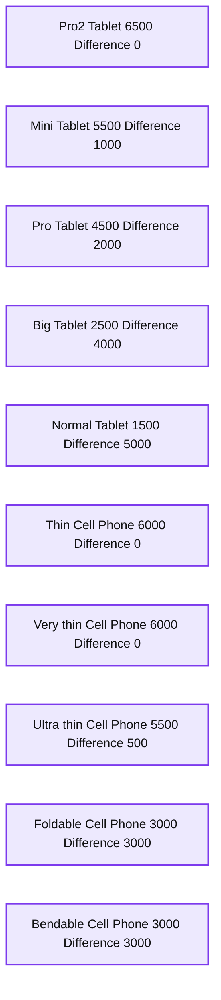
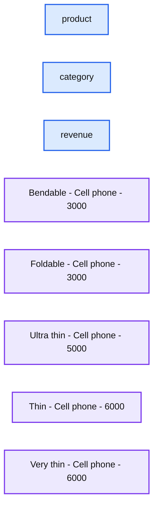
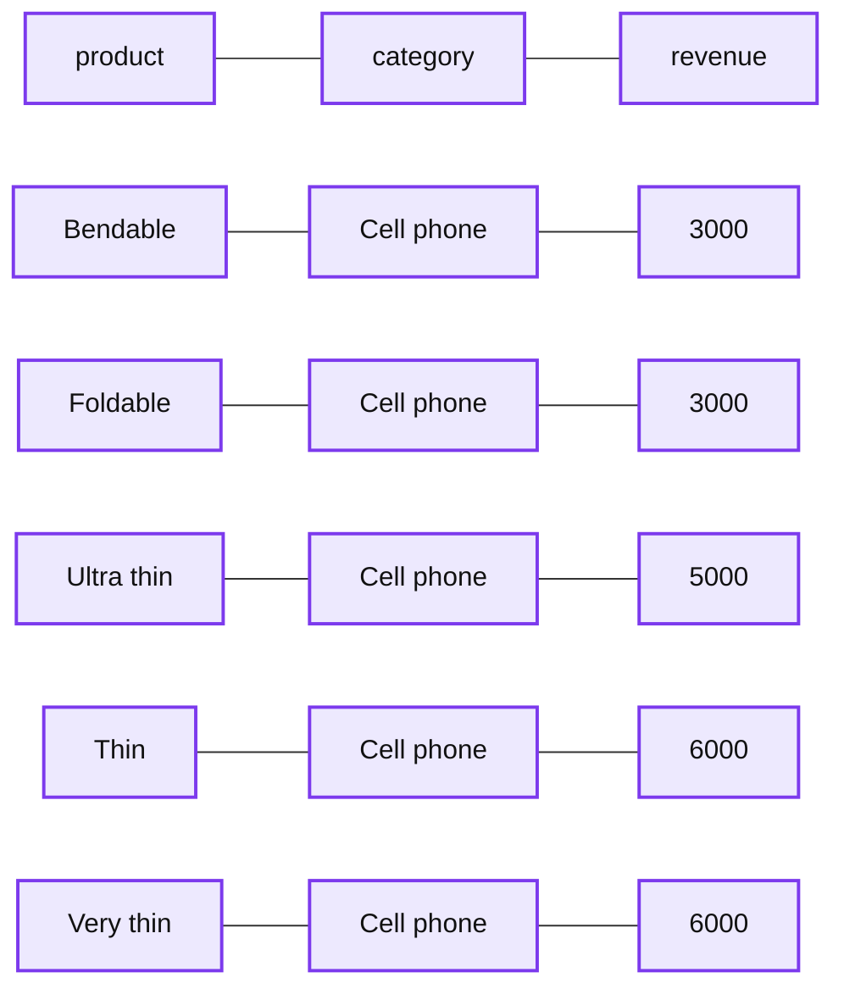
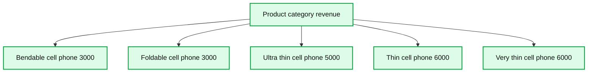

# Introducing Window Functions in Spark SQL

- Source: https://www.databricks.com/blog/2015/07/15/introducing-window-functions-in-spark-sql.html
- Published: 2015-07-15
- Authors: Yin Huai, Michael Armbrust
- Categories: engineering, open-source
- Images: 8 total, 8 extracted as architecture

[Get an early preview of O'Reilly's new ebook for the step-by-step guidance you need to start using Delta Lake.](https://www.databricks.com/resources/ebook/delta-lake-running-oreilly?itm_data=windowfunctionspark-blog-oreillyupandrunning )

---

In this blog post, we introduce the new window function feature that was added in [Apache Spark](https://www.databricks.com/glossary/what-is-apache-spark). Window functions allow users of Spark SQL to calculate results such as the rank of a given row or a moving average over a range of input rows. They significantly improve the expressiveness of Spark’s SQL and DataFrame APIs. This blog will first introduce the concept of window functions and then discuss how to use them with Spark SQL and Spark’s DataFrame API.

## What are Window Functions?

Before 1.4, there were two kinds of functions supported by Spark SQL that could be used to calculate a single return value. *Built-in functions* or *UDFs*, such as `substr` or `round`, take values from a single row as input, and they generate a single return value for every input row. *Aggregate functions, *such as `SUM` or `MAX`*,* operate on a group of rows and calculate a single return value for every group.

While these are both very useful in practice, there is still a wide range of operations that cannot be expressed using these types of functions alone. Specifically, there was no way to both operate on a group of rows while still returning a single value for every input row. This limitation makes it hard to conduct various data processing tasks like calculating a moving average, calculating a cumulative sum, or accessing the values of a row appearing before the current row. Fortunately for users of Spark SQL, window functions fill this gap.

At its core, a window function calculates a return value for every input row of a table based on a group of rows, called the *Frame*. Every input row can have a unique frame associated with it. This characteristic of window functions makes them more powerful than other functions and allows users to express various data processing tasks that are hard (if not impossible) to be expressed without window functions in a concise way. Now, let’s take a look at two examples.

Suppose that we have a *productRevenue* table as shown below.

**Summary:** A product revenue table organized by product, category, and revenue.

**Components:**

- Product column
- Category column
- Revenue column
- Thin, Cell phone, 6000
- Normal, Tablet, 1500
- Mini, Tablet, 5500
- Ultra thin, Cell phone, 5000
- Very thin, Cell phone, 6000
- Big, Tablet, 2500
- Bendable, Cell phone, 3000
- Foldable, Cell phone, 3000
- Pro, Tablet, 4500
- Pro2, Tablet, 6500

**Flows:**

- none

**Numbers:** 6000, 1500, 5500, 5000, 6000, 2500, 3000, 3000, 4500, 6500

```text
%% mermaid failed to render; kept as text
%% Product revenue table organized by product, category, and revenue
flowchart TD
  H1[Product]:::service
  H2[Category]:::service
  H3[Revenue]:::service
  R1[Thin | Cell phone | 6000]:::store
  R2[Normal | Tablet | 1500]:::store
  R3[Mini | Tablet | 5500]:::store
  R4[Ultra thin | Cell phone | 5000]:::store
  R5[Very thin | Cell phone | 6000]:::store
  R6[Big | Tablet | 2500]:::store
  R7[Bendable | Cell phone | 3000]:::store
  R8[Foldable | Cell phone | 3000]:::store
  R9[Pro | Tablet | 4500]:::store
  R10[Pro2 | Tablet | 6500]:::store

  classDef client fill:#dbeafe,stroke:#2563eb,stroke-width:2px,color:#111
  classDef service fill:#dcfce7,stroke:#16a34a,stroke-width:2px,color:#111
  classDef store fill:#ede9fe,stroke:#7c3aed,stroke-width:2px,color:#111
  classDef cache fill:#fef3c7,stroke:#d97706,stroke-width:2px,color:#111
  classDef queue fill:#cffafe,stroke:#0891b2,stroke-width:2px,color:#111
  classDef critical fill:#fee2e2,stroke:#dc2626,stroke-width:4px,color:#111
  classDef external fill:#e5e7eb,stroke:#6b7280,stroke-width:2px,color:#111,stroke-dasharray:4 3
  classDef decision fill:#fce7f3,stroke:#db2777,stroke-width:2px,color:#111
```

<sub>source image: https://www.databricks.com/wp-content/uploads/2015/07/1-1.png</sub>

We want to answer two questions:

1. What are the best-selling and the second best-selling products in every category?
2. What is the difference between the revenue of each product and the revenue of the best-selling product in the same category of that product?

To answer the first question “*What are the best-selling and the second best-selling products in every category?*”, we need to rank products in a category based on their revenue, and to pick the best selling and the second best-selling products based the ranking. Below is the SQL query used to answer this question by using window function `dense_rank` (we will explain the syntax of using window functions in next section).

The result of this program is shown below. Without using window functions, users have to find all highest revenue values of all categories and then join this derived data set with the original *productRevenue* table to calculate the revenue differences.

**Summary:** The table shows product revenues and revenue differences grouped by category.

**Components:**

- Product column
- Category column
- Revenue column
- Revenue difference column
- Tablet products: Pro2, Mini, Pro, Big, Normal
- Cell Phone products: Thin, Very thin, Ultra thin, Foldable, Bendable

**Flows:**

- none

**Numbers:** 2, 6500, 0, 5500, 1000, 4500, 2000, 2500, 4000, 1500, 5000, 6000, 3000, 500



<sub>source image: https://www.databricks.com/wp-content/uploads/2015/07/1-3.png</sub>

## Using Window Functions

Spark SQL supports three kinds of window functions: ranking functions, analytic functions, and aggregate functions. The available ranking functions and analytic functions are summarized in the table below. For aggregate functions, users can use any existing aggregate function as a window function.

|  | **SQL** | **DataFrame API** |
|---|---|---|
| **Ranking functions** | rank | rank |
| dense_rank | denseRank |  |
| percent_rank | percentRank |  |
| ntile | ntile |  |
| row_number | rowNumber |  |
| **Analytic functions** | cume_dist | cumeDist |
| first_value | firstValue |  |
| last_value | lastValue |  |
| lag | lag |  |
| lead | lead |  |

To use window functions, users need to mark that a function is used as a window function by either

- Adding an *OVER* clause after a supported function in SQL, e.g. `avg(revenue) OVER (...)`; or
- Calling the *over* method on a supported function in the DataFrame API, e.g. `rank().over(...)`*.*

Once a function is marked as a window function, the next key step is to define the *Window Specification *associated with this function. A window specification defines which rows are included in the frame associated with a given input row. A window specification includes three parts:

1. Partitioning Specification: controls which rows will be in the same partition with the given row. Also, the user might want to make sure all rows having the same value for  the category column are collected to the same machine before ordering and calculating the frame.  If no partitioning specification is given, then all data must be collected to a single machine.
2. Ordering Specification: controls the way that rows in a partition are ordered, determining the position of the given row in its partition.
3. Frame Specification: states which rows will be included in the frame for the current input row, based on their relative position to the current row.  For example, "the three rows preceding the current row to the current row" describes a frame including the current input row and three rows appearing before the current row.

In SQL, the `PARTITION BY` and `ORDER BY` keywords are used to specify partitioning expressions for the partitioning specification, and ordering expressions for the ordering specification, respectively. The SQL syntax is shown below.

`OVER (PARTITION BY ... ORDER BY ...)`

In the DataFrame API, we provide utility functions to define a window specification. Taking Python as an example, users can specify partitioning expressions and ordering expressions as follows.

In addition to the ordering and partitioning, users need to define the start boundary of the frame, the end boundary of the frame, and the type of the frame, which are three components of a frame specification.

There are five types of boundaries, which are` UNBOUNDED PRECEDING`, `UNBOUNDED FOLLOWING`, `CURRENT ROW`, ` PRECEDING`, and ` FOLLOWING`. `UNBOUNDED PRECEDING` and `UNBOUNDED FOLLOWING` represent the first row of the partition and the last row of the partition, respectively. For the other three types of boundaries, they specify the offset from the position of the current input row and their specific meanings are defined based on the type of the frame. There are two types of frames, *ROW* frame and *RANGE* frame.

**ROW frame**

ROW frames are based on physical offsets from the position of the current input row, which means that `CURRENT ROW`, ` PRECEDING`, or ` FOLLOWING` specifies a physical offset. If `CURRENT ROW` is used as a boundary, it represents the current input row. ` PRECEDING` and ` FOLLOWING` describes the number of rows appear before and after the current input row, respectively. The following figure illustrates a ROW frame with a` 1 PRECEDING` as the start boundary and `1 FOLLOWING` as the end boundary (`ROWS BETWEEN 1 PRECEDING AND 1 FOLLOWING` in the SQL syntax).

**Summary:** A table showing products, their cell phone category, and revenue values.

**Components:**

- Product column
- Category column
- Revenue column
- Product rows: Bendable, Foldable, Ultra thin, Thin, Very thin

**Flows:**

- none

**Numbers:** 3000, 3000, 5000, 6000, 6000



<sub>source image: https://www.databricks.com/wp-content/uploads/2015/07/2-1-1024x338.png</sub>

**RANGE frame**

RANGE frames are based on logical offsets from the position of the current input row, and have similar syntax to the ROW frame. A logical offset is the difference between the value of the ordering expression of the current input row and the value of that same expression of the boundary row of the frame. Because of this definition, when a RANGE frame is used, only a single ordering expression is allowed. Also, for a RANGE frame, all rows having the same value of the ordering expression with the current input row are considered as same row as far as the boundary calculation is concerned.

Now, let’s take a look at an example. In this example, the ordering expressions is `revenue`; the start boundary is `2000 PRECEDING`; and the end boundary is `1000 FOLLOWING` (this frame is defined as `RANGE BETWEEN 2000 PRECEDING AND 1000 FOLLOWING` in the SQL syntax). The following five figures illustrate how the frame is updated with the update of the current input row. Basically, for every current input row, based on the value of revenue, we calculate the revenue range `[current revenue value - 2000, current revenue value + 1000]`. All rows whose revenue values fall in this range are in the frame of the current input row.

**Summary:** A table shows products, their category, and revenue values.

**Components:**

- Product column
- Category column
- Revenue column
- Bendable product
- Foldable product
- Ultra thin product
- Thin product
- Very thin product
- Cell phone category

**Flows:**

- none

**Numbers:** 3000, 3000, 5000, 6000, 6000



<sub>source image: https://www.databricks.com/wp-content/uploads/2015/07/2-2-1024x369.png</sub>

```mermaid
%% Shows product, category, and revenue rows
flowchart TD
  A[Product category revenue]
  B[Bendable Cell phone 3000]
  C[Foldable Cell phone 3000]
  D[Ultra thin Cell phone 5000]
  E[Thin Cell phone 6000]
  F[Very thin Cell phone 6000]

  classDef client fill:#dbeafe,stroke:#2563eb,stroke-width:2px,color:#111
  classDef service fill:#dcfce7,stroke:#16a34a,stroke-width:2px,color:#111
  classDef store fill:#ede9fe,stroke:#7c3aed,stroke-width:2px,color:#111
  classDef cache fill:#fef3c7,stroke:#d97706,stroke-width:2px,color:#111
  classDef queue fill:#cffafe,stroke:#0891b2,stroke-width:2px,color:#111
  classDef critical fill:#fee2e2,stroke:#dc2626,stroke-width:4px,color:#111
  classDef external fill:#e5e7eb,stroke:#6b7280,stroke-width:2px,color:#111,stroke-dasharray:4 3
  classDef decision fill:#fce7f3,stroke:#db2777,stroke-width:2px,color:#111

  class A,B,C,D,E,F service
```

**Summary:** A five-row product table showing categories and revenue values for cell phones.

**Components:**

- Product column
- Category column
- Revenue column
- Bendable product
- Foldable product
- Ultra thin product
- Thin product
- Very thin product

**Flows:**

- none

**Numbers:** 3000, 3000, 5000, 6000, 6000



<sub>source image: https://www.databricks.com/wp-content/uploads/2015/07/2-3-1024x263.png</sub>

**Summary:** A table shows five cell phone products and their revenues.

**Components:**

- Product column
- Category column
- Revenue column
- Bendable row
- Foldable row
- Ultra thin row
- Thin row
- Very thin row

**Flows:**

- none

**Numbers:** 3000, 3000, 5000, 6000, 6000



<sub>source image: https://www.databricks.com/wp-content/uploads/2015/07/2-4-1024x263.png</sub>

```mermaid
%% Shows a product revenue table
flowchart TD
    H["product | category | revenue"]
    R1["Bendable | Cell phone | 3000"]
    R2["Foldable | Cell phone | 3000"]
    R3["Ultra thin | Cell phone | 5000"]
    R4["Thin | Cell phone | 6000"]
    R5["Very thin | Cell phone | 6000"]

    classDef client fill:#dbeafe,stroke:#2563eb,stroke-width:2px,color:#111
    classDef service fill:#dcfce7,stroke:#16a34a,stroke-width:2px,color:#111
    classDef store fill:#ede9fe,stroke:#7c3aed,stroke-width:2px,color:#111
    classDef cache fill:#fef3c7,stroke:#d97706,stroke-width:2px,color:#111
    classDef queue fill:#cffafe,stroke:#0891b2,stroke-width:2px,color:#111
    classDef critical fill:#fee2e2,stroke:#dc2626,stroke-width:4px,color:#111
    classDef external fill:#e5e7eb,stroke:#6b7280,stroke-width:2px,color:#111,stroke-dasharray:4 3
    classDef decision fill:#fce7f3,stroke:#db2777,stroke-width:2px,color:#111

    class H,R1,R2,R3,R4,R5 service
```

**Summary:** A product revenue table showing five cell phone products, with three rows highlighted.

**Components:**

- Product column
- Category column
- Revenue column
- Bendable cell phone revenue 3000
- Foldable cell phone revenue 3000
- Ultra thin cell phone revenue 5000
- Thin cell phone revenue 6000
- Very thin cell phone revenue 6000

**Flows:**

- none

**Numbers:** 3000, 3000, 5000, 6000, 6000



<sub>source image: https://www.databricks.com/wp-content/uploads/2015/07/2-5-1024x263.png</sub>

**Summary:** A revenue table lists five cell phone products and their revenue values.

**Components:**

- Product column
- Category column
- Revenue column
- Bendable
- Foldable
- Ultra thin
- Thin
- Very thin
- Cell phone category

**Flows:**

- none

**Numbers:** 3000, 3000, 5000, 6000, 6000



<sub>source image: https://www.databricks.com/wp-content/uploads/2015/07/2-6-1024x263.png</sub>

```mermaid
%% Shows the product, category, and revenue table
flowchart LR
  Product[product]
  Category[category]
  Revenue[revenue]
  Bendable[Bendable]
  Foldable[Foldable]
  UltraThin[Ultra thin]
  Thin[Thin]
  VeryThin[Very thin]
  CellPhone[Cell phone]
  R1[3000]
  R2[3000]
  R3[5000]
  R4[6000]
  R5[6000]

  classDef client fill:#dbeafe,stroke:#2563eb,stroke-width:2px,color:#111
  classDef service fill:#dcfce7,stroke:#16a34a,stroke-width:2px,color:#111
  classDef store fill:#ede9fe,stroke:#7c3aed,stroke-width:2px,color:#111
  classDef cache fill:#fef3c7,stroke:#d97706,stroke-width:2px,color:#111
  classDef queue fill:#cffafe,stroke:#0891b2,stroke-width:2px,color:#111
  classDef critical fill:#fee2e2,stroke:#dc2626,stroke-width:4px,color:#111
  classDef external fill:#e5e7eb,stroke:#6b7280,stroke-width:2px,color:#111,stroke-dasharray:4 3
  classDef decision fill:#fce7f3,stroke:#db2777,stroke-width:2px,color:#111

  class Product,Category,Revenue client
  class Bendable,Foldable,UltraThin,Thin,VeryThin,CellPhone service
  class R1,R2,R3,R4,R5 store
```

In summary, to define a window specification, users can use the following syntax in SQL.

`OVER (PARTITION BY ... ORDER BY ... frame_type BETWEEN start AND end)`

Here, `frame_type` can be either ROWS (for ROW frame) or RANGE (for RANGE frame); `start` can be any of `UNBOUNDED PRECEDING`, `CURRENT ROW`, ` PRECEDING`, and ` FOLLOWING`; and `end` can be any of `UNBOUNDED FOLLOWING`, `CURRENT ROW`, ` PRECEDING`, and ` FOLLOWING.`

In the Python DataFrame API, users can define a window specification as follows.

## What’s next?

Since the release of [Spark](https://www.databricks.com/spark/about) 1.4, we have been actively working with community members on optimizations that improve the performance and reduce the memory consumption of the operator evaluating window functions. Some of these will be added in Spark 1.5, and others will be added in our future releases. Besides performance improvement work, there are two features that we will add in the near future to make window function support in Spark SQL even more powerful. First, we have been working on adding Interval data type support for Date and Timestamp data types ([SPARK-8943](https://issues.apache.org/jira/browse/SPARK-8943)). With the Interval data type, users can use intervals as values specified in ` PRECEDING` and ` FOLLOWING` for RANGE frame, which makes it much easier to do various time series analysis with window functions. Second, we have been working on adding the support for user-defined aggregate functions in Spark SQL ([SPARK-3947](https://issues.apache.org/jira/browse/SPARK-3947)). With our window function support, users can immediately use their user-defined aggregate functions as window functions to conduct various advanced data analysis tasks.

*To try out these Spark features, [get a free trial of Databricks or use the Community Edition](https://www.databricks.com/try-databricks).*

## Acknowledgements

The development of the window function support in Spark 1.4 is is a joint work by many members of the Spark community. In particular, we would like to thank Wei Guo for contributing the initial patch.
