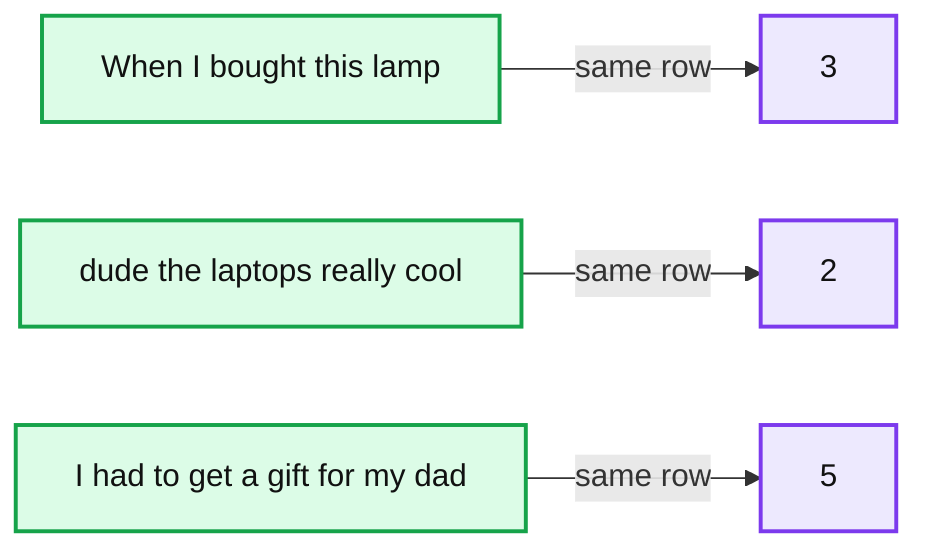
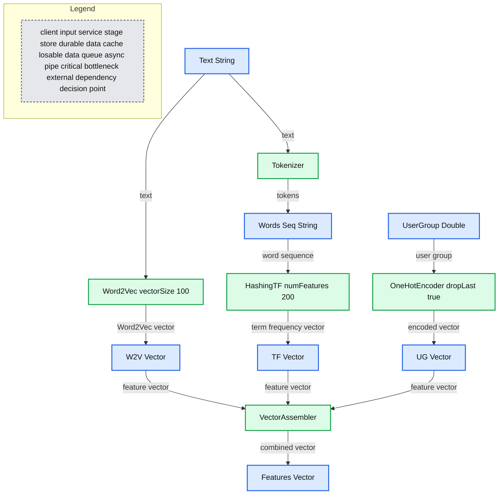

# New Features in Machine Learning Pipelines in Apache Spark 1.4

- Source: https://www.databricks.com/blog/2015/07/29/new-features-in-machine-learning-pipelines-in-apache-spark-1-4.html
- Published: 2015-07-29
- Authors: Joseph Bradley, Burak Yavuz
- Categories: engineering, data-science-machine-learning, open-source
- Images: 2 total, 2 extracted as architecture

Apache Spark 1.2 introduced Machine Learning (ML) Pipelines to facilitate the creation, tuning, and inspection of practical ML workflows. Spark’s latest release, Spark 1.4, significantly extends the ML library.  In this post, we highlight  several new features in the ML Pipelines API, including:

- A stable API — *Pipelines have graduated from Alpha!*
- New feature transformers
- Additional ML algorithms
- A more complete Python API
- A pluggable API for customized, third-party Pipeline components

If you’re new to using ML Pipelines, you can get familiar with the key concepts like Transformers and Estimators by reading our previous [blog post](https://www.databricks.com/blog/2015/01/07/ml-pipelines-a-new-high-level-api-for-mllib.html).

## New Features in Spark 1.4

With significant contributions from the Spark community, ML Pipelines are much more featureful in the 1.4 release.  The API includes many common feature transformers and more algorithms.

## New Feature Transformers

A big part of any ML workflow is massaging the data into the right features for use in downstream processing.  To simply feature extraction, Spark provides many feature transformers out-of-the-box.  The table below outlines most of the feature transformers available in Spark 1.4 along with descriptions of each one. Much of the API is inspired by scikit-learn; for reference, we provide names of similar scikit-learn transformers where available.

| **Transformer** | **Description** | **scikit-learn** |
|---|---|---|
| Binarizer | Threshold numerical feature to binary | Binarizer |
| Bucketizer | Bucket numerical features into ranges |  |
| ElementwiseProduct | Scale each feature/column separately |  |
| HashingTF | Hash text/data to vector. Scale by term frequency | FeatureHasher |
| IDF | Scale features by inverse document frequency | TfidfTransformer |
| Normalizer | Scale each row to unit norm | Normalizer |
| OneHotEncoder | Encode k-category feature as binary features | OneHotEncoder |
| PolynomialExpansion | Create higher-order features | PolynomialFeatures |
| RegexTokenizer | Tokenize text using regular expressions | (part of text methods) |
| StandardScaler | Scale features to 0 mean and/or unit variance | StandardScaler |
| StringIndexer | Convert String feature to 0-based indices | LabelEncoder |
| Tokenizer | Tokenize text on whitespace | (part of text methods) |
| VectorAssembler | Concatenate feature vectors | FeatureUnion |
| VectorIndexer | Identify categorical features, and index |  |
| Word2Vec | Learn vector representation of words |  |

* Only 3 of the above transformers were available in Spark 1.3 (HashingTF, StandardScaler, and Tokenizer).

The following code snippet demonstrates how multiple feature encoders can be strung together into a complex workflow. This example begins with two types of features: *text* (String) and *userGroup* (categorical).  For example:

**Summary:** A table pairs three review texts with their corresponding user groups.

**Components:**

- `text` column containing review text
- `userGroup` column containing group identifiers
- Three data rows

**Flows:**

- Review text -> User group: same-row association

**Numbers:** 3, 2, 5

source image: https://www.databricks.com/wp-content/uploads/2015/07/table-data.png

We generate text features using both hashing and the Word2Vec algorithm, and then apply a one-hot encoding to *userGroup*.  Finally, we combine all features into a single feature vector which can be used by ML algorithms such as Logistic Regression.

The following diagram shows the full pipeline. Pipeline stages are shown as blue boxes, and DataFrame columns are shown as bubbles.

**Summary:** A Spark ML pipeline transforms text and user-group data into a combined feature vector.

**Components:**

- text: String input column
- Tokenizer: Spark text tokenization stage
- words: Seq[String] token column
- HashingTF: Spark hashing term-frequency stage
- tf: Vector term-frequency column
- Word2Vec: Spark Word2Vec stage
- w2v: Vector Word2Vec column
- userGroup: Double input column
- OneHotEncoder: Spark one-hot encoding stage
- ug: Vector encoded user-group column
- VectorAssembler: Spark feature-combination stage
- features: Vector output column

**Flows:**

- text -> Tokenizer: text input
- text -> Word2Vec: text input
- Tokenizer -> words: tokenized words
- words -> HashingTF: word sequence
- HashingTF -> tf: term-frequency vector
- Word2Vec -> w2v: Word2Vec vector
- w2v -> VectorAssembler: transformed feature vector
- userGroup -> OneHotEncoder: user-group input
- OneHotEncoder -> ug: encoded vector
- tf -> VectorAssembler: transformed feature vector
- ug -> VectorAssembler: transformed feature vector
- VectorAssembler -> features: combined feature vector

**Numbers:**

- Word2Vec vectorSize: 100
- Word2Vec maxIter: 1
- Word2Vec numPartitions: 1
- Word2Vec seed: 0
- Word2Vec minCount: 5
- Word2Vec stepSize: 0.025
- HashingTF numFeatures: 200
- OneHotEncoder dropLast: true

source image: https://www.databricks.com/wp-content/uploads/2015/07/simple-pipeline.png

## Better Algorithm Coverage

In Spark 1.4, the Pipelines API now includes trees and ensembles: [Decision Trees](https://en.wikipedia.org/wiki/Decision_tree_learning), [Random Forests](https://en.wikipedia.org/wiki/Random_forest), and [Gradient-Boosted Trees](https://en.wikipedia.org/wiki/Gradient_boosting).  These are some of the most important algorithms in machine learning.  They can be used for both regression and classification, are flexible enough to handle many types of applications, and can use both continuous and categorical features.

The Pipelines API also includes Logistic Regression and Linear Regression using [Elastic Net regularization](https://en.wikipedia.org/wiki/Elastic_net_regularization), an important statistical tool mixing L1 and L2 regularization.

Spark 1.4 also introduces OneVsRest (a.k.a. One-Vs-All), which converts any binary classification "base" algorithm into a multiclass algorithm.  This flexibility to use any base algorithm in OneVsRest highlights the versatility of the Pipelines API.  By using DataFrames, which support varied data types, OneVsRest can remain oblivious to the specifics of the base algorithm.

## More Complete Python API

ML Pipelines have a near-complete Python API in Spark 1.4.  Python APIs have become much simpler to implement after significant improvements to internal Python APIs, plus the unified DataFrame API.  See the Python API docs for ML Pipelines for a full feature list.

## Customizing Pipelines

We have opened up APIs for users to write their own Pipeline stages.  If you need a custom feature transformer, ML algorithm, or evaluation metric in your workflow, you can write your own and plug it into ML Pipelines.  Stages communicate via DataFrames, which act as a simple, flexible API for passing data through a workflow.

The key abstractions are:

- **Transformer**: This includes feature transformers (e.g., OneHotEncoder) and trained ML models (e.g., LogisticRegressionModel).
- **Estimator**: This includes ML algorithms for training models (e.g., LogisticRegression).
- **Evaluator**: These evaluate predictions and compute metrics, useful for tuning algorithm parameters (e.g., BinaryClassificationEvaluator).

To learn more, start with the overview of ML Pipelines in the [ML Pipelines Programming Guide](https://spark.apache.org/docs/latest/ml-guide.html).

## Looking Ahead

The roadmap for Spark 1.5 includes:

- *API*: More complete algorithmic coverage in Pipelines, and more featureful Python API.  There is also initial work towards an MLlib API in Spark R.
- *Algorithms*: More feature transformers (such as CountVectorizer, DiscreteCosineTransform, MinMaxScaler, and NGram) and algorithms (such as KMeans clustering and Naive Bayes).
- *Developers*: Improvements for developers, including to the feature attributes API and abstractions.

ML Pipelines do not yet cover all algorithms in MLlib, but the two APIs can interoperate.  If your workflow requires components from both APIs, all you need to do is convert between RDDs and DataFrames.  For more information on conversions, see the [DataFrame guide](https://spark.apache.org/docs/latest/sql-programming-guide.html#interoperating-with-rdds).

## Acknowledgements

Thanks very much to the community contributors during this release!  You can find a complete list of JIRAs for ML Pipelines with contributors on the [Apache Spark JIRA](https://issues.apache.org/jira/issues/?jql=project%20%3D%20SPARK%20AND%20status%20in%20(Resolved%2C%20Closed)%20AND%20fixVersion%20in%20(1.4.0%2C%201.4.1)%20AND%20component%20%3D%20ML%20ORDER%20BY%20priority%20DESC).

## Learning More

To get started, [download Spark 1.4](https://spark.apache.org/downloads.html) and check out the [ML Pipelines User Guide](https://spark.apache.org/docs/latest/ml-guide.html)!  Also try out the [ML package code examples](https://github.com/apache/spark/tree/07f778978d80f0af57d3dafda4c566a813ad2d09/examples/src/main/scala/org/apache/spark/examples/ml). Experts can get started writing their own Transformers and Estimators by looking at the [DeveloperApiExample code snippet](https://github.com/apache/spark/blob/07f778978d80f0af57d3dafda4c566a813ad2d09/examples/src/main/scala/org/apache/spark/examples/ml/DeveloperApiExample.scala).

To contribute, follow the [MLlib 1.5 Roadmap JIRA](https://issues.apache.org/jira/browse/SPARK-8445).  Good luck!
