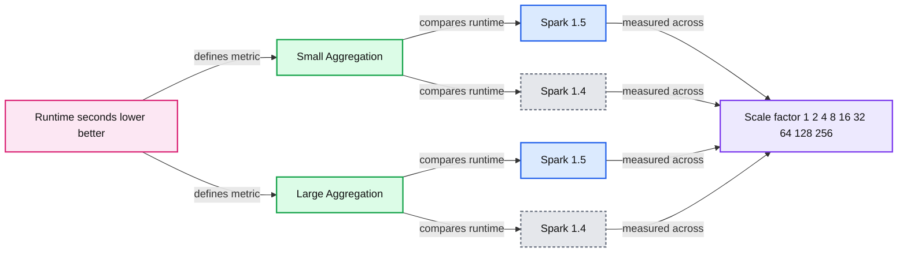
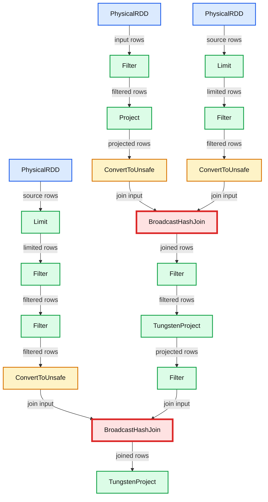

# Announcing Apache Spark 1.5

- Source: https://www.databricks.com/blog/2015/09/09/announcing-apache-spark-1-5.html
- Published: 2015-09-09
- Authors: Reynold Xin, Patrick Wendell
- Categories: engineering, open-source
- Images: 2 total, 2 extracted as architecture

The inaugural Spark Summit Europe will be held in Amsterdam this October. [Check out the full agenda and get your ticket](https://www.databricks.com/dataaisummit)before it sells out!

---

Today we are happy to announce the availability of Apache Spark’s 1.5 release! In this post, we outline the major development themes in Spark 1.5 and some of the new features we are most excited about. In the coming weeks, our blog will feature more detailed posts on specific components of Spark 1.5. For a comprehensive list of features in Spark 1.5, you can also find the detailed Apache release notes below.

Many of the major changes in Spark 1.5 are under-the-hood changes to improve Spark’s **performance, usability, and operational stability**. Spark 1.5 ships major pieces of [Project Tungsten](https://www.databricks.com/blog/2015/04/28/project-tungsten-bringing-spark-closer-to-bare-metal.html), an initiative focused on increasing Spark’s performance through several low-level architectural optimizations. The release also adds operational features for the streaming component, such as backpressure support. Another major theme of this release is **data science**: Spark 1.5 ships several new machine learning algorithms and utilities, and extends Spark’s new R API.

One interesting tidbit is that in Spark 1.5, we have crossed the 10,000 mark for JIRA number (i.e. more than 10,000 tickets have been filed to request features or report bugs). Hopefully the added digit won’t slow down our development too much!

## **Performance Improvements and Project Tungsten**

Earlier this year we announced [Project Tungsten](https://www.databricks.com/blog/2015/04/28/project-tungsten-bringing-spark-closer-to-bare-metal.html) - a set of major changes to Spark’s internal architecture designed to improve performance and robustness. Spark 1.5 delivers the first major pieces of Project Tungsten. This includes **binary processing**, which circumvents the Java object model using a custom binary memory layout. Binary processing significantly reduces garbage collection pressure for data-intensive workloads. It also includes a new **code generation** framework, where optimized byte code is generated at runtime for evaluating expressions in user code. Spark 1.5 adds a large number of built-in functions that are code generated, for common tasks like date handling and string manipulation.

Over the next few weeks, we will be writing about Project Tungsten. To give you a teaser, the chart below compares the out-of-the-box (i.e. no configuration changes) performance of aggregation queries using Spark 1.4 and Spark 1.5, for both small aggregations and large aggregations.

**Summary:** Benchmark chart comparing Spark 1.5 and Spark 1.4 aggregation runtimes across scale factors for small and large aggregations.

**Components:**

- Small Aggregation benchmark using Spark 1.5 and Spark 1.4
- Large Aggregation benchmark using Spark 1.5 and Spark 1.4
- Runtime measured in seconds, where lower is better
- Scale factor benchmark axis
- Databricks branding

**Flows:**

- None visible

**Numbers:** 1.5, 1.4, 1, 2, 4, 8, 16, 32, 64, 128, 256, 0, 40, 80, 120, 160, 300, 600, 900, 1200, seconds

source image: https://www.databricks.com/wp-content/uploads/2015/09/image01-1024x409.png

The release also includes a variety of other performance enhancements. Support for the Apache Parquet file format sees improved input/output performance, with predicate push down now enabled by default and a faster metadata lookup path. Spark’s joins also receive some attention, with a new broadcast outer join operator and the ability to do sort-merge outer joins.

## **Usability and Interoperability**

Spark 1.5 also focuses on usability aspects - such as providing interoperability with a wide variety of environments. After all, you can only use Spark if it connects to your data source or works on your cluster. And Spark programs need to be easy to understand if you want to debug them.

Spark 1.5 adds visualization of SQL and DataFrame query plans in the web UI, with dynamic update of operational metrics such as the selectivity of a filter operator and the runtime memory usage of aggregations and joins. Below is an example of a plan visualization from the web UI (click on the image to see details).

**Summary:** Spark 1.5 web UI visualization of a physical SQL/DataFrame query plan with filters, limits, projections, conversions, and broadcast hash joins.

**Components:**

- PhysicalRDD: Apache Spark physical RDD source
- Filter: Spark SQL filter operator
- Project: Spark SQL projection operator
- Limit: Spark SQL limit operator
- ConvertToUnsafe: Spark SQL row conversion operator
- BroadcastHashJoin: Spark SQL broadcast hash join
- TungstenProject: Spark Tungsten projection operator

**Flows:**

- PhysicalRDD -> Filter: input rows
- Filter -> Project: filtered rows
- Project -> ConvertToUnsafe: projected rows
- PhysicalRDD -> Limit: source rows
- Limit -> Filter: limited rows
- Filter -> ConvertToUnsafe: filtered rows
- ConvertToUnsafe -> BroadcastHashJoin: broadcast join input
- ConvertToUnsafe -> BroadcastHashJoin: broadcast join input
- BroadcastHashJoin -> Filter: joined rows
- Filter -> TungstenProject: filtered joined rows
- TungstenProject -> Filter: projected rows
- Filter -> BroadcastHashJoin: joined-side input
- PhysicalRDD -> Limit: source rows
- Limit -> Filter: limited rows
- Filter -> Filter: filtered rows
- Filter -> ConvertToUnsafe: filtered rows
- ConvertToUnsafe -> BroadcastHashJoin: broadcast join input
- BroadcastHashJoin -> TungstenProject: joined rows

**Numbers:**

- 2 input rows
- 2 output rows
- 2 rows
- 3 input rows
- 3 output rows
- 3 rows
- 10 in number 10
- 15 in name 15

source image: https://www.databricks.com/wp-content/uploads/2015/09/image00.png

In addition, we have invested a significant amount of work to improve interoperability with other ecosystem projects. As an example, using classloader isolation techniques, a single instance of Spark (SQL and DataFrames) can now **connect to multiple versions of Hive **metastores, from Hive 0.12 all the way to Hive 1.2.1. Aside from being able to connect to different metastores, Spark can now **read several Parquet variants** generated by other systems, including parquet-avro, parquet-thrift, parquet-protobuf, Impala, Hive. To the best of our knowledge, Spark is the only system that is capable of connecting to various versions of Hive and supporting the litany of Parquet formats that exist in the wild.

## **Operational Utilities in Spark Streaming**

Spark Streaming adds several new features in this release, with a focus on operational stability for long-lived production streaming workloads. These features are largely based on feedback from existing streaming users. Spark 1.5 adds **backpressure support**, which throttles the rate of receiving when the system is in an unstable state. For example, if there is a large burst in input, or a temporary delay in writing output, the system will adjust dynamically and ensure that the streaming program remains stable. This feature was developed in collaboration with Typesafe.

A second operational addition is the ability to load balance and schedule data receivers across a cluster, and better control over re-launching of receivers for long running jobs. Spark streaming also adds several Python API’s in this release, including Amazon Kinesis, Apache Flume, and the MQTT protocol.

## **Expansion of Data Science API’s**

One of the primary focuses of Spark in 2015 is to empower large-scale data science. We kicked this theme off with three major additions to Spark: [DataFrames](https://www.databricks.com/blog/2015/02/17/introducing-dataframes-in-spark-for-large-scale-data-science.html), [machine learning pipelines](https://www.databricks.com/blog/2015/01/07/ml-pipelines-a-new-high-level-api-for-mllib.html), and [R language support](https://www.databricks.com/blog/2015/06/09/announcing-sparkr-r-on-spark.html). These three additions brought APIs similar to best-in-class single-node tools to Spark. In Spark 1.5, we have greatly expanded their capabilities.

After the initial release of **DataFrames** in Spark 1.3, one of the most common user requests was to support more string and date/time functions out-of-the-box. We are happy to announce that Spark 1.5 introduces over 100 built-in functions. Almost all of these built-in functions also implement code generation, so applications using them can take advantage of the changes we made as part of Project Tungsten.

R language support was introduced as an alpha component in Spark 1.4. Spark 1.5 improves R usability as well as introduces support for scalable machine learning via integration with MLlib. R frontend now supports **GLMs with R formula**, binomial/Gaussian families, and elastic-net regularization.

For machine learning, Spark 1.5 brings better coverage for the **new pipeline API**, with new pipeline modules and algorithms. New pipeline features include feature transformers like CountVectorizer, DCT, MinMaxScaler, NGram, PCA, RFormula, StopWordsRemover, and VectorSlicer, algorithms like multilayer perceptron classifier, enhanced tree models, k-means, and naive Bayes, and tuning tools like train-validation split and multiclass classification evaluator. Other new algorithms include PrefixSpan for sequential pattern mining, association rule generation, 1-sample Kolmogorov-Smirnov test, etc.

## **Growth of Spark Package Ecosystem**

The 1.5 release is also a good time to mention the growth of Spark’s [package ecosystem](https://spark-packages.org/). Today, there are more than 100 packages that can be enabled with a simple flag for any Spark program. Packages include machine learning algorithms, connectors to various data sources, experimental new features, and much more. Several packages have released updates coinciding with the Spark 1.5 release, including the spark-csv, spark-redshift, and spark-avro data source connectors.

Spark 1.5.0 featured contributions from more than 230 developers - thanks to everyone who helped make this release possible! Stay tuned to the Databricks blog to learn more about Spark 1.5’s features and get a peek of upcoming Spark development.

For your convenience, we have attached the entire release notes here. If you want to try out these new features, you can already use Spark 1.5 in Databricks. [Sign up for a 14-day free trial here](https://accounts.cloud.databricks.com/registration.html?utm_source=databricks&utm_medium=blog&utm_campaign=spark1.5_release).

## **Apache Spark 1.5 Release Notes**

### **APIs: RDD, DataFrame and SQL**

- Consistent resolution of column names (see Behavior Changes section)
- [SPARK-3947](https://issues.apache.org/jira/browse/SPARK-3947): New experimental user-defined aggregate function (UDAF) interface
- [SPARK-8300](https://issues.apache.org/jira/browse/SPARK-8300): DataFrame hint for broadcast joins
- [SPARK-8668](https://issues.apache.org/jira/browse/SPARK-8668): expr function for turning a SQL expression into a DataFrame column
- [SPARK-9076](https://issues.apache.org/jira/browse/SPARK-9076): Improved support for NaN values
  - NaN functions: isnan, nanvl
  - dropna/fillna also fill/drop NaN values in addition to NULL values
  - Equality test on NaN = NaN returns true
  - NaN is greater than all other values
  - In aggregation, NaN values go into one group
- [SPARK-8828](https://issues.apache.org/jira/browse/SPARK-8828): Sum function returns null when all input values are nulls
- Data types
  - [SPARK-8943](https://issues.apache.org/jira/browse/SPARK-8943): CalendarIntervalType for time intervals
  - [SPARK-7937](https://issues.apache.org/jira/browse/SPARK-7937): Support ordering on StructType
  - [SPARK-8866](https://issues.apache.org/jira/browse/SPARK-8866): TimestampType’s precision is reduced to 1 microseconds (1us)
- [SPARK-8159](https://issues.apache.org/jira/browse/SPARK-8159): Added ~100 functions, including **date/time**, **string**, **math**.
- [SPARK-8947](https://issues.apache.org/jira/browse/SPARK-8947): Improved type coercion and error reporting in plan analysis phase (i.e. most errors should be reported in analysis time, rather than execution time)
- [SPARK-1855](https://issues.apache.org/jira/browse/SPARK-1855): Memory and local disk only checkpointing support

### **Backend Execution: DataFrame and SQL**

- **Code generation on by default** for almost all DataFrame/SQL functions
- **Improved aggregation** execution in DataFrame/SQL
  - Cache friendly in-memory hash map layout
  - Fallback to external-sort-based aggregation when memory is exhausted
  - Code generation on by default for aggregations
- **Improved join** execution in DataFrame/SQL
  - Prefer (external) sort-merge join over hash join in shuffle joins (for left/right outer and inner joins), i.e. join data size is now bounded by disk rather than memory
  - Support using (external) sort-merge join method for left/right outer joins
  - Support for broadcast outer join
- **Improved sort** execution in DataFrame/SQL
  - Cache-friendly in-memory layout for sorting
  - Fallback to external sorting when data exceeds memory size
  - Code generated comparator for fast comparisons
- **Native memory management & representation**
  - Compact binary in-memory data representation, leading to lower memory usage
  - Execution memory is explicitly accounted for, without relying on JVM GC, leading to less GC and more robust memory management
- [SPARK-8638](https://issues.apache.org/jira/browse/SPARK-8638): **Improved performance & memory usage in window functions**
- **Metrics instrumentation, reporting, and visualization**
  - [SPARK-8856](https://issues.apache.org/jira/browse/SPARK-8856): Plan visualization for DataFrame/SQL
  - [SPARK-8735](https://issues.apache.org/jira/browse/SPARK-8735): Expose metrics for runtime memory usage in web UI
  - [SPARK-4598](https://issues.apache.org/jira/browse/SPARK-4598): Pagination for jobs with large number of tasks in web UI

### **Integrations: Data Sources, Hive, Hadoop, Mesos and Cluster Management**

- **Mesos**
  - [SPARK-6284](https://issues.apache.org/jira/browse/SPARK-6284): Support framework authentication and Mesos roles
  - [SPARK-6287](https://issues.apache.org/jira/browse/SPARK-6287): Dynamic allocation in Mesos coarse-grained mode
  - [SPARK-6707](https://issues.apache.org/jira/browse/SPARK-6707): User specified constraints on Mesos slave attributes
- **YARN**
  - [SPARK-4352](https://issues.apache.org/jira/browse/SPARK-4352): Dynamic allocation in YARN works with preferred locations
- **Standalone Cluster Manager**
  - [SPARK-4751](https://issues.apache.org/jira/browse/SPARK-4751): Dynamic resource allocation support
- [SPARK-6906](https://issues.apache.org/jira/browse/SPARK-6906): Improved **Hive and metastore support**
  - [SPARK-8131](https://issues.apache.org/jira/browse/SPARK-8131): Improved Hive database support
  - Upgraded Hive dependency Hive 1.2
  - Support connecting to Hive 0.13, 0.14, 1.0/0.14.1, 1.1, 1.2 metastore
  - Support partition pruning pushdown into the metastore (off by default; config flag spark.sql.hive.metastorePartitionPruning)
  - Support persisting data in Hive compatible format in metastore
- [SPARK-9381](https://issues.apache.org/jira/browse/SPARK-9381): Support data partitioning for **JSON** data sources
- [SPARK-5463](https://issues.apache.org/jira/browse/SPARK-5463): **Parquet** improvements
  - Upgrade to Parquet 1.7
  - Speedup metadata discovery and schema merging
  - Predicate pushdown on by default
  - [SPARK-6774](https://issues.apache.org/jira/browse/SPARK-6774): Support for reading non-standard legacy Parquet files generated by various libraries/systems by fully implementing all backwards-compatibility rules defined in parquet-format spec
  - [SPARK-4176](https://issues.apache.org/jira/browse/SPARK-4176): Support for writing decimal values with precision greater than 18
- **ORC** improvements (various bug fixes)
- [SPARK-8890](https://issues.apache.org/jira/browse/SPARK-8890): Faster and more robust **dynamic partition insert**
- [SPARK-9486](https://issues.apache.org/jira/browse/SPARK-9486): DataSourceRegister interface for external data sources to specify short names

### **R Language**

- [SPARK-6797](https://issues.apache.org/jira/browse/SPARK-6797): Support for **YARN cluster mode in R**
- [SPARK-6805](https://issues.apache.org/jira/browse/SPARK-6805): **GLMs with R formula**, binomial/Gaussian families, and elastic-net regularization
- [SPARK-8742](https://issues.apache.org/jira/browse/SPARK-8742): Improved error messages for R
- [SPARK-9315](https://issues.apache.org/jira/browse/SPARK-9315): Aliases to make DataFrame functions more R-like

### **Machine Learning and Advanced Analytics**

- [SPARK-8521](https://issues.apache.org/jira/browse/SPARK-8521): **New Feature transformers**: CountVectorizer, Discrete Cosine transformation, MinMaxScaler, NGram, PCA, RFormula, StopWordsRemover, and VectorSlicer.
- **New Estimators in Pipeline API**: [SPARK-8600](https://issues.apache.org/jira/browse/SPARK-8600) naive Bayes, [SPARK-7879](https://issues.apache.org/jira/browse/SPARK-7879) k-means, and [SPARK-8671](https://issues.apache.org/jira/browse/SPARK-8671) isotonic regression.
- **New Algorithms**: [SPARK-9471](https://issues.apache.org/jira/browse/SPARK-9471) multilayer perceptron classifier, [SPARK-6487](https://issues.apache.org/jira/browse/SPARK-6487) PrefixSpan for sequential pattern mining, [SPARK-8559](https://issues.apache.org/jira/browse/SPARK-8559) association rule generation, [SPARK-8598](https://issues.apache.org/jira/browse/SPARK-8598) 1-sample Kolmogorov-Smirnov test, etc.
- **Improvements to existing algorithms**
  - [**LDA**](https://issues.apache.org/jira/browse/SPARK-5572): online LDA performance, asymmetric doc concentration, perplexity, log-likelihood, top topics/documents, save/load, etc.
  - **Trees and ensembles**: class probabilities, feature importance for random forests, thresholds for classification, checkpointing for GBTs, etc.
  - [**Pregel-API**](https://issues.apache.org/jira/browse/SPARK-9436): more efficient Pregel API implementation for GraphX.
  - [**GMM**](https://issues.apache.org/jira/browse/SPARK-5016): distribute matrix inversions.
- **Model summary** for [linear](https://issues.apache.org/jira/browse/SPARK-8539) and [logistic regression](https://issues.apache.org/jira/browse/SPARK-9112).
- **Python API**: [distributed matrices](https://issues.apache.org/jira/browse/SPARK-5572), [streaming k-means](https://issues.apache.org/jira/browse/SPARK-5572) and [linear models](https://issues.apache.org/jira/browse/SPARK-5572), [LDA](https://issues.apache.org/jira/browse/SPARK-5572), [power iteration clustering](https://issues.apache.org/jira/browse/SPARK-5572), etc.
- **Tuning and evaluation**: [train-validation split](https://issues.apache.org/jira/browse/SPARK-8484) and [multiclass classification evaluator](https://issues.apache.org/jira/browse/SPARK-7690).
- **Documentation**: document the release version of public API methods

### **Spark Streaming**

- [SPARK-7398](https://issues.apache.org/jira/browse/SPARK-7398): **Backpressure**: Automatic and dynamic rate controlling in Spark Streaming for handling bursty input streams. This allows a streaming pipeline to dynamically adapt to changes in ingestion rates and computation loads. This works with receivers, as well as, the Direct Kafka approach.
- **Python API for streaming sources**
  - [SPARK-8389](https://issues.apache.org/jira/browse/SPARK-8389): Kafka offsets of Direct Kafka streams available through Python API
  - [SPARK-8564](https://issues.apache.org/jira/browse/SPARK-8564): Kinesis Python API
  - [SPARK-8378](https://issues.apache.org/jira/browse/SPARK-8378): Flume Python API
  - [SPARK-5155](https://issues.apache.org/jira/browse/SPARK-5155): MQTT Python API
- [SPARK-3258](https://issues.apache.org/jira/browse/SPARK-3258): **Python API for streaming machine learning algorithms**: K-Means, linear regression, and logistic regression
- [SPARK-9215](https://issues.apache.org/jira/browse/SPARK-9215): **Improved reliability of Kinesis streams** : No need for enabling write ahead logs for saving and recovering received data across driver failures
- **Direct Kafka API graduated**: Not experimental any more.
- [SPARK-8701](https://issues.apache.org/jira/browse/SPARK-8701): **Input metadata in UI**: Kafka offsets, and input files are visible in the batch details UI
- [SPARK-8882](https://issues.apache.org/jira/browse/SPARK-8882): Better load balancing and scheduling of receivers across cluster
- [SPARK-4072](https://issues.apache.org/jira/browse/SPARK-4072): Include streaming storage in web UI

### **Deprecations, Removals, Configs, and Behavior Changes**

#### Spark Core

- DAGScheduler’s local task execution mode has been removed
- Default driver and executor memory increased from 512m to 1g
- Default setting of JVM’s MaxPermSize increased from 128m to 256m
- Default logging level of spark-shell changed from INFO to WARN
- NIO-based ConnectionManager is deprecated, and will be removed in 1.6

#### Spark SQL & DataFrames

- Optimized execution using manually managed memory (Tungsten) is now enabled by default, along with code generation for expression evaluation. These features can both be disabled by setting spark.sql.tungsten.enabled to false.
- Parquet schema merging is no longer enabled by default. It can be re-enabled by setting spark.sql.parquet.mergeSchema to true.
- Resolution of strings to columns in Python now supports using dots (.) to qualify the column or access nested values. For example df[‘table.column.nestedField’]. However, this means that if your column name contains any dots you must now escape them using backticks (e.g., `table.`column.with.dots`.nested`).
- In-memory columnar storage partition pruning is on by default. It can be disabled by setting spark.sql.inMemoryColumnarStorage.partitionPruning to false.
- Unlimited precision decimal columns are no longer supported, instead Spark SQL enforces a maximum precision of 38. When inferring schema from BigDecimal objects, a precision of (38, 18) is now used. When no precision is specified in DDL then the default remains Decimal(10, 0).
- Timestamps are now processed at a precision of 1us, rather than 100ns.
- Sum function returns null when all input values are nulls (null before 1.4, 0 in 1.4).
- In the sql dialect, floating point numbers are now parsed as decimal. HiveQL parsing remains unchanged.
- The canonical name of SQL/DataFrame functions are now lower case (e.g. sum vs SUM).
- It has been determined that using the DirectOutputCommitter when speculation is enabled is unsafe and thus this output committer will not be used by parquet when speculation is on, independent of configuration.
- JSON data source will not automatically load new files that are created by other applications (i.e. files that are not inserted to the dataset through Spark SQL). For a JSON persistent table (i.e. the metadata of the table is stored in Hive Metastore), users can use REFRESH TABLE SQL command or HiveContext’s refreshTable method to include those new files to the table. For a DataFrame representing a JSON dataset, users need to recreate the DataFrame and the new DataFrame will include new files.

#### Spark Streaming

- New experimental backpressure feature can be enabled by setting the configuration spark.streaming.backpressure.enabled to true.
- Write Ahead Log does not need to be abled for Kinesis streams. The updated Kinesis receiver keeps track of Kinesis sequence numbers received in each batch, and uses that information re-read the necessary data while recovering from failures.
- The number of times the receivers are relaunched on failure are not limited by the max Spark task attempts. The system will always try to relaunch receivers after failures until the StreamingContext is stopped.
- Improved load balancing of receivers across the executors, even after relaunching.
- Enabling checkpointing when using queueStream throws exception as queueStream cannot be checkpointed. However, we found this to break certain existing apps. So this change will be reverted in Spark 1.5.1.

#### MLlib

In the spark.mllib package, there are no breaking API changes but some behavior changes:

- [SPARK-9005](https://issues.apache.org/jira/browse/SPARK-9005): RegressionMetrics.explainedVariance returns the average regression sum of squares.
- [SPARK-8600](https://issues.apache.org/jira/browse/SPARK-8600): NaiveBayesModel.labels become sorted.
- [SPARK-3382](https://issues.apache.org/jira/browse/SPARK-3382): GradientDescent has a default convergence tolerance 1e-3, and hence iterations might end earlier than 1.4.

In the experimental spark.ml package, there exists one breaking API change and one behavior change:

- [SPARK-9268](https://issues.apache.org/jira/browse/SPARK-9268): Java’s varargs support is removed from Params.setDefault due to a Scala compiler bug.
- [SPARK-10097](https://issues.apache.org/jira/browse/SPARK-10097): Evaluator.isLargerBetter is added to indicate metric ordering. Metrics like RMSE no longer flip signs as in 1.4.

### **Known Issues**

The following issues are known in 1.5.0, and will be fixed in 1.5.1 release.

#### SQL/DataFrame

- [SPARK-10301](https://issues.apache.org/jira/browse/SPARK-10301): Reading parquet files with different schema (schema merging) for nested structs can return the wrong answer
- [SPARK-10466](https://issues.apache.org/jira/browse/SPARK-10466): AssertionError when spilling data during sort-based shuffle with data spill
- [SPARK-10441](https://issues.apache.org/jira/browse/SPARK-10441): Timestamp data type cannot be written out as JSON
- [SPARK-10495](https://issues.apache.org/jira/browse/SPARK-10495): Date values saved to JSON are stored as strings representing the number of days from epoch (1970-01-01 00:00:00 UTC) instead of strings in the format of “yyyy-mm-dd”.
- [SPARK-10403](https://issues.apache.org/jira/browse/SPARK-10403): Tungsten mode does not work with tungsten-sort shuffle manager (which is off by default)
- [SPARK-10422](https://issues.apache.org/jira/browse/SPARK-10422): In-memory cache of string type with dictionary encoding is broken
- [SPARK-10434](https://issues.apache.org/jira/browse/SPARK-10434) Parquet files with null elements in arrays written by Spark 1.5.0 cannot be read by earlier versions of Spark

#### Streaming

- [SPARK-10224](https://issues.apache.org/jira/browse/SPARK-10224) Small chance of data loss when StreamingContext is stopped gracefully

### **Credits**

We would like to thank the following organizations for testing the release candidates with their workloads: Tencent, Mesosphere, Typesafe, Palantir, Cloudera, Hortonworks, Huawei, Shopify, Netflix, Intel, Yahoo, Kixer, UC Berkeley and Databricks.

Last but not least, this release would not have been possible without the following contributors: Aaron Davidson, Adam Roberts, Ai He, Akshat Aranya, Alex Shkurenko, Alex Slusarenko, Alexander Ulanov, Alok Singh, Amey Chaugule, Andrew Or, Andrew Ray, Animesh Baranawal, Ankur Chauhan, Ankur Dave, Ben Fradet, Bimal Tandel, Brennan Ashton, Brennon York, Brian Lockwood, Bryan Cutler, Burak Yavuz, Calvin Jia, Carl Anders Duvel, Carson Wang, Chen Xu, Cheng Hao, Cheng Lian, Cheolsoo Park, Chris Freeman, Christian Kadner, Cody Koeninger, Damian Guy, Daniel Darabos, Daniel Emaasit, Daoyuan Wang, Dariusz Kobylarz, David Arroyo Cazorla, Davies Liu, DB Tsai, Dennis Huo, Deron Eriksson, Devaraj K, Dibyendu Bhattacharya, Dong Wang, Emiliano Leporati, Eric Liang, Favio Vazquez, Felix Cheung, Feynman Liang, Forest Fang, Francois Garillot, Gen Tang, George Dittmar, Guo Wei, GuoQiang Li, Han JU, Hao Zhu, Hari Shreedharan, Herman Van Hovell, Holden Karau, Hossein Falaki, Huang Zhaowei, Hyukjin Kwon, Ilya Ganelin, Imran Rashid, Iulian Dragos, Jacek Lewandowski, Jacky Li, Jan Prach, Jean Lyn, Jeff Zhang, Jiajin Zhang, Jie Huang, Jihong MA, Jonathan Alter, Jose Cambronero, Joseph Batchik, Joseph Gonzalez, Joseph K. Bradley, Josh Rosen, Judy Nash, Juhong Park, Kai Sasaki, Kai Zeng, KaiXinXiaoLei, Kan Zhang, Kashif Rasul, Kay Ousterhout, Keiji Yoshida, Kenichi Maehashi, Keuntae Park, Kevin Conor, Konstantin Shaposhnikov, Kousuke Saruta, Kun Xu, Lars Francke, Leah McGuire, lee19, Liang-Chi Hsieh, Lianhui Wang, Luca Martinetti, Luciano Resende, Manoj Kumar, Marcelo Vanzin, Mark Smith, Martin Zapletal, Matei Zaharia, Mateusz Buskiewicz, Matt Massie, Matthew Brandyberry, Meethu Mathew, Meihua Wu, Michael Allman, Michael Armbrust, Michael Davies, Michael Sannella, Michael Vogiatzis, Michel Lemay, Mike Dusenberry, Min Zhou, Mingfei Shi, mosessky, Moussa Taifi, Mridul Muralidharan, NamelessAnalyst, Namit Katariya, Nan Zhu, Nathan Howell, Navis Ryu, Neelesh Srinivas Salian, Nicholas Chammas, Nicholas Hwang, Nilanjan Raychaudhuri, Niranjan Padmanabhan, Nishkam Ravi, Nishkam Ravi, Noel Smith, Oleksiy Dyagilev, Oleksiy Dyagilev, Paavo Parkkinen, Patrick Baier, Patrick Wendell, Pawel Kozikowski, Pedro Rodriguez, Perinkulam I. Ganesh, Piotr Migdal, Prabeesh K, Pradeep Chhetri, Prayag Chandran, Punya Biswal, Qian Huang, Radek Ostrowski, Rahul Palamuttam, Ram Sriharsha, Rekha Joshi, Rekha Joshi, Rene Treffer, Reynold Xin, Roger Menezes, Rohit Agarwal, Rosstin Murphy, Rowan Chattaway, Ryan Williams, Saisai Shao, Sameer Abhyankar, Sandy Ryza, Santiago M. Mola, Scott Taylor, Sean Owen, Sephiroth Lin, Seth Hendrickson, Sheng Li, Shilei Qian, Shivaram Venkataraman, Shixiong Zhu, Shuo Bai, Shuo Xiang, Simon Hafner, Spiro Michaylov, Stan Zhai, Stefano Parmesan, Steve Lindemann, Steve Loughran, Steven She, Su Yan, Sudhakar Thota, Sun Rui, Takeshi YAMAMURO, Takuya Ueshin, Tao Li, Tarek Auel, Tathagata Das, Ted Blackman, Ted Yu, Thomas Omans, Thomas Szymanski, Tien-Dung Le, Tijo Thomas, Tim Ellison, Timothy Chen, Tom Graves, Tom White, Tomohiko K., Vincent D. Warmerdam, Vinod K C, Vinod KC, Vladimir Vladimirov, Vyacheslav Baranov, Wang Tao, Wang Wei, Weizhong Lin, Wenchen Fan, Wisely Chen, Xiangrui Meng, Xu Tingjun, Xusen Yin, Yadong Qi, Yanbo Liang, Yash Datta, Yijie Shen, Yin Huai, Yong Tang, Yu ISHIKAWA, Yuhao Yang, Yuming Wang, Yuri Saito, Yuu ISHIKAWA, Zc He, Zhang, Liye, Zhichao Li, Zhongshuai Pei, Zoltan Zvara, and a few unknown contributors (please indicate your email and name in your git commit to show up here).

You can download the release at [https://spark.apache.org/downloads.html](https://spark.apache.org/downloads.html)
