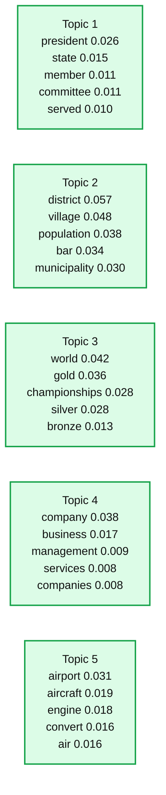
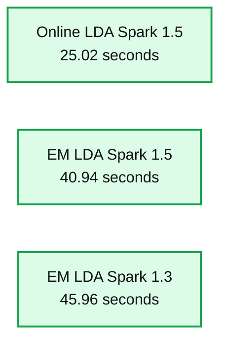

# Large Scale Topic Modeling: Improvements to LDA on Apache Spark

- Source: https://www.databricks.com/blog/2015/09/22/large-scale-topic-modeling-improvements-to-lda-on-apache-spark.html
- Published: 2015-09-22
- Authors: Feynman Liang, Yuhao Yang, Joseph Bradley
- Categories: engineering, open-source, data-science-machine-learning
- Images: 2 total, 2 extracted as architecture

*This blog was written by Feynman Liang and Joseph Bradley from Databricks, and Yuhao Yang from Intel.*

*To get started using LDA, [download Apache Spark 1.5](https://spark.apache.org/downloads.html) or [sign up for a 14-day free trial of Databricks today](https://accounts.cloud.databricks.com/registration.html#signup).*

---

What are people discussing on Twitter? To catch up on distributed computing, what news articles should I read? These are questions that can be answered by topic models, a technique for analyzing the topics present in collections of documents. This blog post discusses improvements in Apache Spark 1.4 and 1.5 for topic modeling using the powerful Latent Dirichlet Allocation (LDA) algorithm.

Spark 1.4 and 1.5 introduced an online algorithm for running LDA incrementally, support for more queries on trained LDA models, and performance metrics such as likelihood and perplexity. We give an example here of training a topic model over a dataset of 4.5 million Wikipedia articles.

## Topic models and LDA

Topic models take a collection of documents and automatically infer the topics being discussed. For example, when we run Spark’s LDA on a dataset of 4.5 million Wikipedia articles, we can obtain topics like those in the table below.

**Summary:** Table of five LDA topics with their highest-weight words and associated scores.

**Components:**

- Topic 1, LDA topic: president, state, member, committee, served
- Topic 2, LDA topic: district, village, population, bar, municipality
- Topic 3, LDA topic: world, gold, championships, silver, bronze
- Topic 4, LDA topic: company, business, management, services, companies
- Topic 5, LDA topic: airport, aircraft, engine, convert, air

**Flows:**

- none

**Numbers:** 1, 2, 3, 4, 5, 0.026, 0.015, 0.011, 0.011, 0.010, 0.057, 0.048, 0.038, 0.034, 0.030, 0.042, 0.036, 0.028, 0.028, 0.013, 0.038, 0.017, 0.009, 0.008, 0.008, 0.031, 0.019, 0.018, 0.016, 0.016

source image: https://www.databricks.com/wp-content/uploads/2015/09/lda_blog_table01-1024x182.png

*Table 1: Example LDA topics learned from Wikipedia articles dataset*

In addition, LDA tells us which topics each document is about; document X might be 30% about Topic 1 (“politics”) and 70% about Topic 5 (“airlines”). Latent Dirichlet Allocation (LDA) has been one of the most successful topic models in practice. [See our previous blog post on LDA](https://www.databricks.com/blog/2015/03/25/topic-modeling-with-lda-mllib-meets-graphx.html) to learn more.

## A new online variational learning algorithm

Online variational inference is a technique for learning an LDA model by processing the data incrementally in small batches. By processing in small batches, we are able to easily scale to very large datasets. MLlib implements an algorithm for performing online variational inference originally described by Hoffman et al.

### Performance comparison

The table of topics shown previously were learned using the newly developed online variational learning algorithm. If we compare timing results, we can see a significant speedup in using the new online algorithm over the old EM algorithm:

**Summary:** Benchmark comparing per-iteration training time for three 100-topic LDA approaches on 4.5 million Wikipedia articles.

**Components:**

- Online LDA using Spark 1.5
- EM LDA using Spark 1.5
- EM LDA using Spark 1.3

**Flows:**

- none

**Numbers:** 100 topics, 4.5 million Wikipedia articles, 25.02 seconds, 40.94 seconds, 45.96 seconds, y-axis ticks 0, 10, 20, 30, 40, 50, Spark versions 1.5 and 1.3

source image: https://www.databricks.com/wp-content/uploads/2015/09/lda_blog_figure01.png

*Figure 1: Online learning algorithm learns faster than earlier EM algorithm*

### Experiment details

We first preprocessed the data by filtering common English stop words and limiting the vocabulary to the 10,000 most common words. We then trained a 100 topic LDA model for 100 iterations using the online LDA optimizer. We ran our experiments using [Databricks](https://www.databricks.com/product/data-lakehouse) on a 16 node AWS r3.2xlarge cluster with data stored in S3. For the actual code, see [this Github gist](https://gist.github.com/feynmanliang/3b6555758a27adcb527d).

## Improved predictions, metrics, and queries

### Predict topics on new documents

In addition to describing topics present in the training set, Spark 1.5 makes the trained LDA models more useful by allowing users to predict topics for a new test document.

### Evaluate your model with likelihood and perplexity

After learning an LDA model, we are often interested in how well the model fits the data. We have added two new metrics to evaluate this: [likelihood](https://en.wikipedia.org/wiki/Likelihood_function) and [perplexity](https://en.wikipedia.org/wiki/Perplexity).

### Make more queries

This new release also adds several new queries users can perform on a trained LDA model. For example, we can now obtain the top k topics for each document (“What is this document discussing?”) as well as the top documents per topic (“To learn about topic X, what documents should I read?”).

## Tips for running LDA

- Make sure to run for enough iterations. Early iterations may return useless (e.g. extremely similar) topics, but running for more iterations dramatically improves the results. We have noticed this is especially true for EM.
- To handle stop words specific to your data, a common workflow is to run LDA, look at topics, identify stop words that show up in the topics, filter them out, and run LDA again.
- Picking the number of topics is an art; there are algorithms to choose automatically, but domain expertise is critical to getting good results.
- The [Pipelines API feature transformers](https://spark.apache.org/docs/latest/ml-features.html) are very useful for preprocessing text to prepare it for LDA; see Tokenizer, StopwordsRemover and CountVectorizer in particular.

## What’s next?

Spark contributors are actively working on improving our LDA implementation. Some works in progress include: [Gibbs sampling](https://issues.apache.org/jira/browse/SPARK-5556) (a slower but sometimes more accurate algorithm), [streaming LDA algorithms](https://issues.apache.org/jira/browse/SPARK-8696), and [hierarchical Dirichlet processes](https://issues.apache.org/jira/browse/SPARK-8555)(for automatically choosing the number of topics).

## Acknowledgements

The development of LDA has been a collaboration between many Spark contributors.

Feynman Liang, Yuhao Yang, Joseph K. Bradley, and others made recent improvements, and [many others](https://www.databricks.com/blog/2015/03/25/topic-modeling-with-lda-mllib-meets-graphx.html) contributed to the earlier work.
