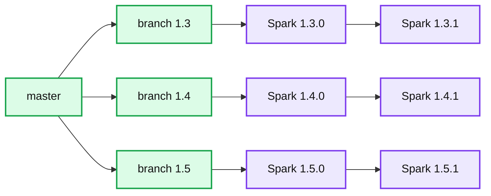

# Apache Spark 1.5.1 and What do Version Numbers Mean?

- Source: https://www.databricks.com/blog/2015/10/01/apache-spark-1-5-1-and-what-do-version-numbers-mean.html
- Published: 2015-10-01
- Authors: Reynold Xin
- Categories: engineering, open-source
- Images: 1 total, 1 extracted as architecture

The inaugural Spark Summit Europe will be held in Amsterdam on October 27 - 29. Check out the [full agenda](https://www.databricks.com/dataaisummit) and get your ticket before it sells out!

---

We are excited to announce the availability of Apache Spark’s 1.5.1 release. Spark 1.5.1 is a maintenance release containing 80 bug fixes in various components, including core, DataFrames, SQL, YARN, Parquet support, ORC support. You can find the detailed list of bug fixes on [Spark JIRA](https://spark.apache.org/releases/spark-release-1-5-1.html).** We strongly recommend all 1.5.0 users to upgrade to this release.**

If you are a Databricks customer, we have been upgrading the Spark 1.5 package as we fix bugs, and as a result you are already benefiting from all the work in 1.5.1. Simply choose “Spark 1.5” in the cluster creation interface.

I would also like to take this opportunity to address a very common question we get: what does Spark’s version number (e.g. 1.4.0 vs 1.5.0 vs 1.5.1) mean?

## What do Spark version numbers mean?

Since Spark 1.0.0, each Spark release is identified by a 3 part version number: [major].[minor].[maintenance].

**Summary:** The diagram shows Spark development branching from master into release branches 1.3, 1.4, and 1.5, with maintenance releases on each branch.

**Components:**

- master branch for ongoing Spark development
- branch 1.3 for Spark 1.3 releases
- branch 1.4 for Spark 1.4 releases
- branch 1.5 for Spark 1.5 releases
- Spark 1.3.0 release
- Spark 1.3.1 maintenance release
- Spark 1.4.0 release
- Spark 1.4.1 maintenance release
- Spark 1.5.0 release
- Spark 1.5.1 maintenance release

**Flows:**

- master -> branch 1.3: branch creation
- master -> branch 1.4: branch creation
- master -> branch 1.5: branch creation
- branch 1.3 -> Spark 1.3.0: release
- Spark 1.3.0 -> Spark 1.3.1: maintenance progression
- branch 1.4 -> Spark 1.4.0: release
- Spark 1.4.0 -> Spark 1.4.1: maintenance progression
- branch 1.5 -> Spark 1.5.0: release
- Spark 1.5.0 -> Spark 1.5.1: maintenance progression

**Numbers:** 1.3, 1.3.0, 1.3.1, 1.4, 1.4.0, 1.4.1, 1.5, 1.5.0, 1.5.1

source image: https://www.databricks.com/wp-content/uploads/2015/10/Spark-branch.png

The first part, major version number, is used to indicate API compatibility. Unless explicitly marked as experimental, user-facing APIs should be backward compatible throughout a major version. That is to say, from an API point of view, if your application is programmed against Spark 1.0.0, this application should be able to run in all Spark 1.x versions without any modification.

The second part, minor version number, indicates releases that bring new features and improvements without changes to existing user-facing APIs. Currently, Spark releases a new minor version every 3 months. For example, Spark 1.5.0 was released in early September, and you can expect Spark 1.6.0 to be released in early December.

The third part, maintenance version number, indicates releases that focus on bug fixes for the same minor version. A patch can only be merged into a maintenance release if the risk for regression is deemed extremely low. Maintenance releases don’t follow a specific schedule. They are made as the community find critical bugs. In general, we encourage users to always upgrade to the latest maintenance release available. That is to say, if you are currently running Spark 1.5.0, you should upgrade to Spark 1.5.1 today.

## What about Spark in Databricks?

The engineering process and the cloud delivery model at Databricks enable us to push updates in a short amount of time. Spark in Databricks follows the official Apache Spark releases, with one improvement: we leverage the fast delivery to provide our customers with new features and bug fixes as soon as possible.

As we have done with Spark 1.5, we started offering Spark 1.5 preview before the official Apache 1.5.0 was available. The preview version is built based on upstream patches and provided for prototyping and experimentation. Similarly, we patch critical bug fixes in Databricks so our customers can receive the upstream bug fixes in the shortest amount of time possible.

This applies to all the versions we currently support, i.e. Spark 1.3, 1.4, and 1.5. That is to say, if you choose Spark 1.3 as the version in Databricks, you will automatically receive bug fixes as they are fixed in the branch for Apache Spark 1.3.x (branch-1.3).

To try Databricks, sign up for a [free 14-day trial](https://accounts.cloud.databricks.com/registration.html?utm_source=databricks&utm_medium=blog&utm_content=spark1.5_preview&utm_campaign=default).
