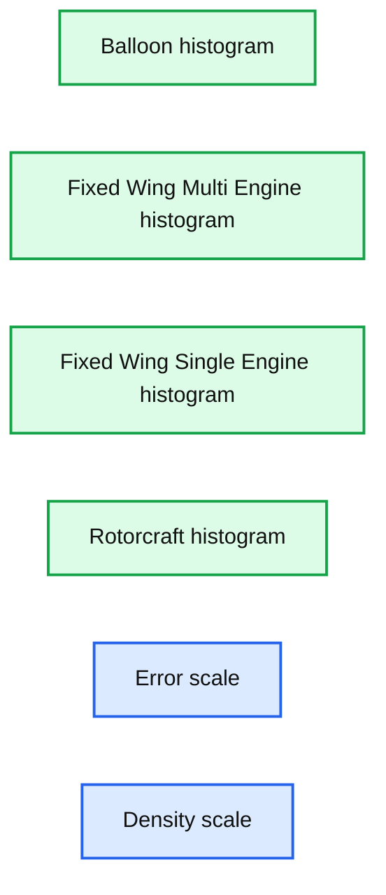

# Generalized Linear Models in SparkR and R Formula Support in MLlib

- Source: https://www.databricks.com/blog/2015/10/05/generalized-linear-models-in-sparkr-and-r-formula-support-in-mllib.html
- Published: 2015-10-05
- Authors: Eric Liang
- Categories: engineering, data-science-machine-learning, open-source
- Images: 1 total, 1 extracted as architecture

*To get started with SparkR, [download Apache Spark 1.5](https://spark.apache.org/downloads.html) or [sign up for a 14-day free trial of Databricks today](https://accounts.cloud.databricks.com/registration.html#signup).*

---

Apache Spark 1.5 adds initial support for distributed machine learning over SparkR DataFrames. To provide an intuitive interface for R users, [SparkR](https://www.databricks.com/blog/2016/12/28/10-things-i-wish-i-knew-before-using-apache-sparkr.html) extends R's native methods for fitting and evaluating models to use MLlib for large-scale machine learning. In this blog post, we cover how to work with generalized linear models in SparkR, and how to use the new R formula support in MLlib to simplify machine learning pipelines. This work was contributed by Databricks in Spark 1.5. We'd also like to thank Alteryx for providing input on early designs.

## Generalized Linear Models

Generalized linear models unify various statistical models such as linear and logistic regression through the specification of a model family and link function. In R, such models can be fitted by passing an R model formula, family, and training dataset to the `[glm()](https://stat.ethz.ch/R-manual/R-devel/library/stats/html/glm.html)` function. Spark 1.5 extends `glm()` to operate over Spark [DataFrames](https://www.databricks.com/blog/2015/02/17/introducing-dataframes-in-spark-for-large-scale-data-science.html), which are distributed data collections managed by Spark. We also support elastic-net regularization for these models, the same as in R's `[glmnet](https://cran.r-project.org/web/packages/glmnet/index.html)` package.

## Fitting Models

Since we extend R's native methods for model fitting, the interface is very similar. R lets you specify the modeling of a response variable in a compact symbolic form. For example, the formula `y ~ f0 + f1` indicates the response `y` is modeled linearly by variables `f0` and `f1`. In 1.5 we support a subset of the [R formula operators](https://stat.ethz.ch/R-manual/R-devel/library/stats/html/formula.html) available. This includes the `+` (inclusion), `-` (exclusion), `.` (include all), and intercept operators. To demonstrate glm in SparkR, we will walk through fitting a model over a 12 GB dataset (with over 120 million records) in the example below. Datasets of this size are hard to train on a single machine due to their size.

### Preprocessing

The dataset we will operate on is the publicly available [airlines dataset](https://www.transtats.bts.gov/OT_Delay/OT_DelayCause1.asp), which contains twenty years of flight records (from 1987 to 2008). We are interested in predicting airline arrival delay based on the flight departure delay, aircraft type, and distance traveled.

First, we read the data from the CSV format using the [spark-csv](https://spark-packages.org/package/databricks/spark-csv) package and join it with an auxiliary [planes table](https://community.amstat.org/jointscsg-section/dataexpo/dataexpo2009) with details on individual aircraft.

### Training

The next step is to use MLlib by calling `glm()` with a formula specifying the model variables. We specify the Gaussian family here to indicate that we want to perform linear regression. MLlib caches the input DataFrame and launches a series of Spark jobs to fit our model over the distributed dataset.

### Evaluation

As with R's native models, coefficients can be retrieved using the `summary()` function.

Note that the `aircraft_type` feature is categorical. Under the hood, SparkR automatically performs one-hot encoding of such features so that it does not need to be done manually. Beyond String and Double type features, it is also possible to fit over [MLlib Vector](https://spark.apache.org/docs/latest/api/scala/index.html#org.apache.spark.mllib.linalg.Vector) features, for compatibility with other MLlib components.

To evaluate our model we can also use `predict()` just like in R. We can pass in the training data or another DataFrame that contains test data.

**Summary:** A faceted histogram chart compares prediction error density across four aircraft categories.

**Components:**

- Balloon: histogram bars showing error density
- Fixed Wing Multi-Engine: histogram bars showing error density
- Fixed Wing Single-Engine: histogram bars showing error density
- Rotorcraft: histogram bars showing error density
- Error axis: horizontal error scale
- Density axis: vertical density scale

**Flows:**

- none

**Numbers:** -2.0, 0.0, 2.0, 0.0, 100m, 200m, 300m, 400m, 500m, 600m, 700m, 800m, 900m, 1.0, 1.1

source image: https://www.databricks.com/wp-content/uploads/2015/10/Screen-Shot-2015-10-01-at-4.40.42-PM-1024x307.png

In summary, SparkR now provides seamless integration of DataFrames with common R modeling functions, making it simple for R users to take advantage of MLlib's distributed machine learning algorithms.

To learn more about SparkR and its integration with MLlib, see the latest [SparkR documentation](https://spark.apache.org/docs/latest/sparkr.html).

## R formula support in other languages

SparkR implements the interpretation of R model formulas as an [MLlib feature transformer](https://spark.apache.org/docs/latest/ml-guide.html#transformers), for integration with the [ML Pipelines API](https://www.databricks.com/blog/2015/01/07/ml-pipelines-a-new-high-level-api-for-mllib.html). The [RFormula transformer](https://spark.apache.org/docs/latest/ml-features.html#rformula) provides a convenient way to specify feature transformations like in R.

To see how the RFormula transformer can be used, let's start with the same airlines dataset from before. In Python, we create an RFormula transformer with the same formula used in the previous section.

After the transformation, a DataFrame with features and label column appended is returned. Note
 that we have to call `fit()` on a dataset before we can call `transform()`. The `fit()` step determines the mapping of categorical feature values to vector indices in the output, so that the fitted RFormula can be used across different datasets.

Any ML pipeline can include the RFormula transformer as a pipeline stage, which is in fact how SparkR implements `glm()`. After we have created an appropriate RFormula transformer and an estimator for the desired model family, fitting a GLM model takes only one step:

When the pipeline executes, the features referenced by the formula will be encoded into an output feature vector for use by the linear regression stage.

We hope that RFormula will simplify the creation of ML pipelines by providing a concise way of expressing complex feature transformations. Starting in Spark 1.5 the RFormula transformer is available for use in Python, Java, and Scala.

## What's next?

In Spark 1.6 we are adding support for more advanced features of R model formulas, including [feature interactions](https://issues.apache.org/jira/browse/SPARK-9681), [more model families](https://issues.apache.org/jira/browse/SPARK-9838), [link functions](https://issues.apache.org/jira/browse/SPARK-9840), and [better summary support](https://issues.apache.org/jira/browse/SPARK-9836).

As part of this blog post, we would like to thank Dan Putler and Chris Freeman from Alteryx for useful discussions during the implementation of this functionality in SparkR, and Hossein Falaki for input on content.
