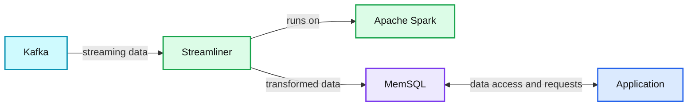
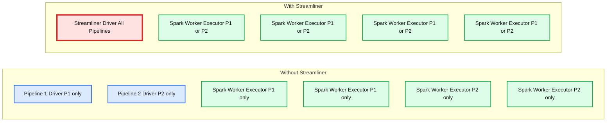

# Guest Blog: Streamliner - An Open Source Apache Spark Streaming Application

- Source: https://www.databricks.com/blog/2015/12/18/guest-blog-streamliner-an-open-source-apache-spark-streaming-application.html
- Published: 2015-12-18
- Authors: Ankur Goyal
- Categories: company, partners, data-streaming
- Images: 2 total, 2 extracted as architecture

This is a guest blog from Ankur Goyal, VP of Engineering at MemSQL

---

Our always-on interconnected world constantly shuttles data between devices and data centers. The need for real-time insights is driving large and small companies alike towards building real-time data pipelines. Apache Spark Streaming tackles several challenges associated with real-time data streams including the need for real-time Extract, Transform, and Load (ETL). This has led to the rapid adoption of Spark Streaming in the industry. In the [2015 Spark survey](https://www.databricks.com/), 48% of Spark users indicated they were using streaming. For production deployments, there was a 56% rise in usage of Spark Streaming from 2014 to 2015.

More importantly, it is becoming a flexible, robust, scalable platform for building end-to-end real-time pipeline solutions. At MemSQL, we observed these trends and built Streamliner - an open source, one-click solution for building real-time data pipelines using Spark Streaming and MemSQL. With Streamliner, you can stream data from real-time data sources (e.g. Apache Kafka), perform data transformations with Spark Streaming, and ultimately load data into MemSQL for persistence and application serving.

### Developing a Spark Streaming Quickstart

Earlier this year, we started digging into customer use cases and noticed a common pattern: using Spark Streaming, connecting to Kafka, and persisting data in a high-performance store such as MemSQL.

With the goal of simplifying the out-of-box experience for Kafka to Spark Streaming to MemSQL, we looked at what would it take to build these properties into a complete solution. For the common case, there should be no need to write code. But if needed, that code should be pluggable and easy to contribute back to the community.

The time-to-value needs to be fast, so debugging and error handling should be simple and visible directly in the UI. Pipelines need to be cheap and easy to work with, such that you can add, remove, pause, stop, and restart them dynamically with minimal system impact.

### Introducing Streamliner

The result was Streamliner, an intuitive, UI-driven solution to build and manage multiple real-time data pipelines on Spark Streaming. Streamliner accomplishes this by exposing three abstractions - Extractors, Transformers, and Loaders - which have pre-built options and are extensible. For example, you can use a pre-built Kafka extractor, plug it into a pre-built JSON transformer, and load it into MemSQL, all without writing any code. You can also add/remove and start/stop pipelines directly from the UI without interrupting other pipelines. Another popular use-case is leveraging the Thrift transformer to convert your custom Thrift-formatted data into database schema + data, without having to write custom code per Thrift schema. Streamliner, along with example applications built with it, are available as open source on GitHub.

[https://github.com/memsql/streamliner-starter](https://github.com/memsql/streamliner-starter)

The premise of Streamliner was to create a simplified experience built on the foundation of Spark Streaming. With that, we needed to meet the following requirements:

- Ingest into Spark Streaming. Our choice for the data source was Kafka, a popular distributed message queue.
- Scalability, particularly the ability to support multiple data pipelines
- Spark API support and compatibility

We also identified a few nice to have features:

- Easy data persistence
- High speed ingest, row-by-row
- Exactly-once semantics
- Rich, full SQL directly on the data with complex data structures like indexes and column stores.
- In-place data transactions that allow users to build an application on top of real-time data

**Summary:** The diagram shows Streamliner running on Apache Spark to extract data from Kafka, transform it, load it into MemSQL, and connect it to an application.

**Components:**

- Kafka, the data source
- Streamliner, the extract transform load application
- Apache Spark, the streaming compute platform
- MemSQL, the data storage system
- Application, the consuming client

**Flows:**

- Kafka -> Streamliner: streaming data
- Streamliner -> MemSQL: transformed data
- MemSQL -> Application: data access
- Application -> MemSQL: application requests

**Numbers:** none

source image: https://www.databricks.com/wp-content/uploads/2015/12/spark-streamer-blog-1-1024x370.png

As we were building Streamliner, we also identified places where our simplifications enabled us to get some big performance wins.

First, we are able to run multiple streaming pipelines in a single Spark job by routing work through a single, special MemSQL Spark application (memsql-spark-interface), allowing for resource sharing across pipelines, which ultimately translates to significantly less hardware consumption and shorter times for pipeline deployment.

Second, we are able to achieve exactly-once semantics in this highly dynamic setting. Streamliner only executes a narrow set of real-time transformations on Spark Streaming, which simplifies the checkpointing mechanisms needed to ensure fault-tolerance guarantees. In addition, the checkpointing is offloaded to MemSQL instead of HDFS, which makes it faster and consistent with the data saved in MemSQL. Finally, Streamliner leverages primary keys and ON DUPLICATE IGNORE semantics in MemSQL to ensure true exactly-once end-to-end semantics, that is, every record is guaranteed to be stored in MemSQL exactly once despite any failures in the system.

**Summary:** The diagram compares isolated Spark pipelines and workers without Streamliner against shared Streamliner resources.

**Components:**

- Pipeline 1 Driver: Apache Spark
- Pipeline 2 Driver: Apache Spark
- Spark Worker executors for Pipeline 1: Apache Spark
- Spark Worker executors for Pipeline 2: Apache Spark
- Streamliner Driver for all pipelines: Streamliner and Apache Spark
- Shared Spark Worker executors: Apache Spark, serving Pipeline 1 or Pipeline 2

**Flows:**

- none visible

**Numbers:** 1, 2, P1, P2

source image: https://www.databricks.com/wp-content/uploads/2015/12/spark-streamer-blog-2-1024x511.png

### Streamliner available as open source on GitHub

We were able to advance a new solution for Spark Streaming with Streamliner. It is now available as open source on GitHub, along with several [examples](https://github.com/memsql/streamliner-starter) to help put it to use.
