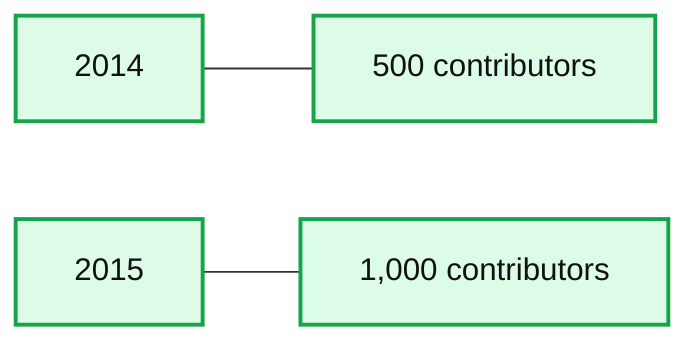

# Announcing Apache Spark 1.6

- Source: https://www.databricks.com/blog/2016/01/04/announcing-apache-spark-1-6.html
- Published: 2016-01-04
- Authors: Michael Lumb, Patrick Wendell, Reynold Xin
- Categories: engineering, open-source
- Images: 1 total, 1 extracted as architecture

To learn more about Apache Spark, attend [Spark Summit East in New York in Feb 2016](https://www.databricks.com/dataaisummit).

---

Today we are happy to announce the availability of Apache Spark 1.6! With this release, Spark hit a major milestone in terms of community development: the number of people that have contributed code to Spark has crossed 1000, doubling the 500 number we saw at the end of 2014.

**Summary:** The chart compares Spark code contributors, showing growth from 500 in 2014 to 1,000 in 2015.

**Components:**

- 2014 contributor count, technology not shown
- 2015 contributor count, technology not shown

**Flows:**

- none

**Numbers:** 2014, 500, 2015, 1,000

source image: https://www.databricks.com/wp-content/uploads/2016/01/spark-contributors-1024x322.png?noresize

So – what’s new in Spark 1.6? Spark 1.6 includes over 1000 patches. In this blog post, we highlight three major development themes: performance improvements, the new Dataset API, and expansion of data science functionality.

## Performance Improvements

According to our 2015 [Spark Survey](https://www.databricks.com/blog/2015/09/24/spark-survey-2015-results-are-now-available.html), 91% of users consider performance as the most important aspect of Spark. As a result, performance optimizations have always been a focus in our Spark development.

**Parquet performance**: Parquet has been one of the most commonly used data formats with Spark, and Parquet scan performance has pretty big impact on many large applications. In the past, Spark’s Parquet reader relies on parquet-mr to read and decode Parquet files. When we profile Spark applications, often many cycles are spent in “record assembly”, a process that reconstructs records from Parquet columns. In Spark 1.6. we introduce a [new Parquet reader](https://issues.apache.org/jira/browse/SPARK-11787) that bypasses parquert-mr’s record assembly and uses a more optimized code path for flat schemas. In our benchmarks, this new reader increases the scan throughput for 5 columns from 2.9 million rows per second to 4.5 million rows per second, an almost 50% improvement!

**Automatic memory management**: Another area of performance gains in Spark 1.6 comes from better memory management. Before Spark 1.6, Spark statically divided the available memory into two regions: execution memory and cache memory. Execution memory is the region that is used in sorting, hashing, and shuffling, while cache memory is used to cache hot data. Spark 1.6 introduces a [new memory manager](https://issues.apache.org/jira/browse/SPARK-10000) that automatically tunes the size of different memory regions. The runtime automatically grows and shrinks regions according to the needs of the executing application. For many applications, this will mean a significant increase in available memory that can be used for operators such as joins and aggregations, without any user tuning.

While the above two improvements apply transparently without any application code change, the following improvement is an example of a new API that enables better performance.

**10X speedup for streaming state management**: State management is an important function in streaming applications, often used to maintain aggregations or session information. Having worked with many users, we have redesigned the state management API in Spark Streaming and introduced a new [mapWithState API](https://issues.apache.org/jira/browse/SPARK-2629) that scales linearly to the number of updates rather than the total number of records. That is to say, it has an efficient implementation that tracks “deltas”, rather than always requiring full scans over data. This has resulted in an order of magnitude performance improvements in many workloads.

## Dataset API

We introduced DataFrames earlier this year, which provide high-level functions that allow Spark to better understand the structure of data as well as the computation being performed. This additional information enables the [Catalyst optimizer](https://www.databricks.com/blog/2015/04/13/deep-dive-into-spark-sqls-catalyst-optimizer.html) and the [Tungsten execution engine](https://www.databricks.com/blog/2015/04/28/project-tungsten-bringing-spark-closer-to-bare-metal.html) to automatically speed up real-world Big Data analyses.

Since we released DataFrames, we have gotten a lot of feedback and one of the main ones is the lack of support for compile-time type safety. To address this, we are introducing a typed extension of the DataFrame API called [Datasets](https://www.databricks.com/blog/2016/01/04/introducing-apache-spark-datasets.html).

The Dataset API extends the DataFrame API to supports static typing and user functions that run directly on existing Scala or Java types. When compared with the traditional RDD API, Datasets provide better memory management as well as in the long run better performance.

Please refer to the blog post [Introducing Spark Datasets](https://www.databricks.com/blog/2016/01/04/introducing-apache-spark-datasets.html).

## New Data Science Functionality

**Machine learning pipeline persistence**: A lot of machine learning applications leverage Spark's ML pipeline feature to construct learning pipelines. In the past, if the application wanted to store the pipeline externally, it needed to implement custom persistence code. In Spark 1.6, the pipeline API offers functionality to save and reload pipelines from a previous state and apply models built previously to new data later. For example, users can train a pipeline in a nightly job, and then apply it to production data in a production job.

**New algorithms and capabilities**: This release also increases algorithm coverage in machine learning, including:

- univariate and bivariate statistics
- survival analysis
- normal equation for least squares
- bisecting K-Means clustering
- online hypothesis testing
- Latent Dirichlet Allocation (LDA) in ML Pipelines
- R-like statistics for GLMs
- feature interactions in R formula
- instance weights for GLMs
- univariate and bivariate statistics in DataFrames
- LIBSVM data source
- non-standard JSON data

This blog post only covered some of the major features in this release. We have also compiled a [more detailed set of release notes along with working examples here](https://spark.apache.org/docs/1.6.1/).

We will be posting more details about some of these new features in the coming weeks. Stay tuned to the Databricks blog to learn more about Spark 1.6. If you want to try out these new features, you can already use Spark 1.6 in Databricks, alongside older versions of Spark.  [Sign up for a free trial account here](https://accounts.cloud.databricks.com/registration.html#signup).

Spark’s success wouldn’t have been possible without the 1000 contributors to date, and we would like to take this opportunity to thank all of them as well.
