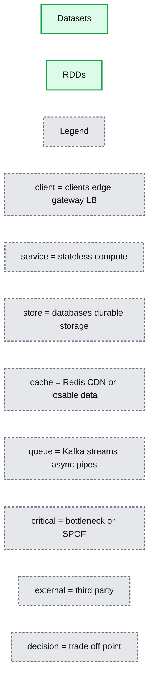
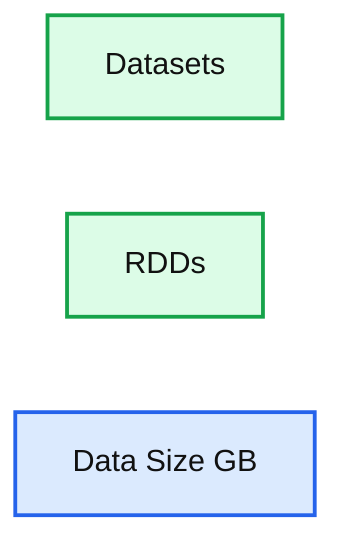
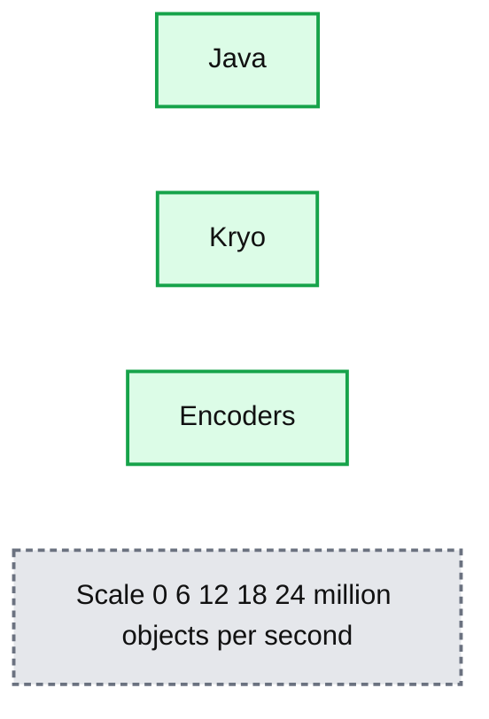

# Introducing Apache Spark Datasets

- Source: https://www.databricks.com/blog/2016/01/04/introducing-apache-spark-datasets.html
- Published: 2016-01-04
- Authors: Michael Armbrust, Wenchen Fan, Reynold Xin, Matei Zaharia
- Categories: engineering, open-source
- Images: 3 total, 3 extracted as architecture

Developers have always loved Apache Spark for providing APIs that are simple yet powerful, a combination of traits that makes complex analysis possible with minimal programmer effort.  At Databricks, we have continued to push Spark’s usability and performance envelope through the introduction of [DataFrames](https://www.databricks.com/blog/2015/02/17/introducing-dataframes-in-spark-for-large-scale-data-science.html) and [Spark SQL](https://www.databricks.com/blog/2014/03/26/spark-sql-manipulating-structured-data-using-spark-2.html). These are high-level APIs for working with structured data (e.g. database tables, JSON files), which let Spark automatically optimize both storage and computation. Behind these APIs, [the Catalyst optimizer](https://www.databricks.com/blog/2015/04/13/deep-dive-into-spark-sqls-catalyst-optimizer.html) and [Tungsten execution engine](https://www.databricks.com/blog/2015/04/28/project-tungsten-bringing-spark-closer-to-bare-metal.html) optimize applications in ways that were not possible with Spark’s object-oriented ([RDD](https://www.databricks.com/blog/2016/07/14/a-tale-of-three-apache-spark-apis-rdds-dataframes-and-datasets.html)) API, such as operating on data in a raw binary form.

Today we’re excited to announce Spark Datasets, an extension of the DataFrame API that provides a *type-safe, object-oriented programming interface*. [Spark 1.6](https://www.databricks.com/blog/2016/01/04/announcing-apache-spark-1-6.html) includes an API preview of Datasets, and they will be a development focus for the next several versions of Spark. Like DataFrames, Datasets take advantage of Spark's Catalyst optimizer by exposing expressions and data fields to a query planner.  Datasets also leverage Tungsten's fast in-memory encoding.  Datasets extend these benefits with compile-time type safety - meaning production applications can be checked for errors before they are run. They also allow direct operations over user-defined classes.

In the long run, we expect Datasets to become a powerful way to write more efficient Spark applications. We have designed them to work alongside the existing RDD API, but improve efficiency when data can be represented in a structured form.  Spark 1.6 offers the first glimpse at Datasets, and we expect to improve them in future releases.

## Working with Datasets

A Dataset is a strongly-typed, immutable collection of objects that are mapped to a relational schema.  At the core of the Dataset API is a new concept called an encoder, which is responsible for converting between JVM objects and tabular representation. The tabular representation is stored using Spark’s internal Tungsten binary format, allowing for operations on serialized data and improved memory utilization.  Spark 1.6 comes with support for automatically generating encoders for a wide variety of types, including primitive types (e.g. String, Integer, Long), Scala case classes, and Java Beans.

Users of RDDs will find the Dataset API quite familiar, as it provides many of the same functional transformations (e.g. map, flatMap, filter).  Consider the following code, which reads lines of a text file and splits them into words:

| **RDDs** val lines = sc.textFile("/wikipedia") val words = lines .flatMap(_.split(" ")) .filter(_ != "") |
|---|
| **Datasets** val lines = sqlContext.read.text("/wikipedia").as[String] val words = lines .flatMap(_.split(" ")) .filter(_ != "") |

Both APIs make it easy to express the transformation using lambda functions. The compiler and your IDE understand the types being used, and can provide helpful tips and error messages while you construct your data pipeline.

While this high-level code may look similar syntactically, with Datasets you also have access to all the power of a full relational execution engine. For example, if you now want to perform an aggregation (such as counting the number of occurrences of each word), that operation can be expressed simply and efficiently as follows:

| **RDDs** val counts = words .groupBy(_.toLowerCase) .map(w => (w._1, w._2.size)) |
|---|
| **Datasets** val counts = words .groupBy(_.toLowerCase) .count() |

Since the Dataset version of word count can take advantage of the built-in aggregate `count`, this computation can not only be expressed with less code, but it will also execute significantly faster.  As you can see in the graph below, the Dataset implementation runs much faster than the naive RDD implementation.  In contrast, getting the same performance using RDDs would require users to manually consider how to express the computation in a way that parallelizes optimally.

**Summary:** The chart compares distributed wordcount execution time for Datasets and RDDs.

**Components:**

- Datasets: Spark Dataset implementation
- RDDs: Spark RDD implementation
- Execution Time: Seconds scale from 0 to 40

**Flows:**

- none

**Numbers:** 0, 10, 20, 30, 40, seconds

source image: https://www.databricks.com/wp-content/uploads/2016/01/Distributed-Wordcount-Chart-1024x371.png?noresize

Another benefit of this new Dataset API is the reduction in memory usage. Since Spark understands the structure of data in Datasets, it can create a more optimal layout in memory when caching Datasets. In the following example, we compare caching several million strings in memory using Datasets as opposed to RDDs. In both cases, caching data can lead to significant performance improvements for subsequent queries.  However, since Dataset encoders provide more information to Spark about the data being stored, the cached representation can be optimized to use 4.5x less space.

**Summary:** The chart compares memory usage when caching Datasets and RDDs.

**Components:**

- Datasets using approximately 13 GB
- RDDs using approximately 59 GB
- Data Size axis measured in GB

**Flows:**

- none

**Numbers:** 0, 15, 30, 45, 60, GB

source image: https://www.databricks.com/wp-content/uploads/2016/01/Memory-Usage-when-Caching-Chart-1024x359.png?noresize

## Lightning-fast Serialization with Encoders

Encoders are highly optimized and use runtime code generation to build custom bytecode for serialization and deserialization.  As a result, they can operate significantly faster than Java or Kryo serialization.

**Summary:** The benchmark compares Java, Kryo, and Encoders by serialization and deserialization throughput.

**Components:**

- Java serialization
- Kryo serialization
- Encoders

**Flows:**

- none

**Numbers:** 0, 6, 12, 18, 24 million objects / second

source image: https://www.databricks.com/wp-content/uploads/2016/01/Serialization-Deserialization-Performance-Chart.png?noresize

In addition to speed, the resulting serialized size of encoded data can also be significantly smaller (up to 2x), reducing the cost of network transfers.  Furthermore, the serialized data is already in the Tungsten binary format, which means that many operations can be done in-place, without needing to materialize an object at all.  Spark has built-in support for automatically generating encoders for primitive types (e.g. String, Integer, Long), Scala case classes, and Java Beans.  We plan to open up this functionality and allow efficient serialization of custom types in a future release.

## Seamless Support for Semi-Structured Data

The power of encoders goes beyond performance.  They also serve as a powerful bridge between semi-structured formats (e.g. JSON) and type-safe languages like Java and Scala.

For example, consider the following dataset about universities:

{"name": "UC Berkeley", "yearFounded": 1868, numStudents: 37581}
 {"name": "MIT", "yearFounded": 1860, numStudents: 11318}
 ...

Instead of manually extracting fields and casting them to the desired type, you can simply define a class with the expected structure and map the input data to it.  Columns are automatically lined up by name, and the types are preserved.

case class University(name: String, numStudents: Long, yearFounded: Long)
 val schools = sqlContext.read.json("/schools.json").as[University]
 schools.map(s => s"${s.name} is ${2015 - s.yearFounded} years old")

Encoders eagerly check that your data matches the expected schema, providing helpful error messages before you attempt to incorrectly process TBs of data. For example, if we try to use a datatype that is too small, such that conversion to an object would result in truncation (i.e. numStudents is larger than a byte, which holds a maximum value of 255) the Analyzer will emit an AnalysisException.

case class University(numStudents: Byte)
 val schools = sqlContext.read.json("/schools.json").as[University]

org.apache.spark.sql.AnalysisException: Cannot upcast `yearFounded` from bigint to smallint as it may truncate

When performing the mapping, encoders will automatically handle complex types, including nested classes, arrays, and maps.

## A Single API for Java and Scala

Another goal to the Dataset API is to provide a single interface that is usable in both Scala and Java. This unification is great news for Java users as it ensure that their APIs won't lag behind the Scala interfaces, code examples can easily be used from either language, and libraries no longer have to deal with two slightly different types of input.  The only difference for Java users is they need to specify the encoder to use since the compiler does not provide type information.  For example, if wanted to process json data using Java you could do it as follows:

## Looking Forward

While Datasets are a new API, we have made them interoperate easily with RDDs and existing Spark programs. Simply calling the rdd`()` method on a Dataset will give an RDD. In the long run, we hope that Datasets can become a common way to work with structured data, and we may converge the APIs even further.

As we look forward to Spark 2.0, we plan some exciting improvements to Datasets, specifically:

- Performance optimizations - In many cases, the current implementation of the Dataset API does not yet leverage the additional information it has and can be slower than RDDs. Over the next several releases, we will be working on improving the performance of this new API.
- Custom encoders - while we currently autogenerate encoders for a wide variety of types, we'd like to open up an API for custom objects.
- Python Support.
- Unification of DataFrames with Datasets - due to compatibility guarantees, DataFrames and Datasets currently cannot share a common parent class. With Spark 2.0, we will be able to unify these abstractions with minor changes to the API, making it easy to build libraries that work with both.

If you'd like to try out Datasets yourself, they are already available in Databricks. Spark 1.6 is available on Databricks today, [sign up for a free 14-day trial](https://accounts.cloud.databricks.com/registration.html#signup).
