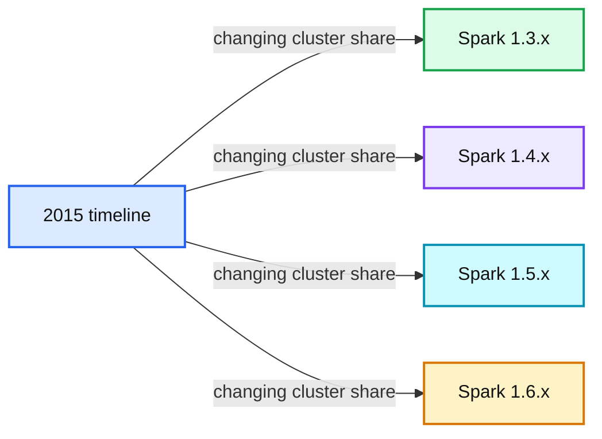
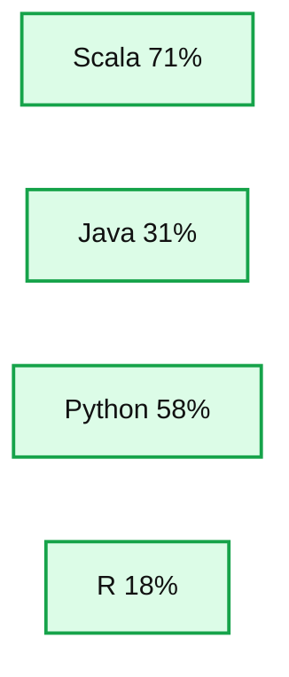
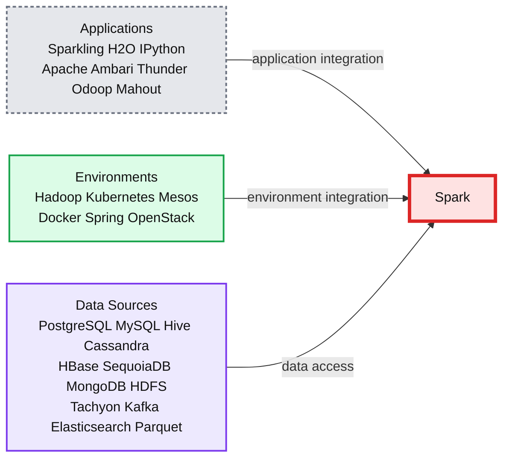

# Apache Spark 2015 Year In Review

- Source: https://www.databricks.com/blog/2016/01/05/apache-spark-2015-year-in-review.html
- Published: 2016-01-05
- Authors: Reynold Xin, Matei Zaharia, Patrick Wendell
- Categories: solutions, engineering, open-source
- Images: 3 total, 3 extracted as architecture

To learn more about Apache Spark, attend [Spark Summit East in New York in Feb 2016](https://www.databricks.com/dataaisummit).

---

2015 has been a year of tremendous growth for Apache Spark. The pace of development is the fastest ever. We went through 4 releases (Spark 1.3 to 1.6) in a single year, and each of them added hundreds of improvements.

The number of developers that have contributed code to Spark has also grown to over 1000, doubling from 500 in 2014. To the best of our knowledge, Spark is now the most actively developed open source project among data tools, big or small. We’ve been humbled by Spark’s growth and the community that has made Spark the project it is today.

At Databricks, we are still working hard to drive Spark forward -- indeed, we contributed about 10x more code to Spark than any organization in 2015. In this blog post, we wanted to highlight some of the major developments that went into the project in 2015:

1. APIs for data science, including DataFrames, Machine Learning Pipelines, and R support.
2. Platform APIs
3. Project Tungsten and Performance Optimizations
4. Spark Streaming

With this rapid pace of development, we are also happy to see how quickly users adopt new versions. For example, the graph below shows the Spark versions run by over 200 customers at Databricks (note that a single customer can also run multiple Spark versions):

**Summary:** Stacked bar chart showing the percentage of customer clusters running Spark versions 1.3.x through 1.6.x across 2015.

**Components:**

- Spark 1.3.x version share
- Spark 1.4.x version share
- Spark 1.5.x version share
- Spark 1.6.x version share
- Cluster ratio percentage axis
- 2015 timeline

**Flows:**

- No arrows are visible. The stacked bars show changing version share over time.

**Numbers:** 2015; 1.3.x; 1.4.x; 1.5.x; 1.6.x; 100%; 75%; 50%; 25%; 0%; 06/01; 06/15; 06/29; 07/13; 07/27; 08/10; 08/24; 09/07; 09/21; 10/05; 10/19; 11/02; 11/16; 11/30; 12/14; 12/28.

source image: https://www.databricks.com/wp-content/uploads/2016/01/spark-version-trend-final-1024x512.png?noresize

As you can see from the graph, Spark users track the latest versions pretty well. Merely 3 months after Spark 1.5 was released, the majority of our customers were running it. And a small fraction have been using [Spark 1.6](https://www.databricks.com/blog/2016/01/04/announcing-apache-spark-1-6.html), as it was available as a [preview package](https://www.databricks.com/blog/2015/11/20/announcing-an-apache-spark-1-6-preview-in-databricks.html) since late November.

Now, let’s dive into the major changes in 2015.

## Data Science APIs: DataFrames, ML Pipelines, and R

Before Spark, the primer to Big Data included a daunting list of concepts, from distributed computing to MapReduce functional programming. As a result, Big Data tooling was used primarily by data infrastructure teams with an advanced level of technical sophistication.

The first major theme of development for Spark in 2015 was to build simplified APIs for big data, similar to those for data science. Rather than forcing data scientists to learn a whole new development paradigm, we wanted to substantially lower the learning curve and provide something that resembles the tools they are already familiar with.

To that end, we introduced three major API additions to Spark.

- [**DataFrames**](https://www.databricks.com/blog/2015/02/17/introducing-dataframes-in-spark-for-large-scale-data-science.html): an easy-to-use and efficient API for working with structured data similar to “small data” tools like R and Pandas in Python.

- [**Machine Learning Pipelines**](https://www.databricks.com/blog/2015/01/07/ml-pipelines-a-new-high-level-api-for-mllib.html): an easy-to-use API for complete machine learning workflows.

- [**SparkR**](https://www.databricks.com/blog/2015/06/09/announcing-sparkr-r-on-spark.html): Together with Python, R is the most popular programming language among data scientists. With a little learning, data scientists can now use R and Spark to process data that is larger than what their single machine can handle.

Although they have only been released for a few months, already 62% of Spark users reported via our [2015 Spark Survey](https://www.databricks.com/blog/2015/09/24/spark-survey-2015-results-are-now-available.html) that they are using the DataFrame API.  Just as revealing,  survey respondents had predominantly identified themselves as data engineers (41%) or data scientists (22%).  This uptick in interest by data scientists is even more apparent when evaluating the languages used in Spark with 58% (49% increase over 2014) of respondents using Python and 18% already using the R API.

**Summary:** The chart shows Spark users’ programming languages in 2015.

**Components:**

- Scala
- Java
- Python
- R

**Flows:**

- none

**Numbers:**

- 2015
- Scala: 71%
- Java: 31%
- Python: 58%
- R: 18%
- Axis scale: 0%, 20%, 40%, 60%, 80%

source image: https://www.databricks.com/wp-content/uploads/2016/01/Languages-Used-2015-1024x332.png?noresize

Since we released DataFrames, we have been collecting feedback from the community. One of the most important pieces of feedback is that for users building larger, more complicated data engineering projects, type safety provided by the traditional RDD API is a useful feature. In response to this, we are developing a [new typed Dataset API in Spark 1.6](https://www.databricks.com/blog/2016/01/04/introducing-apache-spark-datasets.html) for working with these kinds of data.

## Platform APIs

To application developers, Spark is becoming the universal runtime. Applications only need to program against a single set of APIs, and can then run in a variety of environments (on-prem, cloud, Hadoop, …) and connect to a variety of data sources. Earlier this year, we introduced a standard [pluggable data source API](https://www.databricks.com/blog/2015/01/09/spark-sql-data-sources-api-unified-data-access-for-the-spark-platform.html) for 3rd-party developers that enables intelligent pushdown of predicates into these sources.  Some of the data sources that are now available include:

- CSV, JSON, XML
- Avro, Parquet
- MySQL, PostgreSQL, Oracle, Redshift
- Cassandra, MongoDB, [ElasticSearch](https://www.databricks.com/glossary/elasticsearch)
- Salesforce, Google Spreadsheets

**Summary:** Spark is shown at the center of an open-source ecosystem connecting applications, environments, and data sources.

**Components:**

- Spark: central data-processing platform
- Applications: Sparkling, H2O, IPython, Apache Ambari, Thunder, Odoop, Mahout
- Environments: Hadoop, Kubernetes, Mesos, Docker, Spring, OpenStack
- Data Sources: PostgreSQL, MySQL, Hive, Cassandra, HBase, SequoiaDB, MongoDB, HDFS, Tachyon, Kafka, Elasticsearch, Parquet

**Flows:**

- Sparkling -> Spark: application integration
- H2O -> Spark: application integration
- IPython -> Spark: application integration
- Apache Ambari -> Spark: application integration
- Thunder -> Spark: application integration
- Odoop -> Spark: application integration
- Mahout -> Spark: application integration
- Hadoop -> Spark: environment integration
- Kubernetes -> Spark: environment integration
- Mesos -> Spark: environment integration
- Docker -> Spark: environment integration
- Spring -> Spark: environment integration
- OpenStack -> Spark: environment integration
- PostgreSQL -> Spark: data access
- MySQL -> Spark: data access
- Hive -> Spark: data access
- Cassandra -> Spark: data access
- HBase -> Spark: data access
- SequoiaDB -> Spark: data access
- MongoDB -> Spark: data access
- HDFS -> Spark: data access
- Tachyon -> Spark: data access
- Kafka -> Spark: data access
- Elasticsearch -> Spark: data access
- Parquet -> Spark: data access

**Numbers:** none

source image: https://www.databricks.com/wp-content/uploads/2016/01/open-source-ecosystem.png?noresize

To make it easier to find libraries for data sources and algorithms, we have also introduced [spark-packages.org](http://spark-packages.org), a central repository for Spark libraries.

Another interesting trend is that while the early adopters of Spark were predominantly using Spark alongside Hadoop, as Spark grows, Hadoop no longer represents the majority of Spark users. According to our [2015 Spark Survey](https://www.databricks.com/blog/2015/09/24/spark-survey-2015-results-are-now-available.html), 48% of Spark deployments now run on Spark’s standalone cluster manager, while the usage of Hadoop YARN is only around 40%.

## Project Tungsten and Performance Optimizations

According to our [2015 Spark Survey](https://www.databricks.com/blog/2015/09/24/spark-survey-2015-results-are-now-available.html), 91% of users consider performance the most important aspect of Spark. As a result, performance optimizations have always been a focus in our Spark development.

Earlier this year we announced [Project Tungsten](https://www.databricks.com/blog/2015/04/28/project-tungsten-bringing-spark-closer-to-bare-metal.html) – a set of major changes to Spark’s internal architecture designed to improve performance and robustness.  Spark 1.5 delivered the first pieces of Tungsten. This includes **binary processing**, which circumvents the Java object model using a custom binary memory layout.  Binary processing significantly reduces garbage collection pressure for data-intensive workloads.  It also includes a new **code generation** framework where optimized byte code is generated at runtime for evaluating expressions in user code. Throughout the 4 releases in 2015, we also added a large number of built-in functions that are code generated, for common tasks like date handling and string manipulation.

In addition, data ingest performance is as critical as query execution. Parquet has been one of the most commonly used data formats with Spark, and Parquet scan performance has a pretty big impact on many large applications. In [Spark 1.6](https://www.databricks.com/blog/2016/01/04/announcing-apache-spark-1-6.html), we introduced a new Parquet reader that uses a more optimized code path for flat schemas. In our benchmarks, this new reader increases the scan throughput by almost 50%.

## Spark Streaming

With the rise of Internet of Things (IoT), an increasing number of organizations are looking into deploying streaming applications. Integrating these streaming applications with traditional pipelines is crucial, and Spark Streaming simplifies this with a [unified engine for both batch and streaming data processing](https://www.databricks.com/blog/2015/07/30/diving-into-apache-spark-streamings-execution-model.html).  Some of the main additions to Spark Streaming in 2015 included:

- [**Direct Kafka connector**](https://www.databricks.com/blog/2015/03/30/improvements-to-kafka-integration-of-spark-streaming.html): Spark 1.3 improves the integration with Kafka so streaming applications can provide exactly-once data processing semantics and simplify operations. [Additional work](https://www.databricks.com/blog/2015/01/15/improved-driver-fault-tolerance-and-zero-data-loss-in-spark-streaming.html) also improves fault-tolerance and ensures zero data loss.
- [**Web UI for monitoring and easier debugging**](https://www.databricks.com/blog/2015/07/08/new-visualizations-for-understanding-apache-spark-streaming-applications.html): To help monitoring and debugging streaming applications that are often run 24/7, Spark 1.4 introduces a new web UI that displays timelines and histograms for processing trends, as well as details about each discretized streams.
- **10X speedup for state management**: In Spark 1.6, we redesigned the state management API in Spark Streaming and introduced a new mapWithState API that scales linearly to the number of updates rather than the total number of records. This has resulted in an order of magnitude performance improvements in many workloads.

## In Closing

Another aspect where Databricks invested heavily in is training and education for Spark users. In 2015, we partnered with UC Berkeley and UCLA and offered two MOOCs. The first course, Introduction to Big Data with Apache Spark, teaches students about Spark and data analysis. The second course, Scalable Machine Learning, introduces students to machine learning with Spark. Both courses are freely available on the edX platform. Over 125,000 students registered for the first delivery of the two classes, and we plan to offer them again this year.

We are proud of the progress we have made together with the community in one year and are thrilled to continue working to bring even more great features to Spark. Stay tuned on our blog for new developments in 2016.
