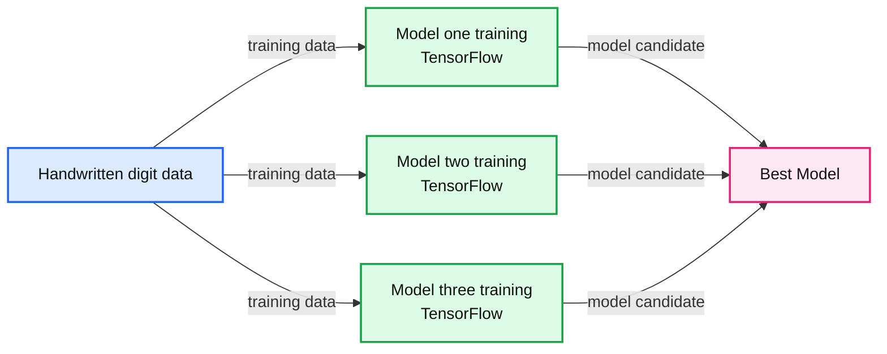
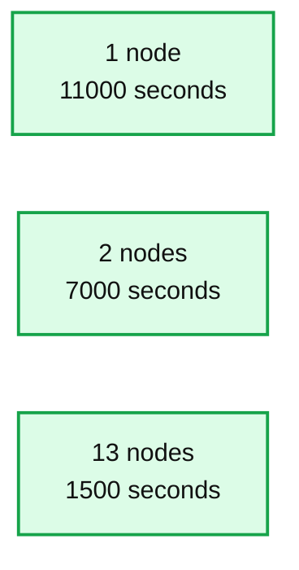
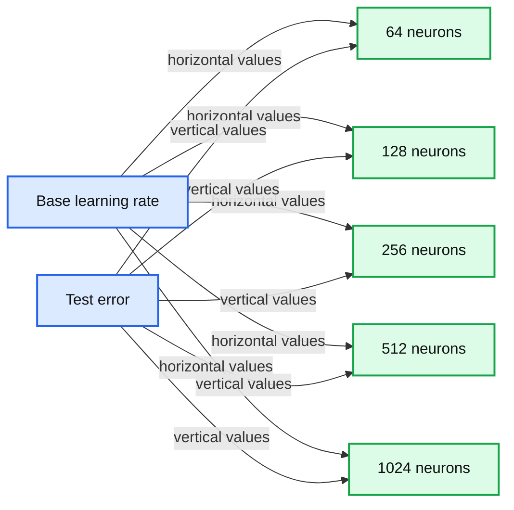

# Deep Learning with Apache Spark and TensorFlow

- Source: https://www.databricks.com/blog/2016/01/25/deep-learning-with-apache-spark-and-tensorflow.html
- Published: 2016-01-25
- Authors: Tim Hunter
- Categories: engineering, company, product, data-science-machine-learning, announcements
- Images: 5 total, 3 extracted as architecture

[Neural networks](https://www.databricks.com/glossary/neural-network) have seen spectacular progress during the last few years and they are now the state of the art in image recognition and automated translation.  [TensorFlow](https://www.tensorflow.org/) is a new framework released by Google for numerical computations and neural networks. In this blog post, we are going to demonstrate how to use TensorFlow and Spark together to train and apply deep learning models.

You might be wondering: what’s Apache Spark’s use here when most high-performance deep learning implementations are single-node only? To answer this question, we walk through two use cases and explain how you can use Spark and a cluster of machines to improve deep learning pipelines with TensorFlow:

1. **Hyperparameter Tuning: **use Spark to find the best set of hyperparameters for neural network training, leading to 10X reduction in training time and 34% lower error rate.
2. **Deploying models at scale: **use Spark to apply a trained neural network model on a large amount of data.

## Hyperparameter Tuning

An example of a deep learning machine learning (ML) technique is [artificial neural networks](https://www.databricks.com/glossary/artificial-neural-network). They take a complex input, such as an image or an audio recording, and then apply complex mathematical transforms on these signals. The output of this transform is a vector of numbers that is easier to manipulate by other ML algorithms. Artificial neural networks perform this transformation by mimicking the neurons in the visual cortex of the human brain (in a much-simplified form).

Just as humans learn to interpret what they see, artificial neural networks need to be trained to recognize specific patterns that are ‘interesting’. For example, these can be simple patterns such as edges, circles, but they can be [much more complicated](https://research.google/pubs/pub38115/). Here, we are going to use a classical dataset put together by NIST and train a neural network to recognize these digits:

The TensorFlow library automates the creation of training algorithms for neural networks of various shapes and sizes. The actual process of building a neural network, however, is more complicated than just running some function on a dataset. There are typically a number of very important hyperparameters (configuration parameters in layman’s terms) to set, which affects how the model is trained. Picking the right parameters leads to high performance, while bad parameters can lead to prolonged training and bad performance. In practice, machine learning practitioners rerun the same model multiple times with different hyperparameters in order to find the best set. This is a classical technique called hyperparameter tuning.

When building a neural network, there are many important hyperparameters to choose carefully. For example:

- Number of neurons in each layer: Too few neurons will reduce the expression power of the network, but too many will substantially increase the running time and return noisy estimates.
- Learning rate: If it is too high, the neural network will only focus on the last few samples seen and disregard all the experience accumulated before. If it is too low, it will take too long to reach a good state.

The interesting thing here is that even though TensorFlow itself is not distributed, the hyperparameter tuning process is “embarrassingly parallel” and can be distributed using Spark. In this case, we can use Spark to broadcast the common elements such as data and model description, and then schedule the individual repetitive computations across a cluster of machines in a fault-tolerant manner.

**Summary:** Spark distributes cross-validation training of multiple TensorFlow models and selects the best model.

**Components:**

- Input data: handwritten digit images
- Distributed Cross Validation: Spark
- Model one training: TensorFlow
- Model two training: TensorFlow
- Model three training: TensorFlow
- Best Model: selected trained model

**Flows:**

- Input data -> Model one training: training data
- Input data -> Model two training: training data
- Input data -> Model three training: training data
- Model one training -> Best Model: trained model candidate
- Model two training -> Best Model: trained model candidate
- Model three training -> Best Model: trained model candidate

**Numbers:** 1, 2, 3

source image: https://www.databricks.com/wp-content/uploads/2016/01/image04.png

How does using Spark improve the accuracy? The accuracy with the default set of hyperparameters is 99.2%. Our best result with hyperparameter tuning has a 99.47% accuracy on the test set, which is a **34% reduction of the test error**. Distributing the computations scaled linearly with the number of nodes added to the cluster: using a 13-node cluster, we were able to train 13 models in parallel, which translates into a **7x speedup** compared to training the models one at a time on one machine. Here is a graph of the computation times (in seconds) with respect to the number of machines on the cluster:

**Summary:** The chart compares computation time for training across clusters with 1, 2, and 13 nodes.

**Components:**

- 1 node cluster using one machine
- 2 nodes cluster using two machines
- 13 nodes cluster using thirteen machines

**Flows:**

- none

**Numbers:** 0, 3000, 6000, 9000, 12000 seconds; 1 node, 2 nodes, 13 nodes

source image: https://www.databricks.com/wp-content/uploads/2016/01/Computation-Time-in-Seconds-by-Machines.png

More important though, we get insights into the sensibility of the training procedure to various hyperparameters of training. For example, we plot the final test performance with respect to the learning rate, for different numbers of neurons:

**Summary:** Line chart showing test error versus base learning rate for neural networks with different neuron counts.

**Components:**

- Base learning rate axis
- Test error axis
- 64 neuron series
- 128 neuron series
- 256 neuron series
- 512 neuron series
- 1024 neuron series

**Flows:**

- none

**Numbers:** 64, 128, 256, 512, 1024, 0.02, 0.04, 0.06, 0.08, 0.10, 0.4, 0.6, 0.8, 1.0, 1.2, 1.4, 1.6, 1.8

source image: https://www.databricks.com/wp-content/uploads/2016/01/image03.png

This shows a typical tradeoff curve for neural networks:

- The learning rate is critical: if it is too low, the neural network does not learn anything (high test error). If it is too high, the training process may oscillate randomly and even diverge in some configurations.
- The number of neurons is not as important for getting a good performance, and networks with many neurons are much more sensitive to the learning rate. This is Occam’s Razor principle: simpler model tend to be “good enough” for most purposes. If you have the time and resource to go after the missing 1% test error, you must be willing to invest a lot of resources in training, and to find the proper hyperparameters that will make the difference.

By using a sparse sample of parameters, we can zero in on the most promising sets of parameters.

## How do I use it?

Since TensorFlow can use all the cores on each worker, we only run one task at one time on each worker and we batch them together to limit contention. The TensorFlow library can be installed on Spark clusters as a regular Python library, following the [instructions on the TensorFlow website](https://www.tensorflow.org/). The following notebooks below show how to install TensorFlow and let users rerun the experiments of this blog post:

- [Distributed processing of images using TensorFlow](https://www.databricks.com/)
- [Testing the distribution processing of images using TensorFlow](https://www.databricks.com/)

## Deploying Models at Scale

TensorFlow models can directly be embedded within pipelines to perform complex recognition tasks on datasets. As an example, we show how we can label a set of images from a stock neural network model that was already trained.

The model is first distributed to the workers of the clusters, using Spark’s built-in broadcasting mechanism:

with gfile.FastGFile( 'classify_image_graph_def.pb', 'rb') as f:
 model_data = f.read()
 model_data_bc = sc.broadcast(model_data)

Then this model is loaded on each node and applied to images. This is a sketch of the code being run on each node:

def apply_batch(image_url):
 # Creates a new TensorFlow graph of computation and imports the model
 with tf.Graph().as_default() as g:
 graph_def = tf.GraphDef()
 graph_def.ParseFromString(model_data_bc.value)
 tf.import_graph_def(graph_def, name='')

This code can be made more efficient by batching the images together.

Here is an example of image:

And here is the interpretation of this image according to the neural network, which is pretty accurate:

('coral reef', 0.88503921),
 ('scuba diver', 0.025853464),
 ('brain coral', 0.0090828091),
 ('snorkel', 0.0036010914),
 ('promontory, headland, head, foreland', 0.0022605944)])

## Looking forward

We have shown how to combine Spark and TensorFlow to train and deploy neural networks on handwritten digit recognition and image labeling. Even though the neural network framework we used itself only works in a single-node, we can use Spark to distribute the hyperparameter tuning process and model deployment. This not only cuts down the training time but also improves accuracy and gives us a better understanding of various hyperparameters’ sensibility.

While this support is only available on Python, we look forward to providing deeper integration between TensorFlow and the rest of the Spark framework.
