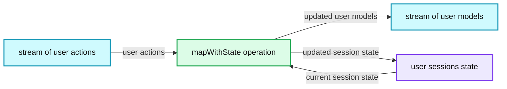
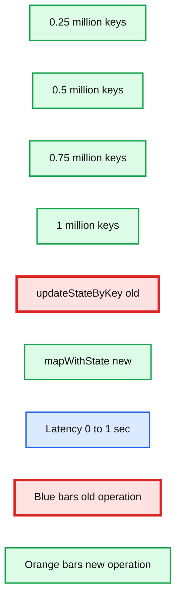
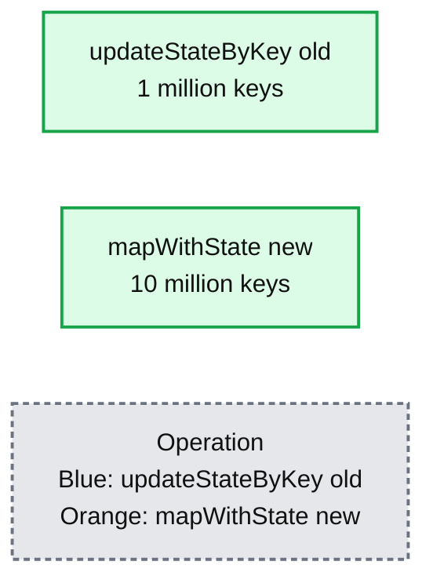

# Faster Stateful Stream Processing in Apache Spark Streaming

- Source: https://www.databricks.com/blog/2016/02/01/faster-stateful-stream-processing-in-apache-spark-streaming.html
- Published: 2016-02-01
- Authors: Tathagata Das, Shixiong Zhu
- Categories: engineering, data-engineering, open-source, data-streaming
- Images: 3 total, 3 extracted as architecture

Many complex stream processing pipelines must maintain state across a period of time. For example, if you are interested in understanding user behavior on your website in real-time, you will have to maintain information about each “user session” on the website as a persistent state and continuously update this state based on the user's actions. Such stateful streaming computations could be implemented in Spark Streaming using its `updateStateByKey` operation.

In Apache Spark 1.6, we have dramatically improved our support for stateful stream processing with a new API, `mapWithState`. The new API has built-in support for the common patterns that previously required hand-coding and optimization when using `updateStateByKey` (e.g. sessions timeouts). As a result, `mapWithState` can provide up to 10x higher performance when compared to `updateStateByKey` . In this blog post, we are going to explain `mapWithState` in more detail as well as give a sneak peek of what is coming in the next few releases.

## Stateful Stream Processing with mapWithState

One of the most powerful features of Spark Streaming is the simple API for stateful stream processing and the associated native, fault-tolerant, state management. Developers only have to specify the structure of the state and the logic to update it, and Spark Streaming takes care of distributing the state in the cluster, managing it, transparently recovering from failures, and giving end-to-end fault-tolerance guarantees. While the existing DStream operation `updateStateByKey` allows users to perform such stateful computations, with the new `mapWithState` operation we have made it easier for users to express their logic and get up to 10x higher performance. Let’s illustrate these advantages using an example.

Let’s say we want to learn about user behavior on a website in real time by monitoring the history of their actions. For each user, we need to maintain a history of user actions. Furthermore, based on this history, we want to output the user’s behavior model to a downstream data store.

To build this application with Spark Streaming, we have to get a stream of user actions as input (say, from Kafka or Kinesis),  transform it using `mapWithState` to generate the stream of user models, and then push them to the data store.

**Summary:** Spark Streaming uses `mapWithState` to transform user actions while maintaining user session state and producing user models.

**Components:**

- Spark Streaming
- User sessions state
- `mapWithState` operation
- Stream of user actions
- Stream of user models

**Flows:**

- Stream of user actions -> `mapWithState` operation: user actions
- `mapWithState` operation -> Stream of user models: updated user models
- `mapWithState` operation -> User sessions state: updated session state
- User sessions state -> `mapWithState` operation: current session state

**Numbers:** none

source image: https://www.databricks.com/wp-content/uploads/2016/01/blog-faster-stateful-streaming-figure-1-1024x562.png

*Maintain user sessions with stateful stream processing in Spark Streaming*

The `mapWithState` operation has the following abstraction. Imagine it to be an operator that takes a user action and the current user session as the input. Based on an input action, the operator can choose to update the user session and then output the updated user model for downstream operations. The developer specifies this updating function when defining the `mapWithState` operation.

Turning this into code, we start by defining the state data structure and the function to update the state.

def stateUpdateFunction(
 userId: UserId,
 newData: UserAction,
 stateData: State[UserSession]): UserModel = {

val currentSession = stateData.get() // Get current session data
 val updatedSession = ... // Compute updated session using newData
 stateData.update(updatedSession) // Update session data

val userModel = ... // Compute model using updatedSession
 return userModel // Send model downstream
 }

Then, we define the `mapWithState` operation on a DStream of user actions. This is done by creating a `StateSpec` object which contains all the specification of the operation.

// Stream of user actions, keyed by the user ID
 val userActions = ... // stream of key-value tuples of (UserId, UserAction)

// Stream of data to commit
 val userModels = userActions.mapWithState(StateSpec.function(stateUpdateFunction))

## New Features and Performance Improvements with mapWithState

Now that we have seen at an example of its use, let’s dive into the specific advantages of using this new API.

### Native support for session timeouts

Many session-based applications require timeouts, where a session should be closed if it has not received new data for a while (e.g., the user left the session without explicitly logging out). Instead of hand-coding it in `updateStateByKey`, developers can directly set timeouts in `mapWithState`.

userActions.mapWithState(StateSpec.function(stateUpdateFunction).timeout(Minutes(10)))

Besides timeouts, developers can also set partitioning schemes and initial state information for bootstrapping.

### Arbitrary data can be sent downstream

Unlike `updateStateByKey`, arbitrary data can be sent downstream from the state update function, as already illustrated in the example above (i.e. the user model returned from the user session state). Furthermore, snapshots of the up-to-date state (i.e. user sessions) can also be accessed.

val userSessionSnapshots = userActions.mapWithState(statSpec).snapshotStream()

The `userSessionSnapshots` is a DStream where each RDD is a snapshot of updated sessions after each batch of data is processed. This DStream is equivalent to the DStream returned by `updateStateByKey`.

### Higher performance

Finally, `mapWithState` can provide 6X lower latency and maintain state for 10X more keys than when using `updateStateByKey`. This increase in performance and scalability is demonstrated by  the following benchmark results. All these results were generated with 1-second batches and the same cluster size. The following graph compares the average time taken to process each 1-second batch when using `mapWithState` and `updateStateByKey`. In each case, we maintained the state for the same number of keys (from 0.25 to 1 million keys), and updated them at the same rate (30k updates / sec). As shown below, `mapWithState` can provide up to 8X lower processing times than `updateStateByKey`, therefore allowing lower end-to-end latencies.

**Summary:** Benchmark chart comparing batch latency for `updateStateByKey` and `mapWithState` across state sizes from 0.25 to 1 million keys.

**Components:**

- Latency axis in seconds
- State size axis in millions of keys
- `updateStateByKey` old operation
- `mapWithState` new operation
- Benchmark bars for 0.25, 0.5, 0.75, and 1 million keys

**Flows:**

- none

**Numbers:**

- Latency range: 0 to 1 sec
- State sizes: 0.25, 0.5, 0.75, 1 million keys
- `updateStateByKey` latency: approximately 0.40, 0.58, 0.77, 0.92 sec
- `mapWithState` latency: approximately 0.12, 0.145, 0.17, 0.19 sec

source image: https://www.databricks.com/wp-content/uploads/2016/01/blog-faster-stateful-streaming-figure-2-1024x489.png

*Up to 8X lower batch processing times (i.e.latency) with mapWithState than updateStateByKey*

Furthermore, faster processing allows `mapWithState` to manage 10X more keys compared with `updateStateByKey` (with the same batch interval, cluster size, update rate in both cases).

**Summary:** Benchmark chart comparing the number of keys in state for `updateStateByKey` and `mapWithState`.

**Components:**

- `updateStateByKey [old]` using the old operation
- `mapWithState [new]` using the new operation
- Y-axis showing `# Keys in state (millions)`
- Operation legend

**Flows:**

- none

**Numbers:** 0, 1, 2, 3, 4, 5, 6, 7, 8, 9, 10, 11; 1 million keys; 10 million keys

source image: https://www.databricks.com/wp-content/uploads/2016/01/blog-faster-stateful-streaming-figure-3-1024x479.png

*Up to 10X more keys in state with mapWithState than updateStateByKey*

This dramatic improvement is achieved by avoiding unnecessary processing for keys where no new data has arrived. Limiting the computation to keys with new data reduces the amount of processing time for each batch, allowing lower latencies and higher number of keys to be maintained.

## Other Improvements in Spark Streaming

Besides `mapWithState`, there are a number of additional improvements in Spark Streaming in Spark 1.6. Some of them are as follows:

- Streaming UI improvements [[SPARK-10885](https://issues.apache.org/jira/browse/SPARK-10885), [SPARK-11742](https://issues.apache.org/jira/browse/SPARK-11742)]: Job failures and other details have been exposed in the streaming UI for easier debugging.

- API improvements in Kinesis integration [[SPARK-11198](https://issues.apache.org/jira/browse/SPARK-11198), [SPARK-10891](https://issues.apache.org/jira/browse/SPARK-10891)]: Kinesis streams have been upgraded to use KCL 1.4.0 and support transparent de-aggregation of KPL-aggregated records. In addition, arbitrary function can now be applied to a Kinesis record in the Kinesis receiver before to customize what data is to be stored in memory

- Python Streaming Listener API [[SPARK-6328](https://issues.apache.org/jira/browse/SPARK-6328)] - Get streaming statistics (scheduling delays, batch processing times, etc.) in streaming.

- Support for S3 for writing Write Ahead Logs (WALs) [[SPARK-11324](https://issues.apache.org/jira/browse/SPARK-11324), [SPARK-11141](https://issues.apache.org/jira/browse/SPARK-11141)]: Write Ahead Logs are used by Spark Streaming to ensure fault-tolerance of received data. Spark 1.6 allows WALs to be used on S3 and other file systems that do not support file flushes. See the [programming guide](https://spark.apache.org/docs/latest/streaming-programming-guide.html#deploying-applications) for more details.

If you want to try out these new features, you can already use Spark 1.6 in Databricks, alongside older versions of Spark.  [Sign up for a free trial account here](https://accounts.cloud.databricks.com/registration.html#signup).
